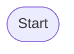

# Alt

_The local-first, composable RSS knowledge pipeline._

Alt is a self-hosted RSS reader and “content refinery” that fetches feeds, scrubs & tags articles, indexes them for lightning-fast search and serves a clean reading UI – everything running in neatly isolated containers so you can swap parts out or scale them independently.
The project is built **mobile-first**, 100 % open-source (Apache-2.0), and engineered around a five-layer flavour of Clean Architecture with test-driven development at its core.

---

## Feature Highlights

| Category | What you get | Where it lives |
|----------|--------------|----------------|
| **Fast crawl** | Go workers pull and de-duplicate feeds in parallel | `alt-backend/` |
| **Readability cleanup** | Pre-processing & language detect articles for AI summarization | `pre-processor/` |
| **Auto-scoring summaries** | Using LLM to score summaries and remove bad ones | `pre-processor/` |
| **Auto-tagging** | ML tagging via Python | `tag-generator/` |
| **Full-text & faceted search** | Meilisearch via a Go proxy | `search-indexer/` |
| **Auto summarization** | LLM summariser | `news-creator/` |
| **One-command up** | `docker compose up` | `compose.yaml` |

---

## Tech Stack

- **Go** for backend services and data processing
- **TypeScript / React / Next.js** for the mobile-first frontend
- **Python** for machine learning tasks (tag generation)
- **Rust** for log forwarding and aggregation (stores logs in ClickHouse)
- **ClickHouse** for high-performance analytical data storage
- **PostgreSQL** as the primary data store
- **Meilisearch** for full-text search
- **Ollama** with the phi4-mini model for LLM summarization
- **Docker Compose** orchestrates all services

## Service Overview

| Service | Tech | Purpose |
|---------|------|---------|
| **nginx** | Nginx | Reverse proxy for frontend and backend |
| **alt-frontend** | Next.js / React | Web UI with mobile-first design |
| **alt-backend** | Go + Echo | Fetches RSS feeds, exposes REST API |
| **pre-processor** | Go | Cleans articles, detects language, scores LLM summaries |
| **tag-generator** | Python + KeyBERT | Generates article tags using ML |
| **search-indexer** | Go + Meilisearch | Indexes articles for fast search |
| **news-creator** | Ollama (LLM) | Summarises and scores content |
| **db** | PostgreSQL | Stores all persistent data |
| **meilisearch** | Meilisearch | Search engine service |
| **rask-log-forwarder** | Rust | Sidecar that streams logs to aggregator |
| **rask-log-aggregator** | Rust + Axum | Central log processing service (stores logs in ClickHouse) |
| **migrate** | Go | Runs database schema migrations |

Each service runs in its own container so components can be scaled or swapped independently. The containers communicate over an internal Docker network and can be started with a single `docker compose up` command.

## Project Characteristics

- Embraces a microservice approach where small, focused containers cooperate via HTTP and message passing.
- Clean Architecture principles guide the main Go services, keeping business rules isolated from infrastructure.
- Test-driven development and automated health checks help maintain reliability.
- The system is designed to be composable: you can replace any service (for example, the search engine or tag generator) without affecting the rest of the pipeline.

## Backend Processing Flow

The backend is a pipeline of microservices that work together to fetch, process, and index content from RSS feeds. Each service is a container that communicates with others over the network.


%% Feed Registration Flow
A[User submits RSS feed URL via alt-frontend]
B[alt-backend saves URL to feed_links table]

%% Article Processing Flow
C[pre-processor periodically fetches articles from feed URLs]
D[Parse and store articles in articles table]

%% Summarization Flow
E[pre-processor sends article content to news-creator]
F[news-creator generates summary using LLM]
G[pre-processor saves summary to article_summaries table]

%% Tag Generation Flow
H[tag-generator fetches untagged articles]
I[Generate tags using ML model]
J[Save tags to article_tags and feed_tags tables]

%% Search Indexing Flow
K[search-indexer fetches new/updated articles]
L[Send article data to Meilisearch for indexing]

%% API Services
M[alt-backend provides REST API for frontend]
N[User searches via frontend]
O[alt-backend queries Meilisearch]
P[Return search results to user]

End([End])

%% Flow connections
Start --> A
A --> B
B --> C
C --> D
D --> E
E --> F
F --> G
G --> H
H --> I
I --> J
J --> K
K --> L
L --> M
M --> N
N --> O
O --> P
P --> End

%% Parallel processes indication
C -.->|Periodic| C
H -.->|Continuous| H
K -.->|Continuous| K
```
```

```

### Flow Description

1.  **Feed Registration**: A user submits a new RSS feed URL through the **alt-frontend**.
2.  **Save Feed URL**: The **alt-backend** receives the URL and saves it to the `feed_links` table in the **PostgreSQL** database.
3.  **Article Fetching**: The **pre-processor** service periodically fetches new articles from the registered feed URLs.
4.  **Save Articles**: The fetched articles are parsed and stored in the `articles` table in the database.
5.  **Article Summarization**: The **pre-processor** sends the content of new articles to the **news-creator** service.
6.  **Return Summary**: The **news-creator**, using an LLM (Phi-3-mini), generates a summary and returns it.
7.  **Save Summary**: The **pre-processor** saves the summary to the `article_summaries` table.
8.  **Tag Generation**: The **tag-generator** service fetches articles that haven't been tagged yet.
9.  **Generate & Save Tags**: It uses an ML model to generate tags from the article's content and saves them to the `article_tags` and `feed_tags` tables.
10. **Search Indexing**: The **search-indexer** service fetches new and updated articles from the database.
11. **Index Articles**: It sends the article data to **Meilisearch** for indexing.
12. **Frontend API**: The **alt-backend** provides a REST API for the **alt-frontend** to display feeds, articles, and search results.
13. **Search API**: When a user searches, the **alt-backend** queries the **Meilisearch** index and returns the results.

