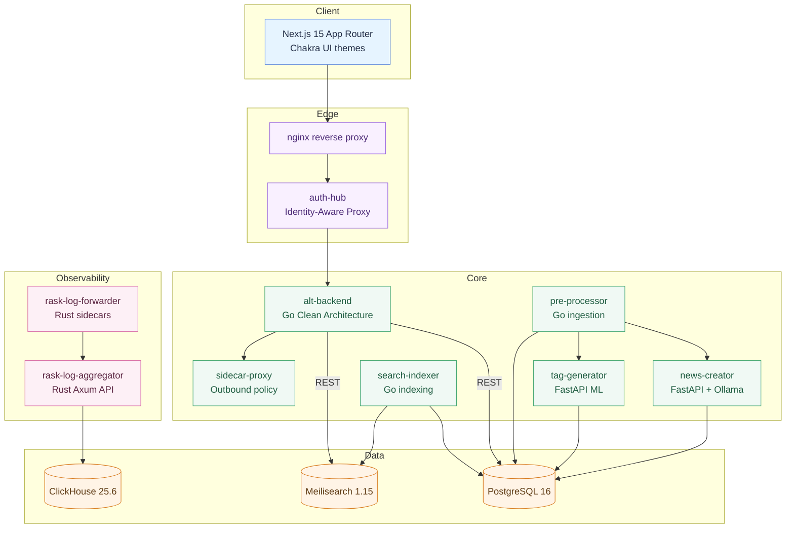
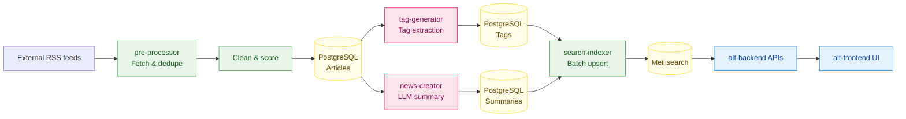

# Alt – Compose-First AI Knowledge Platform

_Last reviewed on October 28, 2025._

Alt turns RSS feeds into an AI-assisted knowledge stream. A Next.js 15 frontend, Go APIs, Python ML services, and Rust observability components run together under Docker Compose. Optional profiles add GPU summarisation and logging inside Compose.

## What You Get

- **One-command stack:** `make up` starts PostgreSQL, Kratos, Meilisearch, API, UI, and jobs.
- **Clean Architecture backend:** Echo handlers route through use cases, ports, gateways, and drivers with GoMock.
- **AI enrichment:** Go ingestion, Python tagging, and FastAPI + Ollama summaries run before content hits the UI.
- **Search ready:** Meilisearch indexer keeps searchable/filterable attributes tuned for discovery.
- **Edge auth & telemetry:** `auth-hub` validates Kratos sessions while Rust sidecars stream JSON logs into ClickHouse.

## Quick Start (Local)

1. Install Docker Desktop (or Lima/Colima), Node.js 24 with `pnpm`, Go 1.24, Rust 1.87, and Python 3.13 tooling (`uv` recommended).
2. Run `make up` from the repo root to copy `.env`, build images, run migrations, and start the default stack.
3. Open `http://localhost` (frontend) and `http://localhost:9000/v1/health` (API).
4. Stop with `make down`, or reset persistent data via `make down-volumes`.

### Compose Profiles

- **Default:** Frontend, backend, PostgreSQL, Kratos, Meilisearch, search-indexer, tag-generator, ClickHouse, log aggregator.
- **`--profile ollama`:** Adds `news-creator` (FastAPI + Ollama) and the Go `pre-processor`.
- **`--profile logging`:** Launches Rust `rask-log-forwarder` sidecars for structured log shipping.

Combine profiles with `docker compose --profile ollama --profile logging up -d`.

### Common Commands

- `make build` – rebuild images.
- `pnpm -C alt-frontend dev` – run the Next.js UI.
- `go test ./...` (Go) / `uv run pytest` (Python) – run service tests.
- `pnpm -C alt-frontend test:e2e` – Playwright E2E when the stack is running.

## Architecture Overview

Alt’s services stay aligned through explicit contracts, structured logging, and Compose orchestration.

## Content Intelligence Flow

## Service Index

| Path | Language | Role | Highlights |
| --- | --- | --- | --- |
| `alt-frontend/` | TypeScript (Next.js 15, React 19) | Mobile UI with Chakra theme trio. | Vitest + Playwright (POM), strict ESLint/Prettier. |
| `alt-backend/app/` | Go 1.24 | REST API with five-layer Clean Architecture. | `go test ./...`, GoMock, Echo `httptest`. |
| `alt-backend/sidecar-proxy/` | Go 1.24 | Outbound allowlist and timeout policy. | Three-part `httptest`, structured `slog`. |
| `pre-processor/app/` | Go 1.24 | Feed ingestion and quality scoring. | Circuit breaker (`mercari/go-circuitbreaker`), table tests. |
| `pre-processor-sidecar/app/` | Go 1.24 | Inoreader scheduler with singleflight refresh. | Mockable clock for CronJob tests. |
| `news-creator/app/` | Python 3.11+ | FastAPI orchestration over Ollama (Gemma3:4b). | Clean Architecture, `pytest-asyncio`, golden prompts. |
| `tag-generator/app/` | Python 3.13 | ML tag extraction with bias checks. | `uv run pytest`, Ruff lint/format. |
| `search-indexer/app/` | Go 1.24 | Meilisearch batch upserts (200 docs). | Clean Architecture adapters, integration smoke tests. |
| `auth-hub/` | Go 1.24 | Identity-Aware Proxy for Nginx `auth_request`. | 5‑minute TTL cache, table-driven tests. |
| `auth-token-manager/` | Deno 2.x | Inoreader OAuth2 token refresher. | Deno BDD tests, `@std/testing/mock`. |
| `rask-log-forwarder/app/` | Rust 1.87 | SIMD Docker log tailer with disk fallback. | `cargo test`, `wiremock` pipeline checks. |
| `rask-log-aggregator/app/` | Rust 1.87 | Axum ingestion API for ClickHouse. | `axum-test`, zero-copy parsing, Criterion. |

## Development Workflow

Alt keeps Red → Green → Refactor non-negotiable.

- Start in the business layer (`usecase`, `service`, or `handler`), mocking ports instead of real clients.
- Inject clocks/timers (`testing/synctest`, custom `Clock` interfaces, mock schedulers) for deterministic tests.
- Avoid live network calls; rely on `httptest`, Playwright POMs, `wiremock`, and Deno `@std/testing/mock`.

### Test Matrix

| Area | Command | Notes |
| --- | --- | --- |
| Backend API | `cd alt-backend/app && go test ./...` | Add `-race -cover` for concurrency checks. |
| Frontend unit | `pnpm -C alt-frontend test` | Vitest + Testing Library + `userEvent`. |
| Frontend E2E | `pnpm -C alt-frontend test:e2e` | Requires `make up`; POMs in `tests/pages`. |
| Pre-processor | `cd pre-processor/app && go test ./...` | Covers circuit breaker, rate limiter, repos. |
| Tag generator | `cd tag-generator/app && uv run pytest` | ML robustness & bias fixtures. |
| News creator | `cd news-creator/app && pytest` | Async FastAPI tests with mocked Ollama gateway. |
| Search indexer | `cd search-indexer/app && go test ./...` | Optional Meilisearch integration tags. |
| Auth hub | `cd auth-hub && go test ./...` | Nginx `auth_request` contract tests. |
| Rust services | `cd rask-log-forwarder/app && cargo test` (repeat for aggregator) | Use `cargo bench` for hot paths. |
| Deno service | `cd auth-token-manager && deno test` | Stub global `fetch` via `@std/testing/mock`. |

## Observability & Operations

- Health checks: `curl` 3000/api/health, 9000/v1/health, 7700/health, 8888/health; run `docker compose exec db pg_isready -U $POSTGRES_USER`.
- Logging: Enable the `logging` profile to stream JSON from `rask-log-forwarder` into ClickHouse via `rask-log-aggregator`; use `docker compose logs -f` as needed.
- Config & migrations: Atlas migrations run before `alt-backend`; keep `.env` aligned with `.env.template`, let `scripts/check-env.js` guard frontend builds, and treat `stopped-using-k8s/` as historical unless a platform maintainer asks otherwise.

## Security & Data Protection

- Keep secrets out of Git; only safe defaults belong in `.env.template`.
- Honour `auth-hub`’s `X-Alt-*` identity headers downstream.
- Use TLS helpers (`make dev-ssl-setup`, `make dev-ssl-test`, `make dev-clean-ssl`) and sanitise LLM outputs with adversarial tests before shipping.

## Contribution Checklist

- Reviewed the root playbook and relevant `CLAUDE.md` files.
- Wrote a failing test before implementing the change.
- Ran formatters/linters (`pnpm fmt`, `gofmt`, `uv run ruff format`, `cargo fmt`, `deno fmt`).
- Executed the smallest meaningful test or health check and documented new configuration, migrations, or APIs while leaving historical Kubernetes manifests untouched.

## Roadmap

- [ ] Extend `auth-hub` for multi-tenant identity and surface it in the frontend.
- [ ] Layer semantic embeddings alongside keyword search in Meilisearch.
- [ ] Add live article status updates via WebSocket or SSE.

## License

Licensed under the Apache License 2.0. See `LICENSE` for details.
