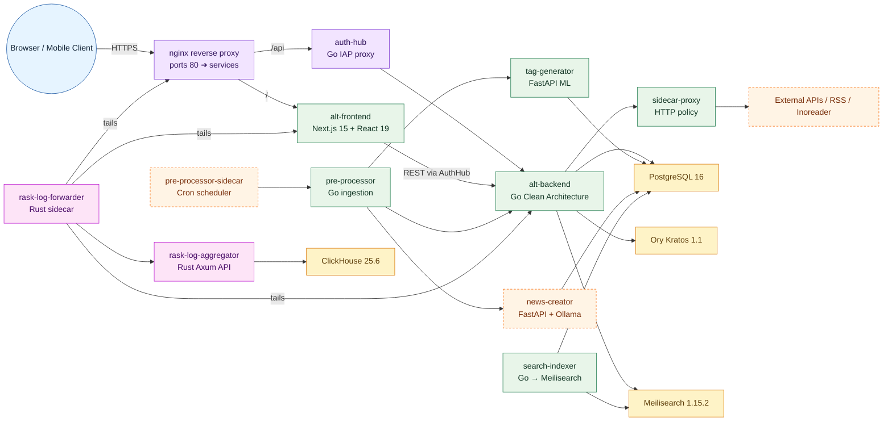
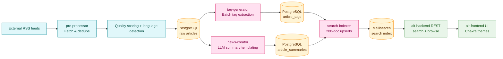
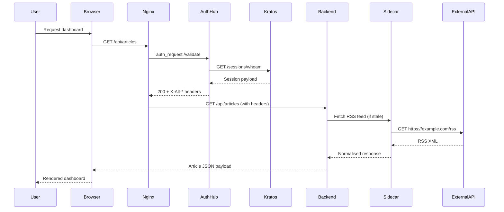

[](https://github.com/Kaikei-e/Alt/actions/workflows/backend-go.yaml)
[](https://github.com/Kaikei-e/Alt/actions/workflows/alt-frontend-unit-test.yaml)
[](https://github.com/Kaikei-e/Alt/actions/workflows/tag-generator.yaml)

# Alt – Compose-First AI Knowledge Platform

_Last reviewed on October 29, 2025._

> Compose-first knowledge platform that ingests RSS content, enriches it with AI, and serves curated insights with a unified developer workflow across Go, Python, Rust, Deno, and Next.js services.

## Table of Contents

- [Platform Snapshot](#platform-snapshot)
- [Architecture](#architecture)
- [Technology & Version Matrix](#technology--version-matrix)
- [Getting Started](#getting-started)
- [Service Catalog](#service-catalog)
- [Observability & Operations](#observability--operations)
- [Development Workflow & Testing](#development-workflow--testing)
- [Data & Storage](#data--storage)
- [Security & Compliance](#security--compliance)
- [External Integrations](#external-integrations)
- [Contribution Checklist](#contribution-checklist)
- [Roadmap & Historical Context](#roadmap--historical-context)
- [Appendix](#appendix)

## Platform Snapshot

- Compose-first developer experience: `make up` builds images, runs Atlas migrations, and starts the full stack under Docker Compose v2 profiles.
- Clean Architecture across languages: Go services follow handler → usecase → port → gateway → driver, while Python, Rust, and Deno counterparts mirror the same contract-first approach.
- AI enrichment pipeline: pre-processor deduplicates and scores feeds, news-creator produces Ollama summaries, and tag-generator delivers ML-backed topical tags before articles surface in the UI.
- Search-ready delivery: search-indexer batches 200-document upserts into Meilisearch 1.15.2 with tuned searchable/filterable attributes and semantic-ready schema defaults.
- Observability built in: Rust rask log services stream structured JSON into ClickHouse 25.6, complemented by health endpoints and targeted dashboards.
- Identity at the edge: auth-hub validates Kratos sessions, emits authoritative `X-Alt-*` headers, and caches them for five minutes so downstream services remain auth-agnostic.
- TDD-first change management: every service mandates Red → Green → Refactor with exhaustive unit suites, integration hooks, and deterministic mocks before production merges.
- Developer ergonomics: shared Make targets, consistent lint/format tooling, golden dataset baselines, and `CLAUDE.md` playbooks accelerate onboarding while constraining drift.
- Production parity: Compose profiles mirror real traffic paths, allowing GPU inference (`ollama`) and full log pipelines (`logging`) to be toggled locally without bespoke scripts.
- Safety rails: environment validation scripts, config templates, and sandboxed secrets pipelines reduce misconfiguration risk when rotating credentials or introducing new services.

## Architecture

Alt is designed to keep local parity with production by centering on Docker Compose while preserving historical Kubernetes manifests for reference only.

### Compose Topology



### Data Intelligence Flow



### Identity & Edge Access

Nginx fronts every `/api` call with `auth_request`, sending it to auth-hub. auth-hub validates the session via Kratos `/sessions/whoami`, caches the result for five minutes, and forwards authoritative `X-Alt-*` headers. alt-backend trusts those headers for user context while delegating outbound HTTP to `sidecar-proxy`, which enforces HTTPS allowlists and shared timeouts.

#### Component Responsibilities

- **Client tier** – Next.js UI delivers responsive dashboards, handles optimistic interactions, and mirrors backend feature flags via `NEXT_PUBLIC_*` variables.
- **Edge tier** – Nginx terminates TLS (when enabled), normalises headers, triggers auth-hub checks, and fan-outs requests to backend APIs or static assets.
- **Core services** – alt-backend orchestrates domain logic, while pre-processor, tag-generator, news-creator, and search-indexer cooperate to enrich, store, and surface content.
- **Data tier** – PostgreSQL persists canonical entities, Meilisearch powers discovery, ClickHouse retains observability telemetry, and Kratos maintains identities.
- **Observability tier** – Rust rask services guarantee durable log delivery, enabling replay into ClickHouse dashboards and anomaly detectors.
- **Optional profiles** – `ollama` introduces GPU inference footprint, `logging` deploys extended telemetry, and additional bespoke profiles can be layered for experiments.

#### Deployment Interaction Diagram



## Technology & Version Matrix

| Layer | Primary Tech | Version (Oct 2025) | Notes |
| --- | --- | --- | --- |
| Web UI | Next.js 15, React 19, TypeScript 5.9, pnpm 9 | Node.js 24 LTS | Chakra UI theme trio; App Router; Playwright + Vitest. |
| Go API & Proxy | Go 1.24, Echo, `net/http/httputil` | Go 1.24.3 | Clean Architecture with GoMock; `testing/synctest`; sidecar enforces HTTPS allowlists and shared timeouts. |
| Go Data Pipeline | Go 1.24, `mercari/go-circuitbreaker`, `singleflight` | - | Pre-processor, scheduler, search-indexer; rate limit ≥5 s; 200-doc Meilisearch batches. |
| Python AI Services | Python 3.11/3.13, FastAPI, Ollama, `uv` | Ollama 0.3.x | Clean Architecture; golden prompts; bias detection; Ruff/mypy gates. |
| Identity & Tokens | Ory Kratos 1.1, auth-hub (Go 1.24), Deno 2.x | - | 5-minute TTL cache; emits `X-Alt-*` headers; Inoreader refresh via `@std/testing/bdd`. |
| Observability | Rust 1.87 (2024 edition), ClickHouse 25.6 | - | SIMD log forwarder; Axum aggregator; `criterion` benchmarks. |
| Storage & Search | PostgreSQL 16, Meilisearch 1.15.2 | - | Atlas migrations; tuned searchable/filterable attributes; persisted volumes. |
| Orchestration | Docker Desktop 4.36+, Compose v2.27+, Makefile | - | `make up/down/build`; optional `ollama` and `logging` profiles; `.env.template` as source. |

> **Version cadence:** Go/Rust toolchains track stable releases quarterly, Next.js updates follow LTS adoption, and Python runtimes are pinned per service to avoid cross-environment drift. Update the matrix whenever upgrade stories land.

## Getting Started

### Prerequisites

- Docker Desktop 4.36+ (or Colima/Lima with Compose v2.27+) with at least 4 CPU / 8 GB memory allocated.
- Node.js 24 LTS with `pnpm` ≥9 installed globally (`corepack enable pnpm`).
- Go 1.24.x toolchain with `GOBIN` on your `PATH`.
- Python 3.13 (for tag-generator) and Python 3.11 (for news-creator) with `uv` for environment management.
- Rust 1.87 (2024 edition) and Cargo, including `rustup target add wasm32-unknown-unknown` if you run front-end bridges.
- Deno 2.x and optional GPU runtime (CUDA 12+) if you plan to run Ollama locally.

### First-Time Setup

1. **Install dependencies** – run `pnpm -C alt-frontend install`, `uv sync --project tag-generator/app`, `uv sync --project news-creator/app`, and `go mod download ./...`.
2. **Seed environment** – copy `.env.template` to `.env`; `make up` performs this automatically if the file is missing.
3. **Start the stack** – execute `make up` to build images, run Atlas migrations, seed Meilisearch, and boot the default profile.
4. **Verify health** – hit `http://localhost:3000/api/health`, `http://localhost:9000/v1/health`, `http://localhost:7700/health`, and `http://localhost:8888/health`.
5. **Stop or reset** – use `make down` to stop while retaining volumes or `make down-volumes` to reset data.

### Compose Profiles

- **Default** – Frontend, backend, PostgreSQL, Kratos, Meilisearch, search-indexer, tag-generator, ClickHouse, rask-log-aggregator.
- **`--profile ollama`** – Adds news-creator (FastAPI + Ollama) and pre-processor ingestion services with persistent model volume at `news_creator_models`.
- **`--profile logging`** – Launches rask-log-forwarder sidecars that stream container logs into the aggregator; includes `x-rask-env` defaults.

Enable combinations as needed with `docker compose --profile ollama --profile logging up -d`.

## Service Catalog

The list below summarises each microservice's responsibilities. Consult the directory-specific `CLAUDE.md` before implementing changes.

- **`alt-frontend/`** – Next.js 15 + React 19 + TS 5.9; Chakra UI themes; Vitest & Playwright POM; env guard script.
- **`alt-backend/app/`** – Go 1.24 Clean Architecture (handler → usecase → port → gateway → driver); GoMock & `testing/synctest`; outbound via sidecar; Atlas migrations.
- **`alt-backend/sidecar-proxy/`** – Go 1.24 proxy; HTTPS allowlists; shared timeouts; structured slog; `httptest` triad.
- **`pre-processor/app/`** – Go 1.24 ingestion; `mercari/go-circuitbreaker`; ≥5 s host pacing; structured logging.
- **`pre-processor-sidecar/app/`** – Go 1.24 scheduler; `singleflight` token refresh; injectable `Clock`; Cron/admin endpoints.
- **`news-creator/app/`** – Python 3.11 FastAPI; 5-layer Clean Architecture; Ollama Gemma 3 4B; golden prompts; `pytest-asyncio`.
- **`tag-generator/app/`** – Python 3.13 FastAPI ML pipeline; bias/robustness tests; manual GC; Ruff/mypy gates.
- **`search-indexer/app/`** – Go 1.24 + Meilisearch 1.15.2; 200-doc batches; checkpointed upserts; index settings on boot.
- **`auth-hub/`** – Go 1.24 IAP; 5-minute TTL cache; emits `X-Alt-*`; table-driven tests.
- **`auth-token-manager/`** – Deno 2.x service; Inoreader OAuth2 refresh; `@std/testing/bdd`; sanitized logging.
- **`rask-log-forwarder/app/`** – Rust 1.87; SIMD JSON parsing; lock-free buffers; disk fallback resilience.
- **`rask-log-aggregator/app/`** – Rust 1.87 Axum; zero-copy ingestion; `axum-test`; `criterion` benchmarks; ClickHouse sink.

- Every service enforces Red → Green → Refactor and propagates structured logs or request IDs.
- Use the appendix command cheat sheet for the most common workflows.

## Observability & Operations

- Enable the `logging` profile to run rask-log-forwarder sidecars; defaults stream 1 000-log batches (flush 500 ms) to `http://rask-log-aggregator:9600/v1/aggregate`. ClickHouse data lives in `clickhouse_data` and is accessible via `docker compose exec clickhouse clickhouse-client`.
- Monitor core endpoints below; Kratos (`http://localhost:4433/health/ready`) and ClickHouse (`http://localhost:8123/ping`) should also respond during smoke tests.

  | Service | Endpoint | Expectation |
  | --- | --- | --- |
  | Frontend | `http://localhost:3000/api/health` | `{ "status": "ok" }` |
  | Backend | `http://localhost:9000/v1/health` | `{ "status": "ok" }` |
  | Auth Hub | `http://localhost:8888/health` | HTTP 200 |
  | Meilisearch | `http://localhost:7700/health` | `{ "status": "available" }` |

- Use `docker compose logs -f <service>` for quick debugging, query ClickHouse for high-volume analysis, and run `backup-postgres.sh` / `backup-postgres-docker.sh` only when the stack is quiesced.

## Development Workflow & Testing

- Follow Red → Green → Refactor, starting with business-layer tests and regenerating mocks when interfaces evolve.
- Keep changes surgical and deterministic—lean on dependency injection, fake clocks (`testing/synctest`, custom `Clock`), and table/parameterized tests.
- Run formatters before committing (`pnpm fmt`, `gofmt`, `uv run ruff format`, `cargo fmt`, `deno fmt`) and document any new env vars or migrations.

### Test Matrix

| Area | Scope | Command | Notes |
| --- | --- | --- | --- |
| Frontend unit | alt-frontend components | `pnpm -C alt-frontend test` | Vitest + Testing Library + `userEvent`. |
| Frontend e2e | alt-frontend Playwright POM | `pnpm -C alt-frontend test:e2e` | Requires `make up`. |
| Go services | alt-backend/app, sidecar-proxy, pre-processor/app, pre-processor-sidecar/app, search-indexer/app, auth-hub | `go test ./...` from each directory | Add `-race -cover` when touching concurrency; regenerate mocks via `make generate-mocks`. |
| Python services | news-creator/app, tag-generator/app | `SERVICE_SECRET=test-secret pytest`; `uv run pytest` | Async tests use `pytest-asyncio`; Ruff and mypy enforce quality gates. |
| Rust services | rask-log-forwarder/app, rask-log-aggregator/app | `cargo test` | Performance guardrails via `cargo bench`. |
| Deno service | auth-token-manager | `deno test` | BDD-style assertions with `@std/testing/bdd`. |
| Compose smoke | Full stack health | `make up` then `curl` health endpoints | Confirms migrations, Meilisearch settings, and auth-hub session flow. |

## Data & Storage

- PostgreSQL 16 (`db_data`) stores articles, summaries, and tags; Atlas migrations live in `migrations-atlas/`. Kratos uses its own Postgres volume (`kratos_db_data`)—never mix schemas.
- Meilisearch (`meili_data`) and ClickHouse (`clickhouse_data`) persist indexes and logs; `search-indexer` reapplies searchable/filterable attributes while rask-aggregator feeds ClickHouse.
- Keep migrations idempotent because `make up` reruns them on every start; review Atlas diffs and smoke-test `make down` / `make up` whenever schema changes land.

## Security & Compliance

- Never commit real credentials; keep developer defaults in `.env.template` and load real secrets via `.env` or Kubernetes Secrets.
- auth-hub is the single source of identity—consume `X-Alt-*` headers and reject conflicting user context.
- Sanitize logs and use the TLS helpers (`make dev-ssl-setup`, `make dev-ssl-test`, `make dev-clean-ssl`) to keep traffic encrypted while redacting sensitive fields.
- Validate inputs, prefer parameterized queries, and wrap errors with context without leaking private details.

## External Integrations

- **Inoreader OAuth2** – Managed by `auth-token-manager` and `pre-processor-sidecar`; tokens refresh proactively and live in Secrets.
- **Ollama (Gemma 3 4B)** – Powers LLM summaries; install GPU drivers before enabling the `ollama` profile.
- **RSS & downstream connectors** – pre-processor respects publisher rate limits today; planned notification channels must preserve the same guardrails.

## Contribution Checklist

- Read the root and service-specific `CLAUDE.md` files before making changes.
- Start every change with a failing test and keep the affected suites green.
- Run formatters/linters and document new configuration, migrations, or APIs.
- Prove the change with the smallest meaningful test or health probe and note the result.
- Leave `stopped-using-k8s/` untouched unless asked and verify `make up` succeeds after edits.

## Roadmap & Historical Context

- Upcoming initiatives: extend auth-hub with tenant scoping, add semantic embeddings to Meilisearch, deliver live article status (SSE/WebSocket), and harden ClickHouse dashboards.
- Historical posture: Kubernetes assets in `stopped-using-k8s/` and the legacy `Alt-arch.mmd` diagram are reference-only—Compose remains the authoritative workflow.

## Appendix

### Command Cheat Sheet

```bash
make up
make down
docker compose --profile ollama --profile logging up -d
pnpm -C alt-frontend test
cd alt-backend/app && go test ./...
```

### Essential Environment Variables

| Variable | Purpose | Default/Location |
| --- | --- | --- |
| `POSTGRES_USER`, `POSTGRES_PASSWORD`, `POSTGRES_DB` | Alt backend database credentials | `.env.template` |
| `KRATOS_INTERNAL_URL`, `KRATOS_PUBLIC_URL` | Ory Kratos internal/public endpoints | `.env.template` |
| `AUTH_HUB_INTERNAL_URL` | Internal URL for auth-hub | `.env.template` |
| `NEXT_PUBLIC_APP_ORIGIN`, `NEXT_PUBLIC_RETURN_TO_DEFAULT` | Frontend routing and redirects | `.env.template` |
| `SIDECAR_PROXY_BASE_URL`, `RASK_ENDPOINT` (+ batching vars) | Outbound proxy and log pipeline config | `.env` or compose `x-rask-env` |
| `SERVICE_SECRET`, `INOREADER_CLIENT_ID`, `INOREADER_CLIENT_SECRET` | News-creator tests and Inoreader OAuth tokens | Export locally or inject via Secrets |

Keep `.env.template` updated with non-sensitive defaults whenever configuration changes, and mirror new variables here.
