[](https://github.com/Kaikei-e/Alt/actions/workflows/backend-go.yaml)
[](https://github.com/Kaikei-e/Alt/actions/workflows/alt-frontend-sv.yml)
[](https://github.com/Kaikei-e/Alt/actions/workflows/tag-generator.yaml)
[](https://github.com/Kaikei-e/Alt/actions/workflows/pre-processor-quality.yml)
[](https://github.com/Kaikei-e/Alt/actions/workflows/search-indexer.yaml)
[](https://github.com/Kaikei-e/Alt/actions/workflows/pre-processor-sidecar-go.yaml)
[](https://github.com/Kaikei-e/Alt/actions/workflows/recap-worker.yml)
[](https://github.com/Kaikei-e/Alt/actions/workflows/rag-orchestrator.yml)
[](https://github.com/Kaikei-e/Alt/actions/workflows/rask-log-aggregator.yaml)
[](https://github.com/Kaikei-e/Alt/actions/workflows/rask-log-forwarder.yml)

# Alt – Compose-First AI Knowledge Platform

_Last reviewed on January 13, 2026._

> A Compose-first knowledge platform that ingests RSS content, enriches it with AI (LLM summaries, tag extraction, RAG-powered Q&A), and serves curated insights through Go, Python, Rust, and TypeScript services.

**Key Capabilities:** RSS Ingestion • AI Enrichment • Full-Text Search • RAG Q&A • 7-Day Recap Summaries • TDD-First Development

---

## Table of Contents

- [Quick Start](#quick-start)
- [Architecture](#architecture)
- [Technology Stack](#technology-stack)
- [Services](#services)
- [Recap Pipeline](#recap-pipeline)
- [Development](#development)
- [Data & Storage](#data--storage)
- [Operations](#operations)
- [Security](#security)
- [Contributing](#contributing)
- [Reference](#reference)

---

## Quick Start

### Prerequisites

- **Docker Desktop 4.36+** (or Colima/Lima with Compose v2.27+) – 4 CPU / 8 GB memory minimum
- **Node.js 24 LTS** with `pnpm` ≥10 (`corepack enable pnpm`)
- **Go 1.24+** with `GOBIN` on `PATH`
- **Python 3.12/3.13** with `uv` for environment management
- **Rust 1.87** (2024 edition) for recap-worker and rask services
- _Optional:_ GPU runtime (CUDA 12+) for local Ollama inference

### First-Time Setup

```bash
# 1. Install dependencies
pnpm -C alt-frontend install
uv sync --project tag-generator/app
uv sync --project news-creator/app
go mod download ./...

# 2. Prepare environment
cp .env.template .env   # Edit with your local settings

# 3. Start the stack
altctl up                # Builds images, runs migrations, starts services

# 4. Verify health
curl http://localhost:3000/api/health   # Frontend
curl http://localhost:9000/v1/health    # Backend
curl http://localhost:7700/health       # Meilisearch
curl http://localhost:8888/health       # Auth Hub

# 5. Stop or reset
altctl down              # Stop (keep volumes)
altctl down --volumes    # Full reset
```

### Additional Setup

- **Service secrets:** Set `SERVICE_SECRET`, `TAG_LABEL_GRAPH_WINDOW`, and `TAG_LABEL_GRAPH_TTL_SECONDS` in `.env`
- **ONNX models:** Place assets under `tag-generator/models/onnx` for tag extraction
- **Recap migrations:** Run `make recap-migrate` before enabling the `recap` profile

---

## Architecture

Alt uses Docker Compose as the source of truth for orchestration, maintaining local-production parity. Historical Kubernetes manifests exist in `stopped-using-k8s/` for reference only.

### Compose Topology

The system consists of core services (always running), plus optional profiles for AI, recap, RAG, messaging, and logging capabilities.

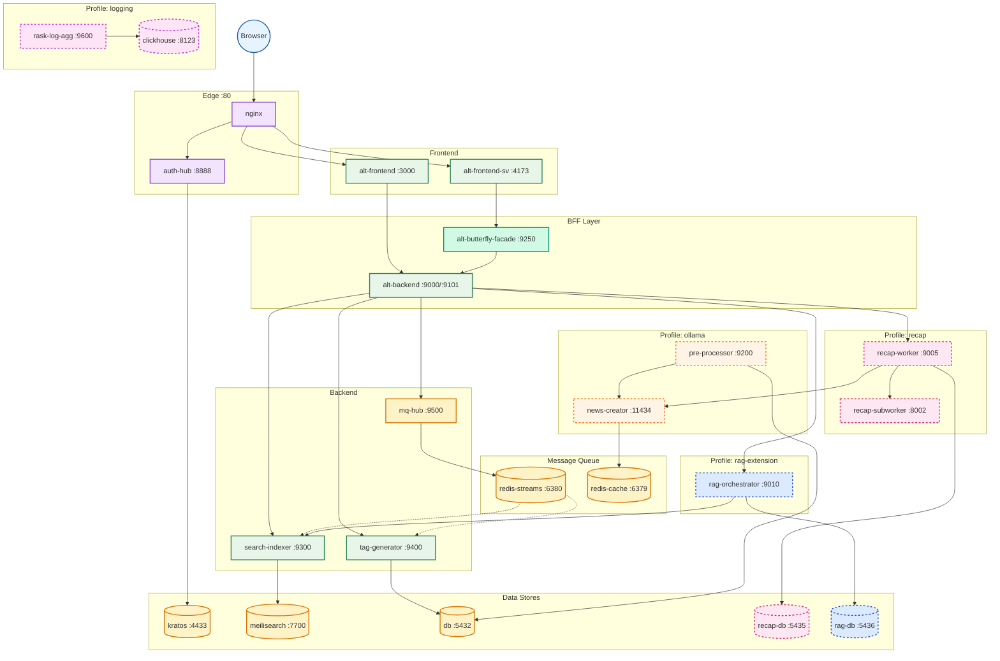

**Legend:**

| Style | Profile | Description |
|-------|---------|-------------|
| Green (solid) | default | Core services (always running) |
| Teal (solid) | default | BFF layer (alt-butterfly-facade) |
| Orange (solid) | default | Message queue (mq-hub, Redis) |
| Orange (dashed) | `--profile ollama` | AI/LLM services |
| Pink (dashed) | `--profile recap` | Summarization pipeline |
| Blue (dashed) | `--profile rag-extension` | RAG services |
| Magenta (dashed) | `--profile logging` | Log aggregation |
| Yellow | — | Data stores |

**Network:** `alt-network` (shared by all services)

**Persistent Volumes:**

| Volume | Service | Description |
|--------|---------|-------------|
| `db_data_17` | db | PostgreSQL 17 main data |
| `kratos_db_data` | kratos-db | Identity provider data |
| `meili_data` | meilisearch | Search indices |
| `recap_db_data` | recap-db | Recap pipeline data |
| `rag_db_data` | rag-db | RAG vectors (pgvector) |
| `clickhouse_data` | clickhouse | Log analytics |
| `news_creator_models` | news-creator | Ollama LLM models |
| `oauth_token_data` | auth-token-manager | OAuth2 tokens |
| `redis-cache-data` | redis-cache | LRU cache persistence |
| `redis-streams-data` | redis-streams | Event stream AOF persistence |

### Data Flow Overview

RSS feeds flow through ingestion, enrichment, and delivery stages. Each stage is handled by specialized services that maintain clear boundaries. Event-driven processing via Redis Streams enables asynchronous workflows.

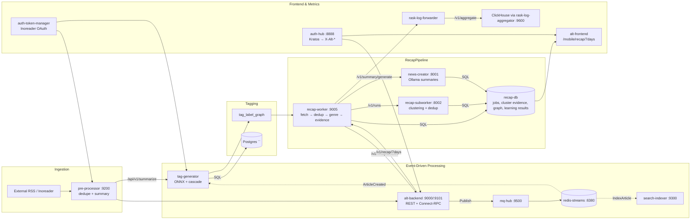

### Data Intelligence Flow

Articles progress through quality scoring, tagging, summarization, and search indexing before reaching the frontend.

```mermaid
flowchart LR
    classDef ingest fill:#e0f7fa,stroke:#00838f,color:#004d40
    classDef ai fill:#ffe0f0,stroke:#d81b60,color:#880e4f
    classDef storage fill:#fff4d5,stroke:#fb8c00,color:#5d2c00
    classDef surface fill:#e8f5e9,stroke:#388e3c,color:#1b5e20

    RSS[External RSS feeds]:::ingest --> Fetch[pre-processor :9200<br/>Fetch & dedupe]:::ingest
    Fetch --> Score[Quality scoring + language detection]:::ingest
    Score -->|SQL| RawDB[(PostgreSQL<br/>raw articles)]:::storage
    RawDB --> TagJob[tag-generator<br/>/api/v1/tags/batch]:::ai
    RawDB --> SummaryJob[news-creator :8001<br/>/api/v1/summarize]:::ai
    TagJob -->|SQL| TagDB[(PostgreSQL<br/>article_tags)]:::storage
    SummaryJob -->|SQL| SummaryDB[(PostgreSQL<br/>article_summaries)]:::storage
    TagDB --> IndexBatch[search-indexer :9300<br/>batch 200 docs]:::ai
    SummaryDB --> IndexBatch
    IndexBatch -->|upsert| Meili[(Meilisearch :7700<br/>search index)]:::storage
    Meili --> API[alt-backend :9000<br/>/v1/search + /v1/feeds/*]:::surface
    API --> Frontend[alt-frontend :3000<br/>Chakra themes]:::surface
```

### Microservice Communication

Direct API calls, event-driven messaging, and data flow between all microservices.

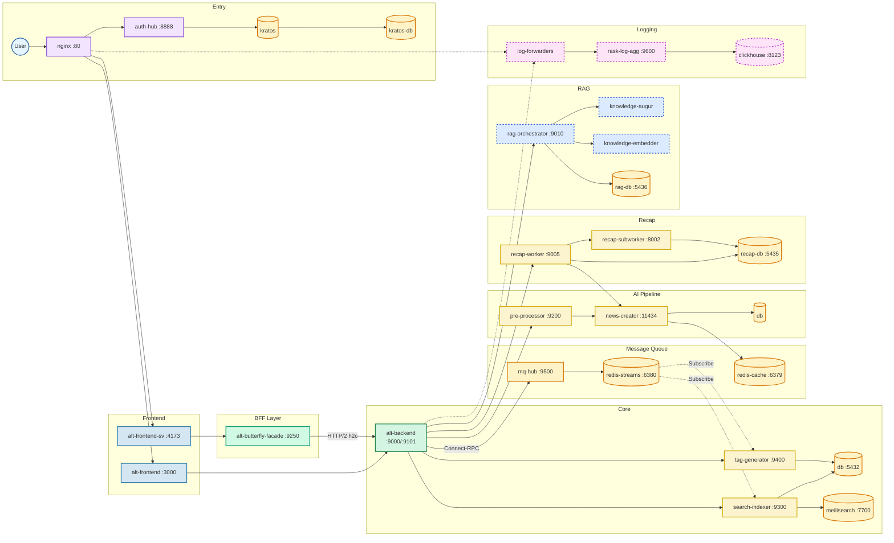

### Identity & Edge Access

Nginx fronts every `/api` call with `auth_request`, sending it to auth-hub. Auth-hub validates sessions via Kratos, caches results for 5 minutes, and forwards authoritative `X-Alt-*` headers. Alt-backend trusts these headers while delegating outbound HTTP to `sidecar-proxy`.

**Component Responsibilities:**

| Tier | Components | Role |
|------|------------|------|
| Client | Next.js UI, SvelteKit UI (`/sv`) | Responsive dashboards, feature flags via `NEXT_PUBLIC_*` / `PUBLIC_*` |
| Edge | Nginx, auth-hub | TLS termination, header normalization, auth checks |
| Core | alt-backend, pre-processor, tag-generator, news-creator, search-indexer | Domain logic, enrichment, indexing |
| Data | PostgreSQL, Meilisearch, ClickHouse, Kratos | Persistence, search, observability, identity |
| Observability | rask-log-forwarder, rask-log-aggregator | Durable log delivery to ClickHouse |

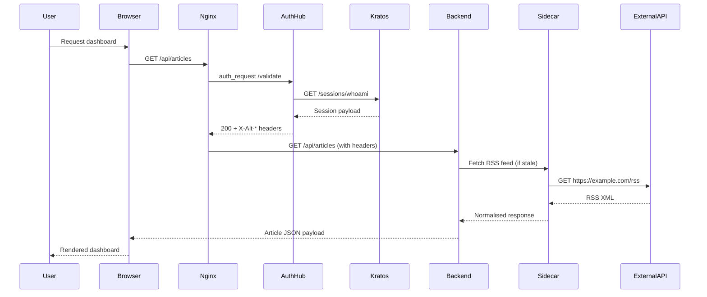

### Connect-RPC Architecture

Alt runs REST (port 9000) and Connect-RPC (port 9101) in parallel, enabling gradual migration to type-safe APIs while maintaining backward compatibility.

**Design Decisions:**
- **Parallel operation** – REST `/v1/*` on 9000 remains default; Connect-RPC on 9101 serves type-safe clients
- **Protocol Buffers** – Schema definitions in `proto/alt/` generate Go handlers and TypeScript clients via `make buf-generate`
- **Auth interceptor** – JWT validation via `X-Alt-Backend-Token` header

**Connect-RPC Services:**

| Service | Methods | Streaming | Description |
|---------|---------|-----------|-------------|
| ArticleService | 3 | No | FetchArticleContent, ArchiveArticle, FetchArticlesCursor |
| FeedService | 10 | Yes | Stats, feeds, search, summarize (StreamFeedStats, StreamSummarize) |
| RSSService | 4 | No | RegisterRSSFeed, ListRSSFeedLinks, DeleteRSSFeedLink, RegisterFavoriteFeed |
| AugurService | 2 | Yes | StreamChat (RAG Q&A), RetrieveContext |
| MorningLetterService | 1 | Yes | StreamChat (via rag-orchestrator :9010) |

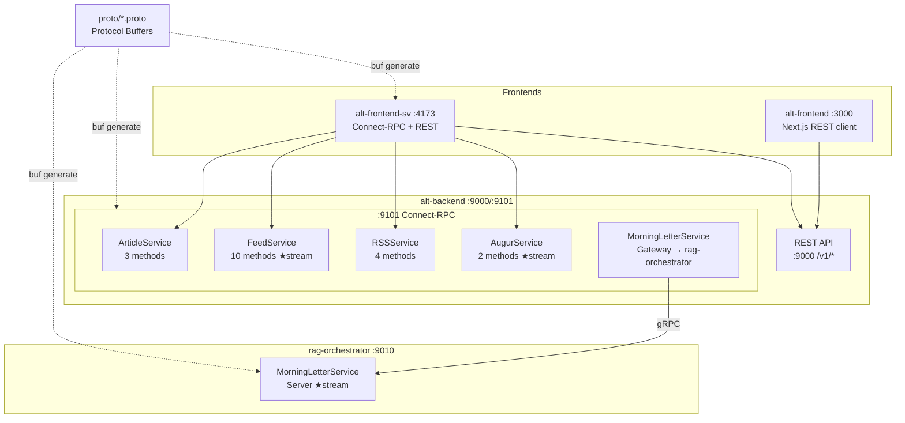

### RAG Pipeline Architecture

The RAG (Retrieval Augmented Generation) pipeline enables knowledge-based Q&A with grounded, citation-backed responses.

**Components:**
- **rag-orchestrator :9010** – Go service managing document indexing, context retrieval, and answer generation
- **rag-db** – PostgreSQL 18 with pgvector for vector similarity search
- **knowledge-embedder** – Generates vector embeddings for article chunks
- **knowledge-augur** – Ollama-based LLM for answer generation

**Flow:**
1. **Indexing** – Articles are chunked, embedded, and stored with version tracking
2. **Retrieval** – Queries are embedded and matched via pgvector similarity search
3. **Generation** – Top-K context chunks assembled into prompts for LLM generation

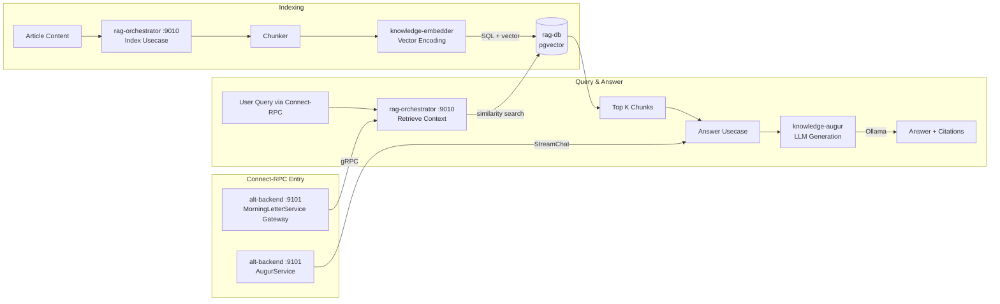

### Inter-Service Communication

Alt employs multiple communication protocols optimized for different use cases: synchronous HTTP/REST for simple requests, Connect-RPC for type-safe streaming, and Redis Streams for event-driven async workflows.

**Protocol Summary:**

| Protocol | Usage | Services |
|----------|-------|----------|
| HTTP/REST | ~70% | nginx ↔ frontends, backend ↔ workers, external APIs |
| Connect-RPC | ~20% | backend ↔ pre-processor, mq-hub, search-indexer; frontend-sv ↔ BFF |
| Redis Streams | ~5% | mq-hub → tag-generator, search-indexer (event-driven) |
| PostgreSQL | ~5% | All services → respective databases |

**Event-Driven Architecture:**

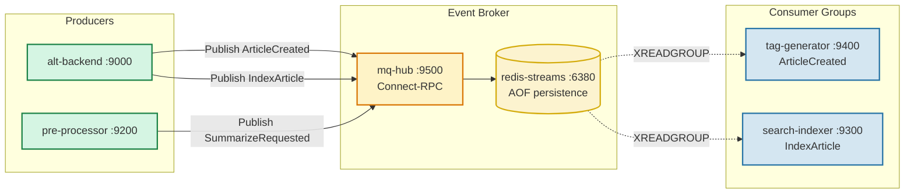

**Stream Keys:**

| Stream | Event Type | Consumers |
|--------|------------|-----------|
| `alt:events:articles` | ArticleCreated | tag-generator |
| `alt:events:index` | IndexArticle | search-indexer |
| `alt:events:summaries` | SummarizeRequested | pre-processor |
| `alt:events:tags` | TagsGenerated | search-indexer |

**BFF Architecture (alt-butterfly-facade):**

The BFF layer provides transparent Connect-RPC proxying with JWT validation for SvelteKit frontend.

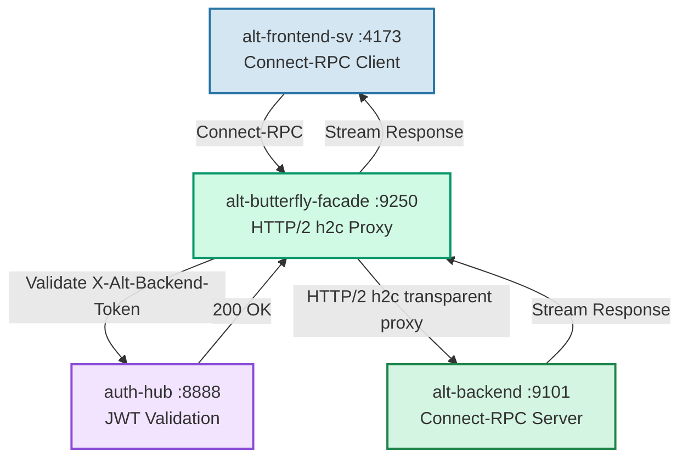

**Key Features:**
- **HTTP/2 cleartext (h2c)** – Multiplexed connections for Connect-RPC efficiency
- **JWT validation** – Tokens signed by auth-hub with BACKEND_TOKEN_SECRET
- **Transparent proxy** – Preserves streaming semantics for real-time UI updates

**Database Access Patterns:**

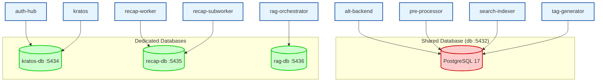

**Database User Segregation:**

| Database | Users | Services |
|----------|-------|----------|
| db (shared) | `alt_appuser`, `pre_processor_user`, `search_indexer_user`, `tag_generator` | backend, pre-processor, search-indexer, tag-generator |
| kratos-db | `kratos_user` | auth-hub, kratos |
| recap-db | `recap_user` | recap-worker, recap-subworker, dashboard |
| rag-db | `rag_user` | rag-orchestrator |

---

## Technology Stack

| Layer | Primary Tech | Version | Notes |
|-------|--------------|---------|-------|
| Web UI (Next.js) | Next.js 16, React 19.2, TypeScript 5.9 | Node.js 24 LTS | Chakra UI 3.30; App Router; Playwright + Vitest |
| Web UI (SvelteKit) | SvelteKit 2.49, Svelte 5.46, TailwindCSS v4 | Node.js 24 LTS | Svelte 5 Runes; `/sv` base; Connect-RPC client |
| Go API & RPC | Go 1.24/1.25, Echo 4.14, Connect-RPC 1.19 | Port 9000/9101 | Clean Architecture; GoMock; `make buf-generate` |
| Go Data Pipeline | Go 1.24/1.25, circuitbreaker, singleflight | — | Pre-processor, scheduler, search-indexer |
| RAG Pipeline | Go 1.25, pgvector, Ollama | Port 9010 | Chunk-based retrieval with LLM generation |
| Python AI Services | Python 3.11-3.13, FastAPI, Ollama, `uv` | — | news-creator, recap-subworker, tag-generator |
| Recap Pipeline | Rust 1.87, Axum, Tokio, sqlx | 2024 edition | recap-worker orchestration |
| Identity & Tokens | Ory Kratos 1.3.0, auth-hub (Go) | — | 5-min TTL cache; `X-Alt-*` headers |
| Observability | Rust 1.87, ClickHouse 25.9 | — | SIMD log forwarder; Axum aggregator |
| Storage & Search | PostgreSQL 17/18, Meilisearch 1.27.0 | — | Atlas migrations; pgvector for RAG |
| Orchestration | Docker Desktop 4.36+, Compose v2.27+, altctl | — | Profiles: ollama, logging, recap, rag-extension |

> **Version cadence:** Go/Rust track stable releases quarterly; Next.js/SvelteKit follow LTS adoption; Python runtimes are pinned per service.

---

## Services

Each service maintains a `CLAUDE.md` for workflow guidelines and a `docs/<service>.md` snapshot for architecture details.

| Service | Language | Primary Doc | Description |
|---------|----------|-------------|-------------|
| alt-frontend | TypeScript | [docs/alt-frontend.md](docs/alt-frontend.md) | Next.js 16 + React 19 UI with Chakra themes |
| alt-frontend-sv | TypeScript | [docs/alt-frontend-sv.md](docs/alt-frontend-sv.md) | SvelteKit `/sv` with Runes, TailwindCSS, Connect-RPC |
| alt-butterfly-facade | Go 1.24+ | [docs/alt-butterfly-facade.md](docs/alt-butterfly-facade.md) | HTTP/2 h2c BFF for SvelteKit with JWT validation |
| alt-backend | Go 1.24+ | [docs/alt-backend.md](docs/alt-backend.md) | Clean Architecture REST + Connect-RPC API |
| sidecar-proxy | Go 1.24+ | [docs/sidecar-proxy.md](docs/sidecar-proxy.md) | Egress proxy with HTTPS allowlists |
| mq-hub | Go 1.24+ | [docs/mq-hub.md](docs/mq-hub.md) | Redis Streams event broker via Connect-RPC |
| pre-processor | Go 1.24+ | [docs/pre-processor.md](docs/pre-processor.md) | RSS ingestion with dedupe and circuit breakers |
| pre-processor-sidecar | Go 1.24+ | [docs/pre-processor-sidecar.md](docs/pre-processor-sidecar.md) | Scheduler for Inoreader token refresh |
| news-creator | Python 3.11+ | [docs/news-creator.md](docs/news-creator.md) | FastAPI Ollama orchestrator for summaries |
| tag-generator | Python 3.13+ | [docs/tag-generator.md](docs/tag-generator.md) | ONNX-backed tag extraction pipeline |
| search-indexer | Go 1.24+ | [docs/search-indexer.md](docs/search-indexer.md) | Batch indexer for Meilisearch |
| auth-hub | Go 1.24+ | [docs/auth-hub.md](docs/auth-hub.md) | Kratos-aware IAP with session caching |
| auth-token-manager | Deno 2.x | [docs/auth-token-manager.md](docs/auth-token-manager.md) | OAuth2 CLI for Inoreader tokens |
| rask-log-forwarder | Rust 1.87+ | [docs/rask-log-forwarder.md](docs/rask-log-forwarder.md) | SIMD JSON log forwarder |
| rask-log-aggregator | Rust 1.87+ | [docs/rask-log-aggregator.md](docs/rask-log-aggregator.md) | Axum API for ClickHouse ingestion |
| recap-worker | Rust 1.87+ | [docs/recap-worker.md](docs/recap-worker.md) | 7-day recap pipeline orchestrator |
| recap-subworker | Python 3.12+ | [docs/recap-subworker.md](docs/recap-subworker.md) | Clustering and classification worker |
| recap-db | PostgreSQL 18 | [docs/recap-db.md](docs/recap-db.md) | Recap jobs, evidence, and learning results |
| rag-orchestrator | Go 1.25+ | [docs/rag-orchestrator.md](docs/rag-orchestrator.md) | RAG indexing, retrieval, and generation |
| rag-db | PostgreSQL 18 | [docs/rag-db.md](docs/rag-db.md) | pgvector for RAG documents and chunks |
| altctl | Go 1.24+ | [altctl/CLAUDE.md](altctl/CLAUDE.md) | CLI for Docker Compose orchestration |
| alt-perf | Deno 2.x | [alt-perf/CLAUDE.md](alt-perf/CLAUDE.md) | E2E performance measurement tool |

---

## Recap Pipeline

The 7-day recap feature condenses articles into genre cards with evidence links and AI-generated summaries.

### Pipeline Stages

`recap-worker` (Rust 2024) orchestrates seven stages via `PipelineOrchestrator`:

1. **Fetch** (`AltBackendFetchStage`) – Pull articles from alt-backend `/v1/recap/articles`, optionally enrich with tags
2. **Preprocess** (`TextPreprocessStage`) – Strip HTML, normalize Unicode, detect language, tokenize via Lindera
3. **Dedup** (`HashDedupStage`) – Remove near-duplicates with XXH3 + sentence similarity
4. **Genre** (`RemoteGenreStage` + `TwoStageGenreStage`) – Coarse classification via recap-subworker, then refine using `tag_label_graph`
5. **Select** (`SummarySelectStage`) – Trim per-genre documents, apply coherence filtering, build evidence bundle
6. **Dispatch** (`MlLlmDispatchStage`) – Fan out to recap-subworker for clustering, news-creator for summaries
7. **Persist** (`FinalSectionPersistStage`) – Store outputs to recap-db, emit metrics to ClickHouse

### API Surfaces

| Endpoint | Auth | Description |
|----------|------|-------------|
| `GET /v1/recap/7days` | Public | Latest recap summary with genre clusters and evidence |
| `GET /v1/recap/articles` | Service token | Article corpus for recap-worker |
| `POST /v1/generate/recaps/7days` | Service token | Manual job trigger |
| `/mobile/recap/7days` | Session | Mobile UI with Recap/Genres/Articles/Jobs tabs |

### Running the Recap Stack

```bash
# 1. Apply migrations
make recap-migrate

# 2. Start services
docker compose --profile recap --profile ollama up \
  recap-worker recap-subworker recap-db news-creator -d

# 3. Trigger a job (or wait for 04:00 JST scheduler)
curl -X POST http://localhost:9005/v1/generate/recaps/7days \
  -H 'Content-Type: application/json' -d '{"genres":[]}'

# 4. Verify output
curl http://localhost:9000/v1/recap/7days
```

### Pipeline Flow

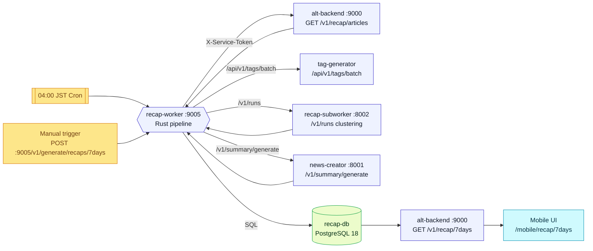

---

## Development

### Environment Setup Checklist

1. **Install toolchains** – Docker Desktop/Colima, Go 1.24+, Node.js 24 + pnpm, Python 3.12/3.13 with uv, Rust 1.87
2. **Bootstrap dependencies:**
   ```bash
   pnpm -C alt-frontend install
   uv sync --project tag-generator/app
   go mod download ./...
   cargo fetch
   ```
3. **Prepare environment** – Copy `.env.template` to `.env`, run `scripts/check-env.js`
4. **Smoke test:**
   ```bash
   pnpm -C alt-frontend build
   go test ./...
   uv run pytest
   cargo test
   altctl up && altctl down
   ```
5. **Align practices** – Read service `CLAUDE.md` files, enable format-on-save, keep credentials out of git

### Compose Profiles

| Profile | Services Added | Use Case |
|---------|---------------|----------|
| (default) | Frontend, backend, PostgreSQL, Kratos, Meilisearch, search-indexer, tag-generator | Core development |
| `ollama` | news-creator, pre-processor | AI summarization |
| `logging` | rask-log-forwarder sidecars (8) | Observability |
| `recap` | recap-worker, recap-subworker, recap-db | Recap pipeline |
| `rag-extension` | rag-orchestrator, rag-db, knowledge-* | RAG Q&A |

```bash
# Examples
docker compose --profile ollama --profile logging up -d
docker compose --profile recap --profile ollama up -d
docker compose --profile rag-extension up -d
```

### Testing

**TDD Workflow:** Red → Green → Refactor. Start with business-layer tests, regenerate mocks when interfaces evolve.

| Area | Command | Notes |
|------|---------|-------|
| Frontend unit | `pnpm -C alt-frontend test` | Vitest + Testing Library |
| Frontend E2E | `pnpm -C alt-frontend test:e2e` | Playwright POM; requires `make up` |
| Go services | `go test ./...` | Add `-race -cover` for concurrency |
| Python services | `uv run pytest` | pytest-asyncio; Ruff gates |
| Rust services | `cargo test -p <crate>` | `cargo bench` for hot paths |
| Deno service | `deno test` | BDD-style with `@std/testing/bdd` |
| Compose smoke | `make up` + curl health | Validates migrations, settings, auth |

**Test Layers:**
- **Unit** – Pure functions, usecases, adapters (table-driven, fixtures)
- **Integration** – Boundary checks (Go ↔ Postgres, FastAPI ↔ Ollama mock)
- **E2E** – Playwright journeys with Page Object Models
- **Golden/Performance** – ROUGE scoring, `criterion`/`testing.B` benchmarks

---

## Data & Storage

### Storage Overview

| Store | Purpose | Volume |
|-------|---------|--------|
| PostgreSQL 17 (db) | Canonical entities: feeds, articles, summaries, tags | `db_data_17` |
| PostgreSQL 18 (recap-db) | Recap jobs, evidence, tag graphs, learning results | `recap_db_data` |
| PostgreSQL 18 (rag-db) | RAG documents, chunks, embeddings (pgvector) | `rag_db_data` |
| Kratos | Identity state | `kratos_db_data` |
| Meilisearch | Full-text search indices | `meili_data` |
| ClickHouse | Structured log analytics | `clickhouse_data` |

### Data Model

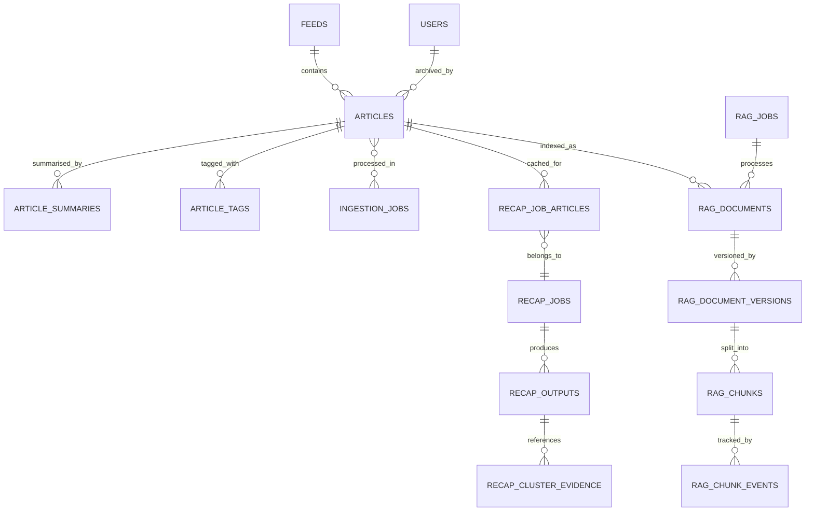

### Storage Guardrails

- **Retention** – Articles persist until archived; summaries/tags follow cascade rules
- **Indices** – PostgreSQL indexes on `(feed_id, archived)` and `(published_at DESC)`
- **Migrations** – Atlas migrations in `migrations-atlas/` must be backward-compatible
- **Resets** – `altctl down --volumes` clears all state
- **Backups** – Use `backup-postgres.sh` or `backup-postgres-docker.sh` when quiesced

---

## Operations

### Health Endpoints

| Service | Endpoint | Expected |
|---------|----------|----------|
| Frontend | `http://localhost:3000/api/health` | `{ "status": "ok" }` |
| Backend | `http://localhost:9000/v1/health` | `{ "status": "ok" }` |
| Auth Hub | `http://localhost:8888/health` | HTTP 200 |
| Meilisearch | `http://localhost:7700/health` | `{ "status": "available" }` |
| Kratos | `http://localhost:4433/health/ready` | HTTP 200 |
| Recap Worker | `http://localhost:9005/health/ready` | HTTP 200 |
| Recap Subworker | `http://localhost:8002/health/ready` | HTTP 200 |
| RAG Orchestrator | `http://localhost:9010/health` | HTTP 200 |
| Connect-RPC | `http://localhost:9101` | gRPC-Web endpoint |
| alt-frontend-sv | `http://localhost:4173/sv` | SvelteKit UI |
| ClickHouse | `http://localhost:8123/ping` | HTTP 200 |

### Observability

Enable the `logging` profile to run rask-log-forwarder sidecars that stream logs to ClickHouse:

```bash
docker compose --profile logging up -d
docker compose exec clickhouse clickhouse-client
```

Key metrics to monitor:
- `recap_genre_refine_*` counters
- `recap_api_evidence_duplicates_total`
- `recap_api_latest_fetch_duration_seconds`

### Troubleshooting

| Symptom | Cause | Resolution |
|---------|-------|------------|
| `pnpm dev` missing env vars | `.env` not aligned | Re-run `cp .env.template .env`, check `scripts/check-env.js` |
| Backend returns 401 | auth-hub cache stale or Kratos offline | Restart auth-hub; verify Kratos `/sessions/whoami` |
| Recap dashboard shows skeletons | recap profile not running or job failed | Start `--profile recap --profile ollama`; check logs |
| Recap evidence duplicates | Migrations missing or graph cache expired | Run `make recap-migrate`; refresh tag graph |
| Meilisearch empty after ingest | search-indexer not running | Check `docker compose logs search-indexer` |
| Ollama summary timeouts | Model not pulled or GPU unavailable | Run `ollama pull gemma:4b`; verify GPU drivers |
| Rust services crash | Insufficient ulimit or missing env | Set `LOG_LEVEL`, `RASK_ENDPOINT`; increase file descriptors |
| Go tests flaky | Missing fake clock or context deadline | Use `testing/synctest` clock; set explicit deadlines |
| Tag-generator 401 | `SERVICE_SECRET` mismatch | Align `.env` values; include `X-Service-Token` header |
| Playwright tests hang | Stack not running or selectors outdated | Start with `make up`; update POM selectors |
| RAG empty context | No indexed articles or pgvector missing | Run indexing job; verify pgvector extension |
| Connect-RPC fails | Port 9101 not exposed | Check compose.yaml exposes 9101 |
| alt-frontend-sv 404 | Wrong base path | Use `/sv` path; check `kit.paths.base` |

**General tip:** Use `docker compose ps` and `docker compose logs -f <service>` for debugging.

---

## Security

### Credentials & Secrets

- Never commit real credentials; keep developer defaults in `.env.template`
- Load production secrets via `.env` or Kubernetes Secrets
- Service-to-service calls use `SERVICE_SECRET` + `X-Service-Token` headers

### Identity

- auth-hub is the single source of identity – consume `X-Alt-*` headers
- Reject conflicting user context from other sources
- Session cache TTL: 5 minutes

### Best Practices

- Sanitize logs and redact sensitive fields
- Use TLS helpers: `make dev-ssl-setup`, `make dev-ssl-test`, `make dev-clean-ssl`
- Validate inputs, prefer parameterized queries
- Wrap errors with context without leaking private details

---

## Contributing

### Checklist

1. Read root and service-specific `CLAUDE.md` files before changes
2. Start every change with a failing test; keep suites green
3. Run formatters/linters before committing
4. Document new configuration, migrations, or APIs
5. Prove changes with the smallest meaningful test
6. Leave `stopped-using-k8s/` untouched unless asked
7. Verify `make up` succeeds after edits

### Change Management

- **Planning** – Open GitHub issues or ADRs for architectural work
- **Documentation** – Update README, `CLAUDE.md`, and runbooks when behavior changes
- **Code reviews** – Default to reviewer pairs who own affected services
- **Release cadence** – Weekly Compose releases after smoke tests pass
- **Communication** – #alt-dev for collaboration, #alt-ops for incidents

### External Integrations

- **Inoreader OAuth2** – Managed by auth-token-manager and pre-processor-sidecar
- **Ollama (Gemma 3 4B)** – Powers LLM summaries; install GPU drivers for `ollama` profile
- **RSS connectors** – pre-processor respects publisher rate limits (≥5 second intervals)

---

## Reference

### Glossary

| Term | Definition |
|------|------------|
| Alt | The Compose-first AI knowledge platform |
| Clean Architecture | Layered approach: interface → business logic → infrastructure |
| Compose profile | Named service group toggled via `docker compose --profile` |
| Connect-RPC | Type-safe RPC using Protocol Buffers (port 9101) |
| Golden dataset | Curated inputs/outputs for regression detection |
| IAP | Identity-Aware Proxy (auth-hub centralizes authentication) |
| LLM | Large Language Model (Ollama-powered Gemma 3 4B) |
| Meilisearch | Lightweight search engine for full-text indexing |
| pgvector | PostgreSQL extension for vector similarity search |
| RAG | Retrieval Augmented Generation for grounded Q&A |
| Rask | Rust observability services (forwarder + aggregator) |
| Recap | 7-day batch summarization feature |
| Runes | Svelte 5 reactive primitives (`$state`, `$derived`, `$effect`) |
| Singleflight | Go concurrency primitive for deduplicating requests |
| SvelteKit | Modern web framework powering alt-frontend-sv |
| TDD | Test-Driven Development (Red → Green → Refactor) |

### Essential Environment Variables

| Variable | Purpose |
|----------|---------|
| `POSTGRES_USER`, `POSTGRES_PASSWORD`, `POSTGRES_DB` | Main database credentials |
| `KRATOS_INTERNAL_URL`, `KRATOS_PUBLIC_URL` | Ory Kratos endpoints |
| `AUTH_HUB_INTERNAL_URL` | auth-hub internal URL |
| `NEXT_PUBLIC_APP_ORIGIN` | Frontend routing |
| `SERVICE_SECRET` | Service-to-service authentication |
| `RECAP_DB_USER`, `RECAP_DB_PASSWORD`, `RECAP_DB_NAME` | Recap database credentials |
| `BACKEND_CONNECT_URL` | Connect-RPC endpoint for SvelteKit |
| `OLLAMA_BASE_URL` | Ollama API URL (default: `http://localhost:11434`) |
| `EMBEDDING_MODEL`, `GENERATION_MODEL` | RAG model configuration |
| `RAG_MAX_CHUNKS` | Maximum context chunks for RAG queries |

### Command Cheat Sheet

```bash
# Stack management
altctl up                                      # Build and start default stacks
altctl down                                    # Stop (keep volumes)
altctl down --volumes                          # Full reset
altctl up core workers                         # Start specific stacks
altctl status                                  # View running services
altctl logs <service> -f                       # Stream logs

# Profiles
docker compose --profile ollama up -d          # AI services
docker compose --profile recap --profile ollama up -d  # Recap pipeline
docker compose --profile rag-extension up -d   # RAG services
docker compose --profile logging up -d         # Observability

# Testing
pnpm -C alt-frontend test                      # Next.js tests
pnpm -C alt-frontend-sv check                  # SvelteKit type check
cd alt-backend/app && go test ./...            # Go tests

# Migrations
make recap-migrate                             # Recap DB migrations
docker compose --profile rag-extension up rag-db-migrator  # RAG migrations

# Code generation
make buf-generate                              # Proto → Go + TypeScript

# Health checks
curl http://localhost:9000/v1/health           # Backend
curl http://localhost:9101                     # Connect-RPC
curl http://localhost:9010/health              # RAG
curl http://localhost:9000/v1/recap/7days      # Recap API
```

### External Resources

- [Next.js Documentation](https://nextjs.org/docs)
- [Go 1.25 Release Notes](https://go.dev/doc/devel/release)
- [Meilisearch Documentation](https://www.meilisearch.com/docs)
- [ClickHouse Documentation](https://clickhouse.com/docs)
- [Ollama](https://ollama.com/)
- [Ory Kratos](https://www.ory.sh/kratos/docs/)

### Roadmap

- Extend auth-hub with tenant scoping
- Add semantic embeddings to Meilisearch
- Deliver live article status (SSE/WebSocket)
- Harden ClickHouse dashboards

Historical Kubernetes assets in `stopped-using-k8s/` are reference-only.

### Open-Source Credits

Alt is built on many open-source projects:

- **Docker & Compose** – Container orchestration (Apache 2.0/MIT)
- **Node.js & pnpm** – JavaScript runtime and package manager (MIT)
- **Next.js & React** – Frontend framework and UI library (MIT) by Vercel and Meta
- **SvelteKit & Svelte** – Modern web framework (MIT)
- **Go** – Systems language (BSD-style) with Echo, GoMock, and ecosystem libraries
- **Python & FastAPI** – Python (PSF) with FastAPI (MIT) for AI services
- **Rust** – Compiler/toolchain (Apache 2.0/MIT) with Axum, Tokio, Criterion
- **Deno** – Secure TypeScript runtime (MIT)
- **Ollama** – Open-source LLM runtime (MIT)
- **Meilisearch** – Search engine (MIT)
- **PostgreSQL** – Database (PostgreSQL License) with pgvector extension
- **ClickHouse** – Columnar database (Apache 2.0)
- **Ory Kratos** – Identity infrastructure (Apache 2.0)

Each dependency retains its respective license. We remain committed to upstream contributions and timely upgrades.
