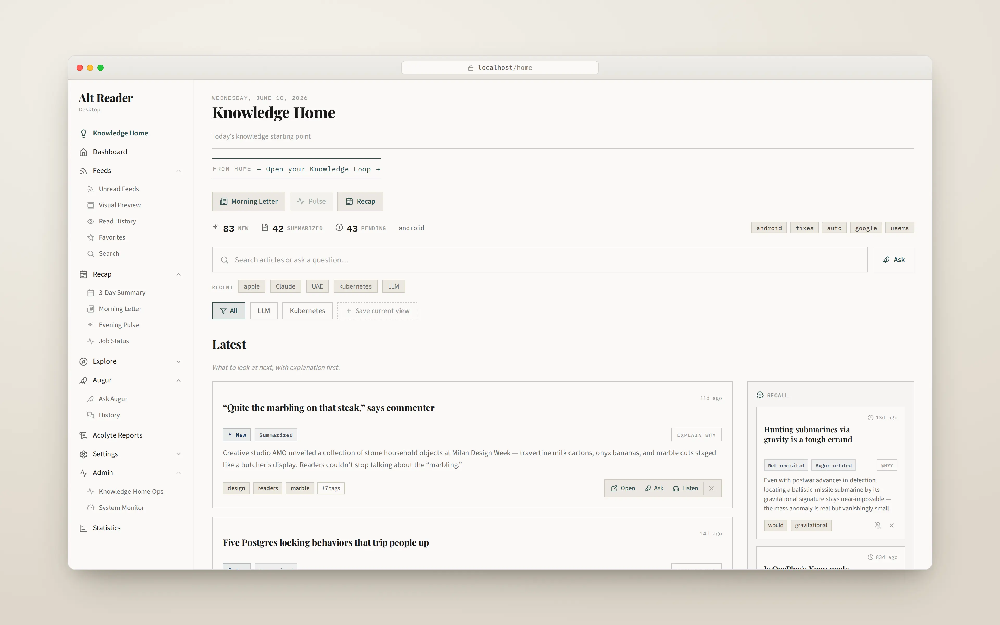
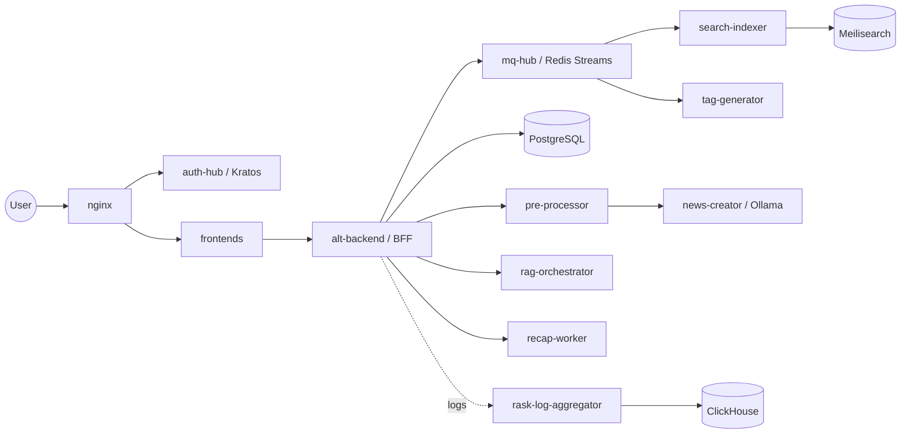

[](https://github.com/Kaikei-e/Alt/actions/workflows/backend-go.yaml)
[](https://github.com/Kaikei-e/Alt/actions/workflows/alt-frontend-sv.yml)
[](https://github.com/Kaikei-e/Alt/actions/workflows/tag-generator.yaml)
[](https://github.com/Kaikei-e/Alt/actions/workflows/pre-processor-quality.yml)
[](https://github.com/Kaikei-e/Alt/actions/workflows/search-indexer.yaml)
[](https://github.com/Kaikei-e/Alt/actions/workflows/pre-processor-sidecar-go.yaml)
[](https://github.com/Kaikei-e/Alt/actions/workflows/recap-worker.yml)
[](https://github.com/Kaikei-e/Alt/actions/workflows/rag-orchestrator.yml)
[](https://github.com/Kaikei-e/Alt/actions/workflows/rask-log-aggregator.yaml)
[](https://github.com/Kaikei-e/Alt/actions/workflows/rask-log-forwarder.yml)
[](https://github.com/Kaikei-e/Alt/actions/workflows/docker-build.yaml)
[](https://github.com/Kaikei-e/Alt/actions/workflows/proto-contract.yaml)
[](https://github.com/Kaikei-e/Alt/actions/workflows/metrics-workflow.yaml)

# Alt

_Last reviewed on March 18, 2026._

**Alt is a Compose-first knowledge platform built for turning information into reusable knowledge.**
Starting from RSS ingestion, Alt runs a local-first AI pipeline for summarization, tag extraction, search, recap, and RAG-powered Q&A, then brings the results together in **Knowledge Home** — the main surface for discovering, understanding, recalling, and revisiting what matters.

Built as an ambitious solo project with production-quality goals, Alt treats **privacy**, **observability**, and **system boundaries as product features**, not afterthoughts. It is designed around a clear stance: not a lightweight RSS reader, but a local-first knowledge operations system for people who want to ingest information, structure it, and find it again later.

**Key Capabilities:** RSS Ingestion • Knowledge Home (event-sourced discovery and recall surface) • AI Enrichment (LLM Summaries, Tag Extraction, Query Expansion, Re-ranking) • Full-Text Search • RAG Q&A (Ask Augur) • 3/7-Day Recaps • Morning Letter & Evening Pulse • Tag Verse (3D) & Tag Trail • Swipe Mode • Japanese TTS • Local LLM (Ollama) • ClickHouse Analytics • TDD-First Development



Alt is organized as a Compose-first monorepo with Go, Python, Rust, TypeScript, Deno, and F# services. Docker Compose is the source of truth for local orchestration. Historical Kubernetes assets under `stopped-using-k8s/` are reference-only.

## Table of Contents

- [Why Alt](#why-alt)
- [Architecture At A Glance](#architecture-at-a-glance)
- [Repository Layout](#repository-layout)
- [Quick Start](#quick-start)
- [Common Workflows](#common-workflows)
- [Services](#services)
- [Development](#development)
- [Documentation](#documentation)
- [Security](#security)
- [Contributing](#contributing)
- [License](#license)

## Why Alt

Alt is for developers and operators who want a local-first system for:

- ingesting articles from RSS and feed-driven workflows
- enriching content with summaries, tags, query expansion, and reranking
- searching and revisiting knowledge through a single surface
- running an opinionated microservice system locally with production-style boundaries

What makes it different:

- Compose-first orchestration instead of a split local-vs-prod story
- clear service boundaries with Clean Architecture in the core services
- observability built into the platform, not bolted on later
- support for local LLM-backed workflows via Ollama and companion AI services

## Architecture At A Glance

At a high level, Alt is structured into five layers:

- Edge and auth: `nginx`, `auth-hub`, Kratos
- Frontends: `alt-frontend-sv`
- Core platform: `alt-backend`, `alt-butterfly-facade`, `mq-hub`
- AI and processing: `pre-processor`, `news-creator`, `tag-generator`, `search-indexer`, `recap-worker`, `rag-orchestrator`, `tts-speaker`
- Data and observability: PostgreSQL, Meilisearch, Redis, ClickHouse, `rask-*`


```mermaid
flowchart LR
    User((User)) --> Nginx[nginx]
    Nginx --> Auth[auth-hub / Kratos]
    Nginx --> FE[frontends]
    FE --> API[alt-backend / BFF]
    API --> MQ[mq-hub / Redis Streams]
    API --> DB[(PostgreSQL)]
    MQ --> IDX[search-indexer]
    MQ --> TAG[tag-generator]
    API --> PRE[pre-processor]
    PRE --> NC[news-creator / Ollama]
    API --> RAG[rag-orchestrator]
    API --> RECAP[recap-worker]
    API -. logs .-> RASK[rask-log-aggregator]
    IDX --> MEILI[(Meilisearch)]
    RASK --> CH[(ClickHouse)]
```

Default orchestration starts from `altctl up`, which reads `.altctl.yaml` and brings up `db`, `auth`, `core`, and `workers`. Optional stacks such as `ai`, `recap`, `rag`, `logging`, `observability`, `perf`, and `backup` can be enabled as needed.

## Repository Layout

These are the main entry points for new contributors:

| Path | Purpose |
| --- | --- |
| `compose/` | Split Docker Compose stack definitions. `compose/compose.yaml` is the all-in-one entrypoint. |
| `altctl/` | CLI for stack orchestration, migrations, logs, and operational workflows. |
| `alt-backend/` | Core Go backend exposing REST and Connect-RPC APIs. |
| `alt-frontend-sv/` | SvelteKit frontend currently used for the main product surface. |
| `pre-processor/`, `news-creator/`, `tag-generator/`, `search-indexer/` | AI and enrichment pipeline services. |
| `recap-worker/`, `recap-subworker/`, `dashboard/`, `recap-evaluator/` | Recap pipeline and supporting tools. |
| `rag-orchestrator/`, `tts-speaker/` | RAG and TTS capabilities. |
| `auth-hub/`, `auth-token-manager/` | Identity-aware edge auth and token refresh tooling. |
| `rask-log-forwarder/`, `rask-log-aggregator/` | Structured log collection and ClickHouse ingestion. |
| `docs/` | ADRs, service notes, proposals, and runbooks. |

## Quick Start

### Prerequisites

- Docker Desktop or a compatible Docker Engine + Compose v2 setup
- Go 1.24+
- Python 3.12 or 3.13 with `uv`
- Rust 1.87+
- Deno 2.x
- Bun 1.x for `alt-frontend-sv`
- Optional: Ollama and GPU runtime for local AI-heavy workflows

### 1. Prepare the environment

```bash
cp .env.template .env
```

Edit `.env` for your local machine if you need to override defaults.

### 2. Install `altctl` (recommended)

```bash
cd altctl
go build -o altctl .
```

You can keep using the local binary from `altctl/`, install it onto your `PATH`, or skip this step and use raw Compose instead.

### 3. Start the default stack

```bash
altctl up
```

If you prefer raw Compose:

```bash
docker compose -f compose/compose.yaml -p alt up -d
```

### 4. Check health

Open the product at `http://localhost/` or `http://localhost:4173/`, then verify the core services:

```bash
curl http://localhost:9000/v1/health
curl http://localhost:7700/health
curl http://localhost:8888/health
curl http://localhost:9250/health
```

### 5. Stop or reset

```bash
altctl down
altctl down --volumes
```

### Optional stacks

```bash
altctl up ai
altctl up recap
altctl up rag
altctl up logging
altctl up observability
```

## Common Workflows

### Manage the stack

```bash
altctl status
altctl list
altctl logs alt-backend
altctl exec db -- psql -U postgres
```

### Run database migrations

```bash
make migrate-status
make recap-migrate-status
make recap-migrate
```

### Work directly with Compose

```bash
docker compose -f compose/compose.yaml -p alt ps
docker compose -f compose/compose.yaml -p alt logs -f alt-backend
docker compose -f compose/compose.yaml -p alt up -d search-indexer
```

## Services

The monorepo has many services, but these are the most important ones to understand first:

### Product surface

- `alt-frontend-sv`: current user-facing frontend
- `alt-butterfly-facade`: BFF for frontend-specific aggregation

### Core platform

- `alt-backend`: REST and Connect-RPC API, core business logic
- `auth-hub`: edge identity validation and `X-Alt-*` header authority
- `mq-hub`: event distribution for asynchronous processing

### AI and enrichment

- `pre-processor`: feed processing, quality gates, summarization orchestration
- `news-creator`: LLM-backed summary and generation service
- `tag-generator`: ML-powered tag extraction
- `search-indexer`: Meilisearch indexing and search integration

### Recap, RAG, and voice

- `recap-worker` and `recap-subworker`: 3-day and 7-day recap pipelines
- `rag-orchestrator`: grounded retrieval and answer orchestration
- `tts-speaker`: Japanese TTS service

### Observability and operations

- `rask-log-forwarder` and `rask-log-aggregator`: structured log pipeline into ClickHouse
- `altctl`: operational CLI for bringing the system up and managing it

## Development

Alt is a polyglot monorepo. The smallest useful test for the affected area should be your default verification target.

### Frontend

```bash
cd alt-frontend-sv && bun test
cd alt-frontend-sv && bun run check
cd alt-frontend-sv && bun run build
```

### Go services

```bash
cd alt-backend/app && go test ./...
cd pre-processor/app && go test ./...
cd search-indexer/app && go test ./...
cd auth-hub && go test ./...
```

### Python services

```bash
SERVICE_SECRET=test-secret uv run pytest
uv run pytest
uv run pyrefly .
uv run ruff check
```

### Rust services

```bash
cd recap-worker/recap-worker && cargo test
cd rask-log-forwarder/app && cargo test
cd rask-log-aggregator/app && cargo test
```

### Deno services

```bash
cd auth-token-manager && deno test
```

### Project conventions

- TDD first: Red -> Green -> Refactor
- Prefer focused, service-local tests over broad stack verification
- Keep service boundaries explicit
- Use `CLAUDE.md` files for repo and service-specific workflows

## Documentation

Start here if you want more detail than the root README should carry:

- [Root workflow guidance](./CLAUDE.md)
- [altctl README](./altctl/README.md)
- [alt-backend README](./alt-backend/README.md)
- [news-creator README](./news-creator/app/README.md)
- [tag-generator README](./tag-generator/app/README.md)
- [recap-worker README](./recap-worker/README.md)
- [docs/](./docs/)

## Security

- Do not commit real credentials. Use `.env.template` as a local starting point only.
- `SERVICE_SECRET` is used for service-to-service authentication across multiple services.
- `auth-hub` is the identity boundary for forwarded user context.
- Preserve redaction and structured logging behavior when changing auth, AI, or observability code.

## Contributing

Contributions are welcome, but this is an opinionated monorepo with strong architectural constraints.

Before making changes:

1. Read [CLAUDE.md](./CLAUDE.md) and the service-specific `CLAUDE.md` for the area you are editing.
2. Start with a failing test whenever you are changing behavior.
3. Keep changes focused and document config, API, or migration changes.
4. Leave `stopped-using-k8s/` untouched unless the task explicitly targets historical manifests.

If you are exploring the codebase for the first time, start with `altctl/`, `alt-backend/`, `alt-frontend-sv/`, and one pipeline service such as `pre-processor/` or `recap-worker/`.

## License

Alt is licensed under [Apache License 2.0](./LICENSE).
