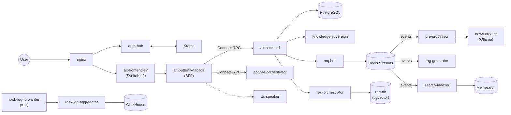

[](https://github.com/Kaikei-e/Alt/actions/workflows/backend-go.yaml)
[](https://github.com/Kaikei-e/Alt/actions/workflows/alt-frontend-sv-unit-test.yaml)
[](https://github.com/Kaikei-e/Alt/actions/workflows/alt-frontend-sv.yml)
[](https://github.com/Kaikei-e/Alt/actions/workflows/tag-generator.yaml)
[](https://github.com/Kaikei-e/Alt/actions/workflows/pre-processor-quality.yml)
[](https://github.com/Kaikei-e/Alt/actions/workflows/search-indexer.yaml)
[](https://github.com/Kaikei-e/Alt/actions/workflows/pre-processor-sidecar-go.yaml)
[](https://github.com/Kaikei-e/Alt/actions/workflows/news-creator.yml)
[](https://github.com/Kaikei-e/Alt/actions/workflows/recap-worker.yml)
[](https://github.com/Kaikei-e/Alt/actions/workflows/rag-orchestrator.yml)
[](https://github.com/Kaikei-e/Alt/actions/workflows/acolyte-orchestrator.yml)
[](https://github.com/Kaikei-e/Alt/actions/workflows/rask-log-aggregator.yaml)
[](https://github.com/Kaikei-e/Alt/actions/workflows/rask-log-forwarder.yml)
[](https://github.com/Kaikei-e/Alt/actions/workflows/docker-build.yaml)
[](https://github.com/Kaikei-e/Alt/actions/workflows/proto-contract.yaml)
[](https://github.com/Kaikei-e/Alt/actions/workflows/metrics-workflow.yaml)

# Alt

> Learn from you, serve for you

**Alt is a Compose-first knowledge platform that turns RSS feeds into searchable, enriched, and rediscoverable knowledge.** A local AI pipeline handles summarization, tag extraction, recap generation, RAG-powered Q&A, and long-form report writing -- then surfaces the results in **Knowledge Home**, an event-sourced discovery and recall interface.

`Go 1.26` · `Python 3.14` · `Rust 1.94` · `TypeScript (SvelteKit 2)` · `Deno 2` · `F# (.NET 10)`


[Code Wiki](https://codewiki.google/github.com/kaikei-e/alt)

## Why Alt

Most RSS readers stop at listing articles. Alt starts there and keeps going -- it ingests, enriches, summarizes, indexes, recaps, and answers questions about your reading, all running locally on your own machine.

**Ingest once, rediscover forever.** Every article flows through a local AI pipeline: summaries are generated by a local LLM, tags are extracted by ML models, and full-text search indexes are built automatically. Weeks later, Knowledge Home resurfaces what matters -- and tells you *why* it resurfaced, because every state change is recorded as an immutable event.

**Ask your own reading.** Ask Augur grounds answers in your actual article corpus, not the open web. Acolyte writes long-form research reports by searching, curating, and synthesizing across your knowledge base -- with citations.

**Own your data, run it your way.** No cloud dependency. Everything runs in Docker Compose on a single machine. Your articles, summaries, embeddings, and interaction history stay on your disk. The event-sourced architecture means you can rebuild any view from the event log at any time.

What sets Alt apart:

- **Event-sourced knowledge state** -- append-only events, disposable projections, full audit trail
- **Local-first AI** -- Ollama on your GPU. No API keys, no usage limits, no data leaving your machine
- **Production-grade boundaries** -- 20+ microservices, Clean Architecture, Connect-RPC contracts, TDD
- **Observability built in** -- ClickHouse logging, Grafana dashboards, Prometheus metrics, SLO monitoring

## Architecture


```mermaid
flowchart LR
    User((User)) --> nginx
    nginx --> auth-hub
    auth-hub <--> Kratos

    nginx --> FE["alt-frontend-sv<br/>(SvelteKit 2)"]
    FE --> BFF["alt-butterfly-facade<br/>(BFF)"]

    BFF -->|Connect-RPC| BE[alt-backend]
    BFF -->|Connect-RPC| ACOL[acolyte-orchestrator]
    BFF -.-> TTS[tts-speaker]

    BE --> DB[(PostgreSQL)]
    BE --> KS[knowledge-sovereign]
    BE --> MQ[mq-hub]
    MQ --> RS[(Redis Streams)]

    RS -->|events| PP[pre-processor]
    RS -->|events| TG[tag-generator]
    RS -->|events| SI[search-indexer]
    PP --> NC["news-creator<br/>(Ollama)"]
    SI --> Meili[(Meilisearch)]

    BE --> RAG[rag-orchestrator]
    RAG --> RAGDB[("rag-db<br/>(pgvector)")]

    RLF["rask-log-forwarder<br/>(x13)"] --> RLA[rask-log-aggregator] --> CH[(ClickHouse)]
```

Six layers: **Edge & Auth** (nginx, auth-hub, Kratos) · **Product Surface** (SvelteKit frontend, BFF) · **Core Platform** (alt-backend, mq-hub, knowledge-sovereign) · **Ingestion & Enrichment** (pre-processor, news-creator, tag-generator, search-indexer) · **Intelligence** (rag-orchestrator, acolyte-orchestrator, recap-worker, tts-speaker) · **Observability & Data** (PostgreSQL x7, Meilisearch, ClickHouse, Redis x2, Grafana, Prometheus)

Services communicate via REST, Connect-RPC (Protobuf), and Redis Streams. For the full service reference with ports, health endpoints, and dependency graph, see [`docs/services/MICROSERVICES.md`](./docs/services/MICROSERVICES.md).

## Quick Start

**Prerequisites:** Docker + Compose v2, Go 1.26+. Optional: Ollama + NVIDIA GPU for AI workflows.

```bash
cp .env.template .env                          # 1. Configure environment
cd altctl && go build -o altctl . && cd ..      # 2. Build the CLI
altctl up                                       # 3. Start default stack (db, auth, core, workers)
```

Open `http://localhost/` and verify:

```bash
curl http://localhost:9000/v1/health    # alt-backend
curl http://localhost:8888/health       # auth-hub
curl http://localhost:7700/health       # Meilisearch
```

Add optional stacks as needed:

```bash
altctl up ai            # LLM summarization (GPU)
altctl up recap         # 3/7-day recaps (GPU)
altctl up rag           # RAG Q&A
altctl up logging       # Structured logs → ClickHouse
altctl up observability # Grafana + Prometheus
```

```bash
altctl down             # Stop
altctl down --volumes   # Stop and remove data
```

## Development

Alt is a polyglot monorepo. Each service has its own `CLAUDE.md` with service-specific guidance.

| Language | Test | Services |
| --- | --- | --- |
| Go 1.26+ | `go test ./...` | alt-backend, auth-hub, pre-processor, search-indexer, mq-hub, rag-orchestrator, knowledge-sovereign |
| Python 3.14+ | `uv run pytest` | news-creator, tag-generator, acolyte-orchestrator, recap-subworker, metrics |
| Rust 1.94+ | `cargo test` | recap-worker, rask-log-aggregator, rask-log-forwarder |
| TypeScript | `bun test` | alt-frontend-sv |
| Deno 2.x | `deno test` | auth-token-manager, alt-perf |
| F# (.NET 10) | `dotnet test` | feed-validator, news-pulser, news-vigil |

**Conventions:** TDD first (Red → Green → Refactor) · Clean Architecture (Handler → Usecase → Port → Gateway → Driver) · Each service owns its data · Rebuild compiled services after changes (`docker compose up --build -d <service>`)

## Go Deeper

| Resource | What you'll find |
| --- | --- |
| [`docs/services/MICROSERVICES.md`](./docs/services/MICROSERVICES.md) | Full service catalog -- ports, health endpoints, compose files, dependency graph |
| [`CLAUDE.md`](./CLAUDE.md) | Development rules, compose commands, critical invariants |
| [`altctl/README.md`](./altctl/README.md) | CLI reference -- stack management, migrations, backup/restore |
| [`docs/`](./docs/) | 466+ ADRs, service docs, runbooks, proposals, reviews (Obsidian vault) |

You can also ask Gemini at [Code Wiki](https://codewiki.google/github.com/kaikei-e/alt) for help understanding the codebase.

## Security

- No credentials in code. Use `.env.template` and Docker file-based secrets (`/run/secrets/*`).
- `auth-hub` is the identity boundary -- validates Kratos sessions, forwards `X-Alt-*` headers.
- `SERVICE_SECRET` authenticates all service-to-service calls via `X-Service-Token`.

## Contributing

1. Read [CLAUDE.md](./CLAUDE.md) and the service-specific `CLAUDE.md` for the area you are editing.
2. Start with a failing test whenever you are changing behavior.
3. Keep changes focused. Rebuild compiled services after changes.

New to the codebase? Start with `altctl/`, `alt-backend/`, `alt-frontend-sv/`, and one pipeline service like `pre-processor/` or `recap-worker/`.

## License

[Apache License 2.0](./LICENSE)
