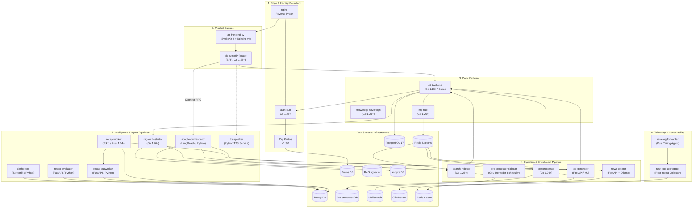

[](https://github.com/Kaikei-e/Alt/actions/workflows/backend-go.yaml)
[](https://github.com/Kaikei-e/Alt/actions/workflows/alt-frontend-sv-unit-test.yaml)
[](https://github.com/Kaikei-e/Alt/actions/workflows/alt-frontend-sv.yml)
[](https://github.com/Kaikei-e/Alt/actions/workflows/tag-generator.yaml)
[](https://github.com/Kaikei-e/Alt/actions/workflows/pre-processor-quality.yml)
[](https://github.com/Kaikei-e/Alt/actions/workflows/search-indexer.yaml)
[](https://github.com/Kaikei-e/Alt/actions/workflows/pre-processor-sidecar-go.yaml)
[](https://github.com/Kaikei-e/Alt/actions/workflows/news-creator.yml)
[](https://github.com/Kaikei-e/Alt/actions/workflows/recap-worker.yml)
[](https://github.com/Kaikei-e/Alt/actions/workflows/rag-orchestrator.yml)
[](https://github.com/Kaikei-e/Alt/actions/workflows/knowledge-sovereign.yaml)
[](https://github.com/Kaikei-e/Alt/actions/workflows/acolyte-orchestrator.yml)
[](https://github.com/Kaikei-e/Alt/actions/workflows/rask-log-aggregator.yaml)
[](https://github.com/Kaikei-e/Alt/actions/workflows/rask-log-forwarder.yml)
[](https://github.com/Kaikei-e/Alt/actions/workflows/docker-build.yaml)
[](https://github.com/Kaikei-e/Alt/actions/workflows/proto-contract.yaml)
[](https://github.com/Kaikei-e/Alt/actions/workflows/metrics-workflow.yaml)

# Alt

> Learn from you, serve for you.

Alt is a Docker Compose-first, local-first knowledge platform that transforms standard RSS feeds into searchable, enriched, and rediscoverable intelligence. Featuring a local-first AI extraction pipeline, it handles text summarization, tag extraction, weekly recaps, vector-based RAG Q&A, and multi-agent report compilation—exposing the results in a real-time, event-sourced discovery interface.

`Go 1.26` · `Python 3.14` · `Rust 1.94 (2024 Edition)` · `TypeScript (Svelte 5 Runes + Tailwind v4)` · `Deno 2` · `F# (.NET 10)`


[Code Wiki](https://codewiki.google/github.com/kaikei-e/alt)

---

## Why Alt?

Most RSS readers stop at listing articles. Alt starts there and keeps going—it ingests, enriches, summarizes, indexes, recaps, and answers questions about your reading, all running locally on your own machine.

### Ingest Once, Rediscover Forever (Event-Sourced Memory)
Traditional RSS feeds are transient streams that induce information anxiety and build up unread backlogs. Alt changes this paradigm by compiling incoming content into a structured, permanent local knowledge base.
Every read event, feed update, or interaction is captured in an append-only event stream (`knowledge_events`). Utilizing a CQRS pattern, the entire user-facing projection system (`knowledge_home_items`) can be safely thrown away, backfilled, or reprojected from the event log at any time. Wire schemas are strictly typed Go structures, ensuring long-term data integrity and preventing drift bugs.

### Synthesize with Semantic Intelligence
Don't just search your article lists; interview them.
*   **Ask Augur:** Ground RAG (Retrieval-Augured Generation) Q&A queries directly in your private article history, not the open web.
*   **Acolyte Agent:** A Python Connect-RPC LangGraph service that plans, gathers evidence, curates sources, drafts, and refines synthesized research papers—complete with full citations—based strictly on what you have read.

### Own Your Data, Run It Your Way
Alt has zero cloud dependencies and requires no API keys or subscription fees. Everything runs locally on your hardware in Docker Compose. Your feed list, articles, vector embeddings, summaries, and interaction logs stay strictly on your local disk. 

---

## What Sets Alt Apart?

We built Alt using strict, production-grade engineering principles to ensure your home-lab or single-server deployment behaves like a enterprise-class distributed platform:

*   **Production-Grade Microservice Boundaries (20+ Polyglot Services):** Every component enforces strict Clean Architecture bounds (`Handler → Usecase → Port → Gateway → Driver`). Structured Connect-RPC and Protobuf contracts ensure type-safety across service edges. If an external API or network node goes offline, the rest of the ingestion queue remains active and healthy.
*   **Ultra-High Throughput Log Ingestion (Rask Telemetry):** Telemetry is handled by a custom, lock-free Rust agent (`rask-log-forwarder`) tailing container stdout with `simd-json` yielding over 4 GB/s parsing throughput. Logs are buffered via `bytes::Bytes` zero-copy streams and sled embedded databases before bulk ingestion into ClickHouse log pools.
*   **Accelerated CPU Batch Recap Engine:** Weekly recaps are handled by our multi-threaded Rust batch worker (`recap-worker`). Heavy Japanese morphological tokenization (Lindera IPADIC), language classification (whatlang), and HTML cleaning (ammonia) are offloaded to Tokyo threadpools. Near-duplicates are filtered via sentence-level `XXH3` hashing, and genre categorizations are solved using sprs-based sparse matrix graph label propagation.
*   **Interactive 3D Visual Exploration:** Explore your reading associations through **Tag Verse**, a WebGPU-accelerated 3D co-occurrence tag cloud computed using server-side Barnes-Hut O(n log n) layout algorithms and rendered in the browser via Three.js and Threlte v8.

---

## Technical Architecture

Alt is structured as a six-layer microservice catalog running in Docker Compose:


```mermaid
flowchart TB
    subgraph EdgeLayer["1. Edge & Identity Boundary"]
        nginx[nginx<br/>Reverse Proxy]
        auth-hub[auth-hub<br/>Go 1.26+]
        kratos[Ory Kratos<br/>v1.3.0]
    end

    subgraph PresentationLayer["2. Product Surface"]
        alt-frontend-sv["alt-frontend-sv<br/>(SvelteKit 2 + Tailwind v4)"]
        alt-butterfly-facade["alt-butterfly-facade<br/>(BFF / Go 1.26+)"]
    end

    subgraph CoreLayer["3. Core Platform"]
        alt-backend["alt-backend<br/>(Go 1.26+ / Echo)"]
        knowledge-sovereign["knowledge-sovereign<br/>(Go 1.26+)"]
        mq-hub["mq-hub<br/>(Go 1.26+)"]
    end

    subgraph IngestionLayer["4. Ingestion & Enrichment Pipeline"]
        pre-processor["pre-processor<br/>(Go 1.26+)"]
        pre-processor-sidecar["pre-processor-sidecar<br/>(Go / Inoreader Scheduler)"]
        search-indexer["search-indexer<br/>(Go 1.26+)"]
        tag-generator["tag-generator<br/>(FastAPI / ML)"]
        news-creator["news-creator<br/>(FastAPI + Ollama)"]
    end

    subgraph IntelligenceLayer["5. Intelligence & Agent Pipelines"]
        rag-orchestrator["rag-orchestrator<br/>(Go 1.26+)"]
        acolyte-orchestrator["acolyte-orchestrator<br/>(LangGraph / Python)"]
        recap-worker["recap-worker<br/>(Tokio / Rust 1.94+)"]
        recap-subworker["recap-subworker<br/>(FastAPI / Python)"]
        recap-evaluator["recap-evaluator<br/>(FastAPI / Python)"]
        tts-speaker["tts-speaker<br/>(Python TTS Service)"]
        dashboard-streamlit["dashboard<br/>(Streamlit / Python)"]
    end

    subgraph TelemetryLayer["6. Telemetry & Observability"]
        rask-log-forwarder["rask-log-forwarder<br/>(Rust Tailing Agent)"]
        rask-log-aggregator["rask-log-aggregator<br/>(Rust Ingest Collector)"]
    end

    subgraph DataStoreLayer["Data Stores & Infrastructure"]
        db[(PostgreSQL 17)]
        kratos-db[(Kratos DB)]
        recap-db[(Recap DB)]
        rag-db[(RAG pgvector)]
        acolyte-db[(Acolyte DB)]
        pre-processor-db[(Pre-processor DB)]
        meilisearch[(Meilisearch)]
        clickhouse[(ClickHouse)]
        redis-streams[(Redis Streams)]
        redis-cache[(Redis Cache)]
    end

    %% Client and Gateway routing
    nginx --> alt-frontend-sv & auth-hub
    auth-hub --> kratos --> kratos-db
    alt-frontend-sv --> alt-butterfly-facade --> alt-backend

    %% Core Data & Event dispatching
    alt-backend --> db & mq-hub & auth-hub
    mq-hub --> redis-streams
    redis-streams --> pre-processor & tag-generator & search-indexer

    %% Pipeline connections
    pre-processor --> pre-processor-db & alt-backend & redis-cache
    search-indexer --> alt-backend & meilisearch
    tag-generator --> alt-backend
    news-creator --> redis-cache
    
    %% Advanced intelligence connections
    alt-butterfly-facade -->|"Connect-RPC"| acolyte-orchestrator
    acolyte-orchestrator --> acolyte-db & search-indexer & news-creator
    alt-backend --> rag-orchestrator --> rag-db & search-indexer
    alt-butterfly-facade -.-> tts-speaker

    %% Recap batch execution
    recap-worker --> recap-db & recap-subworker & news-creator
    recap-subworker & recap-evaluator & dashboard-streamlit --> recap-db

    %% Telemetry loops
    rask-log-forwarder --> rask-log-aggregator --> clickhouse
```

Six layers: **Edge & Auth** (nginx, auth-hub, Kratos) · **Product Surface** (SvelteKit frontend, BFF) · **Core Platform** (alt-backend, mq-hub, knowledge-sovereign) · **Ingestion & Enrichment** (pre-processor, news-creator, tag-generator, search-indexer) · **Intelligence** (rag-orchestrator, acolyte-orchestrator, recap-worker, tts-speaker) · **Observability & Data** (PostgreSQL x7, Meilisearch, ClickHouse, Redis x2, Grafana, Prometheus)

Services communicate via REST, Connect-RPC (Protobuf), and Redis Streams. For the full service reference with ports, health endpoints, and dependency graph, see [`docs/services/MICROSERVICES.md`](./docs/services/MICROSERVICES.md).

---

## Monorepo Service Directory

Alt separates concerns across distinct microservices located within the repository root:

### Product Surface & Edge Gateways
| Directory | Technology | Default Port | Primary Responsibility |
| :--- | :--- | :--- | :--- |
| [`alt-frontend-sv/`](./alt-frontend-sv) | TypeScript / SvelteKit 2 + Svelte 5 Runes + Tailwind v4 + Threlte | `4173` | Core UI dashboard. Implements type-safe API queries and Threlte WebGPU tag visualization under `/sv`. |
| [`alt-butterfly-facade/`](./alt-butterfly-facade) | Go 1.26+ / Connect-RPC | `9250` | Aggregation API gateway and Connect-RPC reverse proxy mapping requests. |
| [`auth-hub/`](./auth-hub) | Go 1.26+ / Echo | `8888` | Identity session validation bridge. Validates Ory Kratos public cookies and exchanges keys. |
| [`auth-token-manager/`](./auth-token-manager) | Deno 2.x | `9201` | Safe OAuth2 client refreshing and serializing external Inoreader platform credentials. |

### Core & Ingestion Framework
| Directory | Technology | Default Port | Primary Responsibility |
| :--- | :--- | :--- | :--- |
| [`alt-backend/`](./alt-backend) | Go 1.26+ / Clean Architecture | `9000` / `9101` | Primary SQL driver owner. Computes event outboxes, manages feed storage, and serves backfills. |
| [`knowledge-sovereign/`](./knowledge-sovereign) | Go 1.26+ | `9500` | Append-only transaction ledger validating and saving structured projection runs. |
| [`mq-hub/`](./mq-hub) | Go 1.26+ / Redis Streams | `9500` | Stream message distributor routing payload packets throughout parallel workers. |
| [`pre-processor/`](./pre-processor) | Go 1.26+ | `9200` / `9202` | Feed enrichment worker incorporating `go-circuitbreaker` boundaries for third-party requests. |
| [`pre-processor-sidecar/`](./pre-processor-sidecar) | Go 1.26+ | - | Inoreader collection cron scheduler executing tasks via singleflight caches. |
| [`search-indexer/`](./search-indexer) | Go 1.26+ | `9300` / `9301` | Index builder packaging upsert requests to Meilisearch in batches of 200 items. |
| [`tag-generator/`](./tag-generator) | Python 3.14+ / FastAPI | `9400` | PyTorch NLP model extracting article entities and tagging categorizations. |
| [`news-creator/`](./news-creator) | Python 3.14+ / FastAPI | `11434` | Inference gateway handling local summarization workloads via GPU-bound Ollama APIs. |

### Intelligence & Telemetry Pipelines
| Directory | Technology | Default Port | Primary Responsibility |
| :--- | :--- | :--- | :--- |
| [`rag-orchestrator/`](./rag-orchestrator) | Go 1.26+ | `9010` / `9011` | Semantic search index client querying pgvector configurations. |
| [`acolyte-orchestrator/`](./acolyte-orchestrator) | Python 3.14+ / LangGraph | `8090` | LangGraph agent synthesizing cited reports using Connect-RPC routing. |
| [`recap-worker/`](./recap-worker) | Rust 1.94+ (Tokio) | `9005` | High-throughput batch worker running sentence-level XXH3 deduplication and genre analysis. |
| [`recap-subworker/`](./recap-subworker) | Python 3.14+ / FastAPI | `8002` | Localized summary structuring endpoint verifying recap metrics. |
| [`recap-evaluator/`](./recap-evaluator) | Python / FastAPI | `8085` | DeepEval integration pipeline checking hallucination boundaries inside summaries. |
| [`rask-log-forwarder/`](./rask-log-forwarder) | Rust 1.94+ | - | SIMD-based zero-copy Docker log parser forwarding container stdout. |
| [`rask-log-aggregator/`](./rask-log-aggregator) | Rust 1.94+ / Axum | `9600` / `4317` | OpenTelemetry receiver collecting telemetry buffers for ClickHouse bulk inputs. |

*Note: The F# (.NET 10) directories ([`feed-validator/`](./feed-validator), `news-pulser/`, and `news-vigil/`) are dedicated sandbox environments for type-safe functional RSS parsing research using Giraffe routes and FSharp.Data Type Providers.*

---

## Quick Start

**Prerequisites:** Docker + Compose v2, Go 1.26+. Optional: Ollama + NVIDIA GPU for AI workflows.

```bash
cp .env.template .env                          # 1. Configure environment
cd altctl && go build -o altctl . && cd ..      # 2. Build the CLI
altctl up                                       # 3. Start default stack (db, auth, core, workers)
```

Open `http://localhost/` and verify:

```bash
curl http://localhost:9000/v1/health    # alt-backend
curl http://localhost:8888/health       # auth-hub
curl http://localhost:7700/health       # Meilisearch
```

Add optional stacks as needed:

```bash
altctl up ai            # LLM summarization (GPU)
altctl up recap         # 3/7-day recaps (GPU)
altctl up rag           # RAG Q&A
altctl up logging       # Structured logs → ClickHouse
altctl up observability # Grafana + Prometheus
```

```bash
altctl down             # Stop
altctl down --volumes   # Stop and remove data
```

---

## Local Development Loop

Alt is configured for Test-Driven Development (TDD) and rigid data ownership invariants.

### Code Invariants & Rules
1.  **TDD First:** Always write a failing unit, integration, or contract (Pact CDC) test before implementing feature changes. Run Red → Green → Refactor.
2.  **Rate-Limiting Discipline:** Keep a minimum 5-second interval between consecutive external HTTP requests inside pipelines.
3.  **Docker Rebuilds:** If you make changes to compiled codebases (Go, Rust, TypeScript) running inside containers, rebuild them explicitly:
    ```bash
    docker compose -f compose/compose.yaml up --build -d <service-directory-name>
    ```
4.  **No Code Credentials:** All secrets must be loaded using `.env` or Docker file-based secrets (`/run/secrets/*`).

### Service Test Matrix
*   **Go Services:** `go test ./...` (or with integration: `go test -tags=integration ./...`)
*   **Python Services:** `uv run pytest` (lint with `ruff check` and type-check with `pyrefly check`)
*   **Rust Services:** `cargo test` (profile benches with `cargo bench`)
*   **TypeScript Frontend:** `bun run test` (E2E with `bun run test:e2e`)
*   **Deno Services:** `deno test`
*   **F# Sandboxes:** `dotnet test`

---

## Documentation Index

Explore the Obsidian knowledge base located within the [`docs/`](./docs) folder to learn more about technical designs and architecture choices:

*   [`docs/services/MICROSERVICES.md`](./docs/services/MICROSERVICES.md): Full microservice registry, ports, and internal configurations.
*   [`CLAUDE.md`](./CLAUDE.md): Detailed development commands, coding rules, and common developer pitfalls.
*   [`altctl/README.md`](./altctl/README.md): Comprehensive CLI reference including projection replay instructions.
*   [`docs/ADR/`](./docs/ADR): More than 460 Architecture Decision Records tracing the evolution of Alt's systems.

---

## License

Alt is licensed under the [Apache License 2.0](./LICENSE).
