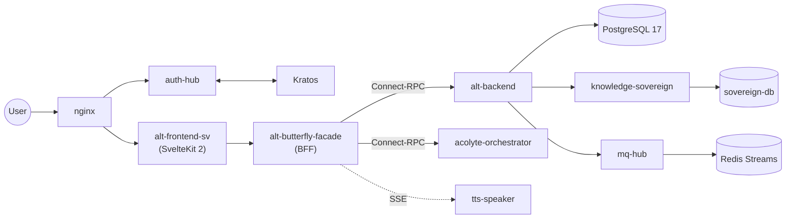
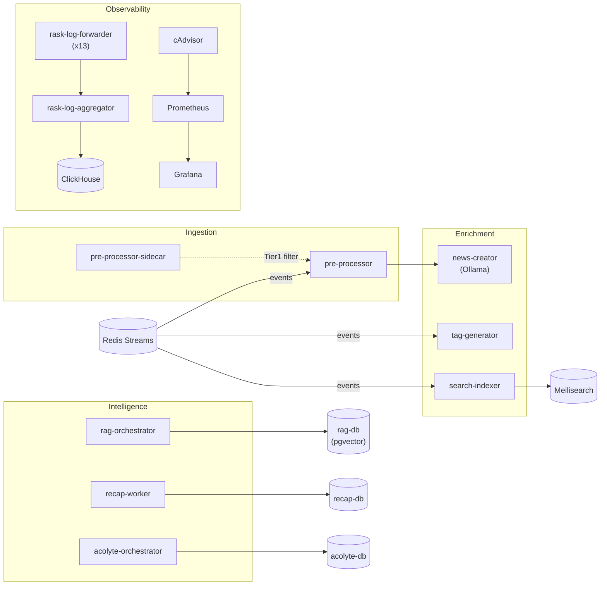

[](https://github.com/Kaikei-e/Alt/actions/workflows/backend-go.yaml)
[](https://github.com/Kaikei-e/Alt/actions/workflows/alt-frontend-sv-unit-test.yaml)
[](https://github.com/Kaikei-e/Alt/actions/workflows/alt-frontend-sv.yml)
[](https://github.com/Kaikei-e/Alt/actions/workflows/tag-generator.yaml)
[](https://github.com/Kaikei-e/Alt/actions/workflows/pre-processor-quality.yml)
[](https://github.com/Kaikei-e/Alt/actions/workflows/search-indexer.yaml)
[](https://github.com/Kaikei-e/Alt/actions/workflows/pre-processor-sidecar-go.yaml)
[](https://github.com/Kaikei-e/Alt/actions/workflows/news-creator.yml)
[](https://github.com/Kaikei-e/Alt/actions/workflows/recap-worker.yml)
[](https://github.com/Kaikei-e/Alt/actions/workflows/rag-orchestrator.yml)
[](https://github.com/Kaikei-e/Alt/actions/workflows/acolyte-orchestrator.yml)
[](https://github.com/Kaikei-e/Alt/actions/workflows/rask-log-aggregator.yaml)
[](https://github.com/Kaikei-e/Alt/actions/workflows/rask-log-forwarder.yml)
[](https://github.com/Kaikei-e/Alt/actions/workflows/docker-build.yaml)
[](https://github.com/Kaikei-e/Alt/actions/workflows/proto-contract.yaml)
[](https://github.com/Kaikei-e/Alt/actions/workflows/metrics-workflow.yaml)

# Alt

> Learn from you, serve for you

**Alt is a Compose-first knowledge platform that turns RSS feeds into searchable, enriched, and rediscoverable knowledge.** A local AI pipeline handles summarization, tag extraction, recap generation, RAG-powered Q&A, and long-form report writing -- then surfaces the results in **Knowledge Home**, an event-sourced discovery and recall interface. Privacy, observability, and explicit service boundaries are built into the platform, not bolted on.

`Go 1.26` · `Python 3.14` · `Rust 1.94` · `TypeScript (SvelteKit 2)` · `Deno 2` · `F# (.NET 10)`

**Key Capabilities:** RSS Ingestion · Knowledge Home (event-sourced discovery & recall) · AI Summaries & Tag Extraction · Full-Text Search · RAG Q&A (Ask Augur) · Acolyte (long-form research reports) · 3/7-Day Recaps · Morning Letter & Evening Pulse · Tag Verse & Tag Trail · Swipe Mode · Japanese TTS · Knowledge Sovereign (event-sourced state ownership) · Local LLM (Ollama) · ClickHouse Analytics · Grafana Dashboards · TDD-First Development


You can ask Gemini at [Code Wiki](https://codewiki.google/github.com/kaikei-e/alt) for help understanding the codebase.

## Architecture

Alt is structured into six layers:

1. **Edge & Auth** -- `nginx`, `auth-hub`, Ory Kratos
2. **Product Surface** -- `alt-frontend-sv` (SvelteKit 2), `alt-butterfly-facade` (BFF)
3. **Core Platform** -- `alt-backend` (REST + Connect-RPC), `mq-hub`, `knowledge-sovereign`
4. **Ingestion & Enrichment** -- `pre-processor`, `news-creator` (Ollama), `tag-generator`, `search-indexer`
5. **Intelligence** -- `rag-orchestrator`, `acolyte-orchestrator` (LangGraph), `recap-worker`, `tts-speaker`
6. **Observability & Data** -- PostgreSQL x7, Meilisearch, ClickHouse, Redis x2, Grafana, Prometheus, `rask-log-*`

Services communicate via **REST**, **Connect-RPC** (Protocol Buffers), and **Redis Streams** for async events.

### Request Flow


```mermaid
flowchart LR
    User((User)) --> nginx
    nginx --> auth-hub
    auth-hub <--> Kratos

    nginx --> FE["alt-frontend-sv<br/>(SvelteKit 2)"]
    FE --> BFF["alt-butterfly-facade<br/>(BFF)"]

    BFF -->|Connect-RPC| BE[alt-backend]
    BFF -->|Connect-RPC| ACOL[acolyte-orchestrator]
    BFF -.->|SSE| TTS[tts-speaker]

    BE --> DB[(PostgreSQL 17)]
    BE --> KS[knowledge-sovereign]
    KS --> KSDB[(sovereign-db)]
    BE --> MQ[mq-hub]
    MQ --> RS[(Redis Streams)]
```

### Data & Event Flow


```mermaid
flowchart LR
    subgraph Ingestion
        PP[pre-processor]
        PPS[pre-processor-sidecar]
        PPS -.->|Tier1 filter| PP
    end

    subgraph Enrichment
        NC["news-creator<br/>(Ollama)"]
        TG[tag-generator]
        SI[search-indexer]
    end

    subgraph Intelligence
        RAG[rag-orchestrator]
        RECAP[recap-worker]
        ACOL[acolyte-orchestrator]
    end

    RS[(Redis Streams)] -->|events| PP
    RS -->|events| TG
    RS -->|events| SI
    PP --> NC
    SI --> Meili[(Meilisearch)]
    RAG --> RAGDB[("rag-db<br/>(pgvector)")]
    RECAP --> RECAPDB[(recap-db)]
    ACOL --> ACOLDB[(acolyte-db)]

    subgraph Observability
        RLF["rask-log-forwarder<br/>(x13)"] --> RLA[rask-log-aggregator]
        RLA --> CH[(ClickHouse)]
        CA[cAdvisor] --> PROM[Prometheus]
        PROM --> GF[Grafana]
    end
```

Full service dependency graph: [`docs/services/MICROSERVICES.md`](./docs/services/MICROSERVICES.md)

## Repository Layout

| Path | Purpose |
| --- | --- |
| `compose/` | 22 Docker Compose YAML files. `compose/compose.yaml` includes them all. |
| `altctl/` | CLI for stack management, migrations, backup/restore (Go/Cobra). |
| `proto/` | Protobuf contracts for Connect-RPC services (buf). |
| `alt-backend/` | Core Go backend -- REST + Connect-RPC APIs, Knowledge Home event sourcing. |
| `alt-frontend-sv/` | SvelteKit 2 frontend -- primary product surface. |
| `alt-butterfly-facade/` | BFF proxy between frontend and backends (Go). |
| `knowledge-sovereign/` | Event-sourced knowledge state ownership (Go). |
| `pre-processor/`, `news-creator/`, `tag-generator/`, `search-indexer/` | Ingestion and AI enrichment pipeline. |
| `acolyte-orchestrator/` | Long-form research report generation (Python/LangGraph). |
| `recap-worker/`, `recap-subworker/`, `recap-evaluator/`, `dashboard/` | Recap pipeline and evaluation. |
| `rag-orchestrator/` | RAG Q&A orchestration (Go). |
| `auth-hub/`, `auth-token-manager/` | Identity boundary (Go) and token management (Deno). |
| `mq-hub/` | Event distribution via Redis Streams (Go). |
| `rask-log-aggregator/`, `rask-log-forwarder/` | Structured log pipeline into ClickHouse (Rust). |
| `tts-speaker/` | Japanese TTS via Kokoro (Python). |
| `knowledge-augur/`, `knowledge-embedder/` | Dedicated Ollama model server + embedding generation. |
| `feed-validator/`, `news-pulser/`, `news-vigil/` | Feed quality tools (F# / .NET 10). |
| `metrics/`, `rerank-server/`, `alt-perf/` | Operational and performance tooling. |
| `migrations-atlas/`, `*-migration-atlas/` | Atlas schema migrations per database. |
| `docs/` | 466+ Obsidian vault entries -- ADRs, service docs, runbooks, proposals. |

## Quick Start

### Prerequisites

- Docker Desktop or Docker Engine + Compose v2
- Go 1.26+ (for `altctl` build)
- Python 3.14+ with `uv` (for Python services)
- Rust 1.94+ (for Rust services)
- Deno 2.x (for `auth-token-manager`, `alt-perf`)
- Bun 1.x (for `alt-frontend-sv`)
- .NET 10 SDK (optional, for F# feed tools)
- Ollama + NVIDIA GPU runtime (optional, for AI workflows)

### 1. Prepare the environment

```bash
cp .env.template .env
```

Edit `.env` to override defaults for your local machine.

### 2. Build `altctl`

```bash
cd altctl && go build -o altctl . && cd ..
```

### 3. Start the default stack

```bash
altctl up
```

This brings up the default stacks: `db`, `auth`, `core`, `workers` (see [Compose Stacks](#compose-stacks) for the full list).

With raw Compose instead:

```bash
docker compose -f compose/compose.yaml -p alt up -d
```

### 4. Check health

Open the product at `http://localhost/` or `http://localhost:4173/`, then verify core services:

```bash
curl http://localhost:9000/v1/health    # alt-backend
curl http://localhost:9250/health       # alt-butterfly-facade (BFF)
curl http://localhost:8888/health       # auth-hub
curl http://localhost:7700/health       # Meilisearch
```

### 5. Stop or reset

```bash
altctl down
altctl down --volumes   # remove data volumes
```

## Service Catalog

### Edge & Auth

| Service | Language | Port(s) | Role |
| --- | --- | --- | --- |
| nginx | -- | 80, 8080 | Reverse proxy, TLS, static assets, SSE/streaming routing |
| auth-hub | Go 1.26+ | 8888 | Identity boundary, `X-Alt-*` header authority |
| kratos | Ory Kratos v1.3.0 | 4433, 4434 | Identity provider (registration, login, sessions) |
| auth-token-manager | Deno 2.x | 9201 | OAuth2 token refresh for external feeds |

### Product Surface

| Service | Language | Port(s) | Role |
| --- | --- | --- | --- |
| alt-frontend-sv | TypeScript (SvelteKit 2 / Svelte 5) | 4173 | Primary frontend -- Knowledge Home, Tag Verse, Admin |
| alt-butterfly-facade | Go 1.26+ | 9250 | BFF -- aggregates Connect-RPC calls for the frontend |

### Core Platform

| Service | Language | Port(s) | Role |
| --- | --- | --- | --- |
| alt-backend | Go 1.26+ (Echo) | 9000, 9101 | REST + Connect-RPC APIs, Knowledge Home event sourcing, projector |
| mq-hub | Go 1.26+ | 9500 | Event distribution via Redis Streams |
| redis-streams | Redis 8.4 | 6380 | Async event backbone |
| knowledge-sovereign | Go 1.26+ | 9510, 9511 | Event-sourced knowledge state, projections, retention, snapshots |

<details>
<summary><strong>Ingestion & Enrichment</strong></summary>

| Service | Language | Port(s) | Role |
| --- | --- | --- | --- |
| pre-processor | Go 1.26+ | 9200, 9202 | Feed quality gates, summarization orchestration |
| pre-processor-sidecar | Go 1.26+ | -- | OAuth2 credential handling, Inoreader feed sync |
| news-creator | Python 3.14+ (FastAPI + Ollama) | 11434 | LLM-backed summarization and generation |
| tag-generator | Python 3.14+ (FastAPI) | 9400 | ML-powered tag extraction |
| search-indexer | Go 1.26+ | 9300, 9301 | Meilisearch indexing via Redis Streams events |

</details>

<details>
<summary><strong>Intelligence</strong></summary>

| Service | Language | Port(s) | Role |
| --- | --- | --- | --- |
| rag-orchestrator | Go 1.26+ | 9010, 9011 | Grounded retrieval and answer generation (Ask Augur) |
| acolyte-orchestrator | Python 3.14+ (Starlette + LangGraph) | 8090 | Long-form research report pipeline (Connect-RPC) |
| recap-worker | Rust 1.94+ | 9005 | 3-day and 7-day recap orchestration |
| recap-subworker | Python 3.14+ (FastAPI) | 8002 | Recap computation and LLM formatting |
| recap-evaluator | Python 3.14+ (FastAPI) | 8085 | Quality evaluation of recap summaries |
| tts-speaker | Python 3.14 (Starlette + Kokoro) | 9700 | Japanese text-to-speech |
| dashboard | Python (Streamlit) | 8501 | Recap monitoring and visualization |

</details>

<details>
<summary><strong>Observability</strong></summary>

| Service | Language | Port(s) | Role |
| --- | --- | --- | --- |
| rask-log-aggregator | Rust 1.94+ (Axum) | 9600, 4317, 4318 | Centralized log collection (OTLP gRPC/HTTP) |
| rask-log-forwarder (x13) | Rust 1.94+ | -- | Per-service structured log forwarding |
| Grafana | -- | 3001 | Dashboards (ClickHouse + Prometheus datasources) |
| Prometheus | -- | 9090 | Metrics collection (14-day retention) |
| cAdvisor | -- | 8181 | Container resource metrics (CPU, memory, disk, network) |
| ClickHouse | -- | 8123, 9009 | Time-series log analytics storage |

</details>

<details>
<summary><strong>Data Stores</strong></summary>

| Store | Version | Port | Used By |
| --- | --- | --- | --- |
| db (alt-db) | PostgreSQL 17 | 5432 | alt-backend (sole writer), Knowledge Home events |
| kratos-db | PostgreSQL 16 | 5434 | Kratos identity data |
| pre-processor-db | PostgreSQL 17 | 5437 | Pre-processor feed processing state |
| recap-db | PostgreSQL 18 | 5435 | Recap pipeline summaries and evaluation |
| rag-db | PostgreSQL 18 + pgvector | 5436 | RAG documents and vector embeddings |
| acolyte-db | PostgreSQL 18 | 5439 | Acolyte reports and versioning |
| knowledge-sovereign-db | PostgreSQL 16 | 5438 | Knowledge state projections and snapshots |
| Meilisearch | v1.27.0 | 7700 | Full-text search indices |
| ClickHouse | v25.9 | 8123 | Structured log analytics |
| redis-streams | Redis 8.4 | 6380 | Async event distribution |
| redis-cache | Redis 8.0 | -- | LLM response cache (news-creator) |

</details>

<details>
<summary><strong>Tools & CLI</strong></summary>

| Service | Language | Role |
| --- | --- | --- |
| altctl | Go 1.26+ (Cobra) | Docker Compose orchestration, migrations, backup/restore |
| alt-perf | Deno 2.x | E2E performance scanning and user flow tests |
| metrics | Python 3.14+ | System health analysis from ClickHouse metrics |
| feed-validator | F# (.NET 10) | Feed quality validation |
| news-pulser | F# (.NET 10) | News pulse feature |
| news-vigil | F# (.NET 10) | News monitoring |
| rerank-server | Python 3.14+ | Cross-encoder reranking service |
| knowledge-augur | Ollama (Swallow-8B) | Dedicated model server for RAG embeddings |
| knowledge-embedder | Python | Embedding generation for vector store |

</details>

## Compose Stacks

`compose/compose.yaml` is an all-in-one entrypoint that includes 16+ split YAML files. `altctl` selects specific stacks; raw `docker compose -f compose/compose.yaml` starts everything.

### Default stacks (`altctl up`)

| Stack | File | Key Services |
| --- | --- | --- |
| db | db.yaml | PostgreSQL 17, Meilisearch 1.27, ClickHouse 25.9, pre-processor-db |
| auth | auth.yaml | Kratos v1.3, kratos-db, auth-hub |
| core | core.yaml + bff.yaml | nginx, alt-frontend-sv, alt-backend, alt-butterfly-facade |
| workers | workers.yaml + mq.yaml | search-indexer, tag-generator, pre-processor-sidecar, auth-token-manager, mq-hub, redis-streams |

### Optional stacks

| Stack | File | Key Services | GPU |
| --- | --- | --- | --- |
| sovereign | sovereign.yaml | knowledge-sovereign, knowledge-sovereign-db | -- |
| ai | ai.yaml | news-creator, Ollama, pre-processor, redis-cache | **Yes** |
| acolyte | acolyte.yaml | acolyte-orchestrator, acolyte-db | -- |
| recap | recap.yaml | recap-worker, recap-subworker, recap-evaluator, dashboard, recap-db | **Yes** |
| rag | rag.yaml | rag-orchestrator, rag-db (pgvector) | -- |
| logging | logging.yaml | rask-log-aggregator, 13x rask-log-forwarder | -- |
| observability | observability.yaml | Prometheus, Grafana, cAdvisor, nginx-exporter | -- |
| pgbouncer | pgbouncer.yaml | Connection pooling for PostgreSQL | -- |
| perf | perf.yaml | alt-perf | -- |
| backup | backup.yaml | restic-backup | -- |
| dev | dev.yaml | mock-auth, frontend HMR | -- |
| pact | pact.yaml | Pact broker + DB (CI contract testing) | -- |

```bash
altctl up ai            # Add AI/LLM services
altctl up recap         # Add recap pipeline
altctl up rag           # Add RAG extension
altctl up logging       # Add structured log pipeline
altctl up observability # Add Grafana/Prometheus dashboards
altctl status           # Show running services
altctl logs alt-backend # Follow service logs
```

## Development

### Frontend (TypeScript / SvelteKit)

```bash
cd alt-frontend-sv && bun test
cd alt-frontend-sv && bun run check
cd alt-frontend-sv && bun run build
```

### Go services

```bash
cd alt-backend/app && go test ./...
cd pre-processor/app && go test ./...
cd search-indexer/app && go test ./...
cd auth-hub && go test ./...
cd mq-hub/app && go test ./...
cd rag-orchestrator/app && go test ./...
cd knowledge-sovereign/app && go test ./...
```

### Python services

```bash
cd news-creator/app && SERVICE_SECRET=test-secret uv run pytest
cd tag-generator/app && uv run pytest
cd acolyte-orchestrator/app && uv run pytest
cd recap-subworker && uv run pytest
cd metrics && uv run pytest
```

### Rust services

```bash
cd recap-worker/recap-worker && cargo test
cd rask-log-aggregator/app && cargo test
cd rask-log-forwarder/app && cargo test
```

### Deno services

```bash
cd auth-token-manager && deno test
cd alt-perf && deno test
```

### F# services

```bash
cd feed-validator/FeedValidator && dotnet test
cd news-pulser/NewsPulser && dotnet test
cd news-vigil/NewsVigil && dotnet test
```

### Protobuf (Connect-RPC)

```bash
make buf-generate   # Generate code from proto files
make buf-lint       # Lint proto files
```

### Conventions

- **TDD first**: Red -> Green -> Refactor
- **Clean Architecture**: Handler -> Usecase -> Port -> Gateway -> Driver
- **Service boundaries**: each service owns its data; `alt-backend` is the sole writer to `alt-db`
- **After code changes to compiled services**: always `docker compose -f compose/compose.yaml up --build -d <service>`
- **Per-service guidance**: check `<service>/CLAUDE.md` before modifying a service

## Documentation

| Resource | Description |
| --- | --- |
| [`docs/services/MICROSERVICES.md`](./docs/services/MICROSERVICES.md) | Complete service reference with ports, health endpoints, and dependency graph |
| [`CLAUDE.md`](./CLAUDE.md) | Root workflow guidance (TDD, Compose, Clean Architecture rules) |
| [`altctl/README.md`](./altctl/README.md) | CLI operations and stack management |
| [`alt-backend/README.md`](./alt-backend/README.md) | Backend architecture and API surface |
| [`news-creator/app/README.md`](./news-creator/app/README.md) | LLM summarization pipeline |
| [`recap-worker/README.md`](./recap-worker/README.md) | Recap pipeline design |
| [`docs/`](./docs/) | ADRs, proposals, runbooks, reviews, daily notes (Obsidian vault) |

## Security

- Do not commit real credentials. Use `.env.template` as a starting point.
- All inter-service secrets use Docker file-based secrets (`/run/secrets/*`), never environment variable values.
- `SERVICE_SECRET` authenticates service-to-service calls via `X-Service-Token` headers (REST and Connect-RPC).
- `auth-hub` is the identity boundary -- it validates Kratos sessions and forwards user context as `X-Alt-*` headers.
- Preserve redaction and structured logging behavior when changing auth, AI, or observability code.

## Contributing

Contributions are welcome. This is an opinionated monorepo with strong architectural constraints.

Before making changes:

1. Read [CLAUDE.md](./CLAUDE.md) and the service-specific `CLAUDE.md` for the area you are editing.
2. Start with a failing test whenever you are changing behavior.
3. Keep changes focused and document config, API, or migration changes.
4. After code changes to compiled services (Go, Rust, F#, TypeScript), rebuild: `docker compose -f compose/compose.yaml up --build -d <service>`

If you are exploring for the first time, start with `altctl/`, `alt-backend/`, `alt-frontend-sv/`, and one pipeline service such as `pre-processor/` or `recap-worker/`.

## License

Alt is licensed under [Apache License 2.0](./LICENSE).
