[](https://github.com/Kaikei-e/Alt/actions/workflows/backend-go.yaml)
[](https://github.com/Kaikei-e/Alt/actions/workflows/alt-frontend-e2e.yaml)
[](https://github.com/Kaikei-e/Alt/actions/workflows/alt-frontend-unit-test.yaml)
[](https://github.com/Kaikei-e/Alt/actions/workflows/pre-processor-quality.yml)
[](https://github.com/Kaikei-e/Alt/actions/workflows/search-indexer.yaml)
[](https://github.com/Kaikei-e/Alt/actions/workflows/tag-generator.yaml)


# Alt - AI-Powered RSS Knowledge Pipeline

> October 2025 update: Alt now runs locally on Docker Compose (`compose.yaml`). Kubernetes manifests remain in the repo for future redeployment but are no longer the primary development path.

## Executive Summary

**Alt** transforms a traditional RSS reader into an intelligent knowledge discovery platform. The system blends microservices, AI enrichment, and a polished frontend to deliver curated content across devices.

### Key Capabilities

- **📱 Mobile-First Design**: Responsive TypeScript/React frontend with glassmorphism UI
- **🤖 AI Content Enhancement**: Automatic tagging and LLM-powered summarisation
- **⚡ High-Performance Processing**: Go-based backend with Clean Architecture and TDD
- **🔍 Intelligent Search**: Meilisearch-backed full-text and semantic discovery
- **📊 Observability-Ready**: Rust logging pipeline into ClickHouse with optional sidecars
- **🧱 Docker Compose-First**: Single-command local stack with optional `ollama` and `logging` profiles; Kubernetes manifests are maintained only for future production rollout

### Target Audience

- **Knowledge Workers**: Professionals who need to stay informed across multiple domains
- **Researchers**: Academic and industry researchers tracking developments in their fields
- **Content Creators**: Writers, bloggers, and journalists seeking inspiration and trends
- **Platform Engineers**: Developers exploring multi-service stacks with Compose orchestration

---

## Features & Capabilities

### Core Features

#### 📰 Intelligent Content Aggregation
- **RSS Feed Management**: Subscribe to unlimited RSS feeds with automatic discovery
- **Duplicate Detection**: Advanced algorithms prevent content duplication across feeds
- **Language Detection**: Multi-language support with automatic language identification

#### 🧠 AI-Powered Enhancement
- **Automatic Tagging**: Machine learning models generate contextually relevant tags
- **Content Summarization**: LLM-powered summaries using Ollama (Gemma3:4b model)
- **Topic Classification**: Articles automatically categorized by subject matter

#### 🔍 Advanced Search & Discovery
- **Full-Text Search**: Lightning-fast search across all content using Meilisearch
- **Semantic Search**: AI-powered semantic matching beyond keyword search
- **Filter & Sort**: Advanced filtering by date, source, tags, reading status

### Technical Features

#### 🏗️ Modern Architecture
- **Microservices Design**: 8 specialized services with clear boundaries
- **Clean Architecture**: 5-layer pattern ensuring maintainability and testability
- **Event-Driven Communication**: Asynchronous processing with reliable delivery
- **API-First Design**: RESTful APIs with comprehensive OpenAPI documentation

#### 🚀 Performance & Scalability
- **High Throughput**: 100K+ logs/second processing capability
- **Low Latency**: Sub-5ms response times for critical operations
- **Profile-Based Scaling**: Optional Docker Compose profiles isolate heavy services from the baseline stack
- **Efficient Resource Usage**: Optimized memory and CPU consumption

#### 🔒 Security & Reliability
- **Rate Limiting**: Intelligent rate limiting prevents abuse and ensures stability
- **Input Validation**: Comprehensive validation prevents injection attacks
- **Graceful Degradation**: System remains functional during partial failures

---

## Architecture Overview

### System Architecture


### Data Processing Pipeline


---

## Microservice Architecture

### Service Responsibilities

#### 🎯 alt-backend (Go/Echo)
**Primary API Gateway & Business Logic**

- **Technology**: Go 1.23+, Echo framework, Clean Architecture (5-layer)
- **Responsibilities**:
  - RESTful API endpoints for frontend communication
  - User feed management and subscription handling
  - Content aggregation and presentation logic
  - Authentication and authorization (future)
  - Rate limiting and request validation
- **Architecture Pattern**: REST → Usecase → Port → Gateway → Driver
- **Key Features**:
  - CSRF protection on state-changing endpoints
  - Structured logging with `slog`
  - Comprehensive test coverage (>80%)
  - Clean separation of concerns


#### 🔄 pre-processor (Go)
**RSS Feed Processing & Content Extraction**

- **Technology**: Go 1.23+, Custom HTML parser, Quality scoring algorithms
- **Responsibilities**:
  - RSS feed fetching with configurable intervals
  - HTML content cleaning and sanitization
  - Language detection and content normalization
  - Quality scoring using readability metrics
  - Content deduplication across feeds
- **Performance**: Handles 1000+ feeds with batched processing
- **Error Handling**: Comprehensive retry logic with exponential backoff

#### 🏷️ tag-generator (Python)
**ML-Powered Content Classification**

- **Technology**: Python 3.13, scikit-learn, UV package manager
- **Responsibilities**:
  - Automatic tag generation using ML models
  - Content classification and topic modeling
  - Multi-language text processing
  - Feature extraction from article content
  - Tag relevance scoring and filtering
- **ML Pipeline**: TF-IDF → Feature Extraction → Multi-class Classification
- **Development**: TDD with pytest, comprehensive model validation

#### 📝 news-creator (Ollama)
**LLM-Based Content Summarization**

- **Technology**: Ollama runtime, Gemma3:4b model, GPU acceleration
- **Responsibilities**:
  - Article summarization using large language models
  - Content quality assessment and filtering
  - Context-aware summary generation
  - Multi-format output (brief, detailed, bullet points)
- **Performance**: GPU-optimized with NVIDIA runtime support
- **Scaling**: Model caching and efficient batch processing

#### 🔍 search-indexer (Go)
**Search Index Management**

- **Technology**: Go 1.23+, Meilisearch client, Clean Architecture
- **Responsibilities**:
  - Real-time search index updates
  - Content synchronization with database
  - Search relevance optimization
  - Index health monitoring and maintenance
- **Features**: Incremental indexing, faceted search, typo tolerance

#### 🎨 alt-frontend (TypeScript/React)
**Mobile-First User Interface**

- **Technology**: TypeScript, React, Next.js (Pages Router), Chakra UI
- **Responsibilities**:
  - Responsive mobile-first user interface
  - Real-time content updates via SSE
  - Glassmorphism design system
- **Performance**: Virtual scrolling, lazy loading, optimized bundling
- **Testing**: Playwright for E2E, Vitest for unit tests

#### 📊 rask-log-forwarder (Rust)
**High-Performance Log Collection**

- **Technology**: Rust 1.87+, SIMD JSON parsing, Lock-free data structures
- **Responsibilities**:
  - Zero-copy log collection from Docker containers
  - SIMD-accelerated JSON parsing (>4GB/s throughput)
  - Service-aware log enrichment
  - Reliable delivery with disk fallback
- **Architecture**: Sidecar pattern with one forwarder per service
- **Performance**: >100K logs/second, <16MB memory per instance

#### 🏪 rask-log-aggregator (Rust/Axum)
**Centralized Log Processing**

- **Technology**: Rust 1.87+, Axum web framework, ClickHouse client
- **Responsibilities**:
  - Central log aggregation and processing
  - Real-time analytics and metrics generation
  - Log storage in ClickHouse for analytics
  - System health monitoring and alerting
- **Capabilities**: Stream processing, data compression, query optimization

---

## Data Flow & Processing

### RSS Content Enhancement Pipeline


### AI Enhancement Workflow


---

## Deployment Architecture

### Docker Compose Runtime

```mermaid
flowchart TB
    subgraph Default
        NGX[nginx\n:80]
        FE[alt-frontend\n:3000]
        BE[alt-backend\n:9000]
        MIGRATE[migrate Atlas init job]
        DB[(postgres\n:5432)]
        SEARCHIDX[search-indexer\n:9300]
        TAGGER[tag-generator\n:9400]
        MEILI[meilisearch\n:7700]
        LOGAGG[rask-log-aggregator\n:9600]
        CLICK[(clickhouse\n:8123/:9009)]
        KRATOSDB[(kratos-db\n:5433)]
        KRATOS[kratos\n:4433/:4434]
        AUTH[auth-hub\n:8888]
    end

    subgraph Profile_Ollama [Optional profile: ollama]
        OLLAMA_INIT[news-creator-volume-init]
        NEWS[news-creator\n:11434]
        PREPROC[pre-processor\n:9200]
    end

    subgraph Profile_Logging [Optional profile: logging]
        LOGFWD[log forwarder sidecars\n(nginx, backend, db, etc.)]
    end

    NGX --> FE
    NGX --> BE
    BE --> DB
    BE --> MEILI
    SEARCHIDX --> DB
    SEARCHIDX --> MEILI
    TAGGER --> DB
    LOGAGG --> CLICK
    LOGFWD -.-> LOGAGG
    PREPROC --> DB
    PREPROC --> NEWS
    NEWS -.-> OLLAMA_INIT
    AUTH --> KRATOS
    KRATOS --> KRATOSDB
```

### Docker Compose Profiles

- **Baseline (default)**: Frontend, backend, PostgreSQL, Meilisearch, tagging, indexing, identity (Kratos), analytics (ClickHouse + log aggregator).
- **`--profile ollama`**: Adds GPU-enabled `news-creator`, its volume initialiser, and the `pre-processor` ingestion service.
- **`--profile logging`**: Starts Rust log forwarders that tail Docker logs and ship them to `rask-log-aggregator`.

Profiles can be combined, e.g. `docker compose --profile ollama --profile logging up --build`.

## Service Catalog (compose.yaml)

| Service | Language / Image | Ports (host) | Compose profile | Purpose |
|---------|------------------|--------------|-----------------|---------|
| `nginx` | nginx:latest | 80 | default | Reverse proxy for frontend (`/`) and backend (`/api`) with health gating |
| `alt-frontend` | Next.js 15 (./alt-frontend) | 3000 | default | Serves the web UI; exposes `/api/health` |
| `alt-backend` | Go 1.24 (./alt-backend) | 9000 | default | Clean Architecture API with `/v1/health` |
| `migrate` | Atlas CLI (./migrations-atlas) | – (one-shot) | default | Applies schema migrations before backend starts |
| `db` | postgres:16-alpine | 5432 | default | Primary relational database seeded from `db/init` |
| `meilisearch` | getmeili/meilisearch:v1.15.2 | 7700 | default | Full-text search engine |
| `search-indexer` | Go (./search-indexer) | 9300 | default | Syncs Postgres records into Meilisearch |
| `tag-generator` | Python 3.13 (./tag-generator) | 9400 | default | ML-driven keyword extraction |
| `rask-log-aggregator` | Rust (./rask-log-aggregator) | 9600 | default | Collects structured logs into ClickHouse |
| `clickhouse` | clickhouse/clickhouse-server:25.6 | 8123, 9009 | default | Analytics warehouse backing observability |
| `kratos-db` | postgres:16-alpine | 5433 | default | Identity database for Kratos |
| `kratos-migrate` | oryd/kratos:v1.2.0 | – (one-shot) | default | Runs Kratos SQL migrations |
| `kratos` | oryd/kratos:v1.2.0 | 4433, 4434 | default | Identity & self-service flows surfaced in UI |
| `auth-hub` | Go (./auth-hub) | 8888 | default | Auth facade aggregating Kratos flows |
| `news-creator` | Ollama runtime (./news-creator) | 11434 | `ollama` | LLM summarisation service (GPU-enabled) |
| `pre-processor` | Go (./pre-processor) | 9200 | `ollama` | RSS ingestion orchestrator feeding news-creator |
| `news-creator-volume-init` | Ollama image | – (one-shot) | `ollama` | Fixes ownership for shared model volume |
| `*-logs` forwarders | Rust (./rask-log-forwarder/app) | – | `logging` | Tail Docker logs per service and push to aggregator |

Persistent volumes: `db_data`, `kratos_db_data`, `meili_data`, `clickhouse_data`, `news_creator_models`, `rask_log_aggregator_data`.

---

## Local Development Workflow

1. **Install prerequisites**: Docker Desktop (or compatible engine) and Node.js 24 with pnpm 10 (`corepack enable pnpm`).
2. **Create environment file**: `cp .env.template .env` (or let `make up` create it automatically).
3. **Start the stack**: `make up` → builds images and launches the baseline services.
4. **Enable optional profiles** as needed:
   - AI services: `docker compose --profile ollama up -d`
   - Log forwarders: `docker compose --profile logging up -d`
5. **Run the frontend locally**: `pnpm -C alt-frontend install` then `pnpm -C alt-frontend dev`.
6. **Shut down**: `make down` (keep data) or `make down-volumes` (reset everything).

### Helpful Commands

| Command | Description |
|---------|-------------|
| `make build` | Force rebuild of all images |
| `make up-clean-frontend` | Rebuild the frontend image without cache before starting |
| `make up-with-news-creator` | Rebuild AI image then start the stack |
| `make dev-ssl-setup` / `make dev-ssl-test` | Generate and verify PostgreSQL SSL certificates |
| `docker compose logs -f <service>` | Stream logs from a specific container |
| `docker compose ps --status=running` | Check which services (and profiles) are online |
| `docker compose exec db psql ...` | Connect to the Postgres shell |

### Environment Notes

- `scripts/check-env.js` validates required variables during `next build`. Keep `.env.template`, `.env`, and compose `env_file` entries in sync.
- Frontend defaults: `NEXT_PUBLIC_API_BASE_URL=/api`, `API_URL=http://alt-backend:9000`. When running `pnpm dev` outside Docker, set `NEXT_PUBLIC_API_BASE_URL=http://localhost/api`.
- Identity routes rely on Kratos URLs (`NEXT_PUBLIC_KRATOS_PUBLIC_URL`, `KRATOS_PUBLIC_URL`, `KRATOS_INTERNAL_URL`) injected via compose build args.

### Troubleshooting Quick Checks

- `curl http://localhost:3000/api/health` → frontend container health
- `curl http://localhost:9000/v1/health` → backend availability
- `curl http://localhost:7700/health` → Meilisearch readiness
- `docker compose logs -f <service>` → targeted diagnostics (all services share the `alt-network` bridge)
- `docker compose exec db pg_isready -U ${POSTGRES_USER}` → Postgres connectivity

---

## Testing & Quality Gates

| Area | Command | Notes |
|------|---------|-------|
| Frontend unit tests | `pnpm -C alt-frontend test` | Vitest + React Testing Library |
| Frontend watch mode | `pnpm -C alt-frontend test:watch` | Red/Green/Refactor loop |
| Frontend coverage | `pnpm -C alt-frontend test:coverage` | Istanbul output |
| Frontend E2E | `pnpm -C alt-frontend test:e2e` | Requires stack running; Playwright projects cover auth + content |
| Frontend lint | `pnpm -C alt-frontend lint` | ESLint 9 with Next plugin |
| Frontend format | `pnpm -C alt-frontend fmt` | Prettier |
| Backend tests | `cd alt-backend/app && go test ./...` | Add `-race -cover` as needed |
| Backend mocks | `make generate-mocks` | GoMock against `alt-backend/app/port` interfaces |
| Search indexer | `cd search-indexer && go test ./...` | Validates index sync logic |
| Tag generator | `cd tag-generator && uv run pytest` | Python tests (requires UV/venv) |

CI pipelines mirror these commands (see badges above).

---

## Technology Stack

### Programming Languages & Versions

| Language | Version | Usage | Key Features |
|----------|---------|--------|--------------|
| **Go** | 1.24 | Backend services, processing, auth hub | Clean Architecture, generics, structured logging |
| **TypeScript** | 5.9 | Frontend development | Strict typing, modern Next.js features |
| **Python** | 3.13 | ML/AI services | UV package management, async-ready |
| **Rust** | 1.87 | Logging pipeline | SIMD JSON parsing, zero-copy abstractions |

### Frameworks & Libraries

#### Backend (Go)
- **Echo v4**: High-performance HTTP framework
- **GORM**: ORM with PostgreSQL driver
- **gomock**: Mock generation for testing
- **slog**: Structured logging (stdlib)
- **testify**: Testing assertions and suites

#### Frontend (TypeScript)
- **Next.js 15 (App Router)**: React framework with server/client component support
- **React 19**: Hooks-first UI layer with Suspense-ready primitives
- **Chakra UI**: Component library with theme tokens and responsive props
- **Playwright**: End-to-end testing
- **Vitest**: Unit testing framework

#### ML/AI (Python)
- **UV**: Modern Python package manager
- **scikit-learn**: Machine learning library
- **transformers**: Hugging Face transformers
- **FastAPI**: API framework (if needed)
- **pytest**: Testing framework

#### Logging (Rust)
- **Tokio**: Async runtime
- **Axum**: Web framework
- **SIMD-JSON**: High-performance JSON parsing
- **Bollard**: Docker API client
- **ClickHouse**: Database client

### Infrastructure & Databases

#### Databases
- **PostgreSQL 16**: Primary relational database with SSL/TLS
- **Meilisearch v1.15.2**: Full-text search engine
- **ClickHouse 25.6**: Analytics database for logs

#### Container & Orchestration
- **Docker**: Multi-stage builds for every service
- **Docker Compose**: Primary orchestration with optional profiles (`compose.yaml`)
- **Makefile**: Idempotent helpers for builds, environment setup, SSL, and mock generation
- **Skaffold / Kubernetes**: Legacy manifests retained for future redeployment (not part of the default workflow)

#### Networking & Security
- **NGINX**: Reverse proxy and load balancer
- **SSL/TLS**: End-to-end encryption
- **Let's Encrypt**: Automated certificate management
- **CORS**: Cross-origin resource sharing
- **Docker network (`alt-network`)**: Isolated bridge network shared by all services

### Development Tools & Practices

#### Code Quality
- **TDD**: Test-driven development across all services
- **Clean Architecture**: Layered architecture in Go services
- **ESLint/Prettier**: TypeScript code formatting
- **Ruff**: Python linting and formatting
- **Clippy**: Rust linting

#### CI/CD & DevOps
- **Git**: Version control with conventional commits
- **GitHub Actions**: Continuous integration
- **Docker Registry**: Container image storage
- **Docker Compose**: Declarative local runtime shared across contributors

#### Monitoring & Observability
- **Structured Logging**: JSON logs across all services
- **Metrics Collection**: Performance and business metrics
- **Health Checks**: Service health monitoring
- **Distributed Tracing**: Request tracing (future)

---

## Key Design Patterns

### Clean Architecture Implementation

Alt's backend services follow Uncle Bob's Clean Architecture principles with a 5-layer variant:


#### Layer Responsibilities

1. **REST Layer**: HTTP request/response handling, input validation, error responses
2. **Usecase Layer**: Business logic orchestration, workflow coordination
3. **Port Layer**: Interface definitions, contracts between layers
4. **Gateway Layer**: Anti-corruption layer, external service translation
5. **Driver Layer**: Technical implementations, database access, API clients

### Test-Driven Development (TDD)

All services follow strict TDD practices with the Red-Green-Refactor cycle:

```mermaid
flowchart LR
    RED[🔴 RED<br/>Write Failing Test] --> GREEN[🟢 GREEN<br/>Write Minimal Code]
    GREEN --> REFACTOR[🔄 REFACTOR<br/>Improve Design]
    REFACTOR --> RED

    classDef red fill:#ffebee
    classDef green fill:#e8f5e8
    classDef refactor fill:#e3f2fd

    class RED red
    class GREEN green
    class REFACTOR refactor
```



#### Testing Strategy

- **Unit Tests**: >80% coverage for usecase and gateway layers
- **Integration Tests**: End-to-end workflow testing
- **Performance Tests**: Load testing for critical paths
- **Contract Tests**: API contract validation

### Microservice Communication Patterns

#### Synchronous Communication
- **REST APIs**: Service-to-service communication
- **HTTP Keep-Alive**: Connection pooling for performance
- **Circuit Breakers**: Failure isolation and recovery

#### Asynchronous Communication
- **Event-Driven**: Database triggers for workflow initiation
- **Message Queues**: Future implementation for scalability
- **Batch Processing**: Efficient bulk operations

### Logging and Observability Strategy

#### Sidecar Logging Pattern
Each service has a dedicated Rust-based log forwarder running as a sidecar container:


#### Benefits of Sidecar Pattern
- **Isolation**: Log forwarder failures don't affect application
- **Performance**: Zero-copy log processing with SIMD acceleration
- **Scalability**: Each service scales independently
- **Flexibility**: Service-specific log processing rules

---

## Development Practices

### Code Quality Standards

#### Go Services
- **Structured Logging**: All logs use `slog` with context
- **Error Handling**: Comprehensive error wrapping with `fmt.Errorf`
- **Code Coverage**: Minimum 80% for business logic layers
- **Static Analysis**: `go vet`, `golangci-lint` for code quality

#### TypeScript Frontend
- **Type Safety**: Strict TypeScript configuration
- **Component Testing**: Playwright for E2E, Vitest for units
- **Performance**: Bundle optimization, lazy loading
- **Accessibility**: WCAG 2.1 AA compliance

#### Python ML Services
- **Type Hints**: Comprehensive type annotations
- **Testing**: pytest with fixtures and mocking
- **Code Quality**: Ruff for linting and formatting
- **Package Management**: UV for fast dependency resolution

#### Rust Logging Services
- **Memory Safety**: Zero unsafe code blocks
- **Performance**: SIMD optimizations, lock-free data structures
- **Error Handling**: `thiserror` and `anyhow` for error management
- **Testing**: Property-based testing with quickcheck

### Security Practices

#### Application Security
- **Input Validation**: All external inputs validated at entry points
- **SQL Injection Prevention**: Parameterized queries only
- **CSRF Protection**: Token-based protection for state changes
- **Content Security Policy**: Strict CSP headers

#### Infrastructure Security
- **TLS Everywhere**: Dev certificates generated via `make dev-ssl-setup`; production TLS handled by NGINX
- **Secret Management**: Environment variables, no hardcoded secrets
- **Network Segmentation**: Docker `alt-network` bridge isolates services; optional profiles add no extra host ports
- **Minimal Attack Surface**: Alpine-based container images

#### Operational Security
- **Principle of Least Privilege**: Service-specific database users
- **Audit Logging**: Comprehensive audit trails
- **Security Updates**: Automated dependency updates
- **Penetration Testing**: Regular security assessments

---


## 📈 Roadmap

### Planned Features
- [ ] Multi-user support with authentication
- [ ] Advanced filtering and saved searches
- [ ] Export functionality (OPML, JSON)
- [ ] Webhook notifications
- [ ] GraphQL API option
- [ ] Reintroduce Kubernetes deployment manifests once Compose-first workflow stabilises

### Performance Goals
- Maintain sub-100 ms API response times on commodity hardware
- Support for 10,000+ subscribed feeds
- Real-time updates via WebSocket (future)
- Horizontal scale-out plan via optional Kubernetes profile

## 📄 License

Apache 2.0 — see `LICENSE` for full text.

## 🙏 Acknowledgments

- Built with inspiration from Clean Architecture principles by Robert C. Martin
- Powered by Go, Rust, TypeScript, Python, React, Next.js, PostgreSQL, Meilisearch, ClickHouse, Ollama, and countless OSS contributors
- Special thanks to the RSS community for keeping web feeds alive

---

For additional deep dives, check the Wiki or the `docs/` directory.

