# Alt - AI-Powered RSS Knowledge Pipeline

> A mobile-first RSS reader built with microservices architecture, featuring AI-powered content enhancement, high-performance logging, and intelligent content discovery.

## Executive Summary

**Alt** is a sophisticated RSS reader platform that transforms traditional feed consumption into an intelligent knowledge discovery system. Built with a modern microservices architecture, Alt combines the simplicity of RSS with the power of artificial intelligence to deliver personalized, enhanced content experiences.

### Key Capabilities

- **📱 Mobile-First Design**: Optimized TypeScript/React frontend with responsive glassmorphism UI
- **🤖 AI Content Enhancement**: ML-powered automatic tagging and LLM-based article summarization
- **⚡ High-Performance Processing**: Go-based backend with Clean Architecture and TDD practices
- **🔍 Intelligent Search**: Meilisearch-powered full-text search with relevance scoring
- **📊 Advanced Analytics**: Rust-based high-performance logging with real-time metrics
- **☁️ Cloud-Native**: Kubernetes-ready with SSL/TLS, auto-scaling, and observability

### Target Audience

- **Knowledge Workers**: Professionals who need to stay informed across multiple domains
- **Researchers**: Academic and industry researchers tracking developments in their fields
- **Content Creators**: Writers, bloggers, and journalists seeking inspiration and trends
- **Technology Enthusiasts**: Developers interested in modern microservices architecture

---

## Features & Capabilities

### Core Features

#### 📰 Intelligent Content Aggregation
- **RSS Feed Management**: Subscribe to unlimited RSS feeds with automatic discovery
- **Duplicate Detection**: Advanced algorithms prevent content duplication across feeds
- **Language Detection**: Multi-language support with automatic language identification

#### 🧠 AI-Powered Enhancement
- **Automatic Tagging**: Machine learning models generate contextually relevant tags
- **Content Summarization**: LLM-powered summaries using Ollama (Gemma3:4b model)
- **Topic Classification**: Articles automatically categorized by subject matter

#### 🔍 Advanced Search & Discovery
- **Full-Text Search**: Lightning-fast search across all content using Meilisearch
- **Semantic Search**: AI-powered semantic matching beyond keyword search
- **Filter & Sort**: Advanced filtering by date, source, tags, reading status

### Technical Features

#### 🏗️ Modern Architecture
- **Microservices Design**: 8 specialized services with clear boundaries
- **Clean Architecture**: 5-layer pattern ensuring maintainability and testability
- **Event-Driven Communication**: Asynchronous processing with reliable delivery
- **API-First Design**: RESTful APIs with comprehensive OpenAPI documentation

#### 🚀 Performance & Scalability
- **High Throughput**: 100K+ logs/second processing capability
- **Low Latency**: Sub-5ms response times for critical operations
- **Horizontal Scaling**: Kubernetes-native auto-scaling based on demand
- **Efficient Resource Usage**: Optimized memory and CPU consumption

#### 🔒 Security & Reliability
- **Rate Limiting**: Intelligent rate limiting prevents abuse and ensures stability
- **Input Validation**: Comprehensive validation prevents injection attacks
- **Graceful Degradation**: System remains functional during partial failures

---

## Architecture Overview

### System Architecture

### Data Processing Pipeline

---

## Microservice Architecture

### Service Responsibilities

#### 🎯 alt-backend (Go/Echo)
**Primary API Gateway & Business Logic**

- **Technology**: Go 1.23+, Echo framework, Clean Architecture (5-layer)
- **Responsibilities**:
  - RESTful API endpoints for frontend communication
  - User feed management and subscription handling
  - Content aggregation and presentation logic
  - Authentication and authorization (future)
  - Rate limiting and request validation
- **Architecture Pattern**: REST → Usecase → Port → Gateway → Driver
- **Key Features**:
  - CSRF protection on state-changing endpoints
  - Structured logging with `slog`
  - Comprehensive test coverage (>80%)
  - Clean separation of concerns

#### 🔄 pre-processor (Go)
**RSS Feed Processing & Content Extraction**

- **Technology**: Go 1.23+, Custom HTML parser, Quality scoring algorithms
- **Responsibilities**:
  - RSS feed fetching with configurable intervals
  - HTML content cleaning and sanitization
  - Language detection and content normalization
  - Quality scoring using readability metrics
  - Content deduplication across feeds
- **Performance**: Handles 1000+ feeds with batched processing
- **Error Handling**: Comprehensive retry logic with exponential backoff

#### 🏷️ tag-generator (Python)
**ML-Powered Content Classification**

- **Technology**: Python 3.13, scikit-learn, UV package manager
- **Responsibilities**:
  - Automatic tag generation using ML models
  - Content classification and topic modeling
  - Multi-language text processing
  - Feature extraction from article content
  - Tag relevance scoring and filtering
- **ML Pipeline**: TF-IDF → Feature Extraction → Multi-class Classification
- **Development**: TDD with pytest, comprehensive model validation

#### 📝 news-creator (Ollama)
**LLM-Based Content Summarization**

- **Technology**: Ollama runtime, Gemma3:4b model, GPU acceleration
- **Responsibilities**:
  - Article summarization using large language models
  - Content quality assessment and filtering
  - Context-aware summary generation
  - Multi-format output (brief, detailed, bullet points)
- **Performance**: GPU-optimized with NVIDIA runtime support
- **Scaling**: Model caching and efficient batch processing

#### 🔍 search-indexer (Go)
**Search Index Management**

- **Technology**: Go 1.23+, Meilisearch client, Clean Architecture
- **Responsibilities**:
  - Real-time search index updates
  - Content synchronization with database
  - Search relevance optimization
  - Index health monitoring and maintenance
- **Features**: Incremental indexing, faceted search, typo tolerance

#### 🎨 alt-frontend (TypeScript/React)
**Mobile-First User Interface**

- **Technology**: TypeScript, React, Next.js (Pages Router), Chakra UI
- **Responsibilities**:
  - Responsive mobile-first user interface
  - Real-time content updates via SSE
  - Glassmorphism design system
- **Performance**: Virtual scrolling, lazy loading, optimized bundling
- **Testing**: Playwright for E2E, Vitest for unit tests

#### 📊 rask-log-forwarder (Rust)
**High-Performance Log Collection**

- **Technology**: Rust 1.87+, SIMD JSON parsing, Lock-free data structures
- **Responsibilities**:
  - Zero-copy log collection from Docker containers
  - SIMD-accelerated JSON parsing (>4GB/s throughput)
  - Service-aware log enrichment
  - Reliable delivery with disk fallback
- **Architecture**: Sidecar pattern with one forwarder per service
- **Performance**: >100K logs/second, <16MB memory per instance

#### 🏪 rask-log-aggregator (Rust/Axum)
**Centralized Log Processing**

- **Technology**: Rust 1.87+, Axum web framework, ClickHouse client
- **Responsibilities**:
  - Central log aggregation and processing
  - Real-time analytics and metrics generation
  - Log storage in ClickHouse for analytics
  - System health monitoring and alerting
- **Capabilities**: Stream processing, data compression, query optimization

---

## Data Flow & Processing

### RSS Content Enhancement Pipeline

### AI Enhancement Workflow

---

## Deployment Architecture

### Kubernetes Architecture

### Docker Compose Services

---

## Technology Stack

### Programming Languages & Versions

| Language | Version | Usage | Key Features |
|----------|---------|--------|--------------|
| **Go** | 1.23+ | Backend services, processing | Generics, improved performance, structured logging |
| **TypeScript** | Latest | Frontend development | Type safety, modern ES features |
| **Python** | 3.13 | ML/AI services | Modern async, improved performance |
| **Rust** | 1.87+ (2024 edition) | High-performance logging | SIMD, zero-cost abstractions |

### Frameworks & Libraries

#### Backend (Go)
- **Echo v4**: High-performance HTTP framework
- **GORM**: ORM with PostgreSQL driver
- **gomock**: Mock generation for testing
- **slog**: Structured logging (stdlib)
- **testify**: Testing assertions and suites

#### Frontend (TypeScript)
- **Next.js**: React framework with Pages Router
- **React**: UI library with hooks
- **Chakra UI**: Component library with theming
- **Playwright**: End-to-end testing
- **Vitest**: Unit testing framework

#### ML/AI (Python)
- **UV**: Modern Python package manager
- **scikit-learn**: Machine learning library
- **transformers**: Hugging Face transformers
- **FastAPI**: API framework (if needed)
- **pytest**: Testing framework

#### Logging (Rust)
- **Tokio**: Async runtime
- **Axum**: Web framework
- **SIMD-JSON**: High-performance JSON parsing
- **Bollard**: Docker API client
- **ClickHouse**: Database client

### Infrastructure & Databases

#### Databases
- **PostgreSQL 16**: Primary relational database with SSL/TLS
- **Meilisearch v1.15.2**: Full-text search engine
- **ClickHouse 25.6**: Analytics database for logs

#### Container & Orchestration
- **Docker**: Containerization with multi-stage builds
- **Docker Compose**: Local development environment
- **Kubernetes**: Production orchestration
- **Kustomize**: Configuration management

#### Networking & Security
- **NGINX**: Reverse proxy and load balancer
- **SSL/TLS**: End-to-end encryption
- **Let's Encrypt**: Automated certificate management
- **CORS**: Cross-origin resource sharing

### Development Tools & Practices

#### Code Quality
- **TDD**: Test-driven development across all services
- **Clean Architecture**: Layered architecture in Go services
- **ESLint/Prettier**: TypeScript code formatting
- **Ruff**: Python linting and formatting
- **Clippy**: Rust linting

#### CI/CD & DevOps
- **Git**: Version control with conventional commits
- **GitHub Actions**: Continuous integration
- **Docker Registry**: Container image storage
- **Kubernetes**: Automated deployment and scaling

#### Monitoring & Observability
- **Structured Logging**: JSON logs across all services
- **Metrics Collection**: Performance and business metrics
- **Health Checks**: Service health monitoring
- **Distributed Tracing**: Request tracing (future)

---

## Key Design Patterns

### Clean Architecture Implementation

Alt's backend services follow Uncle Bob's Clean Architecture principles with a 5-layer variant:

#### Layer Responsibilities

1. **REST Layer**: HTTP request/response handling, input validation, error responses
2. **Usecase Layer**: Business logic orchestration, workflow coordination
3. **Port Layer**: Interface definitions, contracts between layers
4. **Gateway Layer**: Anti-corruption layer, external service translation
5. **Driver Layer**: Technical implementations, database access, API clients

### Test-Driven Development (TDD)

All services follow strict TDD practices with the Red-Green-Refactor cycle:

```mermaid
flowchart LR
    RED[🔴 RED<br/>Write Failing Test] --> GREEN[🟢 GREEN<br/>Write Minimal Code]
    GREEN --> REFACTOR[🔄 REFACTOR<br/>Improve Design]
    REFACTOR --> RED

    classDef red fill:#ffebee
    classDef green fill:#e8f5e8
    classDef refactor fill:#e3f2fd

    class RED red
    class GREEN green
    class REFACTOR refactor
```

#### Testing Strategy

- **Unit Tests**: >80% coverage for usecase and gateway layers
- **Integration Tests**: End-to-end workflow testing
- **Performance Tests**: Load testing for critical paths
- **Contract Tests**: API contract validation

### Microservice Communication Patterns

#### Synchronous Communication
- **REST APIs**: Service-to-service communication
- **HTTP Keep-Alive**: Connection pooling for performance
- **Circuit Breakers**: Failure isolation and recovery

#### Asynchronous Communication
- **Event-Driven**: Database triggers for workflow initiation
- **Message Queues**: Future implementation for scalability
- **Batch Processing**: Efficient bulk operations

### Logging and Observability Strategy

#### Sidecar Logging Pattern
Each service has a dedicated Rust-based log forwarder running as a sidecar container:

#### Benefits of Sidecar Pattern
- **Isolation**: Log forwarder failures don't affect application
- **Performance**: Zero-copy log processing with SIMD acceleration
- **Scalability**: Each service scales independently
- **Flexibility**: Service-specific log processing rules

---

## Development Practices

### Code Quality Standards

#### Go Services
- **Structured Logging**: All logs use `slog` with context
- **Error Handling**: Comprehensive error wrapping with `fmt.Errorf`
- **Code Coverage**: Minimum 80% for business logic layers
- **Static Analysis**: `go vet`, `golangci-lint` for code quality

#### TypeScript Frontend
- **Type Safety**: Strict TypeScript configuration
- **Component Testing**: Playwright for E2E, Vitest for units
- **Performance**: Bundle optimization, lazy loading
- **Accessibility**: WCAG 2.1 AA compliance

#### Python ML Services
- **Type Hints**: Comprehensive type annotations
- **Testing**: pytest with fixtures and mocking
- **Code Quality**: Ruff for linting and formatting
- **Package Management**: UV for fast dependency resolution

#### Rust Logging Services
- **Memory Safety**: Zero unsafe code blocks
- **Performance**: SIMD optimizations, lock-free data structures
- **Error Handling**: `thiserror` and `anyhow` for error management
- **Testing**: Property-based testing with quickcheck

### Security Practices

#### Application Security
- **Input Validation**: All external inputs validated at entry points
- **SQL Injection Prevention**: Parameterized queries only
- **CSRF Protection**: Token-based protection for state changes
- **Content Security Policy**: Strict CSP headers

#### Infrastructure Security
- **TLS Everywhere**: All communications encrypted
- **Secret Management**: Environment variables, no hardcoded secrets
- **Network Segmentation**: Kubernetes network policies
- **Minimal Attack Surface**: Alpine-based container images

#### Operational Security
- **Principle of Least Privilege**: Service-specific database users
- **Audit Logging**: Comprehensive audit trails
- **Security Updates**: Automated dependency updates
- **Penetration Testing**: Regular security assessments

---

## 📈 Roadmap

### Planned Features
- [ ] Multi-user support with authentication
- [ ] Advanced filtering and saved searches
- [ ] Export functionality (OPML, JSON)
- [ ] Webhook notifications
- [ ] GraphQL API option
- [ ] Kubernetes deployment manifests

### Performance Goals
- Sub-100ms API response times
- Support for 10,000+ feeds
- Real-time updates via WebSocket
- Horizontal scaling capabilities

## 📄 License

This project is licensed under the Apache 2.0 License - see the LICENSE file for details.

## 🙏 Acknowledgments

- Built with inspiration from Clean Architecture principles by Robert C. Martin
- Powered by amazing open-source projects: Go, Rust, TypeScriptm, Echo, React, Next.js, PostgreSQL, Meilisearch, ClickHouse, Ollama
- Special thanks to the RSS community for keeping web feeds alive

---

For more detailed documentation, visit our [Wiki](https://github.com/yourusername/alt/wiki) or check the `docs/` directory.

