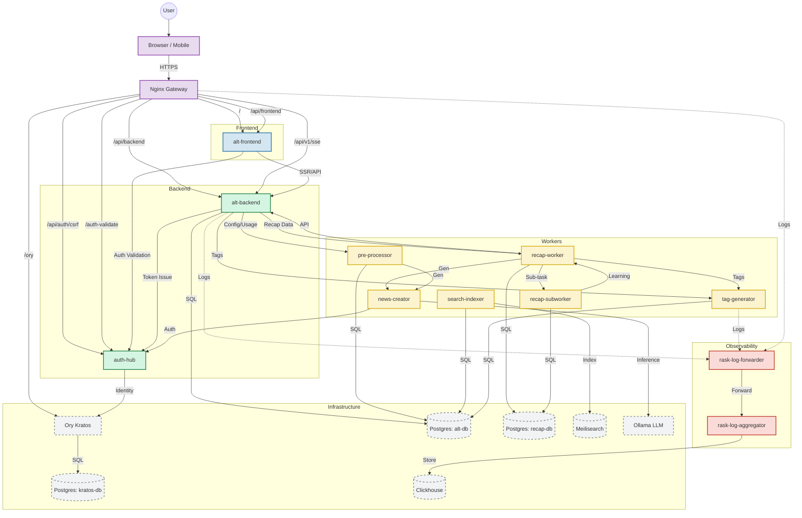

[](https://github.com/Kaikei-e/Alt/actions/workflows/backend-go.yaml)
[](https://github.com/Kaikei-e/Alt/actions/workflows/alt-frontend-unit-test.yaml)
[](https://github.com/Kaikei-e/Alt/actions/workflows/tag-generator.yaml)

# Alt – Compose-First AI Knowledge Platform

_Last reviewed on November 13, 2025._

> Compose-first knowledge platform that ingests RSS content, enriches it with AI, and serves curated insights with a unified developer workflow across Go, Python, Rust, Deno, and Next.js services.

## Table of Contents

- [Platform Snapshot](#platform-snapshot)
- [Architecture](#architecture)
  - [Data Flow Overview](#data-flow-overview)
  - [Compose Topology](#compose-topology)
  - [Data Intelligence Flow](#data-intelligence-flow)
  - [Microservice Communication Map](#microservice-communication-map)
  - [Identity & Edge Access](#identity--edge-access)
- [Technology & Version Matrix](#technology--version-matrix)
- [Getting Started](#getting-started)
  - [Prerequisites](#prerequisites)
  - [First-Time Setup](#first-time-setup)
  - [Compose Profiles](#compose-profiles)
  - [Developer Setup Checklist](#developer-setup-checklist)
- [Service Catalog & Documentation](#service-catalog--documentation)
- [Service Deep Dives](#service-deep-dives)
- [Recap Experience & Pipeline](#recap-experience--pipeline)
  - [Mobile & API Surfaces](#mobile--api-surfaces)
  - [Running the Recap Stack](#running-the-recap-stack)
  - [Pipeline Flow](#pipeline-flow)
- [Observability & Operations](#observability--operations)
- [Development Workflow & Testing](#development-workflow--testing)
- [Testing Playbook](#testing-playbook)
- [Data & Storage](#data--storage)
- [Security & Compliance](#security--compliance)
- [External Integrations](#external-integrations)
- [Contribution Checklist](#contribution-checklist)
- [Roadmap & Historical Context](#roadmap--historical-context)
- [Change Management & Communication](#change-management--communication)
- [Troubleshooting & FAQs](#troubleshooting--faqs)
- [Glossary](#glossary)
- [Reference Resources](#reference-resources)
- [Appendix](#appendix)

## Platform Snapshot

- Compose-first developer experience: `make up` builds images, runs Atlas migrations, and starts the full stack under Docker Compose v2 profiles.
- Clean Architecture across languages: Go services follow handler → usecase → port → gateway → driver, while Python, Rust, and Deno counterparts mirror the same contract-first approach.
- AI enrichment pipeline: pre-processor deduplicates and scores feeds, news-creator produces Ollama summaries, and tag-generator runs ONNX-backed extraction with SentenceTransformer fallback, keeps a background worker thread alive for batch throughput, and exposes a service-token gated `/api/v1/tags/batch` so downstream systems (Recap, recap-worker replays, etc.) can fetch cascade-aware tags and refresh the rolling `tag_label_graph` priors.
- Recap experience: recap-worker (Rust 2024) + recap-subworker (FastAPI) condense the latest seven days of articles into genre cards, evidence links, and summaries that power the mobile `/mobile/recap/7days` dashboard and backend `/v1/recap/7days` API, while deduplicating evidence, persisting `recap_cluster_evidence`, emitting `recap_genre_learning_results`, and shipping golden dataset evaluation metrics plus an offline `scripts/replay_genre_pipeline` helper.
- Recap ingestion: the backend also hosts `GET /v1/recap/7days` (public) plus service-authenticated `POST /v1/recap/articles`; the latter enforces `X-Service-Token` + `RecapRateLimiter` meters, returns `X-RateLimit-*` headers, and validates `from/to` RFC3339 ranges before calling `RecapGateway`.
- Dedicated recap-db (PostgreSQL 16) tracks jobs, cached articles, cluster evidence, tag-label graph priors, refine telemetry, and published recaps so reruns stay deterministic and audits replayable via Atlas migrations in `recap-migration-atlas/`.
- Search-ready delivery: search-indexer batches 200-document upserts into Meilisearch 1.15.2 with tuned searchable/filterable attributes and semantic-ready schema defaults.
- Observability built in: Rust rask log services stream structured JSON into ClickHouse 25.6, complemented by health endpoints and targeted dashboards.
- Streamed metrics: `/v1/sse/feeds/stats` keeps a heartbeat (10s) + ticker (configured via `SERVER_SSE_INTERVAL`) open so dashboards immediately reflect `feedAmount`, `unsummarizedFeedAmount`, and `articleAmount`.
- Identity at the edge: auth-hub validates Kratos sessions, emits authoritative `X-Alt-*` headers, and caches them for five minutes so downstream services remain auth-agnostic.
- TDD-first change management: every service mandates Red → Green → Refactor with exhaustive unit suites, integration hooks, and deterministic mocks before production merges.
- Developer ergonomics & safety: shared Make targets, lint/format tooling, env guards, and secrets hygiene keep onboarding fast and safe.
- Production parity: Compose profiles mirror production paths so GPU summarisation (`ollama`) and log pipelines (`logging`) toggle locally without ad-hoc scripts.

## Architecture

Alt is designed to keep local parity with production by centering on Docker Compose while preserving historical Kubernetes manifests for reference only.

## Data Flow Overview

- Ingested RSS feeds enter the Go pre-processor, undergo deduplication/sanitation, and emit canonical articles plus summaries for downstream services (`docs/pre-processor.md`).
- The tag-generator consumes those articles, runs the ONNX-backed extractor with cascade controls, and refreshes the `tag_label_graph` priors that recap-worker uses during genre refinement (`docs/tag-generator.md`).
- The recap pipeline (worker + subworker + recap-db + news-creator) orchestrates evidence deduction, clustering, LLM summarisation, and persistence of deduplicated proof links plus genre learning results (`docs/recap-worker.md`, `docs/recap-subworker.md`, `docs/recap-db.md`), while `alt-backend` surfaces the curated recap and articles APIs (`docs/alt-backend.md`).
- The backend also exposes `/v1/sse/feeds/stats` (heartbeat + periodic tickers) for live feed metrics and a service-authenticated `POST /v1/recap/articles` that enforces `X-Service-Token`, paged `from/to` queries, and `RecapRateLimiter` headers before handing data to recap-worker; these flows keep dashboards in sync and avoid Kratos/session churn.
- Observability services (rask log forwarder/aggregator) capture `recap_genre_refine_*` counters, `recap_api_evidence_duplicates_total`, and related metrics for ClickHouse dashboards (`docs/rask-log-forwarder.md`, `docs/rask-log-aggregator.md`).
- Identity flows (auth-hub, auth-token-manager) ensure Kratos sessions and Inoreader tokens stay fresh for the entire pipeline, and the frontend renders the `/mobile/recap/7days` experience from the recap summary DTOs (`docs/auth-hub.md`, `docs/auth-token-manager.md`, `docs/alt-frontend.md`).


### Compose Topology


### Data Intelligence Flow


### Microservice Communication Map

This diagram visualizes the direct API calls and data flow between microservices, highlighting the interconnected nature of the platform ("Mandala" view).



### Identity & Edge Access

Nginx fronts every `/api` call with `auth_request`, sending it to auth-hub. auth-hub validates the session via Kratos `/sessions/whoami`, caches the result for five minutes, and forwards authoritative `X-Alt-*` headers. alt-backend trusts those headers for user context while delegating outbound HTTP to `sidecar-proxy`, which enforces HTTPS allowlists and shared timeouts.

#### Component Responsibilities

- **Client tier** – Next.js UI delivers responsive dashboards, handles optimistic interactions, and mirrors backend feature flags via `NEXT_PUBLIC_*` variables.
- **Edge tier** – Nginx terminates TLS (when enabled), normalises headers, triggers auth-hub checks, and fan-outs requests to backend APIs or static assets.
- **Core services** – alt-backend orchestrates domain logic, while pre-processor, tag-generator, news-creator, and search-indexer cooperate to enrich, store, and surface content.
- **Data tier** – PostgreSQL persists canonical entities, Meilisearch powers discovery, ClickHouse retains observability telemetry, and Kratos maintains identities.
- **Observability tier** – Rust rask services guarantee durable log delivery, enabling replay into ClickHouse dashboards and anomaly detectors.
- **Optional profiles** – `ollama` introduces GPU inference footprint, `logging` deploys extended telemetry, and additional bespoke profiles can be layered for experiments.

#### Deployment Interaction Diagram


## Technology & Version Matrix

| Layer | Primary Tech | Version (Oct 2025) | Notes |
| --- | --- | --- | --- |
| Web UI | Next.js 15, React 19, TypeScript 5.9, pnpm 10.20.0 | Node.js 24 LTS | Chakra UI theme trio; App Router; Playwright + Vitest. |
| Go API & Proxy | Go 1.25, Echo, `net/http/httputil` | Go 1.25.x | Clean Architecture with GoMock; `testing/synctest`; sidecar enforces HTTPS allowlists and shared timeouts. |
| Go Data Pipeline | Go 1.25, `mercari/go-circuitbreaker`, `singleflight` | - | Pre-processor, scheduler, search-indexer; rate limit ≥5 s; 200-doc Meilisearch batches. |
| Python AI Services | Python 3.11/3.14, FastAPI, Ollama, `uv` | Ollama 0.3.x | Clean Architecture; golden prompts; bias detection; Ruff/mypy gates. |
| Recap pipeline | Rust 1.90 (Axum, Tokio, sqlx), FastAPI 0.115, PostgreSQL recap-db | Rust 1.90 / Python 3.11 | recap-worker orchestrates fetch→preprocess→dedupe→genre→persist; recap-subworker clusters evidence payloads; both depend on news-creator via the `ollama` profile. |
| Identity & Tokens | Ory Kratos 1.1, auth-hub (Go 1.25), Deno 2.5.4 | - | 5-minute TTL cache; emits `X-Alt-*` headers; Inoreader refresh via `@std/testing/bdd`. |
| Observability | Rust 1.90 (2024 edition), ClickHouse 25.6 | - | SIMD log forwarder; Axum aggregator; `criterion` benchmarks. |
| Storage & Search | PostgreSQL 16, Meilisearch 1.15.2 | - | Atlas migrations; tuned searchable/filterable attributes; persisted volumes. |
| Orchestration | Docker Desktop 4.36+, Compose v2.27+, Makefile | - | `make up/down/build`; optional `ollama` and `logging` profiles; `.env.template` as source. |

> **Version cadence:** Go/Rust toolchains track stable releases quarterly, Next.js updates follow LTS adoption, and Python runtimes are pinned per service to avoid cross-environment drift. Update the matrix whenever upgrade stories land.

## Getting Started

### Prerequisites

- Docker Desktop 4.36+ (or Colima/Lima with Compose v2.27+) with at least 4 CPU / 8 GB memory allocated.
- Node.js 24 LTS with `pnpm` ≥9 installed globally (`corepack enable pnpm`).
- Go 1.25.x toolchain with `GOBIN` on your `PATH`.
- Python 3.14 (for tag-generator) and Python 3.11 (for news-creator) with `uv` for environment management.
- Rust 1.90 (2024 edition) and Cargo, including `rustup target add wasm32-unknown-unknown` if you run front-end bridges.
- Deno 2.5.4 and optional GPU runtime (CUDA 12+) if you plan to run Ollama locally.

### First-Time Setup

1. **Install dependencies** – run `pnpm -C alt-frontend install`, `uv sync --project tag-generator/app`, `uv sync --project news-creator/app`, and `go mod download ./...`.
2. **Seed environment** – copy `.env.template` to `.env`; `make up` performs this automatically if the file is missing.
3. **Start the stack** – execute `make up` to build images, run Atlas migrations, seed Meilisearch, and boot the default profile.
4. **Verify health** – hit `http://localhost:3000/api/health`, `http://localhost:9000/v1/health`, `http://localhost:7700/health`, and `http://localhost:8888/health`.
5. **Stop or reset** – use `make down` to stop while retaining volumes or `make down-volumes` to reset data.
6. **Configure service secrets & models** – set `SERVICE_SECRET`, `TAG_LABEL_GRAPH_WINDOW`, and `TAG_LABEL_GRAPH_TTL_SECONDS` inside `.env`, place the ONNX assets under `tag-generator/models/onnx`, and let Compose mount them so tag-generator can reuse the ONNX runtime volume without extra downloads.

### Compose Profiles

- **Default** – Frontend, backend, PostgreSQL, Kratos, Meilisearch, search-indexer, tag-generator (mounts `./tag-generator/models/onnx` for the ONNX runtime and respects `SERVICE_SECRET`), ClickHouse, rask-log-aggregator.
- **`--profile ollama`** – Adds news-creator (FastAPI + Ollama) and pre-processor ingestion services with persistent model volume at `news_creator_models`.
- **`--profile logging`** – Launches rask-log-forwarder sidecars that stream container logs into the aggregator; includes `x-rask-env` defaults.
- **`--profile recap`** – Starts recap-worker (Rust), recap-subworker (FastAPI), recap-db (PostgreSQL 16), and the recap Atlas migrator. Pair it with `--profile ollama` so news-creator is available to finish summaries.

Enable combinations as needed with `docker compose --profile ollama --profile logging up -d` or `docker compose --profile recap --profile ollama up recap-worker recap-subworker recap-db recap-db-migrator` when testing the Recap stack end-to-end.

### Developer Setup Checklist

1. **Install toolchains** – Docker Desktop/Colima, Go 1.25.x, Node.js 24 + `pnpm`, Python 3.11/3.14 with `uv`, Rust 1.90, and Deno 2.5.4 should all respond to `--version`.
2. **Bootstrap dependencies** – Run `pnpm -C alt-frontend install`, `uv sync` for Python services, `go mod download ./...`, and `cargo fetch` to warm caches.
3. **Prepare environment** – Copy `.env.template` to `.env`, fill local-safe secrets, and confirm `scripts/check-env.js` passes.
4. **Smoke the stack** – Execute `pnpm -C alt-frontend build`, `go test ./...`, `uv run pytest`, `cargo test`, then `make up`/`make down` to validate orchestration.
5. **Align practices** – Read root/service `CLAUDE.md`, enable editor format-on-save, install optional pre-commit hooks, and keep credentials out of git.
6. **Recap-specific prep** – Run `make recap-migrate` (Atlas-backed) once before bringing up the `recap` profile, and confirm `http://localhost:9005/health/ready` plus `http://localhost:8002/health/ready` respond when testing the new mobile Recap surfaces.

## Service Catalog & Documentation

Each microservice maintains a `CLAUDE.md` for process guardrails plus a snapshot under `docs/<service>.md` that captures the latest architecture, configuration, and testing guidance. The table below links the primary doc per service so you can jump straight to the most concrete contract before coding.

| Service | Primary Doc | Focus |
| --- | --- | --- |
| `alt-frontend/` | [docs/alt-frontend.md](docs/alt-frontend.md) | Next.js 15 + React 19 App Router UI with Chakra themes and the `/mobile/recap/7days` experience. |
| `alt-frontend-sv/` | [docs/alt-frontend-sv.md](docs/alt-frontend-sv.md) | SvelteKit `/sv` experience with Runes, Tailwind v4, and authenticated dashboards. |
| `alt-backend/app/` | [docs/alt-backend.md](docs/alt-backend.md) | Go 1.25 Clean Architecture REST API, SSE + recap endpoints, and background job runners. |
| `alt-backend/sidecar-proxy/` | [docs/sidecar-proxy.md](docs/sidecar-proxy.md) | Go egress proxy that enforces HTTPS allowlists, bypasses internal DNS, and exposes health/metrics/debug hooks. |
| `pre-processor/app/` | [docs/pre-processor.md](docs/pre-processor.md) | Go ingestion service with dedupe/sanitization, circuit breakers, and async summarization queue. |
| `pre-processor-sidecar/app/` | [docs/pre-processor-sidecar.md](docs/pre-processor-sidecar.md) | Scheduler handling Inoreader token refresh, Cron-mode toggles, and secret-watchers. |
| `news-creator/app/` | [docs/news-creator.md](docs/news-creator.md) | FastAPI Ollama orchestrator with Model Bucket Routing, Map-Reduce summarisation, and golden prompts. |
| `tag-generator/app/` | [docs/tag-generator.md](docs/tag-generator.md) | Python 3.14 ML pipeline batching tag extractions, cascade controls, and rolling `tag_label_graph` priors. |
| `search-indexer/app/` | [docs/search-indexer.md](docs/search-indexer.md) | Go batch indexer (200 docs) into Meilisearch with tokenizer + schema bootstrapping plus `/v1/search`. |
| `auth-hub/` | [docs/auth-hub.md](docs/auth-hub.md) | Kratos-aware IAP that validates sessions, caches 5m, and emits authoritative `X-Alt-*` headers. |
| `auth-token-manager/` | [docs/auth-token-manager.md](docs/auth-token-manager.md) | Deno OAuth2 CLI refreshing Inoreader tokens, writing Kubernetes secrets, and monitoring horizons. |
| `rask-log-forwarder/app/` | [docs/rask-log-forwarder.md](docs/rask-log-forwarder.md) | Rust SIMD log tailer with buffering, disk fallback, and ClickHouse-ready batching. |
| `rask-log-aggregator/app/` | [docs/rask-log-aggregator.md](docs/rask-log-aggregator.md) | Axum API ingesting JSON logs and persisting to ClickHouse via exporter traits. |
| `recap-worker/` | [docs/recap-worker.md](docs/recap-worker.md) | Rust pipeline orchestrating fetch → preprocess → dedup → genre → evidence → news-creator → persist. |
| `recap-subworker/` | [docs/recap-subworker.md](docs/recap-subworker.md) | FastAPI worker running clustering, classification, diagnostics, and admin learning jobs. |
| `recap-db` | [docs/recap-db.md](docs/recap-db.md) | PostgreSQL schema contract for recap jobs, sections, evidence, tag graphs, and learning results. |

Additional reference docs include `docs/Alt-Architecture-07.md` for historical Kubernetes/Compose topology, the `docs/recap-*` retrospectives (runbooks, investigations, and pipeline notes), and the `docs/recap-7days-pipeline.md` overview for mobile/genre sequencing. Keep `CLAUDE.md` plus the linked snapshot fresh as you edit.

## Service Deep Dives

Every `docs/<service>.md` snapshot pairs prose with architecture diagrams, configuration, testing commands, and operational notes derived from the current tree. Consult the linked doc before touching the service and refresh it whenever contracts or lint/test surface changes.

- **alt-frontend** – Next.js 15 App Router UI with Chakra palettes, SWR/react-query caching, middleware-protected flows, and the `/mobile/recap/7days` experience that now renders evidence links + genre payloads. [docs/alt-frontend.md](docs/alt-frontend.md)
- **alt-frontend-sv** – SvelteKit `/sv` gateway with Runes, Tailwind v4, SSE hooks, and Kratos-aware middleware powering the modern dashboard while exchanging tokens via auth-hub. [docs/alt-frontend-sv.md](docs/alt-frontend-sv.md)
- **alt-backend/app** – Go 1.25 Clean Architecture API (handler → usecase → port → gateway → driver) with GoMock suites, Atlas migrations, structured slog, and the recap endpoints `/v1/recap/7days` + service-auth `/v1/recap/articles`. [docs/alt-backend.md](docs/alt-backend.md)
- **alt-backend/sidecar-proxy** – Go egress proxy enforcing HTTPS allowlists, external DNS resolution, CONNECT tunnels, health/metrics/debug endpoints, and structured logging while remaining light enough to attach to Compose/Kubernetes. [docs/sidecar-proxy.md](docs/sidecar-proxy.md)
- **pre-processor/app** – Go ingestion worker that deduplicates feeds, sanitizes content, queues summarisation jobs, and obeys 5-second host pacing with circuit breakers. [docs/pre-processor.md](docs/pre-processor.md)
- **pre-processor-sidecar/app** – Scheduler rotating Inoreader tokens, syncing subscriptions, and exposing health/admin endpoints; uses `singleflight`, pluggable clocks, and secret watching. [docs/pre-processor-sidecar.md](docs/pre-processor-sidecar.md)
- **news-creator/app** – FastAPI Ollama orchestrator featuring Model Bucket Routing, hierarchical Map-Reduce summarization, golden prompts, and fallback strategies for OOM or repetition. [docs/news-creator.md](docs/news-creator.md)
- **tag-generator/app** – Python 3.14 ML pipeline batching tag extraction, running ONNX Runtime (with SentenceTransformer fallback), exposing `/api/v1/tags/batch`, and refreshing the rolling `tag_label_graph`. [docs/tag-generator.md](docs/tag-generator.md)
- **search-indexer/app** – Go Meilisearch indexer that batches 200 documents, ensures schema settings, and exposes a `/v1/search` handler. [docs/search-indexer.md](docs/search-indexer.md)
- **auth-hub** – Kratos-aware IAP that validates sessions, caches identities for five minutes, and emits authoritative `X-Alt-*` headers for downstream services. [docs/auth-hub.md](docs/auth-hub.md)
- **auth-token-manager** – Deno OAuth2 CLI refreshing Inoreader tokens, writing Kubernetes secrets, and monitoring token horizon alerts. [docs/auth-token-manager.md](docs/auth-token-manager.md)
- **rask-log-forwarder/app** – Rust SIMD JSON log forwarder with lock-free buffers, disk fallback, and ClickHouse-friendly batching. [docs/rask-log-forwarder.md](docs/rask-log-forwarder.md)
- **rask-log-aggregator/app** – Rust Axum API ingesting newline-delimited JSON logs and persisting them into ClickHouse via exporter traits. [docs/rask-log-aggregator.md](docs/rask-log-aggregator.md)
- **recap-worker** – Rust 2024 Axum orchestrator that fetches articles, preprocesses/deduplicates, assigns genres, assembles evidence, clusters via recap-subworker, summarizes via news-creator, and persists outputs for `/v1/recap/7days`. [docs/recap-worker.md](docs/recap-worker.md)
- **recap-subworker** – FastAPI/Gunicorn clustering and classification worker using process pools, embeddings, and diagnostics; supports admin warmups and graph builds. [docs/recap-subworker.md](docs/recap-subworker.md)
- **recap-db** – PostgreSQL schema contract for recap jobs, sections, evidence, tag graphs, and learning results plus migration helpers. [docs/recap-db.md](docs/recap-db.md)

- **Cross-cutting note** – Structured logging, context propagation, deterministic tests, and environment-driven configuration apply to every service. Refresh the relevant `docs/<service>.md` snapshot whenever contracts, env guards, or test commands change, and read the `CLAUDE.md` file for process guardrails before committing.

## Recap Experience & Pipeline

`recap-worker` (Rust 2024) orchestrates the 7-day recap job described in `docs/recap-worker.md` via `PipelineOrchestrator` (`recap-worker/recap-worker/src/pipeline.rs`). A scheduler or manual `POST /v1/generate/recaps/7days` trigger creates a `JobContext` that drives seven stages:

1.  **Fetch** (`AltBackendFetchStage`) pulls the current 7‑day window from `alt-backend` `/v1/recap/articles`, optionally enriches articles with `tag-generator` tags, and writes raw HTML/metadata copies to `recap_job_articles`.
2.  **Preprocess** (`TextPreprocessStage`) strips HTML, normalises Unicode, runs language detection, tokenises via Lindera, and extracts tag signals with `recap_job_articles` data before handing the batch to the deduper.
3.  **Dedup** (`HashDedupStage`) removes near-duplicates with XXH3 + sentence similarity so each article appears once.
4.  **Genre** (`RemoteGenreStage` + `TwoStageGenreStage`) sends batches to `recap-subworker` for remote coarse classification, then, when `genre_refine_enabled` is configured, reloads the cached `tag_label_graph` (preloaded from `recap-db`) and refines genres using `DefaultRefineEngine` + rollout settings.
5.  **Select** (`SummarySelectStage`) trims per-genre documents (min counts, subgenre limits), optionally reruns coherence filtering with the embedding service, and builds the evidence bundle.
6.  **Dispatch** (`MlLlmDispatchStage`) fans out the bundle: `recap-subworker` clusters evidence via `/v1/runs`, `news-creator` summarises per-cluster content through Ollama, and the orchestrator collects the summaries plus diagnostics.
7.  **Persist** (`FinalSectionPersistStage`) stores the curated recap (`recap_outputs`, `recap_genres`), `recap_cluster_evidence`, `recap_genre_learning_results`, and related diagnostics in `recap-db`, updating metrics and structured logs consumed by ClickHouse/rust observability services.

Before each run the builder optionally refreshes the graph cache (`recap_pre_refresh_graph_enabled`) and reloads `GraphOverrideSettings` so genre thresholds can be tuned live; resumable jobs look up the last completed stage when the orchestrator replays the handler. The same workflow emits the `/v1/recap/7days` DTO, `recap_cluster_evidence` links, and `recap_genre_learning_results` telemetry that drive the `/mobile/recap/7days` surface plus downstream dashboards.

### Mobile & API Surfaces

- `/mobile/recap/7days` renders the Recap, Genres, Articles, and Jobs tabs defined in `PLAN6.md`, using SWR hooks (`useRecapData`) plus Chakra skeletons so data appears instantly via `stale-while-revalidate`.
- `GET /v1/recap/7days` (alt-backend) is public and streams the latest recap summary, genre clusters, and deduplicated evidence links (`recap_cluster_evidence`) via the `RecapSummary` → `RecapGenre` → `EvidenceLink` DTOs so clients always get the final, proofed payload.
- `GET /v1/recap/articles` is service-authenticated (service token + `middleware_custom.ServiceAuth`) and supplies recap-worker with deterministic article corpora (window, pagination, language filters) before every run. Pair it with `POST /v1/generate/recaps/7days` for manual retries or narrow-genre jobs.
- `recap-worker` exposes `/health/live`, `/health/ready`, `/metrics`, and admin retries; `recap-subworker` mirrors the health endpoints and publishes queue depth gauges so Grafana, ClickHouse, or CLI checks can flag stalls early.

### Running the Recap Stack

- Run `make recap-migrate` (or `docker compose --profile recap run recap-db-migrator atlas migrate apply`) before enabling the profile so recap-db includes the latest schema (`recap_jobs`, `recap_outputs`, `recap_cluster_evidence`, diagnostics tables).
- Start everything with GPU + worker profiles, e.g.:
  ```bash
  docker compose --profile recap --profile ollama up recap-worker recap-subworker recap-db news-creator -d
  ```
- Trigger a job manually via `curl -X POST http://localhost:9005/v1/generate/recaps/7days -H 'Content-Type: application/json' -d '{"genres":[]}'` or wait for the default 04:00 JST scheduler. Watch `docker compose logs -f recap-worker recap-subworker` for per-stage metrics.
- Once the job completes, `curl http://localhost:9000/v1/recap/7days` should return fresh data and the mobile route will refresh automatically thanks to SWR’s `stale-if-error` fallback.
- The genre refinement stage depends on the `TAG_LABEL_GRAPH_WINDOW`/`TAG_LABEL_GRAPH_TTL_SECONDS` cache window, so update those envs and re-run `scripts/build_label_graph.py` or the `scripts/replay_genre_pipeline.rs` helper (pass `--dataset`, optional `--graph-window`, `--graph-ttl`, `--require-tags`, `--dry-run`) whenever you change the tag priors; the recap-worker also ships golden dataset evaluation + ROUGE scoring utilities to guard summary quality alongside these offline replays.

### Pipeline Flow


## Observability & Operations

- Enable the `logging` profile to run rask-log-forwarder sidecars; defaults stream 1 000-log batches (flush 500 ms) to `http://rask-log-aggregator:9600/v1/aggregate`. When testing Recap, pair the `recap` and `ollama` profiles so recap-worker can reach both recap-db and news-creator. ClickHouse data lives in `clickhouse_data` and is accessible via `docker compose exec clickhouse clickhouse-client`.
- Monitor recap-specific metrics (`recap_genre_refine_rollout_enabled_total`, `_skipped_total`, `recap_genre_refine_graph_hits_total`, `recap_api_evidence_duplicates_total`, `recap_api_latest_fetch_duration_seconds`, etc.) alongside the `recap` profile logs, and use the golden dataset evaluation tasks (`recap-worker/tests/golden_eval.rs`, ROUGE helpers under `recap-worker/src/evaluation/golden.rs`, and `scripts/replay_genre_pipeline.rs`) whenever you change summarisation, clustering, or graph priors.
- Monitor core endpoints below; Kratos (`http://localhost:4433/health/ready`) and ClickHouse (`http://localhost:8123/ping`) should also respond during smoke tests.

  | Service | Endpoint | Expectation |
  | --- | --- | --- |
  | Frontend | `http://localhost:3000/api/health` | `{ "status": "ok" }` |
  | Backend | `http://localhost:9000/v1/health` | `{ "status": "ok" }` |
  | Auth Hub | `http://localhost:8888/health` | HTTP 200 |
  | Meilisearch | `http://localhost:7700/health` | `{ "status": "available" }` |
  | Recap Worker | `http://localhost:9005/health/ready` | Probes recap-subworker + news-creator before `200`; metrics at `/metrics`. |
  | Recap Subworker | `http://localhost:8002/health/ready` | `200` only when queue + process pool are healthy. |
  | Recap DB | `docker compose exec recap-db pg_isready -U $RECAP_DB_USER` | `accepting connections` |

- Use `docker compose logs -f <service>` for quick debugging, query ClickHouse for high-volume analysis, and run `backup-postgres.sh` / `backup-postgres-docker.sh` only when the stack is quiesced.

## Development Workflow & Testing

- Follow Red → Green → Refactor, starting with business-layer tests and regenerating mocks when interfaces evolve.
- Keep changes surgical and deterministic—lean on dependency injection, fake clocks (`testing/synctest`, custom `Clock`), and table/parameterized tests.
- Run formatters before committing (`pnpm fmt`, `gofmt`, `uv run ruff format`, `cargo fmt`, `deno fmt`) and document any new env vars or migrations.

### Test Matrix

| Area | Scope | Command | Notes |
| --- | --- | --- | --- |
| Frontend unit | alt-frontend components | `pnpm -C alt-frontend test` | Vitest + Testing Library + `userEvent`. |
| Frontend e2e | alt-frontend Playwright POM | `pnpm -C alt-frontend test:e2e` | Requires `make up`. |
| Go services | alt-backend/app, sidecar-proxy, pre-processor/app, pre-processor-sidecar/app, search-indexer/app, auth-hub | `go test ./...` from each directory | Add `-race -cover` when touching concurrency; regenerate mocks via `make generate-mocks`. |
| Python services | news-creator/app, tag-generator/app, recap-subworker | `SERVICE_SECRET=test-secret pytest`; `uv run pytest` | Async tests use `pytest-asyncio`; Ruff and mypy enforce quality gates; recap-subworker exercises clustering + queue backpressure. |
| Rust services | recap-worker, rask-log-forwarder/app, rask-log-aggregator/app | `cargo test -p <crate>` | Use `cargo bench` for recap-worker preprocessing + rask hot paths; run `SQLX_OFFLINE=true cargo test -p recap-worker` in CI. |
| Deno service | auth-token-manager | `deno test` | BDD-style assertions with `@std/testing/bdd`. |
| Recap pipeline | recap-worker ↔ recap-subworker contract + alt-backend `/v1/recap/*` DTOs | `cargo test -p recap-worker && uv run pytest -q` | Run before modifying JSON Schemas or evidence DTOs; follow with `docker compose --profile recap --profile ollama up` smoke to validate `/v1/recap/7days`. |
| Compose smoke | Full stack health | `make up` then `curl` health endpoints | Confirms migrations, Meilisearch settings, and auth-hub session flow. |

## Testing Playbook

Alt’s quality bar depends on disciplined, layered tests:

- **Unit** – Pure functions, usecases, and adapters using table-driven Go tests, pytest fixtures, Vitest `describe.each`, or Rust unit modules.
- **Integration** – Boundary checks (Go ↔ Postgres, FastAPI ↔ Ollama mock, Rust ↔ ClickHouse) run via Compose services or lightweight doubles.
- **End-to-end** – Playwright journeys ensure auth headers, summarisation flows, and search UX remain intact; rely on Page Object Models.
- **Golden/Performance** – Guard LLM prompts and hot paths with golden datasets, ROUGE scoring helpers, offline replays (`scripts/replay_genre_pipeline.rs`), and `criterion`/`testing.B` benchmarks.

Authoring guidelines: name tests descriptively, isolate dependencies (GoMock, `pytest-mock`, `mockall`, `@std/testing/mock`), control time via fake clocks, and keep suites fast to avoid flaky CI.

CI expectations: PRs run lint + unit suites per language plus targeted integration/E2E jobs when code touches those areas. Record commands and outcomes in PR descriptions. If tests fail, prefer fixing root causes over blanket retries; update snapshots only when behaviour changes intentionally.

## Data & Storage

- PostgreSQL 16 (`db_data`) stores canonical entities: `feeds`, `articles`, `article_summaries`, `article_tags`, `ingestion_jobs`, `users`, and audit tables. Atlas migrations live in `migrations-atlas/` and must remain backward-compatible because `make up` replays them on every boot.
- Kratos maintains its own database (`kratos_db_data`) for identity state; never cross-link application tables to Kratos schemas—consume identity via auth-hub headers instead.
- Meilisearch (`meili_data`) holds denormalised search documents built by `search-indexer`; run `docker compose exec meilisearch index list` to inspect configured indices.
- ClickHouse (`clickhouse_data`) captures structured logs from rask-aggregator, enabling time-series queries, dashboards, and anomaly alerts.
- recap-db (`recap_db_data`) is the dedicated PostgreSQL instance for recap-worker; it stores `recap_jobs`, cached articles, cluster evidence, and published summaries. Keep it in sync via `recap-migration-atlas/` + `make recap-migrate` before running the `recap` profile.
- recap-db (`recap_db_data`) is the dedicated PostgreSQL instance for recap-worker; it stores `recap_jobs`, cached articles, `recap_cluster_evidence`, `tag_label_graph`, `recap_genre_learning_results`, and published summaries. Keep it in sync via `recap-migration-atlas/` + `make recap-migrate` before running the `recap` profile, and refresh the graph edges with `tag-generator/app/scripts/build_label_graph.py` (respecting `TAG_LABEL_GRAPH_WINDOW` / `TAG_LABEL_GRAPH_TTL_SECONDS`) or its background service thread whenever you update genre priors.
- Backups: `backup-postgres.sh` (local Docker) and `backup-postgres-docker.sh` (Compose-aware) provide snapshot scripts; schedule them before major migrations. ClickHouse backups can be scripted via `clickhouse-client` or S3-based storage (future).

### Data Model Overview


### Storage Guardrails

- **Retention** – Articles stay until explicitly archived; summaries and tags follow cascading rules defined in migrations—avoid manual deletes.
- **Indices** – Postgres indexes `(feed_id, archived)` and `(published_at DESC)` keep queries snappy; adjust Meilisearch filterable attributes when adding new facets.
- **Migrations** – Preview drift with Atlas when available; keep changes idempotent and reversible.
- **Resets** – `make down-volumes` clears state; note any seed scripts so teammates can repopulate fixtures quickly.
- **Recap state** – Use `make recap-migrate` + `docker compose --profile recap run recap-worker sqlx migrate info` after editing `recap-migration-atlas/`; keep JSONB payloads backwards compatible so the public `/v1/recap/7days` API never breaks.

## Security & Compliance

- Never commit real credentials; keep developer defaults in `.env.template` and load real secrets via `.env` or Kubernetes Secrets.
- auth-hub is the single source of identity—consume `X-Alt-*` headers and reject conflicting user context.
- Sanitize logs and use the TLS helpers (`make dev-ssl-setup`, `make dev-ssl-test`, `make dev-clean-ssl`) to keep traffic encrypted while redacting sensitive fields.
- Service-to-service calls (e.g., `/v1/recap/articles`, `/api/v1/tags/batch`, and tag label graph refreshes) now rely on `SERVICE_SECRET` + `X-Service-Token` headers; keep the secret in `.env`/Secrets, rotate it consistently, and only share it with Compose services that need to authenticate.
- Validate inputs, prefer parameterized queries, and wrap errors with context without leaking private details.

## External Integrations

- **Inoreader OAuth2** – Managed by `auth-token-manager` and `pre-processor-sidecar`; tokens refresh proactively and live in Secrets.
- **Ollama (Gemma 3 4B)** – Powers LLM summaries; install GPU drivers before enabling the `ollama` profile.
- **RSS & downstream connectors** – pre-processor respects publisher rate limits today; planned notification channels must preserve the same guardrails.

## Contribution Checklist

- Read the root and service-specific `CLAUDE.md` files before making changes.
- Start every change with a failing test and keep the affected suites green.
- Run formatters/linters and document new configuration, migrations, or APIs.
- Prove the change with the smallest meaningful test or health probe and note the result.
- Leave `stopped-using-k8s/` untouched unless asked and verify `make up` succeeds after edits.

## Roadmap & Historical Context

- Upcoming initiatives: extend auth-hub with tenant scoping, add semantic embeddings to Meilisearch, deliver live article status (SSE/WebSocket), and harden ClickHouse dashboards.
- Historical posture: Kubernetes assets in `stopped-using-k8s/` and the legacy `Alt-arch.mmd` diagram are reference-only—Compose remains the authoritative workflow.

## Change Management & Communication

- **Planning** – Open a GitHub issue or ADR for significant architectural work. Reference impacted services and note required Compose profile changes or migrations.
- **Documentation** – Update this README, relevant `CLAUDE.md`, and any runbooks when behaviour changes. Diagram diffs (Mermaid, Alt-arch.mmd) should be kept in sync.
- **Code reviews** – Default to reviewer pairs who own affected services; call out risky areas, test coverage, and rollback strategy. Highlight any rate limit, security, or compliance implications.
- **Release cadence** – Weekly Compose releases roll forward once smoke tests pass. Emergency fixes require tagged releases with changelog entries and communication in #alt-platform.
- **Communication channels** – Use #alt-dev for day-to-day collaboration, #alt-ops for incident coordination, and the platform RFC Notion space for long-form proposals.
- **Post-merge validation** – After merging, run `make up`, verify health endpoints, and monitor ClickHouse dashboards for anomalies during the first ingestion cycle.

## Troubleshooting & FAQs

| Symptom | Likely Cause | Resolution |
| --- | --- | --- |
| `pnpm dev` fails with missing env vars | `.env` not aligned with `.env.template` | Re-run `cp .env.template .env`, ensure `scripts/check-env.js` passes. |
| Backend returns 401 despite valid session | auth-hub cache stale or Kratos offline | Restart auth-hub container; verify Kratos `/sessions/whoami` responds; purge cache by restarting service. |
| Recap dashboard shows skeletons forever | `--profile recap` not running, recap-worker job failed, or recap-db lacks data | Run `docker compose --profile recap --profile ollama up recap-worker recap-subworker recap-db`; trigger `POST /v1/generate/recaps/7days`; inspect `docker compose logs recap-worker`. |
| Recap evidence links keep returning duplicates or empty lists | `recap_cluster_evidence`/`tag_label_graph` migrations missing, label graph cache expired (`TAG_LABEL_GRAPH_TTL_SECONDS`), or tag-generator hasn't refreshed `tag_label_graph` | Run `make recap-migrate`, confirm `recap_cluster_evidence` & `tag_label_graph` exist, refresh the graph with `tag-generator/app/scripts/build_label_graph.py` (or background thread), and rerun `curl POST /v1/generate/recaps/7days`. |
| Meilisearch searches empty after ingest | search-indexer not running or index misconfigured | Check `docker compose logs search-indexer`; rerun `search-indexer` manually; confirm index settings via Meili dashboard. |
| Ollama summary timeouts | Model not pulled or GPU unavailable | Run `docker compose --profile ollama logs news-creator`; preload model with `ollama pull gemma:4b`; confirm GPU drivers. |
| Rust services crash on startup | Insufficient ulimit or missing env | Ensure `LOG_LEVEL` and `RASK_ENDPOINT` set; increase file descriptors via Docker Compose `ulimits`. |
| Go tests flaky with timeouts | Missing fake clock or context deadline | Inject `testing/synctest` clock, set explicit deadlines, and avoid sleeping blindly in tests. |
| Tag-generator batch fetch returns 401 | `SERVICE_SECRET` missing/mismatched or `X-Service-Token` header not sent | Align `.env` values for `SERVICE_SECRET`, include the same value when calling `/api/v1/tags/batch`, and confirm clients supply `X-Service-Token`. |
| Playwright tests hang | Stack not running or selectors outdated | Start stack with `make up`; update POM selectors to match `data-testid` or page changes. |

**General tip:** Use `docker compose ps` and `docker compose logs -f <service>` for health checks, `docker compose exec db psql -U $POSTGRES_USER $POSTGRES_DB` for database inspection, and `make down-volumes` to reset state (only when data loss is acceptable).

## Glossary

- **Alt** – The Compose-first AI knowledge platform described in this repository.
- **Clean Architecture** – Layered approach separating interface (handlers), business logic (usecases), and infrastructure (gateways/drivers).
- **Compose profile** – Named group of services (e.g., `ollama`, `logging`) that can be toggled on via `docker compose --profile`.
- **Golden dataset** – Curated set of inputs/outputs used to detect regressions in LLM or ML-driven features.
- **IAP (Identity-Aware Proxy)** – Pattern where an edge service (auth-hub) centralises authentication before requests reach backend services.
- **LLM** – Large Language Model; in this project, Ollama-powered Gemma 3 4B produces article summaries.
- **Meilisearch** – Lightweight search engine used for full-text indexing and filtering of enriched content.
- **Rask** – Codename for the Rust observability duo: `rask-log-forwarder` (ingest) and `rask-log-aggregator` (ClickHouse sink).
- **Recap** – The seven-day batch summarization feature driven by recap-worker (Rust), recap-subworker (FastAPI), recap-db (PostgreSQL), and the mobile `/mobile/recap/7days` UI exposed via `/v1/recap/7days`.
- **Singleflight** – Go concurrency primitive ensuring only one duplicate request executes; used for token refresh.
- **TDD** – Test-Driven Development; the Red → Green → Refactor cycle enforced across all services.

## Reference Resources

- Internal docs: `CLAUDE.md` (root) and service-specific `CLAUDE.md` files.
- Architecture diagrams: `README.md` Mermaid blocks and `Alt-arch.mmd` for historical Kubernetes topology.
- Runbooks: `docs/` folder (if present) and scripts under `scripts/` for auth checks, log collection, and index resets.
- External references: [Next.js](https://nextjs.org/docs), [Go 1.25](https://go.dev/doc/devel/release), [Meilisearch](https://www.meilisearch.com/docs), [ClickHouse](https://clickhouse.com/docs), [Ollama](https://ollama.com/), [Kratos](https://www.ory.sh/kratos/docs/).
- Communication hubs: #alt-dev, #alt-ops Slack channels, and the Alt Notion workspace for RFCs and runbooks.

## Appendix

### Command Cheat Sheet

```bash
make up
make down
docker compose --profile ollama --profile logging up -d
pnpm -C alt-frontend test
cd alt-backend/app && go test ./...
make recap-migrate
docker compose --profile recap --profile ollama up recap-worker recap-subworker recap-db -d
curl http://localhost:9000/v1/recap/7days
```

### Essential Environment Variables

| Variable | Purpose | Default/Location |
| --- | --- | --- |
| `POSTGRES_USER`, `POSTGRES_PASSWORD`, `POSTGRES_DB` | Alt backend database credentials | `.env.template` |
| `KRATOS_INTERNAL_URL`, `KRATOS_PUBLIC_URL` | Ory Kratos internal/public endpoints | `.env.template` |
| `AUTH_HUB_INTERNAL_URL` | Internal URL for auth-hub | `.env.template` |
| `NEXT_PUBLIC_APP_ORIGIN`, `NEXT_PUBLIC_RETURN_TO_DEFAULT` | Frontend routing and redirects | `.env.template` |
| `SIDECAR_PROXY_BASE_URL`, `RASK_ENDPOINT` (+ batching vars) | Outbound proxy and log pipeline config | `.env` or compose `x-rask-env` |
| `SERVICE_SECRET`, `INOREADER_CLIENT_ID`, `INOREADER_CLIENT_SECRET` | News-creator tests and Inoreader OAuth tokens | Export locally or inject via Secrets |
| `RECAP_DB_USER`, `RECAP_DB_PASSWORD`, `RECAP_DB_NAME`, `RECAP_DB_PORT` | Recap PostgreSQL credentials shared by recap-worker, recap-subworker, and the migrator | `.env.template`, `recap-migration-atlas/.env.example` |
| `RECAP_WORKER_URL`, `RECAP_SUBWORKER_BASE_URL`, `RECAP_WINDOW_DAYS` | alt-backend → recap-worker client target plus worker scheduling window | `.env.template` and Compose `recap` profile |

Keep `.env.template` updated with non-sensitive defaults whenever configuration changes, and mirror new variables here.

## Open-Source Credits

Alt stands on the shoulders of many open-source projects. We gratefully acknowledge the communities that maintain the tools and frameworks powering this platform.

- **Docker & Docker Compose** – Container orchestration backbone for local and CI workflows. © Docker Inc. Licensed under Apache 2.0/MIT.
- **Node.js & pnpm** – JavaScript runtime and package manager enabling the Next.js frontend. Node.js is available under the MIT License; pnpm under MIT.
- **Next.js & React** – Frontend framework and UI library (MIT) by Vercel and Meta. Chakra UI (MIT) provides the design system.
- **Go** – Systems language (BSD-style license) powering backend, ingestion, proxy, and auth services. Includes Echo (MIT), GoMock (Apache 2.0), and other Go ecosystem libraries.
- **Python & FastAPI** – Python (PSF License) with FastAPI (MIT) drives LLM summarisation and tagging services, alongside `uv` (MIT), `pytest` (MIT), and the wider scientific stack (varied permissive licenses).
- **Rust** – Rust compiler/toolchain (Apache 2.0 / MIT dual license) underpins observability sidecars, supplemented by crates like Axum (MIT/Apache 2.0), Tokio (MIT/Apache 2.0), and Criterion (Apache 2.0).
- **Deno** – Secure TypeScript/JavaScript runtime (MIT) powering the auth-token-manager.
- **Ollama** – Open-source LLM runtime (MIT) providing Gemma 3 4B hosting for news-creator.
- **Meilisearch** – Search engine (MIT) delivering full-text indexing. Integrated via official Go client (MIT).
- **PostgreSQL & pgx** – PostgreSQL database (PostgreSQL License) and associated drivers for data persistence.
- **ClickHouse** – Columnar database (Apache 2.0) backing observability analytics.
- **Ory Kratos** – Identity infrastructure (Apache 2.0) enabling session validation via auth-hub.
- **Mercari/go-circuitbreaker, singleflight, slog, Atlas** – Key Go libraries (varied BSD/MIT/Apache licenses) supporting resilience, logging, and migrations.
- **Testing frameworks** – Vitest, Playwright, pytest, Go `testing`, Cargo test, and Deno test suites (MIT/BSD/Apache) enforcing the TDD workflow.
- **Linux base images** – Alpine Linux (MIT), Debian/Ubuntu (varied open-source licenses) form the runtime foundation for service containers.

Each dependency retains its respective license; review individual repositories for full terms. We remain committed to upstream contributions and timely upgrades to honour these communities.
