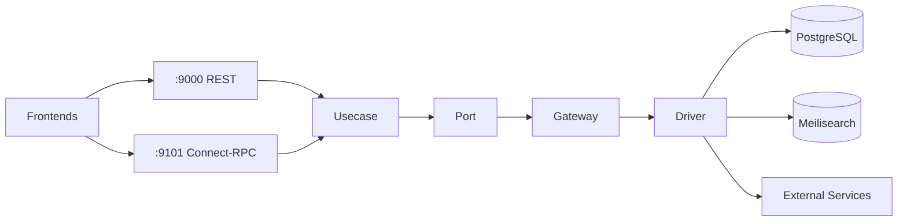

# alt-backend

Core backend service for the Alt RSS knowledge platform. Provides REST API (port 9000) and Connect-RPC (port 9101) interfaces with Clean Architecture principles.

## Tech Stack

| Component | Technology |
|-----------|------------|
| Language | Go 1.24+ |
| Framework | Echo 4.14 |
| RPC | Connect-RPC 1.19 |
| Database | PostgreSQL 17 |
| Search | Meilisearch (via search-indexer) |
| Auth | JWT + X-Alt-* headers |

## Architecture

Five-layer Clean Architecture:

```
REST Handler → Usecase → Port → Gateway → Driver
```

| Layer | Responsibility |
|-------|----------------|
| REST | HTTP handlers, routing, middleware |
| Usecase | Business logic orchestration |
| Port | Interface definitions/contracts |
| Gateway | External API adaptation, domain translation |
| Driver | Database, search, external integrations |



## Quick Start

```bash
cd app

# Run tests
go test ./...

# Run with coverage
go test -race -cover ./...

# Generate mocks
make generate-mocks

# Start service
go run main.go

# Health check
curl http://localhost:9000/v1/health
```

## API Surface

### REST API (port 9000)

| Endpoint | Auth | Description |
|----------|------|-------------|
| `/v1/health` | No | Health check |
| `/v1/feeds/*` | Yes | Feed management, listing, stats |
| `/v1/articles/*` | Yes | Article fetch, search, archive |
| `/v1/search` | Yes | Full-text search |
| `/v1/recap/*` | Mixed | Recap data (7days public, articles service-only) |
| `/v1/sse/feeds/stats` | Yes | Real-time feed stats |

### Connect-RPC (port 9101)

| Service | Methods | Streaming |
|---------|---------|-----------|
| ArticleService | 3 | No |
| FeedService | 10 | Yes |
| RSSService | 4 | No |
| AugurService | 2 | Yes |
| MorningLetterService | 1 | Yes |

## Configuration

| Variable | Default | Description |
|----------|---------|-------------|
| `SERVER_PORT` | 9000 | REST API port |
| `DB_HOST`, `DB_*` | - | PostgreSQL connection |
| `AUTH_SHARED_SECRET` | - | Shared secret for X-Alt-* auth |
| `SERVICE_SECRET` | - | Service-to-service auth |
| `PRE_PROCESSOR_URL` | http://pre-processor:9200 | Summarization service |
| `RECAP_WORKER_URL` | http://recap-worker:9005 | Recap service |

See `app/config/config.go` for complete configuration.

## Background Jobs

| Job | Interval | Description |
|-----|----------|-------------|
| HourlyJobRunner | 1 hour | RSS feed collection |
| DailyScrapingPolicyJob | 24 hours | Robots.txt refresh |

## Development

### Project Structure

```
alt-backend/
├── README.md
├── Dockerfile.backend
├── app/
│   ├── CLAUDE.md            # Workflow guidelines
│   ├── main.go              # Entry point
│   ├── config/              # Configuration
│   ├── di/                  # Dependency injection
│   ├── domain/              # Domain entities
│   ├── rest/                # HTTP handlers
│   ├── usecase/             # Business logic
│   ├── port/                # Interfaces
│   ├── gateway/             # External adapters
│   ├── driver/              # DB/API clients
│   ├── middleware/          # Auth, logging
│   ├── job/                 # Background jobs
│   ├── mocks/               # Generated mocks
│   └── utils/               # Helpers
└── sidecar-proxy/           # Egress proxy
```

### Testing

```bash
# Unit tests
go test ./...

# With race detection
go test -race ./...

# Specific package
go test ./usecase/...

# Generate mocks (when interfaces change)
make generate-mocks
```

## Related Documentation

- [Workflow Guidelines](./app/CLAUDE.md)
- [Architecture Details](../docs/services/alt-backend.md)
- [Project CLAUDE.md](../CLAUDE.md)
