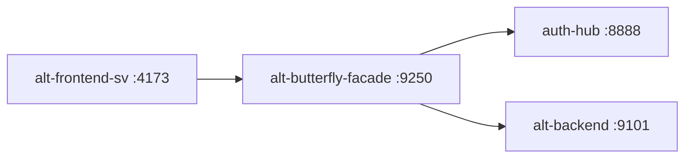

# alt-butterfly-facade

Backend for Frontend (BFF) service providing transparent HTTP/2 proxying between `alt-frontend-sv` and `alt-backend` with JWT validation.

## Architecture



**Flow:**
1. Frontend sends Connect-RPC request with `X-Alt-Backend-Token` header
2. BFF validates JWT (issuer: auth-hub, audience: alt-backend)
3. BFF forwards request to alt-backend via HTTP/2 h2c
4. BFF streams response back to frontend

## Prerequisites

- Go 1.25+
- Docker (for deployment)

## Quick Start

```bash
# Run tests
go test ./...

# Build
go build -o alt-butterfly-facade .

# Start service (requires env vars)
./alt-butterfly-facade

# Health check
curl http://localhost:9200/health

# Docker healthcheck (in container)
./alt-butterfly-facade healthcheck
```

## Configuration

| Environment Variable | Default | Description |
|---------------------|---------|-------------|
| `BFF_PORT` | 9200 | Service port |
| `BACKEND_CONNECT_URL` | http://alt-backend:9101 | Backend Connect-RPC URL |
| `BACKEND_TOKEN_SECRET_FILE` | - | Path to JWT secret file |
| `BACKEND_TOKEN_SECRET` | - | JWT secret (fallback) |
| `BACKEND_TOKEN_ISSUER` | auth-hub | Expected JWT issuer |
| `BACKEND_TOKEN_AUDIENCE` | alt-backend | Expected JWT audience |
| `BFF_REQUEST_TIMEOUT` | 30s | Timeout for unary requests |
| `BFF_STREAMING_TIMEOUT` | 5m | Timeout for streaming requests |

## Streaming Endpoints

The following endpoints use server streaming with extended timeout:

- `/alt.feeds.v2.FeedService/StreamFeedStats`
- `/alt.feeds.v2.FeedService/StreamSummarize`
- `/alt.augur.v2.AugurService/StreamChat`
- `/alt.morning_letter.v2.MorningLetterService/StreamChat`

## Docker Deployment

The service uses a multi-stage build with distroless base image:

```bash
# Build image
docker build -t alt-butterfly-facade .

# Run container
docker run -p 9250:9250 \
  -e BACKEND_CONNECT_URL=http://alt-backend:9101 \
  -e BACKEND_TOKEN_SECRET=your-secret \
  alt-butterfly-facade
```

Resource limits:
- Memory: 128MB (limit), 64MB (reservation)
- Runs as non-root user

## Health Check

```bash
# HTTP endpoint
curl http://localhost:9200/health

# Docker healthcheck command (from container)
/alt-butterfly-facade healthcheck
```

## Related Documentation

- [Workflow Guidelines](./CLAUDE.md)
- [Project Documentation](../docs/services/alt-butterfly-facade.md)
