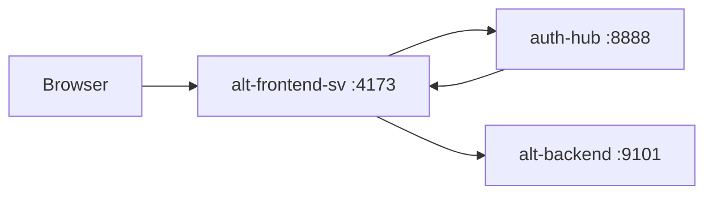

# alt-frontend-sv

SvelteKit frontend for the Alt platform, serving desktop and mobile experiences under the `/sv` base path.

## Tech Stack

| Component | Technology |
|-----------|------------|
| Framework | SvelteKit 2.49 + Svelte 5.46 |
| Runtime | Bun 1.x |
| Styling | TailwindCSS v4 + bits-ui |
| API | Connect-RPC + REST |
| Auth | Ory Kratos via auth-hub |
| Testing | Vitest (unit) + Playwright (E2E) |
| Lint/Format | Biome |

## Quick Start

```bash
# Install dependencies
bun install

# Start development server
bun dev

# Build for production
bun run build

# Type check
bun run check

# Run tests
bun test              # Unit tests
bun run test:e2e      # E2E tests (requires stack running)

# Lint and format
bun run lint
bun run format
```

## Architecture

### Routes Structure

```
src/routes/
├── +page.svelte           # Landing page
├── login/                 # Authentication
├── register/
├── sv/
│   ├── home/              # Desktop dashboard
│   ├── mobile/            # Mobile feed reader
│   └── dashboard/         # System administration
└── api/                   # SvelteKit API endpoints
```

### State Management

Uses **Svelte 5 Runes** exclusively:
- `$state()` for reactive state
- `$derived()` for computed values
- `$effect()` for side effects
- `$props()` for component props

### API Integration

1. Frontend sends requests with session cookie
2. `api.ts` exchanges cookie for JWT via auth-hub
3. Requests include `X-Alt-Backend-Token` header
4. Backend validates JWT and processes request



## Configuration

| Variable | Purpose |
|----------|---------|
| `BACKEND_BASE_URL` | Backend URL for SSR (e.g., `http://alt-backend:9000`) |
| `BACKEND_CONNECT_URL` | Connect-RPC URL (e.g., `http://alt-backend:9101`) |
| `AUTH_HUB_INTERNAL_URL` | Token exchange URL (e.g., `http://auth-hub:8888`) |
| `KRATOS_INTERNAL_URL` | Kratos URL for session validation |
| `KRATOS_PUBLIC_URL` | Public Kratos URL for redirects |

## Development Notes

- **Base Path**: App runs under `/sv`. All links must account for this.
- **Runes Only**: Do not use legacy `export let` or `$:` syntax.
- **TailwindCSS v4**: CSS-first configuration in `src/app.css`.
- **SSR vs CSR**: Data loading in `+page.server.ts` (SSR), client interactions via `api.ts`.

## Related Documentation

- [Architecture Details](../docs/services/alt-frontend-sv.md)
- [Project CLAUDE.md](../CLAUDE.md)
