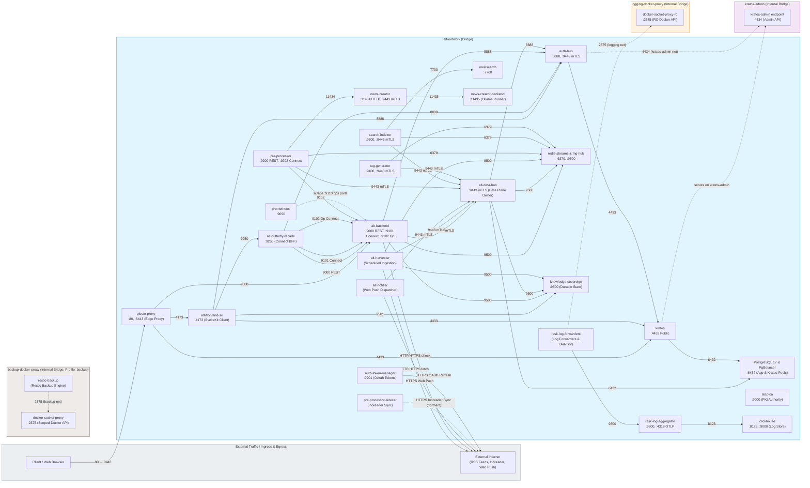

# Alt Project — Skaffold-Orchestrated Kubernetes Architecture (Layers 01–07)

A consolidated, code-backed technical deep dive of the Alt project as containerized and orchestrated on Kubernetes through Skaffold up to Layer 07. This document synthesizes Skaffold configs, Helm charts, Kubernetes NetworkPolicies, and core service source code to provide a clear, security-first architectural overview with actionable detail.

## Table of Contents
- 1. Scope and Reading Guide
- 2. High-Level Architecture
- 3. Layers 01–07 at a Glance
- 4. Skaffold Orchestration Model
- 5. Namespaces and Core Services
- 6. Security Model (Zero Trust + Mesh)
- 7. Data and Control Flows
- 8. Source Code Topology (by Service)
- 9. Operations and Profiles
- 10. Mermaid Network Diagram
- 11. Ports and Endpoints Reference
- 12. Assumptions and Traceability

---

## 1. Scope and Reading Guide
- This document covers Alt’s Kubernetes deployment up to Layer 07 as defined in `skaffold/` and corresponding Helm charts under each layer.
- Evidence is drawn from Skaffold configs, Helm values/templates, and service source code where relevant. File paths are included so you can jump to definitions.
- Security posture (NetworkPolicy, namespace isolation, Linkerd) is summarized from `skaffold/01-foundation/charts/network-policies/` and service-level NetworkPolicies.

## 2. High-Level Architecture
- Architecture Style: Multi-namespace, microservice-based system on Kubernetes, managed via Skaffold and Helm.
- Core Domains:
  - Application (alt-frontend, alt-backend, envoy-proxy)
  - Authentication (auth-service + Ory Kratos)
  - Data Platform (PostgreSQL, ClickHouse, Meilisearch)
  - Processing Pipeline (pre-processor, tag-generator, search-indexer, news-creator, pre-processor-sidecar, auth-token-manager)
- Service Mesh & Zero Trust:
  - Default-deny NetworkPolicies by namespace with explicit cross-namespace allows.
  - Linkerd service mesh used for mTLS and traffic policy in multiple services.
  - Outbound access for sensitive services is constrained to `envoy-proxy` (egress gateway pattern).

## 3. Layers 01–07 at a Glance
- Layer 01 — Foundation: Cert-manager, shared config/secrets, strict network policies, namespace isolation, Linkerd allowances.
  - Skaffold: `skaffold/01-foundation/skaffold.yaml`
  - Policies: `skaffold/01-foundation/charts/network-policies/templates/*.yaml`
- Layer 02 — Infrastructure: PostgreSQL (app DB), PostgreSQL for Kratos/Auth, ClickHouse, Meilisearch.
  - Skaffold: `skaffold/02-infrastructure/skaffold.yaml`
  - Charts: `skaffold/02-infrastructure/charts/*`
- Layer 04 — Core Services: `alt-backend`, `envoy-proxy`, optional sidecar-proxy.
  - Skaffold: `skaffold/04-core-services/skaffold.yaml`
- Layer 05 — Auth Platform: `auth-service` (Go) and `kratos`.
  - Skaffold: `skaffold/05-auth-platform/skaffold.yaml`
- Layer 06 — Application: `alt-frontend`, `nginx-external` (ingress/egress gateway).
  - Skaffold: `skaffold/06-application/skaffold.yaml`
- Layer 07 — Processing: `pre-processor`, `pre-processor-sidecar`, `search-indexer`, `tag-generator`, `news-creator`, `auth-token-manager`.
  - Skaffold: `skaffold/07-processing/skaffold.yaml`

Dependency order is enforced by `skaffold/skaffold.yaml` `requires` chain. Profiles (`dev`, `staging`, `prod`) selectively activate sub-configs per layer.

## 4. Skaffold Orchestration Model
- Entry Config: `skaffold/skaffold.yaml`
  - `requires` orchestrates layer order: 01 → 02 → 04 → 05 → 06 → 07 → 08.
  - Helm flags include `--atomic`, `--wait`, and extended timeouts; status checks are enabled.
- Per-Layer Configs:
  - Build: Local by default; images tagged via `gitCommit` and injected into Helm via `setValueTemplates` (e.g., `image.repository`, `image.tag`).
  - Deploy: Helm releases per service; namespaces created as needed via Skaffold.
- Profiles:
  - Dev: Optimized for kind/local clusters, `image.pullPolicy: Never` on many services, `tryImportMissing: true`.
  - Staging/Prod: Same structure with appropriate values overrides; some layers define only `prod`.

## 5. Namespaces and Core Services
- alt-apps: `alt-backend`, `envoy-proxy`, `alt-frontend` (via Layer 06), optional `sidecar-proxy`.
- alt-auth: `auth-service`, `kratos`, `auth-postgres`, `kratos-postgres`.
- alt-database: `postgres` for application data.
- alt-search: `meilisearch`.
- alt-analytics: `clickhouse`.
- alt-processing: `pre-processor`, `pre-processor-sidecar`, `search-indexer`, `tag-generator`, `news-creator`, `auth-token-manager`.
- alt-ingress: `nginx-external` and Cloudflare tunnel integration.
- linkerd: control plane (mesh allowances in policies).

## 6. Security Model (Zero Trust + Mesh)
- Default Deny by Namespace: `namespace-isolation-policies.yaml` introduces default deny for ingress and egress across `alt-apps`, `alt-database`, `alt-search`, `alt-processing`, `alt-operations` plus DNS egress allowances.
- Cross-Namespace Policies:
  - alt-processing → alt-apps `envoy-proxy` for egress on 8085/8081/8080/9901.
  - `pre-processor` egress strictly via `envoy-proxy`; direct external egress is denied.
  - `news-creator` may egress to `envoy-proxy:8082` for external HTTPS APIs.
  - `search-indexer` egress to `meilisearch` in `alt-search:7700`.
  - `kratos` ↔ `auth-postgres` egress/ingress allowed within `alt-auth`.
  - `alt-frontend` → `kratos` ingress allowed on 4433.
- Service-Level NetworkPolicies (Layer 07):
  - `pre-processor` ingress from `alt-apps`; egress to `alt-database:5432`, `news-creator:11434`, Linkerd, and `envoy-proxy:8085` only.
  - `search-indexer` ingress from `alt-apps` and `alt-ingress`; egress to `alt-database:5432` and `alt-search:7700`.
  - `tag-generator` egress to `alt-database:5432`.
  - `news-creator` ingress from `alt-apps` and `alt-processing`; egress to `auth-service:8080`, `alt-backend:8080`, `alt-database:5432`, `envoy-proxy:8082`, and Linkerd control-plane ports.
  - `pre-processor-sidecar` egress to DNS, `alt-database:5432`, Linkerd, and `envoy-proxy:8081` (explicit forward proxy for OAuth flows).
- Mesh: Many pods have `linkerd.io/inject: enabled`; policies include egress to Linkerd control-plane ports for identity/policy/destination.

## 7. Data and Control Flows
- User/Auth:
  - `alt-frontend` authenticates against `kratos` (NetworkPolicy on 4433) and consumes `auth-service` APIs (`/v1/*`, port 8080).
  - `auth-service` uses PostgreSQL (`auth-postgres` in `alt-auth` namespace); Kratos also connects to its Postgres.
- Application:
  - `alt-backend` serves API on 9000, consumes `auth-service` (`AUTH_SERVICE_URL`) and the application Postgres in `alt-database`.
  - Outbound egress to the public Internet is via `envoy-proxy` acting as an egress gateway.
- Processing Pipeline:
  - `pre-processor` (9200) reads application Postgres and calls `news-creator:11434` for LLM-backed summarization.
  - `tag-generator` (9400) persists to Postgres and leverages `news-creator` (`OLLAMA_HOST`) for model inference.
  - `search-indexer` (9300) indexes/searches via `meilisearch:7700` and reads from Postgres.
  - `auth-token-manager` provisions OAuth tokens and stores them into a Secret, egressing via proxy only.

## 8. Source Code Topology (by Service)

### 8.1 auth-service (Go)
- Entrypoints/Router: `auth-service/app/rest/router.go`
  - Routes under `/v1` include health (`/health`, `/ready`, `/live`), auth (`/auth/login`, `/auth/register`, `/auth/csrf`, `/auth/logout`, `/auth/refresh`, `/auth/validate`), and user management (`/v1/user/*`).
  - Middleware: security headers, rate limiting, CSRF protection, IDS-like analyzer, CORS, RequestID.
- Persistence: PostgreSQL in `alt-auth`; migrations under `auth-service/migrations/` and `auth-service/schema/`.
- Identity: Integrates with Ory Kratos (`auth-service/app/driver/kratos/*`).
- K8s Ports: `service.targetPort: 8080`; NetworkPolicy allows ingress from `alt-auth`, `alt-database`, `alt-apps` (see `values.yaml`).

### 8.2 alt-backend (Go)
- API: Handlers under `alt-backend/app/rest/*` (articles, feeds, images, SSE, schema, utils). Listens on `9000`.
- Middleware: auth, CSRF, validation, request-id, logging, DoS protection.
- Persistence: application Postgres in `alt-database`.
- Upstream Auth: `AUTH_SERVICE_URL` targets `auth-service.alt-auth.svc.cluster.local:8080`.
- Mesh/Proxy: Linkerd injection enabled; proxy knobs for `envoy-proxy` and sidecar-proxy exposed via env vars and Helm values.

### 8.3 pre-processor (Go)
- Entrypoint: `pre-processor/app/main.go` initializes repos/services, starts background jobs for summarization and quality checks; calls `news-creator` via configured host.
- Data Access: Reads/writes PostgreSQL using prepared statements and batch ops under `pre-processor/app/driver/*`.
- Outbound Policy: All external egress through `envoy-proxy:8085`; direct external access is blocked by NetworkPolicy.
- K8s Ports: `service.targetPort: 9200`; ingress from `alt-apps`.

### 8.4 search-indexer (Go)
- HTTP Server: `search-indexer/app/server/server.go`; exposes `/v1/search`.
- External: Uses Meilisearch client (`github.com/meilisearch/meilisearch-go`).
- K8s Ports: `service.targetPort: 9300`; egress to `alt-search:7700` (Meilisearch) and to Postgres.

### 8.5 tag-generator (Python)
- Workload: Generates tags with an LLM via `news-creator` (`OLLAMA_HOST`), persists results to Postgres.
- K8s Ports: `service.targetPort: 9400`.
- Storage: Ephemeral caches/venv volumes configured in values.

### 8.6 news-creator (LLM runtime)
- Port: `11434` (Ollama-style service).
- Ingress: from `alt-apps` and `alt-processing`.
- Egress: to `auth-service:8080`, `alt-backend:8080`, Postgres, and external HTTPS via `envoy-proxy:8082`.
- Mesh: Linkerd injected; health probes bypass proxy on 11434.

### 8.7 pre-processor-sidecar (CronJob)
- Role: OAuth-enabled sidecar for pre-processor networking; egress only, proxy-enforced via `envoy-proxy:8081` for Inoreader.

### 8.8 auth-token-manager (Node/Deno)
- Role: Automates OAuth login/refresh for Inoreader; writes tokens to Secrets in `alt-processing`.
- Network: Forced to use Envoy proxy; no direct external egress.

## 9. Operations and Profiles
- Build + Deploy (root): `skaffold run -p dev|staging|prod`
- Layered deploys when needed (examples):
  - Foundation: `cd skaffold/01-foundation && skaffold run -p prod`
  - Infrastructure: `cd skaffold/02-infrastructure && skaffold run -p prod`
  - Processing: `cd skaffold/07-processing && skaffold run -p dev`
- Image Tagging: Skaffold injects Git-derived tags into Helm (`setValueTemplates`) to guarantee the deployed image version matches the built artifact.
- Timeouts/Status: Long Helm timeouts and Helm `--atomic --wait` for StatefulSets (DBs, Meilisearch, ClickHouse).

## 10. Mermaid Network Diagram
Derived from Docker Compose network topologies, service definitions, published port mappings, and upstream service addresses across the Compose stacks (`compose/compose.yaml` and included `compose/*.yaml`).

Notes:
- Networks: The stack runs on four Docker Compose bridge networks. `alt-network` is a named bridge network interconnecting application services, storage, and telemetry. Three internal-only bridge networks enforce isolation: `kratos-admin` isolates the Ory Kratos administrative endpoint (`:4434`) so only `auth-hub` can access it; `logging-docker-proxy` restricts read-only Docker socket API access (`:2375`) to log forwarders and cAdvisor; `backup-docker-proxy` restricts scoped Docker socket API access (`:2375`) to `restic-backup` under the `backup` Compose profile.
- Collapsed and Omitted Services: To maintain readability, dedicated service databases (`db`, `kratos-db`, `pre-processor-db`, `knowledge-sovereign-db`, `rag-db`, `recap-db`, `acolyte-db`, `pact-db`), connection poolers (`pgbouncer`, `pgbouncer-kratos`), and migration jobs are collapsed into their respective owners or summarized under the PostgreSQL node. Peripheral workloads that all sit on `alt-network` (`rag-orchestrator`, `recap-worker`, `recap-subworker`, `recap-evaluator`, `dashboard`, `acolyte-orchestrator`, `knowledge-embedder-local`, `rerank-local`, and `redis-cache`) as well as auxiliary testing/metrics tools (`pact-broker`, `grafana`, `alertmanager`) are omitted. All 16 per-service `rask-log-forwarder` containers are collapsed into a single forwarder block.
- Metrics Scraping: Prometheus scrapes every service's `:9110` ops port plus `mq-hub:9500` and `knowledge-sovereign:9501` (`observability/prometheus/prometheus.yml`); this is illustrated by a representative scrape edge to `alt-backend`.
- Backup Mechanism: `restic-backup` runs `pg_dump` via `docker exec` through the scoped Docker socket proxy (`docker-socket-proxy:2375`), so no direct network path to PostgreSQL exists.
- In-Process mTLS and Zero Trust: Linkerd service mesh has been removed. Inter-service confidentiality and authentication are provided via in-process mTLS. Services automatically enroll with `step-ca` (:9000) at startup (without sidecars); `alt-data-hub` (:9443) acts as the central mTLS data plane gatekeeper for application state.
- Outbound Internet Access: The legacy Envoy egress proxy has been eliminated. External internet egress is conducted directly over HTTPS/HTTP by dedicated fetcher and dispatcher services (`alt-harvester` for RSS feeds and OGP images, `alt-backend` for feed validation and archiving, `pre-processor-sidecar` for Inoreader sync which is dormant by default with `INOREADER_SYNC=disabled`, `auth-token-manager` for Inoreader OAuth token lifecycle, and `alt-notifier` for Web Push delivery).

## 11. Ports and Endpoints Reference
- alt-backend: `9000` (health `/v1/health`, app APIs under `/v1/*`).
- auth-service: `8080` (health `/v1/health`, auth `/v1/auth/*`, user `/v1/user/*`).
- kratos: public `4433`.
- pre-processor: `9200`.
- search-indexer: `9300` (`/v1/search`).
- tag-generator: `9400`.
- news-creator: `11434` (Ollama-compatible TCP health/readiness).
- envoy-proxy: `8080` (proxy), `8081` (explicit HTTP proxy), `8082` (HTTPS egress), `8085` (sidecar proxy), `9901` (admin/metrics).
- meilisearch: `7700`.
- postgres: `5432`.

## 12. Assumptions and Traceability
- NetworkPolicy sources:
  - Layer 01 foundation policies: `skaffold/01-foundation/charts/network-policies/templates/*`.
  - Service NetworkPolicies: Layer 05 (`auth-service`) and Layer 07 (processing charts).
- Skaffold layering and profiles:
  - Root orchestrator: `skaffold/skaffold.yaml` `requires` chain and profiles.
  - Per-layer configs reference Helm charts and image tag injection via `setValueTemplates`.
- Source code pointers:
  - `auth-service/app/rest/router.go` — routes, middleware, and security posture.
  - `pre-processor/app/main.go` — job scheduler and dependency calls.
  - `search-indexer/app/server/server.go` — HTTP server and Meilisearch integration.
  - `alt-backend/app/rest/*.go` — handlers and middleware.
- Where behavior is inferred, it is constrained to what manifests and code clearly express (e.g., ports, upstream URLs, policies). Unspecified runtime paths are left out to avoid speculation.

---

This document targets high-confidence, operator-ready understanding while remaining close to the repository’s truth. For questions or desired extensions (e.g., 08-operations, SLOs, or runbooks), open an issue and we can append follow-up sections.
