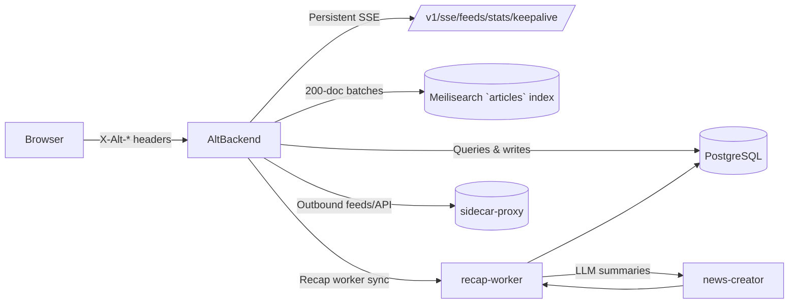

# Alt Backend

_Last reviewed: November 17, 2025_

**Location:** `alt-backend/app`

## Role
- Primary Go 1.24+ HTTP API that exposes feeds/articles/recaps/SSE, orchestrates background recap jobs, and keeps Clean Architecture boundaries between REST → Usecase → Port → Gateway → Driver.
- Gatekeeper for rich features such as SSE fan-out, service-to-service recap ingestion, search synchronization, and configurable DOS protection.
- Outbound requests go through `sidecar-proxy`, which enforces TLS, allowlists, and shared timeouts.

## Architecture Snapshot
| Layer | Notes |
| --- | --- |
| REST handlers (`rest/routes.go`, `rest/*`) | Ten ordered middlewares: request ID → recovery → secure headers → CORS → DOS guard → timeout (skips `/sse/`) → validation → logging → gzip. Routes split into feeds, articles, SSE, images, recap, security. |
| Usecases / Jobs (`usecase/*`, `job/hourly_job.go`) | Each usecase exposes constructors that accept port interfaces; `job.HourlyJobRunner` reuses DI container to trigger hourly recap refresh + search sync. |
| Ports → Gateways | Contracts live under `port/*`; gateways translate domain entities to Postgres/Meilisearch DTOs before hitting drivers. |
| Drivers | `driver/alt_db` connects to Postgres, `driver/search_indexer` calls Meilisearch, `utils/secure_http_client.go` wraps outbound requests via `sidecar-proxy`. |
| DI | `di/container.go` wires repositories, services, schedulers, and middleware helpers; reuse the same container in jobs to keep lifecycle consistent. |

## Routes, Streaming, and Recap Contracts
- **Public APIs**:
  - `GET /v1/articles/*`, `POST /v1/feeds/*`, `GET /v1/search`, `GET /v1/health`, `/security/csp-report`.
  - `/v1/sse/feeds/stats` keeps a long-lived SSE connection: heartbeat every 10s, tickers every `SERVER_SSE_INTERVAL`, and flushes `feedAmount`, `unsummarizedFeedAmount`, and `articleAmount` metrics via `UnsummarizedFeedStatsSummary`.
- **Recap endpoints**:
  - `POST /v1/recap/articles` (service auth via `middleware_custom.NewServiceAuthMiddleware`, `X-Service-Token` + env `ALT_BACKEND_SERVICE_TOKEN`). Validates `from`/`to` (RFC3339), optional `page`, `page_size`, `fields`, `lang`. Shared `recapRateLimiter` emits `X-RateLimit-*` headers and rejects bursts with `Retry-After`.
  - `GET /v1/recap/7days` (public) uses `RecapUsecase` to return `RecapSummary` + `EvidenceLinks` shaped by domain models.
- **Middleware**: DOS protection whitelists `/v1/health`, `/v1/sse/*`, `/security/csp-report`; `middleware_custom.ValidationMiddleware` ensures request payloads stay tidy.

## Integrations & Data Flow
- **Postgres driver** (`driver/alt_db`) wraps `pgx/v5` pools with prepared statements; domain invariants guard duplicates (e.g., `domain/feed_reading_status.go`).
- **Meilisearch sync**: Gateways notify `driver/search_indexer` after article mutations; `JobRunner` triggers search-indexer refreshes during the hourly job.
- **Recap orchestration**: `RecapGateway` (`RECAP_WORKER_URL`) talks to `/v1/recap/7days`, converts responses into domain structs, and surfaces them through `RecapHandler` + `recap_articles_usecase`.
- **SSE**: `/v1/sse/feeds/stats` uses `container.FeedAmountUsecase`, `UnsummarizedArticlesCountUsecase`, `TotalArticlesCountUsecase`; ticker/heartbeat ensures watchers stay connected while `flusher.Flush()` keeps SSE live.
- **Security**: Service tokens, rate limit headers, and fallback to `handleValidationError` keep responses consistent.

## Configuration / Environment
- `ServerConfig`: `SERVER_PORT`, timeouts, `SERVER_SSE_INTERVAL`.
- `RecapConfig`: `RECAP_DEFAULT_PAGE_SIZE`, `RECAP_RATE_LIMIT_{RPS,BURST}`, `RECAP_MAX_RANGE_DAYS`, `RECAP_MAX_ARTICLE_BYTES`.
- `RateLimitConfig`: `RATE_LIMIT_EXTERNAL_API_INTERVAL` (≥5s between host hits), `DOS_PROTECTION_*`.
- `PreProcessor`: `PRE_PROCESSOR_URL` used for health checks.
- `Database`: `DB_*` connection pool settings plus compatibility fields (`ALT_DB_DSN`, `SEARCH_INDEXER_HOST`).
- Logging/middleware uses `LOG_LEVEL`, `LOG_FORMAT`, while `sidecar-proxy` settings (`SIDECAR_PROXY_BASE_URL`) govern outbound fetches.

## Testing & Tooling
- `go test ./...` (table-driven + `pgxmock`/`gomock` fakes).
- SSE handler tests cover tickers and heartbeats via `httptest` helpers.
- Run `make generate-mocks` after altering interfaces.
- Optional `golangci-lint run` for linting and `go test ./job -run TestHourlyJob` to cover orchestration.

## Operational Notes
1. Health check: `curl http://localhost:9000/v1/health`.
2. Jobs: `job/hourly_job.go` reruns recap refresh; if Recap data stalls, restart `go run ./cmd/job_runner`.
3. Schema drift: `make db-migrate` plus driver tests to ensure new columns propagate.
4. SSE load: watch `sse` logs for throttle reasons; large fan-outs go through rate-limiter and `SetRateLimitHeaders`.

## Observability & Logs
- Structured `log/slog` events include `route`, `tenant_id`, `request_id`, `operation` fields.
- Emit histograms via `utils/logger/metrics.go` for endpoints like `feeds.register.success`, `articles.fetch.duration_ms`, `recap_articles`.
- Feature flags guard SSE and recap pushes (`SSE_RECAP_ENABLED=false` to quiet streaming).

## LLM Notes
- Mention middleware order (RequestID → Recovery → Secure → CORS → DOS → Timeout → Validation → Log → Gzip) when generating new handlers.
- Provide DTO names (`domain/recap.go`, `rest/recap_handlers.go`) so schemas stay stable.
- Clarify if work occurs inside REST handler path or job (`job/hourly_job.go` uses the same DI container).
