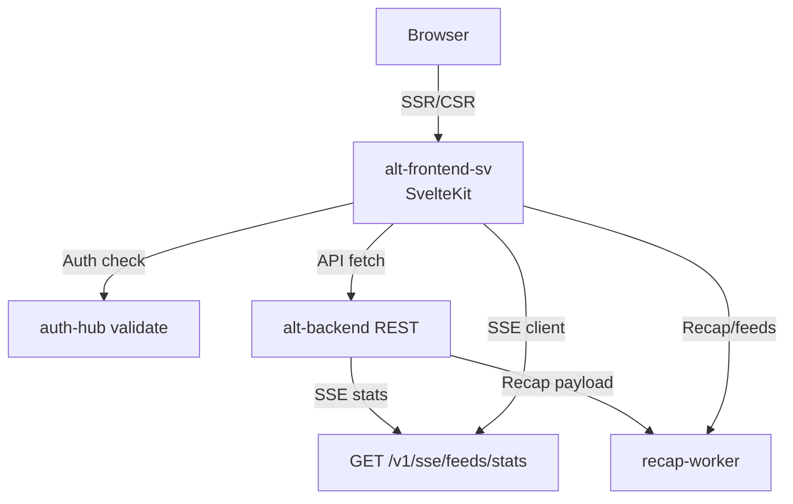

# Alt Frontend SV

_Last reviewed: December 4, 2025_

**Location:** `alt-frontend-sv`

## Role
- SvelteKit (Svelte 5) + Vite application serving as the modern replacement for the Next.js frontend (`alt-frontend`).
- Provides desktop and mobile dashboards, authentication flows (Ory Kratos), and feed consumption experiences.
- Focuses on performance, reduced bundle size, and improved developer experience using Svelte 5 runes and TailwindCSS v4.

## Architecture & Layer Diagram
| Area | Details |
| --- | --- |
| Routing tree | `src/routes` defines the file-system based routing. Key routes: `/`, `/home`, `/mobile`, `/login`, `/register`. API routes under `src/routes/api`. |
| Data layer | `src/lib/api` contains API clients. `src/routes/+page.server.ts` handles server-side data fetching (Load functions). |
| State | Svelte 5 Runes for local state, `src/lib/stores` for global state, TanStack Query for server state management. |
| Middleware | `src/hooks.server.ts` intercepts requests to validate sessions using `@ory/client` and handles authentication checks. |
| Styling | TailwindCSS v4 with `bits-ui` and `lucide-svelte` for icons. |

## Routing & Middleware Details
- `src/hooks.server.ts` intercepts requests to validate sessions using `@ory/client`.
- Protected routes redirect to `/login` if no valid session is found.
- Layouts (`+layout.svelte`) provide common UI structures (headers, sidebars).
- `src/routes/api` handles internal API endpoints.

## Tooling & Tests
- Scripts (see `package.json`):
  - `pnpm dev`: Start Vite dev server.
  - `pnpm build`: Build for production (using `@sveltejs/adapter-node`).
  - `pnpm check`: Run `svelte-check` for TypeScript validation.
  - `pnpm lint` / `pnpm format`: Run Biome for linting and formatting.
- Dependencies:
  - `svelte@5`: UI framework (Runes mode).
  - `tailwindcss@4`: Styling.
  - `@ory/client`: Authentication.
  - `@tanstack/svelte-query`: Data fetching and caching.
  - `@sveltejs/adapter-node`: Node.js adapter for deployment.

## Runbook & Ops
1. `pnpm -C alt-frontend-sv dev` for local development.
2. `pnpm -C alt-frontend-sv build` to generate the production build.
3. `pnpm -C alt-frontend-sv check` for type checking.
4. `pnpm -C alt-frontend-sv lint` to check for code style issues.

## Accessibility & Performance
- Utilizes Svelte's built-in accessibility warnings during development.
- TailwindCSS for efficient, atomic CSS generation.
- Server-side rendering (SSR) for fast initial load and SEO.
- Progressive enhancement via SvelteKit form actions.

## LLM Notes
- **Svelte 5 Runes**: Use `$state`, `$derived`, `$effect`, `$props` for all new components.
- **TailwindCSS v4**: Use the new engine and configuration.
- **Directory Structure**:
  - `src/routes`: Pages and API endpoints.
  - `src/lib/components`: Reusable UI components.
  - `src/lib/api`: API clients and data fetching logic.
  - `src/lib/utils`: Helper functions.
- **Authentication**: Rely on `src/hooks.server.ts` and `locals.session` for auth state.
