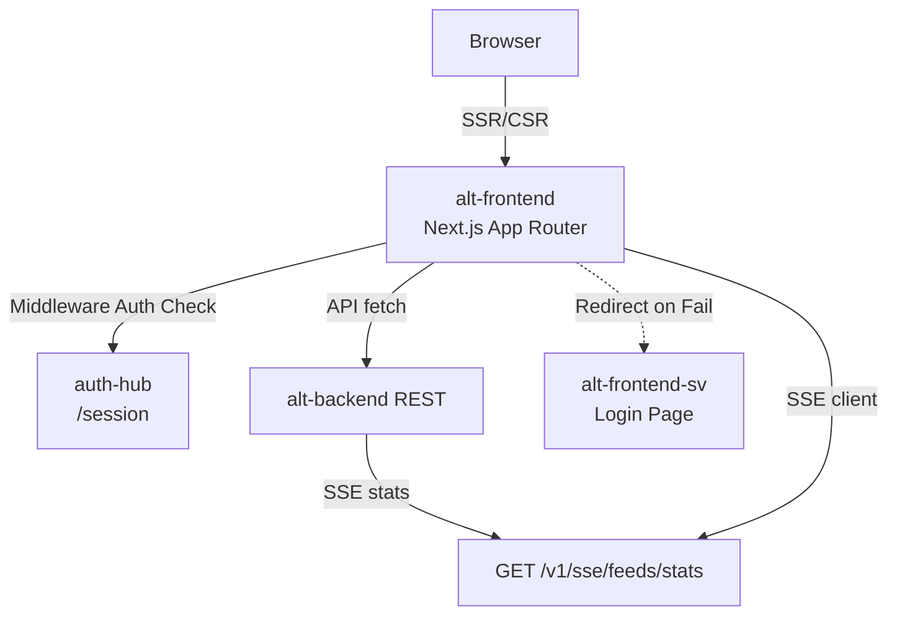

# Alt Frontend

_Last reviewed: December 18, 2025_

**Location:** `alt-frontend`

## Role
- **Next.js 16 + React 19 App Router**: The primary web application rendering the platform's UI.
- **Unified Interface**: Renders desktop and mobile dashboards, command palettes, and auth flows.
- **Gateway**: Acts as a thin client to `alt-backend`, managing SSR, optimistic UI, and auth states.
- **Strict Compliance**: Enforces TypeScript 5.9 strict mode and WCAG 2.1 AA accessibility standards.

## Architecture Snapshot

| Layer | Details |
| --- | --- |
| **Routing** | **App Router** (`src/app`). <br>- `(auth)`: Login/Register flows.<br>- `desktop`, `mobile`: Device-specific layouts.<br>- `api`: Internal API routes.<br>- `public`: Landing pages. |
| **State** | **SWR** for server state caching/revalidation. `src/hooks` contains custom hooks. Context providers in `src/providers.tsx` (Theme, Auth). |
| **Data Layer** | `src/lib/api/*`: centralized REST clients.<br>- `ApiClient`: Core HTTP client with `AuthInterceptor`.<br>- `serverFetch`: Utility for Server Components to forward cookies/headers to backend. |
| **Middleware** | `src/middleware.ts`: Validates `ory_kratos_session` via `auth-hub`. Redirects unauthenticated users to `/sv/auth/login` (SvelteKit auth flow) if session is invalid. |
| **Styling** | **Chakra UI** (React 19 compatible) + CSS Modules (`globals.css`) for global styles. |



## Key Directories

- `src/app`:
    - `(auth)`: Authentication related pages (deprecated/redirects to SV).
    - `desktop`: Desktop-specific dashboard views.
    - `mobile`: Mobile-specific views (swipeable feeds).
    - `api`: Next.js API Routes (e.g., `/api/auth/logout`).
- `src/lib`:
    - `api`: Typed API clients (`ArticleApi`, `FeedApi`) wrapping `fetch`.
    - `hooks`: Custom React hooks (e.g., `useRecapData`).
- `src/middleware.ts`: Edge middleware for authentication and routing protection.

## Configuration
- **Next.js Config** (`next.config.ts`): Configures experimental features and rewrites.
- **Environment**:
    - `NEXT_PUBLIC_API_BASE_URL`: Browser-side backend URL.
    - `NEXT_PUBLIC_APP_ORIGIN`: Public origin for redirects.
    - `AUTH_HUB_INTERNAL_URL`: Internal URL for session validation (e.g., `http://auth-hub:8888`).
    - `INTERNAL_API_BASE_URL`: Server-side backend URL (e.g., `http://alt-backend:9000`).

## Development

### Prerequisites
- Node.js 24 (as per `package.json` engines)
- pnpm 10+

### Commands
```bash
# Start development server
pnpm dev

# Build for production
pnpm build

# Type check
pnpm typecheck

# Lint
pnpm lint

# E2E Tests (Playwright)
pnpm test:e2e:chrome
```

### LLM / Dev Notes
- **React 19**: This project uses React 19. Be usage of new hooks (`use`, `useActionState`, etc.) if applicable, but standard SWR patterns are preferred for data fetching.
- **Server Components**: Default to Server Components. Add `'use client'` only when interactive features (hooks, event listeners) are needed.
- **Auth Redirects**: Auth failures in middleware redirect to the SvelteKit frontend (`/sv/auth/login`) which handles the actual Kratos login flow.
- **API Clients**: Use the singleton instances exported from `src/lib/api/index.ts` (e.g., `feedApi`, `articleApi`) instead of raw `fetch`.
