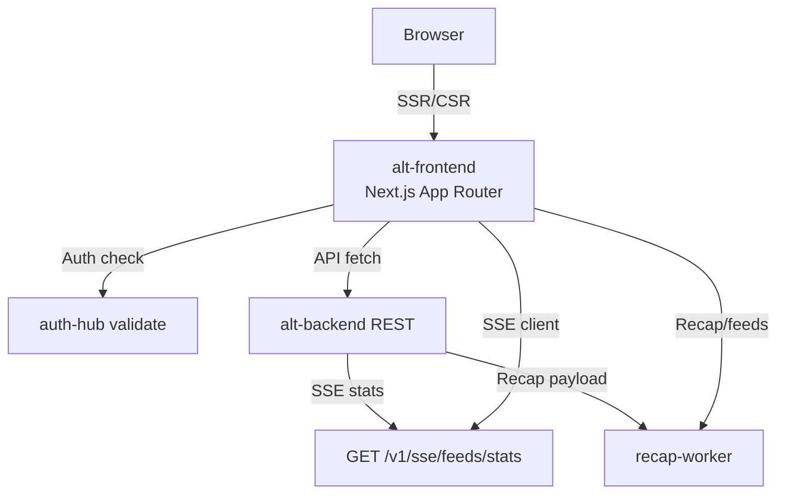

# Alt Frontend

_Last reviewed: November 17, 2025_

**Location:** `alt-frontend`

## Role
- Next.js 16 + React 19 App Router client that renders desktop/mobile dashboards, auth flows, and the `/mobile/recap/7days` experience with Chakra UI themes, server components, and SSE hydration.
- Acts as a thin gateway to backend services: it owns SSR rendering, command palette routing, optimistic UI, and graceful fallbacks when auth or SSE streams lag.
- Applies strict TypeScript (`tsconfig.json` + TypeScript 5.9) plus WCAG 2.1 AA guardrails before shipping builds.

## Architecture & Layer Diagram
| Area | Details |
| --- | --- |
| Routing tree | `src/app/layout.tsx` wires Chakra + theme + analytics. Subtrees include `home`, `desktop`, `mobile`, `(auth)`, `login`, `register`, `test`, `public`. API routes live under `src/app/api`. |
| Data layer | `src/lib/api/*` modules centralize REST fetches (articles, feeds, recap, desktop helpers) while `src/lib/server-fetch.ts` adds shared headers + error handling for server components. |
| State | `SWR` + custom hooks in `src/hooks` keep TTL short; providers in `src/providers.tsx` persist theme, analytics, experiments. |
| Middleware | `src/middleware.ts` uses a public route allowlist (landing pages, `/api`, `_next`) and calls `auth-hub/session` (via `AUTH_HUB_INTERNAL_URL`) to validate `ory_kratos_session`; failures redirect to `/public/landing` with `return_to`. |

## Routing & Middleware Details
- `src/middleware.ts` keeps `/api/debug/**` protected while allowing `/auth`, `/public/landing`, `/test/**`, `/static/**`, and `_next` assets. `PUBLIC_ROUTES` uses regex patterns and short-circuits auth when `NODE_ENV === "test"`.
- Session validation hits `auth-hub/session`, forwarding the raw `ory_kratos_session` cookie (also tolerant of `ory-kratos-session`). Errors fail closed (redirect to landing) with a 5s `fetch` timeout + `x-forwarded-*` headers.
- `src/app/home`, `src/app/desktop`, and `src/app/mobile` reuse atoms and shared layout slots; `mobile/recap/page.tsx` relies on `src/hooks/useRecapData` to call `GET /v1/recap/7days` and render `RecapCard`/`EvidenceList` components.
- Skylight controls (`src/app/test`, `src/app/public`) exist to support Playwright scenarios and landing experiments.

## Data & SSE Integrations
- REST clients in `src/lib/api/index.ts` (feeds, articles, desktop helpers, recap) wrap `fetch` with `ApiClientError` and `serverFetch` utilities that forward cookies + headers.
- `src/lib/apiSse.ts` implements `setupSSE` + `setupSSEWithReconnect`: SSE clients auto-reconnect with exponential backoff, only reset reconnection attempts after a valid payload, and parse `UnsummarizedFeedStatsSummary`. The `feedsApiSse` singleton exposes `getFeedsStats`.
- `src/lib/config.ts` defines default base URLs (`NEXT_PUBLIC_BASE_URL`, `NEXT_PUBLIC_API_BASE_URL`), while `env.public.ts` maps `NEXT_PUBLIC_*` envs consumed by App Router renders.
- `src/api.ts` re-exports `feedsApi`, `recapApi`, `articleApi`, `desktopApi`, and `serverFetch` so components simply import typed clients.

## Theming, Providers & UX
- `ThemeProvider.tsx` (under `src/providers.tsx`) wires the Vaporwave, Liquid-Beige, and Alt-Paper palettes. Color mode persists via Chakra + `next-themes`.
- `src/app/_server` includes analytics/tracker helpers; `scripts/ensure-default-stylesheet.mjs` runs post-build to guarantee baseline CSS exists before `next start`.
- Shared atoms/components under `src/components/desktop`, `src/components/mobile`, `src/components/layout/*` keep desktop/mobile experiences aligned.

## Tooling & Tests
- Scripts (see `package.json`):
  - `pnpm dev`, `pnpm build` (`node scripts/check-env.js && next build`, `postbuild` ensures default stylesheet).
  - `pnpm lint`, `pnpm fmt`, `pnpm typecheck`.
  - `pnpm test`/`pnpm test:unit` for Vitest, `pnpm test:e2e` (Playwright) requires `node tests/pre-test-setup.cjs`.
  - `pnpm test:e2e:chrome`, `:firefox`, `:errors`, `test:e2e:headed`, `test:ci` cover the full matrix.
  - `pnpm test:all` runs E2E + unit suites, `pnpm analyze` surfaces bundle sizes (`ANALYZE=true`).
- Testing layers: `src/__tests__` for unit, `tests/pages` for Playwright page objects + POM, `playwright/` includes fixtures, test hooks, and `tests/pre-test-setup.cjs`.
-
## Runbook & Ops
1. `pnpm -C alt-frontend dev` for local iteration (requires `.env` or `NEXT_PUBLIC_*` variables).
2. `pnpm -C alt-frontend test:e2e --project authenticated-chrome` after `make up`.
3. Build check: `NEXT_PHASE=analyze pnpm -C alt-frontend build`.
4. Clearing caches: delete `.next/`, `node_modules/.cache`, and rerun `pnpm install` if hydration fails.
5. Monitor `auth-hub` session headers — when cookies change, Next.js SSR may redirect to landing until cached pages expire.

## Accessibility & Performance
- Components must leverage Chakra’s `Stack`, accessible text, and `aria-*` props; use `React.Suspense` + skeletons for streaming routes.
- Streaming views (SSE stats, recap evidence) load data inside server components wherever possible to keep `LCP` < 2s; lazy load non-critical modules (`dynamic` with suspense).
- Tests run with `axe-playwright` in CI to guard against regressions.

## LLM Notes
- Specify whether generated UI belongs in a server component (`'use server'`), client component (add `'use client'`), or `page.tsx`; mistakes break hydration.
- Point LLMs at `src/app/home`, `src/lib/api`, or `src/hooks` so imports remain aligned with existing modules.
