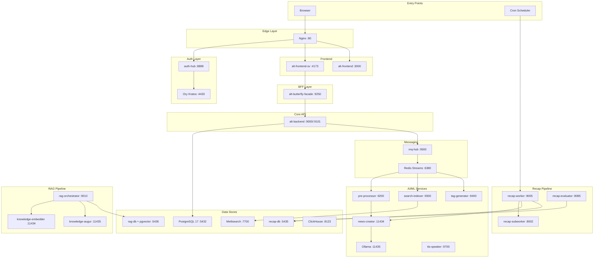
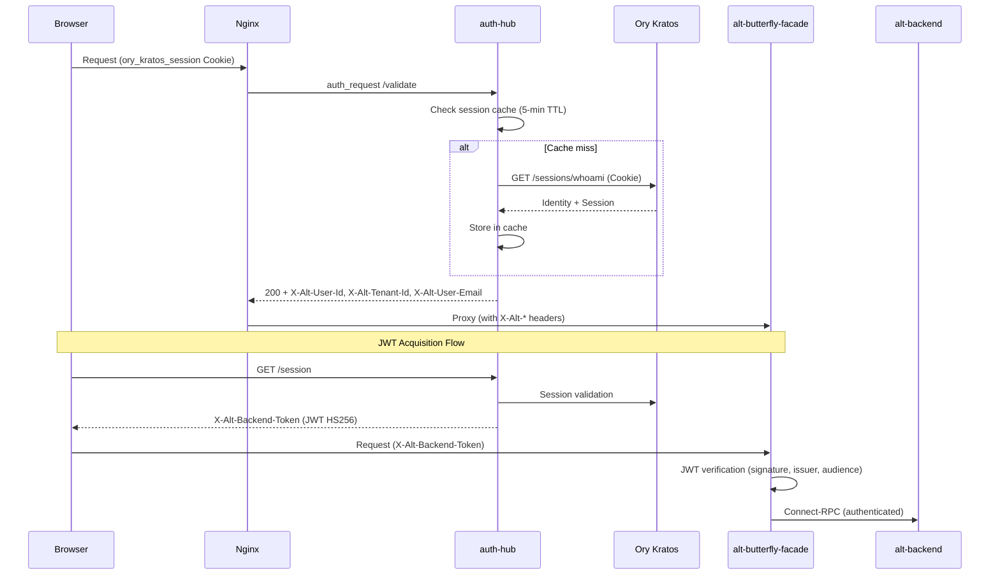
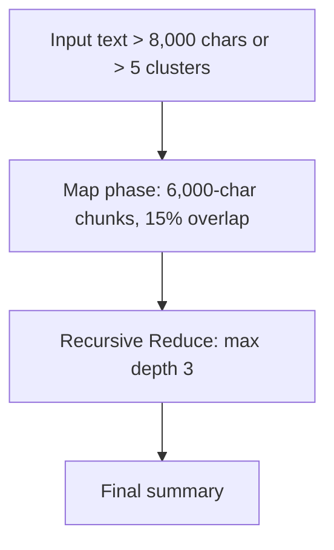
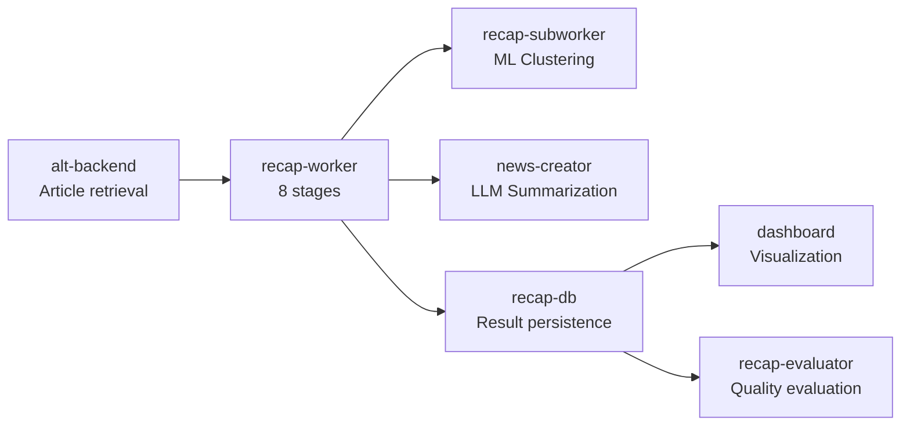
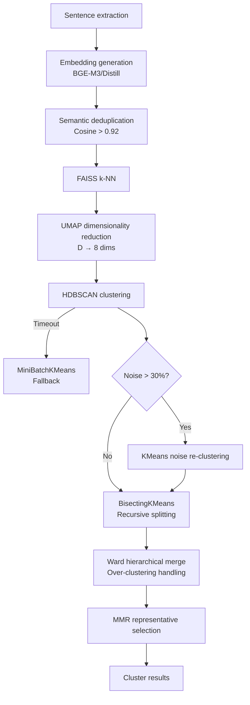
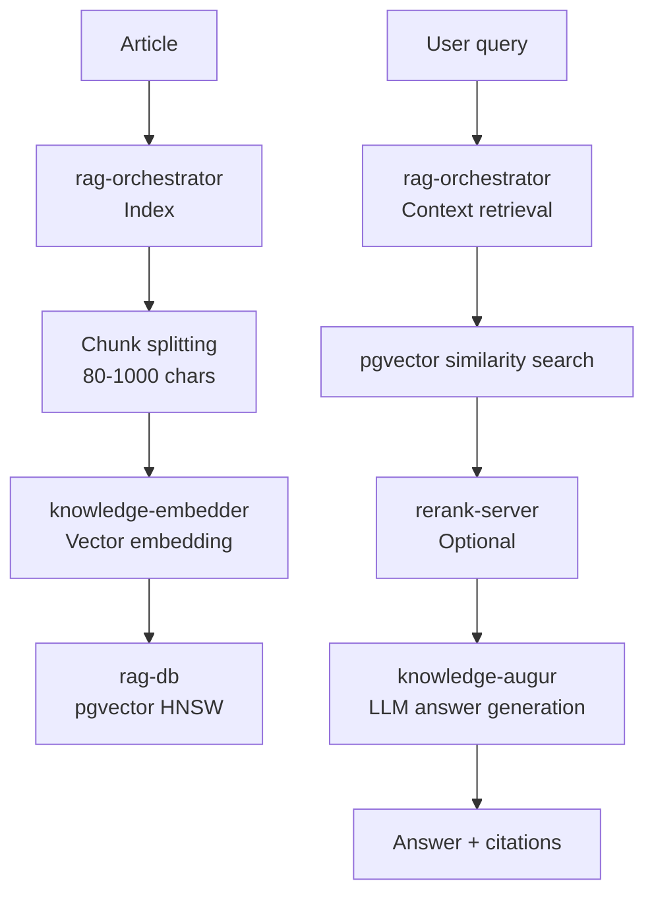

# Alt Platform — Comprehensive Microservices Guide

> AI-Augmented RSS Knowledge Platform
> Last updated: 2026-02-12

---

## Table of Contents

- [1. Platform Overview](#1-platform-overview)
  - [1.1 What is Alt](#11-what-is-alt)
  - [1.2 Technology Stack](#12-technology-stack)
  - [1.3 Architecture Principles](#13-architecture-principles)
  - [1.4 Overall Data Flow](#14-overall-data-flow)
  - [1.5 Service Quick Reference](#15-service-quick-reference)
- [2. Infrastructure Layer](#2-infrastructure-layer)
  - [2.1 Docker Compose Topology](#21-docker-compose-topology)
  - [2.2 Data Stores](#22-data-stores)
  - [2.3 Reverse Proxy (Nginx)](#23-reverse-proxy-nginx)
  - [2.4 Migration Management (Atlas)](#24-migration-management-atlas)
  - [2.5 Networks, Volumes, and Secrets](#25-networks-volumes-and-secrets)
  - [2.6 Backup Strategy](#26-backup-strategy)
- [3. Authentication and Security Layer](#3-authentication-and-security-layer)
  - [3.1 Authentication Architecture Overview](#31-authentication-architecture-overview)
  - [3.2 auth-hub (Go)](#32-auth-hub-go)
  - [3.3 Ory Kratos](#33-ory-kratos)
  - [3.4 auth-token-manager (Deno)](#34-auth-token-manager-deno)
  - [3.5 pre-processor-sidecar (Go)](#35-pre-processor-sidecar-go)
  - [3.6 Inter-Service Authentication Patterns](#36-inter-service-authentication-patterns)
- [4. Core API, BFF, and Frontend](#4-core-api-bff-and-frontend)
  - [4.1 alt-backend (Go) — Clean Architecture and API Reference](#41-alt-backend-go--clean-architecture-and-api-reference)
  - [4.2 alt-butterfly-facade (Go) — BFF](#42-alt-butterfly-facade-go--bff)
  - [4.3 mq-hub (Go) — Event Broker](#43-mq-hub-go--event-broker)
  - [4.4 alt-frontend-sv (SvelteKit) — Primary UI](#44-alt-frontend-sv-sveltekit--primary-ui)
  - [4.5 alt-frontend (Next.js) — Legacy UI](#45-alt-frontend-nextjs--legacy-ui)
  - [4.6 Protocol Buffers Definitions](#46-protocol-buffers-definitions)
- [5. AI/ML and NLP Services](#5-aiml-and-nlp-services)
  - [5.1 news-creator (Python) — LLM Summarization](#51-news-creator-python--llm-summarization)
  - [5.2 tag-generator (Python) — Tag Generation](#52-tag-generator-python--tag-generation)
  - [5.3 pre-processor (Go) — Article Preprocessing](#53-pre-processor-go--article-preprocessing)
  - [5.4 search-indexer (Go) — Search Index](#54-search-indexer-go--search-index)
  - [5.5 tts-speaker (Python) — Japanese TTS](#55-tts-speaker-python--japanese-tts)
  - [5.6 rerank-server (Python) — Reranking](#56-rerank-server-python--reranking)
- [6. Recap and RAG Pipeline](#6-recap-and-rag-pipeline)
  - [6.1 Recap Pipeline Overview](#61-recap-pipeline-overview)
  - [6.2 recap-worker (Rust) — 8-Stage Pipeline](#62-recap-worker-rust--8-stage-pipeline)
  - [6.3 recap-subworker (Python) — ML Clustering](#63-recap-subworker-python--ml-clustering)
  - [6.4 recap-evaluator (Python) — Quality Evaluation](#64-recap-evaluator-python--quality-evaluation)
  - [6.5 dashboard (Streamlit) — Monitoring](#65-dashboard-streamlit--monitoring)
  - [6.6 RAG Pipeline Overview](#66-rag-pipeline-overview)
  - [6.7 rag-orchestrator (Go) — RAG Coordination](#67-rag-orchestrator-go--rag-coordination)
  - [6.8 knowledge-augur / knowledge-embedder](#68-knowledge-augur--knowledge-embedder)
- [7. Observability, CLI, and Development Tools](#7-observability-cli-and-development-tools)
  - [7.1 rask-log-forwarder (Rust) — Log Collection](#71-rask-log-forwarder-rust--log-collection)
  - [7.2 rask-log-aggregator (Rust) — Log Aggregation](#72-rask-log-aggregator-rust--log-aggregation)
  - [7.3 Prometheus, Grafana, and cAdvisor](#73-prometheus-grafana-and-cadvisor)
  - [7.4 metrics CLI (Python)](#74-metrics-cli-python)
  - [7.5 altctl (Go) — CLI](#75-altctl-go--cli)
  - [7.6 alt-perf (Deno) — Performance Testing](#76-alt-perf-deno--performance-testing)
- [8. Cross-Cutting Concerns](#8-cross-cutting-concerns)
  - [8.1 Inter-Service Communication Patterns](#81-inter-service-communication-patterns)
  - [8.2 Error Handling and Retries](#82-error-handling-and-retries)
  - [8.3 Testing Strategy (TDD)](#83-testing-strategy-tdd)
  - [8.4 Port Reference](#84-port-reference)
  - [8.5 Troubleshooting](#85-troubleshooting)

---

## 1. Platform Overview

### 1.1 What is Alt

Alt is an AI-augmented RSS knowledge platform. It provides integrated support for the entire information consumption lifecycle — from RSS feed collection, summarization, classification, search, periodic report (Recap) generation, to RAG-based question answering.

Key features:

- **RSS Feed Management**: Feed registration, subscription, browsing, and favorites management
- **AI Summarization**: Automatic Japanese article summarization using Gemma 3 4B QAT
- **Tag Generation**: Automatic topic tag assignment using KeyBERT + ONNX
- **Full-Text Search**: Japanese-capable search using Meilisearch + MeCab tokenizer
- **Recap Reports**: AI-curated periodic reports for 7-day and 3-day windows
- **RAG Question Answering**: Article-based answer generation using pgvector vector search + LLM
- **TTS Speech Synthesis**: Japanese article read-aloud using Kokoro-82M
- **Observability**: High-performance log collection and analysis based on SIMD parsers

### 1.2 Technology Stack

| Language | Version | Target Services | Test Command |
|----------|---------|-----------------|--------------|
| Go | 1.24+ / 1.25+ | alt-backend, auth-hub, pre-processor, search-indexer, mq-hub, altctl, alt-butterfly-facade, rag-orchestrator, pre-processor-sidecar | `go test ./...` |
| Python | 3.11+ ~ 3.13+ | news-creator, tag-generator, metrics, recap-subworker, recap-evaluator, dashboard, tts-speaker, rerank-server | `uv run pytest` |
| Rust | 1.87+ | rask-log-aggregator, rask-log-forwarder, recap-worker | `cargo test` |
| TypeScript | SvelteKit 2.x / Next.js 15 | alt-frontend-sv, alt-frontend | `pnpm test` / `bun test` |
| Deno | 2.x | auth-token-manager, alt-perf | `deno test` |

### 1.3 Architecture Principles

**Clean Architecture**

All services follow this layer structure:

```
Handler → Usecase → Port (Interface) → Gateway → Driver
```

| Layer | Responsibility | Allowed Imports |
|-------|---------------|-----------------|
| Handler | HTTP endpoints, request validation | Usecase, DI only |
| Usecase | Business logic | Port, Domain only |
| Port | Interface contracts | Domain only |
| Gateway | External service adaptation layer | Driver, Domain |
| Driver | Database, external APIs | External libraries only |
| Domain | Core business entities | No imports |

**TDD-First**: Test-driven development (RED → GREEN → REFACTOR) is practiced across all services.

**Compose-First**: Docker Compose serves as the single source of truth, providing a consistent environment from local development to staging.

### 1.4 Overall Data Flow



### 1.5 Service Quick Reference

| Service | Language | Port | Protocol | Role |
|---------|----------|------|----------|------|
| nginx | C | 80, 8080 | HTTP | Reverse proxy |
| alt-backend | Go 1.24+ | 9000, 9101 | REST, Connect-RPC | Core API |
| alt-butterfly-facade | Go 1.25+ | 9250 | HTTP/2 h2c | BFF proxy |
| alt-frontend-sv | SvelteKit 2.x | 4173 | HTTP | Primary UI |
| alt-frontend | Next.js 15 | 3000 | HTTP | Legacy UI |
| auth-hub | Go 1.25+ | 8888 | HTTP | Identity-Aware Proxy |
| Ory Kratos | Go | 4433, 4434 | HTTP | Identity management |
| auth-token-manager | Deno 2.x | 9201 | HTTP | OAuth2 token management |
| pre-processor-sidecar | Go 1.24+ | — | Internal | OAuth token bridge |
| mq-hub | Go 1.24+ | 9500 | Connect-RPC | Event broker |
| news-creator | Python 3.11+ | 11434 | REST | LLM summarization |
| news-creator-backend | Ollama | 11435 | REST | LLM inference |
| tag-generator | Python 3.13+ | 9400 | REST | Tag generation |
| pre-processor | Go 1.24+ | 9200, 9202 | REST, Connect-RPC | Article preprocessing |
| search-indexer | Go 1.24+ | 9300, 9301 | REST, Connect-RPC | Search index |
| tts-speaker | Python 3.12 | 9700 | Connect-RPC | Japanese TTS |
| rerank-server | Python | 8080 | REST | Reranking |
| recap-worker | Rust 1.87+ | 9005 | HTTP | Recap 8-stage pipeline |
| recap-subworker | Python 3.12+ | 8002 | HTTP | ML clustering |
| recap-evaluator | Python 3.13+ | 8085 | HTTP | Quality evaluation |
| dashboard | Python (Streamlit) | 8501, 8502 | HTTP | Monitoring UI |
| rag-orchestrator | Go 1.25+ | 9010, 9011 | REST, Connect-RPC | RAG pipeline |
| knowledge-augur | Ollama | 11435 | REST | RAG LLM |
| knowledge-embedder | Ollama | 11434 | REST | Vector embedding |
| rask-log-aggregator | Rust 1.87+ | 9600, 4317, 4318 | HTTP, OTLP | Log aggregation |
| rask-log-forwarder | Rust 1.87+ | — | Internal | Log collection (14 instances) |
| metrics | Python 3.13+ | — | CLI | SLI/SLO analysis |
| altctl | Go | — | CLI | CLI orchestration |
| alt-perf | Deno 2.x | — | CLI | E2E performance testing |
| PostgreSQL 17 | SQL | 5432 | TCP | Main DB |
| recap-db (PostgreSQL 18) | SQL | 5435 | TCP | Recap DB |
| rag-db (PostgreSQL + pgvector) | SQL | 5436 | TCP | RAG vector DB |
| kratos-db (PostgreSQL 16) | SQL | 5434 | TCP | Auth DB |
| Meilisearch | Rust | 7700 | HTTP | Full-text search |
| ClickHouse | C++ | 8123, 9009 | HTTP, gRPC | Log analysis |
| Redis Streams | C | 6380 | Redis | Event streaming |
| Redis Cache | C | — | Redis | AI cache |

---

## 2. Infrastructure Layer

### 2.1 Docker Compose Topology

Alt employs a modular Compose architecture with 17 YAML files in the `compose/` directory.

**Compose File Reference:**

| File | Role | Key Services |
|------|------|--------------|
| `base.yaml` | Shared resources (secrets, networks, volumes, YAML anchors) | — |
| `compose.yaml` | Meta-orchestrator (full stack integration) | — |
| `db.yaml` | Database layer | PostgreSQL 17, Meilisearch, ClickHouse |
| `core.yaml` | Core services | Nginx, Frontend ×2, alt-backend, migrate |
| `auth.yaml` | Authentication | Kratos, auth-hub, kratos-db |
| `mq.yaml` | Message queue | Redis Streams, mq-hub |
| `workers.yaml` | Background workers | search-indexer, tag-generator, auth-token-manager |
| `ai.yaml` | AI/LLM | news-creator, Ollama, redis-cache, pre-processor |
| `recap.yaml` | Recap pipeline | recap-db, recap-worker, recap-subworker, dashboard |
| `rag.yaml` | RAG pipeline | rag-db, rag-orchestrator |
| `logging.yaml` | Logging infrastructure | rask-log-aggregator + 14 forwarders |
| `observability.yaml` | Observability | Prometheus, Grafana, cAdvisor |
| `backup.yaml` | Backup | Restic 0.17.3 |
| `bff.yaml` | Backend for Frontend | alt-butterfly-facade |
| `perf.yaml` | Performance testing | alt-perf |
| `dev.yaml` | Development mode | mock-auth, local services |
| `frontend-dev.yaml` | Frontend development | mock-auth, alt-frontend-sv |

**Profile Reference:**

| Profile | Description |
|---------|-------------|
| `db` | Database services |
| `auth` | Authentication services |
| `core` | Core application |
| `workers` | Background workers |
| `ai` | AI/LLM services |
| `rag` | RAG augmentation |
| `recap` | Recap pipeline |
| `logging` | Logging infrastructure |
| `observability` | Observability stack |
| `backup` | Backup (opt-in) |
| `perf` | Performance testing (opt-in) |
| `mq` | Message queue |
| `bff` | Backend for Frontend |
| `dev` | Development mode |
| `frontend-dev` | Frontend development |

**Operation Commands:**

```bash
# Start all services
docker compose -f compose/compose.yaml -p alt up -d

# Start a specific service
docker compose -f compose/compose.yaml -p alt up -d <service>

# View logs
docker compose -f compose/compose.yaml -p alt logs <service> -f

# Stop
docker compose -f compose/compose.yaml -p alt down
```

### 2.2 Data Stores

#### PostgreSQL 17 (Main DB `alt-db`)

| Item | Value |
|------|-------|
| Image | `postgres:17-alpine` |
| Port | 5432 |
| Volume | `db_data_17` |
| max_connections | 100 |
| shared_buffers | 128MB |
| idle_in_transaction_session_timeout | 30s |

**Service Access Matrix:**

| Service | DB User | Purpose |
|---------|---------|---------|
| alt-backend | `DB_USER` | Core API operations |
| pre-processor | `PRE_PROCESSOR_DB_USER` | Article processing |
| pre-processor-sidecar | `PRE_PROCESSOR_SIDECAR_DB_USER` | RSS/Inoreader sync |
| search-indexer | `SEARCH_INDEXER_DB_USER` | Index data retrieval |
| tag-generator | `DB_TAG_GENERATOR_USER` | Tag management |

**Key Tables (30+):**

| Category | Tables |
|----------|--------|
| Core | `feeds`, `feed_links`, `articles`, `article_summaries` |
| Tags | `feed_tags`, `article_tags` |
| User State | `read_status`, `user_reading_status`, `favorite_feeds` |
| Inoreader | `inoreader_subscriptions`, `inoreader_articles`, `sync_state` |
| Domain | `scraping_domains`, `declined_domains` |
| Jobs | `summarize_job_queue`, `outbox_events`, `feed_link_availability` |

#### recap-db (PostgreSQL 18)

| Item | Value |
|------|-------|
| Port | 5435 |
| Volume | `recap_db_data` |
| max_connections | 250 |
| Extensions | `pg_cron` (scheduled data cleanup) |

Key tables: `recap_jobs`, `recap_job_articles`, `recap_outputs`, `recap_sections`, `recap_cluster_evidence`, `tag_label_graph`, `recap_worker_config`, `morning_article_groups`

#### rag-db (PostgreSQL + pgvector)

| Item | Value |
|------|-------|
| Port | 5436 |
| Volume | `rag_db_data` |
| Extensions | `pgvector` (vector similarity search) |
| max_connections | 100 |

Key tables: `rag_documents`, `rag_document_versions`, `rag_chunks` (HNSW index), `rag_chunk_events`, `rag_jobs`

#### kratos-db (PostgreSQL 16)

| Item | Value |
|------|-------|
| Image | `postgres:16-alpine` |
| Port | 5434 |
| Purpose | Ory Kratos identity management |

#### Meilisearch v1.27.0

| Item | Value |
|------|-------|
| Port | 7700 |
| Memory Limit | 15GB (Reserve: 8GB) |
| Environment | `MEILI_ENV=production` |
| Health Check | `curl -f http://localhost:7700/health` |

#### ClickHouse 25.9

| Item | Value |
|------|-------|
| Port | 8123 (HTTP), 9009 (gRPC) |
| Database | `rask_logs` |
| File Limit | `nofile` 262144 |

**Key Tables:**

| Table | TTL | Purpose |
|-------|-----|---------|
| `logs` | 2 days | Legacy application logs |
| `otel_logs` | 7 days | OpenTelemetry logs |
| `otel_traces` | 7 days | OpenTelemetry traces |
| `sli_metrics` | — | SLI metrics |

#### Redis Instances

| Instance | Image | Port | maxmemory | Policy | Purpose |
|----------|-------|------|-----------|--------|---------|
| redis-streams | redis:8.4-alpine | 6380 | 512MB | `noeviction` | Event streaming |
| redis-cache | redis:8.0.2-alpine | — | 256MB | `allkeys-lru` | AI cache |

Redis Streams is configured with AOF persistence and 4 I/O threads.

### 2.3 Reverse Proxy (Nginx)

Nginx serves as the platform's single entry point.

**Key Routing:**

| Path | Upstream | Timeout | Notes |
|------|----------|---------|-------|
| `/api/v1/sse/` | alt-backend:9000 | 300s | SSE, buffering disabled |
| `/sse/dashboard/` | dashboard:8000 | 300s | Dashboard SSE |
| `/ory/` | kratos:4433 | 30s | WebSocket support |
| `/api/auth/csrf` | auth-hub:8888 | 5s | CSRF token |
| `/auth-validate` | auth-hub:8888 | 5s | Internal only |
| `/api/backend/*` | alt-backend:9000 | 240s | With auth validation |
| `/sv/api/.*stream\|sse` | alt-frontend-sv:4173 | 1h | SvelteKit SSE |
| `/sv/` | alt-frontend-sv:4173 | 300s | SvelteKit pages |
| `/` | alt-frontend:3000 | 30s | Legacy UI |

**Security Headers:**

- `server_tokens off` — Hide Nginx version
- `X-Frame-Options: SAMEORIGIN`
- `X-Content-Type-Options: nosniff`
- `X-XSS-Protection: 1; mode=block`

**Status Endpoint:** `/nginx_status` (port 8080, internal network only)

### 2.4 Migration Management (Atlas)

Atlas migrations exist for each of the 3 databases.

| DB | Directory | Migration Count |
|----|-----------|-----------------|
| Main DB | `migrations-atlas/` | 60+ |
| recap-db | `recap-migration-atlas/` | 25+ |
| rag-db | `rag-migration-atlas/` | 3 |

Each migration is configured via `atlas.hcl` and checksum-verified with `atlas.sum`. Docker containers (`migrate`, `recap-db-migrator`, `rag-db-migrator`) run automatically at service startup.

### 2.5 Networks, Volumes, and Secrets

**Network:** `alt-network` — A Docker-managed network that all services connect to

**Volumes (12):**

| Volume | Purpose |
|--------|---------|
| `db_data_17` | PostgreSQL 17 main DB |
| `kratos_db_data` | Kratos auth DB |
| `recap_db_data` | Recap DB |
| `rag_db_data` | RAG vector DB |
| `meili_data` | Meilisearch index |
| `clickhouse_data` | ClickHouse observability |
| `news_creator_models` | Ollama model cache |
| `oauth_token_data` | OAuth2 tokens |
| `prometheus_data` | Prometheus metrics |
| `grafana_data` | Grafana dashboards |
| `redis-streams-data` | Redis Streams persistence |
| `rask_log_aggregator_data` | Log aggregator |

**Secrets (22):**

Docker secrets (`/run/secrets/`) are used, with all services supporting the `*_FILE` pattern.

Key secrets: `auth_shared_secret`, `backend_token_secret`, `postgres_password`, `db_password`, `csrf_secret`, `service_secret`, `meili_master_key`, `clickhouse_password`, `kratos_cookie_secret`, `kratos_cipher_secret`, `hugging_face_token`, `inoreader_client_id`, `inoreader_client_secret`, `grafana_admin_password`, `restic_password`, etc.

**YAML Anchors (Templates):**

| Anchor | Configuration |
|--------|---------------|
| `x-rask-env` | Log aggregator environment (batch size: 1, flush interval: 500ms) |
| `x-rask-forwarder-env` | Forwarder environment (batch size: 1000, buffer capacity: 100K) |
| `x-healthcheck-http` | HTTP health check (interval: 10s, retries: 5) |
| `x-healthcheck-db` | DB health check (interval: 5s, retries: 10) |
| `x-logging-config` | Logging config (json-file, 10MB, 3 files) |

### 2.6 Backup Strategy

A 3-2-1 backup strategy is employed using **Restic 0.17.3**.

**Backup Target Volumes (10):**

`db_data_17`, `kratos_db_data`, `recap_db_data`, `rag_db_data`, `meili_data`, `clickhouse_data`, `redis-streams-data`, `oauth_token_data`, `prometheus_data`, `grafana_data`

**Scheduler:** Cron execution via Supercronic v0.2.33. Monitoring integrated with Healthchecks.io.

---

## 3. Authentication and Security Layer

### 3.1 Authentication Architecture Overview



### 3.2 auth-hub (Go)

Bridges Nginx `auth_request` and Ory Kratos using the Identity-Aware Proxy pattern.

**Endpoints:**

| Path | Method | Rate Limit | Description |
|------|--------|------------|-------------|
| `/validate` | GET | 100 req/min | Nginx auth_request handler |
| `/session` | GET | 30 req/min | Session info + JWT issuance |
| `/csrf` | POST | 10 req/min | CSRF token generation |
| `/health` | GET | Unlimited | Health check |
| `/internal/system-user` | GET | 10 req/min | Internal system user |

**JWT Token:**

- Algorithm: HS256
- Issuer: `auth-hub`
- Audience: `alt-backend`
- TTL: 5 minutes (configurable)
- Claims: `email`, `role`, `sid`, `sub`, `iss`, `aud`, `iat`, `exp`

**Session Cache:**

- Method: In-memory RWMutex-based
- TTL: 5 minutes (configurable)
- Cleanup: goroutine at 1-minute intervals

**Middleware Chain:**

1. `SecurityHeaders()` — HSTS, CSP, X-Frame-Options
2. `OTelecho.Middleware()` — OpenTelemetry tracing
3. `RequestLogger` — Structured logging
4. `Recover()` — Panic recovery
5. `RateLimiter` — Per-endpoint rate limiting

**CSRF Protection:** HMAC-SHA256 (session ID-based, minimum 32-character secret)

### 3.3 Ory Kratos

Identity management via Ory Kratos v1.3.0.

| Item | Configuration |
|------|---------------|
| Public URL | `https://example.com/ory` |
| Session Lifetime | 720 hours (30 days) |
| Cookie Domain | `.example.com` |
| Cookie SameSite | Lax |
| Hashing | bcrypt (cost: 12) |
| Auth Methods | Password, TOTP, Lookup Secret, Link, Code |

**Identity Schema:**

```json
{
  "traits": {
    "email": { "type": "string", "format": "email" },
    "name": { "first": { "type": "string" }, "last": { "type": "string" } }
  },
  "required": ["email"]
}
```

**Self-Service Flows:**

| Flow | UI URL | Lifetime |
|------|--------|----------|
| Login | `/sv/auth/login` | 30 minutes |
| Registration | `/sv/register` | 30 minutes |
| Recovery | `/sv/recovery` | Code method |
| Settings | `/sv/settings` | Privileged session: 10 minutes |

### 3.4 auth-token-manager (Deno)

A Deno service that manages the lifecycle of Inoreader OAuth2 tokens.

**CLI Commands:**

| Command | Description |
|---------|-------------|
| `daemon` | Default resident service (checks token refresh every 5 minutes) |
| `authorize` | Interactive OAuth bootstrap |
| `refresh` | Force token refresh |
| `health` | Config + token verification |
| `monitor` | Token freshness alerts (5m/30m/1h/2h/6h thresholds) |
| `validate` | CI/automation gate |

**Daemon Mode Behavior:**

1. Immediate token check at startup
2. Refresh decision every 5 minutes (refreshes when less than 2 hours remaining)
3. POST request to Inoreader OAuth2 endpoint
4. Retry: Exponential backoff (max 3 attempts, base 1 second, max 30 seconds)

**Sensitive Data Protection:** `access_token`, `refresh_token`, `client_secret` are all replaced with `[REDACTED]` in logs.

### 3.5 pre-processor-sidecar (Go)

RSS ingestion scheduler for the Inoreader API. Retrieves OAuth tokens from auth-token-manager.

**Token Management:**

- Token read via Kubernetes API (`pre-processor-sidecar-oauth2-token` Secret)
- Polling interval: 60 seconds
- Clock skew tolerance: 60 seconds

**HTTP Client Configuration:**

- TLS handshake timeout: 15 seconds
- Response header timeout: 60 seconds
- Fallback: Proxy → Direct connection

**Rate Limiting:** Monitors Inoreader Zone 1 headers (`X-Reader-Zone1-Usage` / `X-Reader-Zone1-Limit`).

### 3.6 Inter-Service Authentication Patterns

| Pattern | Header | Usage | Verification Method |
|---------|--------|-------|---------------------|
| X-Internal-Auth | `X-Internal-Auth` | auth-hub internal endpoints | `crypto/subtle.ConstantTimeCompare` |
| X-Service-Token | `X-Service-Token` | Inter-service API calls | String comparison |
| X-Alt-Backend-Token | `X-Alt-Backend-Token` | Frontend → BFF → Backend | JWT HS256 signature verification |
| X-Alt-* Headers | `X-Alt-User-Id`, etc. | Request context propagation | Nginx proxy_set_header |

---

## 4. Core API, BFF, and Frontend

### 4.1 alt-backend (Go) — Clean Architecture and API Reference

alt-backend is the platform's core API server, providing dual-protocol support via REST (port 9000) and Connect-RPC (port 9101).

**REST API Endpoints (Key):**

| Category | Path | Method | Description |
|----------|------|--------|-------------|
| Health | `/v1/health` | GET | Health check with DB ping |
| Feeds | `/v1/feeds/fetch/cursor` | GET | Cursor-based feed retrieval |
| Feeds | `/v1/feeds/count/unreads` | GET | Unread count retrieval |
| Feeds | `/v1/feeds/read` | POST | Mark as read |
| Feeds | `/v1/feeds/register/favorite` | POST | Register favorite |
| Feeds | `/v1/feeds/search` | POST | Feed search |
| Feeds | `/v1/feeds/summarize/stream` | POST | Streaming summarization (SSE) |
| Articles | `/v1/articles/fetch/cursor` | GET | Cursor-based article retrieval |
| Articles | `/v1/articles/search` | POST | Article search |
| Articles | `/v1/articles/by-tag` | GET | Retrieve articles by tag |
| RSS | `/v1/rss-feed-link/register` | POST | RSS feed registration |
| Recap | `/v1/recap/7days` | GET | 7-day Recap |
| Recap | `/v1/recap/3days` | GET | 3-day Recap |
| Recap | `/v1/recap/evening-pulse` | GET | Evening Pulse |
| Augur | `/v1/augur/answer` | POST | RAG answer generation |
| SSE | `/v1/sse/feeds/stats` | GET | Real-time feed statistics |

**Connect-RPC Services (Port 9101):**

| Service | Method Count | Key Methods |
|---------|-------------|-------------|
| `FeedService` | 14 | `GetUnreadFeeds`, `StreamFeedStats`, `StreamSummarize`, `SearchFeeds`, `ListSubscriptions` |
| `ArticleService` | 8 | `FetchArticleContent`, `FetchArticlesCursor`, `FetchArticlesByTag`, `StreamArticleTags` |
| `RSSService` | 4 | `RegisterRSSFeed`, `ListRSSFeedLinks`, `DeleteRSSFeedLink` |
| `AugurService` | 2 | `StreamChat` (RAG chat), `RetrieveContext` |
| `MorningLetterService` | 1 | `StreamChat` (time-limited RAG) |
| `RecapService` | 3 | `GetSevenDayRecap`, `GetThreeDayRecap`, `GetEveningPulse` |

**Background Jobs:**

| Job | Interval | Timeout | Description |
|-----|----------|---------|-------------|
| `hourly-feed-collector` | 1 hour | 30 minutes | Feed collection, new article detection |
| `daily-scraping-policy` | 24 hours | 1 hour | robots.txt refresh |
| `outbox-worker` | 5 seconds | 30 seconds | Event Outbox processing |

**DI Container:** 40+ use cases wired in `di/container.go`.

### 4.2 alt-butterfly-facade (Go) — BFF

Acts as a transparent HTTP/2 h2c proxy between alt-frontend-sv and alt-backend.

```
Frontend :4173 → BFF :9250 (JWT verification) → Backend :9101 (Connect-RPC)
```

**Streaming Endpoints (5-minute timeout):**

1. `/alt.feeds.v2.FeedService/StreamFeedStats`
2. `/alt.feeds.v2.FeedService/StreamSummarize`
3. `/alt.augur.v2.AugurService/StreamChat`
4. `/alt.morning_letter.v2.MorningLetterService/StreamChat`

**Resource Limits:** Memory 128MB / Reserve 64MB

### 4.3 mq-hub (Go) — Event Broker

Redis Streams-based event sourcing infrastructure.

**Event Streams:**

| Stream | Producer | Consumer |
|--------|----------|----------|
| `alt:events:articles` | alt-backend | pre-processor, search-indexer, tag-generator |
| `alt:events:summaries` | pre-processor | search-indexer |
| `alt:events:tags` | tag-generator | search-indexer |
| `alt:events:index` | search-indexer | — |

**Event Types:**

| Event | Trigger |
|-------|---------|
| `ArticleCreated` | New article scraped |
| `SummarizeRequested` | Summarization requested by user |
| `ArticleSummarized` | Article summarization complete |
| `TagsGenerated` | Tag generation complete |

Delivery guarantee: At-Least-Once. Scalability ensured via consumer groups.

### 4.4 alt-frontend-sv (SvelteKit) — Primary UI

Primary frontend built with SvelteKit 2.x + Svelte 5 Runes + TailwindCSS v4.

**Route Structure:**

| Path | Description |
|------|-------------|
| `/sv/` | Landing page |
| `/sv/(app)/feeds/` | Main feed view |
| `/sv/(app)/feeds/swipe/` | Card swipe UI |
| `/sv/(app)/feeds/tag-trail/` | Cross-tag exploration |
| `/sv/(app)/augur/` | RAG chat |
| `/sv/(app)/recap/7days` | 7-day Recap |
| `/sv/(app)/recap/3days` | 3-day Recap |
| `/sv/(app)/recap/evening-pulse` | Evening Pulse |
| `/sv/(app)/recap/morning-letter` | Morning Letter |
| `/sv/desktop/` | Desktop layout |
| `/sv/mobile/` | Mobile layout |

**Data Fetching:**

- **Connect-RPC**: `src/lib/connect/` — Clients for FeedService, ArticleService, AugurService, etc.
- **TanStack Svelte Query**: `src/lib/queries/` — Cached data fetching
- **REST**: `src/lib/api.ts` — Legacy REST calls

**State Management:** Svelte 5 Runes (`$state`, `$derived`, `$effect`)

**Authentication:** Server-side session validation in `hooks.server.ts` → JWT exchange with auth-hub

### 4.5 alt-frontend (Next.js) — Legacy UI

Legacy frontend built with Next.js 15 + React 19 + Chakra UI. Being progressively replaced by alt-frontend-sv.

- Port: 3000
- WCAG 2.1 AA accessibility compliant
- Articles are automatically archived on view

### 4.6 Protocol Buffers Definitions

All service `.proto` definitions are stored in `proto/alt/`.

| File | Service |
|------|---------|
| `feeds/v2/feeds.proto` | FeedService |
| `articles/v2/articles.proto` | ArticleService |
| `rss/v2/rss.proto` | RSSService |
| `augur/v2/augur.proto` | AugurService |
| `morning_letter/v2/morning_letter.proto` | MorningLetterService |
| `recap/v2/recap.proto` | RecapService |
| `tts/v1/tts.proto` | TTSService |
| `mqhub/v1/mqhub.proto` | MQHubService |

**Common Message Types:**

- `CursorRequest` / `CursorResponse` — Cursor-based pagination
- `FeedItem` — Feed metadata + content
- `ArticleItem` — Article entity
- `RecapGenre` — Genre-based Recap
- `PulseTopic` — Evening Pulse topic (`NEED_TO_KNOW`, `TREND`, `SERENDIPITY`)
- `StreamChatEvent` — Streaming chat event (`delta`, `meta`, `done`, `error`, `thinking`)

---

## 5. AI/ML and NLP Services

### 5.1 news-creator (Python) — LLM Summarization

LLM-based article summarization service. Uses Gemma 3 4B QAT via Ollama.

**LLM Models:**

| Model | Context | Keep-Alive | Usage |
|-------|---------|------------|-------|
| `gemma3-4b-8k` | 8,192 tokens | 24 hours | Standard article summarization |
| `gemma3-4b-60k` | 61,440 tokens | 15 minutes | Large-scale summarization for Recap |

**Ollama Configuration:** `OLLAMA_NUM_PARALLEL=2`, `OLLAMA_MAX_LOADED_MODELS=1`, 8GB VRAM support

**Map-Reduce Hierarchical Summarization:**



Trigger conditions: Cluster section > 8,000 characters or 5+ clusters

**Priority Semaphore (Hybrid Scheduling):**

| Property | Setting |
|----------|---------|
| RT reserved slots | 1 |
| BE → RT promotion | After 120 seconds |
| Aging threshold | 60 seconds |
| BE guaranteed bandwidth | 1 BE per 5 RT requests |
| Backpressure | Queue depth 10 |

**LLM Generation Parameters:**

| Parameter | Value |
|-----------|-------|
| Temperature | 0.7 (for CJK text) |
| Top P | 0.85 |
| Top K | 40 |
| Repeat Penalty | 1.15 |
| Max Prediction | 1,200 tokens |

**Quality Gating:** Quality verification via Ollama scoring. Repetition detection (threshold 0.3, max 2 retries). Low-quality summaries are automatically deleted.

**Endpoints:**

| Path | Method | Description |
|------|--------|-------------|
| `/api/v1/summarize` | POST | Single article summarization |
| `/api/v1/summarize/batch` | POST | Batch summarization (max 3 parallel) |
| `/api/v1/recap-summary` | POST | Recap cluster summarization |
| `/api/v1/expand-query` | POST | Query expansion |
| `/health` | GET | Health + model status |

### 5.2 tag-generator (Python) — Tag Generation

Redis Streams event-driven tag generation service.

**ML Pipeline:**

- **KeyBERT + CascadeController**: Multi-stage cascade pipeline
- **ONNX Runtime**: CPU inference with binary quantized models
- **Batch Processing**: Batch size 75, explicit GC after processing

**CascadeController Decision Logic:**

| Condition | Action |
|-----------|--------|
| Confidence > 0.72 and tag count >= 5 | Skip refinement (high confidence) |
| Confidence < 0.72 | Mark for refinement |
| Tag count < 5 | Mark for refinement |
| Inference > 180ms | Mark for refinement |
| Refinement budget cap | 35% (cost control) |

**Redis Streams:**

- Stream key: Configurable
- Consumer group: `tag-generator-group`
- Manual ACK (after successful insertion)

### 5.3 pre-processor (Go) — Article Preprocessing

Dual-protocol (REST:9200, Connect-RPC:9202) article preprocessing service.

**Processing Pipeline:**

1. Fetch unsummarized articles via cursor-based pagination
2. Send batch summarization requests to news-creator
3. Summary validation via quality checker

**Circuit Breaker:** Fallback on external API failures. Dead Letter Queue stores failed articles.

**Rate Limiting:**

| Operation | Interval |
|-----------|----------|
| Feed processing | 2 seconds |
| Summarization processing | 10 seconds |
| Quality check | 30 seconds |
| External APIs | Minimum 5-second intervals |

### 5.4 search-indexer (Go) — Search Index

Provides document indexing to Meilisearch and Japanese full-text search.

**Japanese Support:**

- **Kagome v2** + IPA dictionary for morphological analysis
- Wakati (word segmentation) mode
- Tag → morpheme-level synonym conversion

**Batch Size:** 200 documents/batch, 15-second timeout/operation

### 5.5 tts-speaker (Python) — Japanese TTS

Japanese text-to-speech synthesis using Kokoro-82M (82M parameters).

**Voice List:**

| ID | Name | Gender |
|----|------|--------|
| `jf_alpha` | Alpha | Female (default) |
| `jf_gongitsune` | Gongitsune | Female |
| `jf_nezumi` | Nezumi | Female |
| `jf_tebukuro` | Tebukuro | Female |
| `jm_kumo` | Kumo | Male |

**Audio Specification:** 24kHz float32 WAV

**GPU Support:** ROCm 7.2 (AMD iGPU), with CPU fallback

**Endpoints:**

| Path | Method | Description |
|------|--------|-------------|
| `/alt.tts.v1.TTSService/Synthesize` | POST | Text → WAV |
| `/alt.tts.v1.TTSService/ListVoices` | GET | Available voice list |
| `/health` | GET | Model status + device info |

### 5.6 rerank-server (Python) — Reranking

Reranking service using CrossEncoder `BAAI/bge-reranker-v2-m3`.

**Device Priority:** MPS (Apple Silicon) → CUDA → CPU

**Request/Response:**

```json
// Request
{ "query": "search query", "candidates": ["text1", "text2"], "top_k": 10 }

// Response
{ "results": [{"index": 0, "score": 0.95}], "model": "BAAI/bge-reranker-v2-m3" }
```

---

## 6. Recap and RAG Pipeline

### 6.1 Recap Pipeline Overview



**Pipeline Variants:**

| Variant | Window | Schedule | Purpose |
|---------|--------|----------|---------|
| 7-day Recap | 7 days | Daily at 04:00 JST | Weekly deep dive |
| 3-day Recap | 3 days | On demand | Daily quick catch-up |
| Morning Update | 1 day | JST morning | Article grouping (lightweight) |

### 6.2 recap-worker (Rust) — 8-Stage Pipeline

Rust-based Recap orchestrator. Supports job mutual exclusion via Advisory Locks and pipeline resumption via the `recap_stage_state` table.

**8 Stages:**

| Stage | Processing | Key Technology |
|-------|-----------|----------------|
| 1. Fetch | Retrieve articles from alt-backend (pagination) | Exponential backoff retry |
| 2. Preprocess | HTML cleaning, language detection, tokenization | Ammonia, html2text, Lindera (IPADIC) |
| 3. Dedup | Exact match + near-duplicate detection | XXH3 hashing |
| 4. Genre | Hybrid 2-stage genre classification | Rocchio + Graph Label Propagation |
| 5. Select | Per-genre article trimming (max 20) | Outlier filtering |
| 6. Evidence | Per-genre corpus preparation | Metadata tracking |
| 7. Dispatch | Parallel clustering + sequential summarization | recap-subworker + news-creator |
| 8. Persist | JSONB persistence | recap_outputs, recap_sections |

**Genre Classification (2-Stage Hybrid):**

*Stage 1: Coarse Pass (Remote Classification)*

- Centroid-based similarity using Rocchio algorithm
- Multi-centroid support
- Temperature scaling for confidence calibration
- Default threshold: 0.6 (0.75 for society_justice)
- Centroid learning from Golden Dataset

*Stage 2: Refine Pass (Local Graph Propagation)*

- Graph Label Propagation via `tag_label_graph`
- Similarity threshold: 0.85
- Gradual rollout via `RECAP_GENRE_REFINE_ROLLOUT_PERCENT`

**External Service Integration:**

| Service | Endpoint | Purpose |
|---------|----------|---------|
| alt-backend | `/v1/recap/articles` | Article source |
| recap-subworker | `/v1/runs`, `/v1/classify` | ML clustering & classification |
| news-creator | `/v1/summary/generate` | LLM summarization (top 40 clusters) |

**Control API:**

| Method | Path | Description |
|--------|------|-------------|
| POST | `/v1/generate/recaps/7days` | Manual 7-day job submission (202 + job_id) |
| GET | `/v1/recaps/7days` | Retrieve latest 7-day Recap |
| POST | `/v1/generate/recaps/3days` | Manual 3-day job submission |
| GET | `/v1/recaps/3days` | Retrieve latest 3-day Recap |
| GET | `/v1/morning/updates` | Morning article groups |
| POST | `/v1/evaluation/genres` | Golden Dataset genre evaluation |
| GET | `/metrics` | Prometheus metrics |

### 6.3 recap-subworker (Python) — ML Clustering

Text processing-specialized ML/ETL service. Runs on Gunicorn + Uvicorn.

**Evidence Clustering Pipeline:**



**Classification Backends:**

| Backend | Technology | Description |
|---------|-----------|-------------|
| `learning_machine` (default) | DistilBERT Student | Language-specific (JA/EN) multi-label classification |
| `joblib` (legacy) | LogisticRegression + TF-IDF | Legacy classifier |

**Training & Threshold Optimization:**

1. `tag_label_graph` reconstruction (7-day and 30-day windows)
2. Training dataset snapshot generation
3. Bayesian optimization (`gp_minimize`, default 30 iterations)
4. `graph_margin`, `boost_threshold`, `tag_count_threshold` optimization
5. Send training results to recap-worker

**Device Configuration:**

| GPU VRAM | Recommended Setting |
|----------|---------------------|
| 8GB+ (no Ollama) | Both `cuda` |
| 8GB (with Ollama) | embedding: `cuda`, classification: `cpu` |
| 4GB | Both `cpu` |

### 6.4 recap-evaluator (Python) — Quality Evaluation

Multi-dimensional quality evaluation service for Recap jobs.

**Evaluation Metrics:**

| Dimension | Metrics |
|-----------|---------|
| Genre Classification | Macro F1, Micro F1, Weighted F1, Per-genre P/R/F1 |
| Cluster Quality | Silhouette Score, Davies-Bouldin, Calinski-Harabasz |
| Summary Quality (G-Eval) | Coherence, Consistency, Fluency, Relevance (each 1-5) |
| Pipeline Health | Success rate, processing time, per-stage success rate |

**Alert Thresholds:**

| Metric | Warning | Critical |
|--------|---------|----------|
| Genre Macro F1 | 0.70 | 0.60 |
| Silhouette | 0.25 | 0.15 |
| G-Eval Coherence | 3.5 | 3.0 |
| Pipeline Success Rate | 0.95 | 0.90 |

**Schedule:** Automatic execution daily at 06:00 UTC (15:00 JST)

### 6.5 dashboard (Streamlit) — Monitoring

Streamlit-based monitoring UI with 8 tabs.

| Tab | Content |
|-----|---------|
| Overview | Job summary, timing, status |
| Classification | Classification accuracy, genre distribution |
| Clustering | Cluster quality metrics |
| Summarization | Summary generation metrics |
| System Monitor | CPU, memory, disk, GPU |
| Log Analysis | Structured log search |
| Admin Jobs | Administrative jobs (retry, re-run) |
| Recap Jobs | Job progress tracking |

### 6.6 RAG Pipeline Overview



### 6.7 rag-orchestrator (Go) — RAG Coordination

RAG pipeline orchestrator following Clean Architecture.

**Index Flow:**

1. Idempotency check via source hash (title + body)
2. Paragraph-based chunk splitting (V8: 80-1000 characters)
3. Embedding generation for new/updated chunks
4. Diff calculation: `added`, `updated`, `deleted`, `unchanged`
5. Chunk and diff event persistence

**Context Retrieval Flow:**

1. Japanese → English translation (when needed)
2. Tag-based query expansion
3. pgvector vector search (HNSW index)
4. Optional reranking
5. Result merging & deduplication

**RAG Answer Generation:**

- Single-phase generation (retrieval → prompt construction → LLM → validation)
- LRU cache: 256 entries, 10-minute TTL
- Prompt token budget: 6,000 (default)

**API Endpoints:**

| Path | Method | Description |
|------|--------|-------------|
| `/internal/rag/index/upsert` | POST | Article indexing (idempotent) |
| `/v1/rag/retrieve` | POST | Context retrieval |
| `/v1/rag/answer` | POST | RAG answer generation |
| `/v1/rag/answer/stream` | POST | Streaming answer (SSE) |

### 6.8 knowledge-augur / knowledge-embedder

#### knowledge-augur (RAG LLM)

Ollama-based text generation service.

**Primary Model:** `qwen3-8b-rag`

| Parameter | Value |
|-----------|-------|
| num_ctx | 8,192 |
| num_predict | 512 |
| temperature | 0.2 |
| top_p | 0.9 |
| Flash Attention | Enabled |
| KV Cache | q8_0 (quantized) |

**GPU Support:** Vulkan (AMD GPU). The entrypoint auto-detects GPU device GID and sets permissions.

**Response Format:**

```json
{
  "answer": "Generated answer...",
  "citations": [
    {"chunk_id": "uuid-1", "reason": "Source reference"}
  ],
  "fallback": false
}
```

#### knowledge-embedder (Vector Embedding)

Ollama-based embedding generation service.

| Model | Purpose |
|-------|---------|
| `embeddinggemma` | Primary embedding |
| `mxbai-embed-large` | Multilingual alternative |

Configuration: `OLLAMA_NUM_PARALLEL=8`, `OLLAMA_MAX_LOADED_MODELS=8`, `OLLAMA_KEEP_ALIVE=24h`

---

## 7. Observability, CLI, and Development Tools

### 7.1 rask-log-forwarder (Rust) — Log Collection

Ultra-high-performance log forwarding sidecar. 15 instances are deployed, collecting Docker logs from each service.

**Performance:**

| Metric | Value | Technology |
|--------|-------|------------|
| SIMD parse throughput | > 4 GB/s | simd-json (AVX2/NEON) |
| Buffer throughput | 1M+ msg/sec | Lock-free ring buffer |
| Memory overhead | ~100 MB | Arena allocator (bumpalo) |

**Data Pipeline:**

```
Docker API (bollard) → DockerLogCollector
→ SIMD Parser (>4 GB/s) → ZeroAllocParser
→ MemoryManager (pressure monitoring)
→ LockFreeBuffer (queue + batch)
→ HttpSender (compression + retry)
→ rask-log-aggregator /v1/aggregate
  (on failure) → DiskFallback (sled) → Recovery
```

**Memory Pressure Control (3 Levels):**

| Level | Capacity | Action |
|-------|----------|--------|
| None | < 80% | Normal operation |
| Warning | 80% | 1ms sleep throttling |
| Critical | 95% | 10ms sleep + drop tolerance |

**Retry:** Exponential backoff (max 5 attempts, base 500ms, max 60 seconds, ±50% jitter)

**Monitored Services (14):**

nginx, alt-backend, auth-hub, tag-generator, pre-processor, search-indexer, news-creator, news-creator-backend, recap-worker, recap-subworker, dashboard, recap-evaluator, rag-orchestrator

### 7.2 rask-log-aggregator (Rust) — Log Aggregation

Log aggregation service using a dual-server model.

| Server | Port | Protocol | Endpoint |
|--------|------|----------|----------|
| Main | 9600 | HTTP | `POST /v1/aggregate`, `GET /v1/health` |
| OTLP HTTP | 4318 | HTTP (protobuf) | `POST /v1/logs`, `POST /v1/traces` |

**OTLP Receiver:**

- `POST /v1/logs`: Receives OpenTelemetry logs, protobuf decode → ClickHouse export
- `POST /v1/traces`: Receives OpenTelemetry traces, ClickHouse export
- gRPC (port 4317) is planned

**ClickHouse Export:**

| Table | TTL | Indexes |
|-------|-----|---------|
| `otel_logs` | 7 days | bloom_filter (TraceId, SpanId), tokenbf (Body), minmax (Severity) |
| `otel_traces` | 7 days | bloom_filter (TraceId, SpanName), minmax (Duration), set (StatusCode) |

### 7.3 Prometheus, Grafana, and cAdvisor

**Prometheus v3.1.0:**

| Scrape Job | Target | Interval |
|------------|--------|----------|
| prometheus | localhost:9090 | 15s |
| nginx | nginx-exporter:9113 | 10s |
| cadvisor | cadvisor:8080 | 15s |
| alt-backend | alt-backend:9000 | 15s |

Retention period: 7 days

**Grafana v11.4.0 (Port 3001):**

Data sources: Prometheus + ClickHouse (grafana-clickhouse-datasource plugin)

**Dashboards (8):**

| Dashboard | Content |
|-----------|---------|
| golden-signals | Latency, traffic, errors, saturation |
| slo-overview | SLI/SLO metrics and error budgets |
| rask-system-health | Log aggregation system health |
| otel-overview | OpenTelemetry trace overview |
| trace-explorer | Distributed trace exploration |
| ai-pipeline-health | AI/ML pipeline metrics |
| nginx-metrics | Nginx reverse proxy metrics |
| recap-genre-dashboard | Recap system metrics |

**cAdvisor v0.51.0 (Port 8181):** Container resource metrics (CPU, memory, disk, network)

**nginx-exporter v1.4 (Port 9113):** Nginx status metrics

### 7.4 metrics CLI (Python)

Python CLI that generates health reports from ClickHouse data.

**Usage:**

```bash
uv run python -m alt_metrics analyze --hours 24 --verbose
```

**Health Score Calculation:**

```
Score = 100 - Error Rate Penalty - Latency Penalty - Log Gap Penalty
```

| Error Rate | Penalty |
|------------|---------|
| > 10% | -40 |
| > 5% | -25 |
| > 1% | -10 |
| > 0.5% | -5 |

| Latency (p95) | Penalty |
|----------------|---------|
| > 10s | -30 |
| > 5s | -20 |
| > 1s | -10 |

**Health Status:**

| Score | Status |
|-------|--------|
| >= 90 | Healthy |
| >= 70 | Warning |
| >= 50 | Degraded |
| < 50 | Critical |

**Output:** Japanese Markdown report via Jinja2 templates

### 7.5 altctl (Go) — CLI

Docker Compose orchestration CLI supporting 15 stacks.

**Key Commands:**

```bash
altctl up [stacks...]      # Start stacks (auto-resolve dependencies)
altctl down [stacks...]    # Stop stacks
altctl restart [stacks...] # Restart stacks
altctl status [--json]     # Show status
altctl list [--services]   # List stacks
altctl logs <service> [-f] # Stream logs
altctl exec <service> -- <cmd>  # Execute command in container
```

**15 Stacks:**

| Stack | Dependencies | Optional | Provided Features |
|-------|-------------|----------|-------------------|
| base | — | No | — |
| db | base | No | database |
| auth | base | No | auth |
| core | base, db, auth | No | — |
| workers | base, db, core | No | search |
| ai | base, db, core, mq | Yes | ai |
| recap | base, db, core | Yes | recap |
| logging | base, db | Yes | logging |
| rag | base, db, core, workers | Yes | rag |
| observability | base, db, core | Yes | observability |
| mq | base | Yes | mq |
| bff | base, db, auth, core | Yes | bff |
| perf | base, db, auth, core | Yes | — |
| backup | base, db | Yes | — |
| dev | base | Yes | — |

**Feature Dependency Warnings:**

```
$ altctl up core
Feature Warnings:
  Stack 'core' requires feature 'search' which is not available.
  Suggestion: Also start: workers
```

**Default Stacks** (`altctl up` with no arguments): db, auth, core, workers

### 7.6 alt-perf (Deno) — Performance Testing

E2E performance measurement using Astral browser automation.

**Core Web Vitals Thresholds:**

| Metric | Good | Needs Improvement | Poor |
|--------|------|-------------------|------|
| LCP | < 2.5s | 2.5s - 4.0s | > 4.0s |
| INP | < 200ms | 200ms - 500ms | > 500ms |
| CLS | < 0.1 | 0.1 - 0.25 | > 0.25 |
| FCP | < 1.8s | 1.8s - 3.0s | > 3.0s |
| TTFB | < 800ms | 800ms - 1.8s | > 1.8s |

**Measurement Method:** In-browser measurement via PerformanceObserver API. Median after outlier removal using IQR method.

**Output Formats:** CLI (color display), JSON, Markdown

---

## 8. Cross-Cutting Concerns

### 8.1 Inter-Service Communication Patterns

| Pattern | Technology | Usage |
|---------|-----------|-------|
| REST | HTTP/JSON | alt-backend ↔ all frontends |
| Connect-RPC | HTTP/2 + Protobuf | alt-backend ↔ BFF ↔ frontend |
| Redis Streams | At-Least-Once events | mq-hub ↔ workers |
| SSE | Server-Sent Events | Real-time updates |
| OTLP | HTTP/Protobuf | All services → rask-log-aggregator |
| Direct HTTP | Inter-service API | recap-worker ↔ recap-subworker |

### 8.2 Error Handling and Retries

| Service | Pattern | Configuration |
|---------|---------|---------------|
| news-creator | Priority Semaphore | RT/BE hybrid, queue depth 10 |
| pre-processor | Circuit Breaker | Dead Letter Queue |
| recap-worker | Exponential backoff + Advisory Lock | Pipeline resumption support |
| recap-subworker | HDBSCAN → KMeans fallback | 300-second timeout |
| auth-token-manager | Exponential backoff | Max 3 attempts, base 1 second |
| rask-log-forwarder | Exponential backoff + disk fallback | Max 5 attempts, sled DB |

### 8.3 Testing Strategy (TDD)

| Language | Test Command | Framework |
|----------|-------------|-----------|
| Go | `go test ./...` | testing + testify |
| Python | `uv run pytest` | pytest + pytest-asyncio |
| Rust | `cargo test` | Standard test + Testcontainers |
| TypeScript | `bun test` / `pnpm test` | Vitest / Jest |
| Deno | `deno test` | Deno standard test |

**TDD Principle:** RED → GREEN → REFACTOR cycle is observed across all services.

### 8.4 Port Reference

| Port | Service | Protocol |
|------|---------|----------|
| 80 | Nginx | HTTP |
| 3000 | alt-frontend | HTTP |
| 3001 | Grafana | HTTP |
| 4173 | alt-frontend-sv | HTTP |
| 4317 | rask-log-aggregator | OTLP gRPC |
| 4318 | rask-log-aggregator | OTLP HTTP |
| 4433 | Kratos (Public) | HTTP |
| 4434 | Kratos (Admin) | HTTP |
| 5432 | PostgreSQL 17 | TCP |
| 5434 | kratos-db | TCP |
| 5435 | recap-db | TCP |
| 5436 | rag-db | TCP |
| 6380 | Redis Streams | Redis |
| 7700 | Meilisearch | HTTP |
| 8002 | recap-subworker | HTTP |
| 8080 | Nginx (metrics) / rerank-server | HTTP |
| 8085 | recap-evaluator | HTTP |
| 8123 | ClickHouse (HTTP) | HTTP |
| 8181 | cAdvisor | HTTP |
| 8501 | Dashboard (Streamlit) | HTTP |
| 8502 | Dashboard (SSE) | HTTP |
| 8888 | auth-hub | HTTP |
| 9000 | alt-backend (REST) | HTTP |
| 9005 | recap-worker | HTTP |
| 9009 | ClickHouse (gRPC) | gRPC |
| 9010 | rag-orchestrator (REST) | HTTP |
| 9011 | rag-orchestrator (Connect-RPC) | HTTP |
| 9090 | Prometheus | HTTP |
| 9101 | alt-backend (Connect-RPC) | HTTP |
| 9113 | nginx-exporter | HTTP |
| 9200 | pre-processor (REST) | HTTP |
| 9201 | auth-token-manager | HTTP |
| 9202 | pre-processor (Connect-RPC) | HTTP |
| 9250 | alt-butterfly-facade (BFF) | HTTP |
| 9300 | search-indexer (REST) | HTTP |
| 9301 | search-indexer (Connect-RPC) | HTTP |
| 9400 | tag-generator | HTTP |
| 9500 | mq-hub | Connect-RPC |
| 9600 | rask-log-aggregator | HTTP |
| 9700 | tts-speaker | Connect-RPC |
| 11434 | news-creator / knowledge-embedder | HTTP |
| 11435 | news-creator-backend / knowledge-augur | HTTP |

### 8.5 Troubleshooting

| Issue | Solution |
|-------|----------|
| Stack won't start | `docker compose -f compose/compose.yaml -p alt down` → `up -d` |
| Tests failing | Verify mock interfaces match implementations |
| Rate limit errors | Ensure 5-second intervals for external API calls |
| Import cycles (Go) | Check layer dependencies (Handler → Usecase → Port → Gateway → Driver) |
| LLM not responding | Check model status with `curl http://localhost:11435/api/tags` |
| Meilisearch search returns empty | Check search-indexer index job status |
| Recap job stuck | Resubmit via `/admin/jobs/retry`, check `recap_stage_state` table |
| Logs not reaching ClickHouse | Check rask-log-aggregator health + ClickHouse connection |
| pgvector search slow | Rebuild HNSW index, verify with `EXPLAIN ANALYZE` |
| JWT verification error | Verify `BACKEND_TOKEN_SECRET` matches between auth-hub and BFF |

**Health Check Endpoints:**

```bash
curl http://localhost:3000/api/health   # Frontend
curl http://localhost:9000/v1/health    # Backend
curl http://localhost:7700/health       # Meilisearch
curl http://localhost:9005/health/live  # Recap Worker
curl http://localhost:8888/health       # Auth Hub
curl http://localhost:9600/v1/health    # Log Aggregator
```
