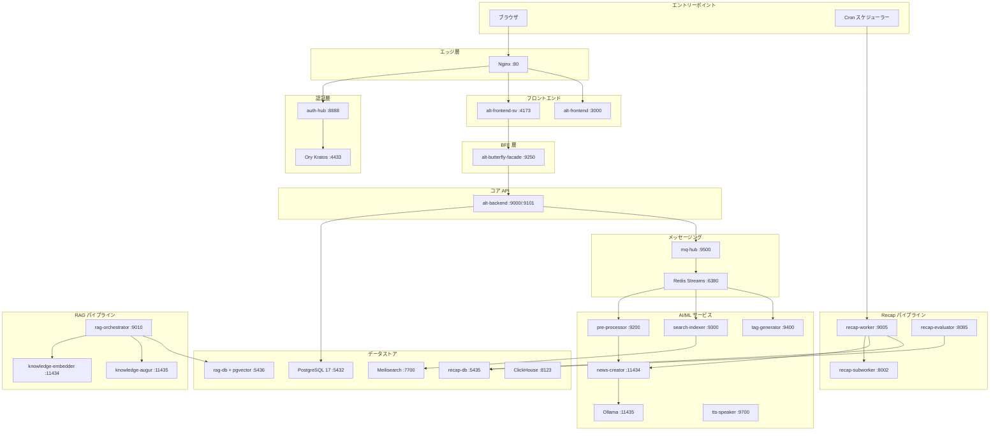
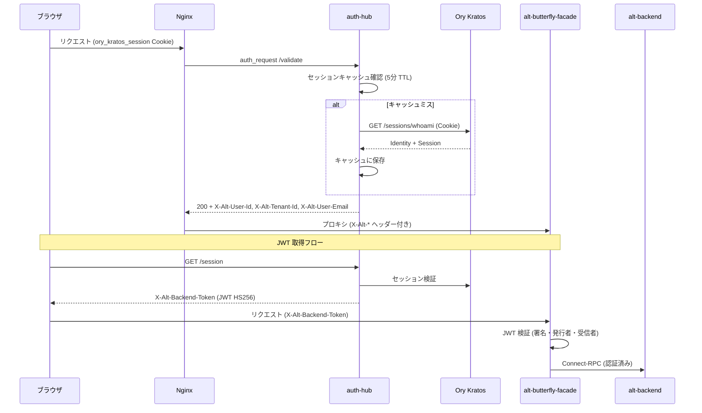
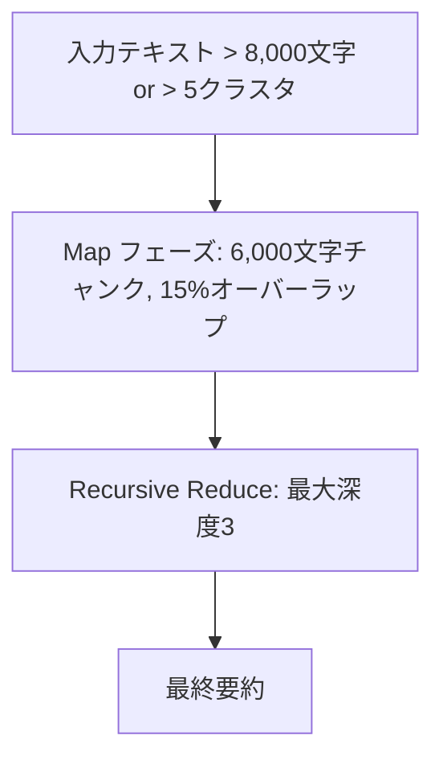
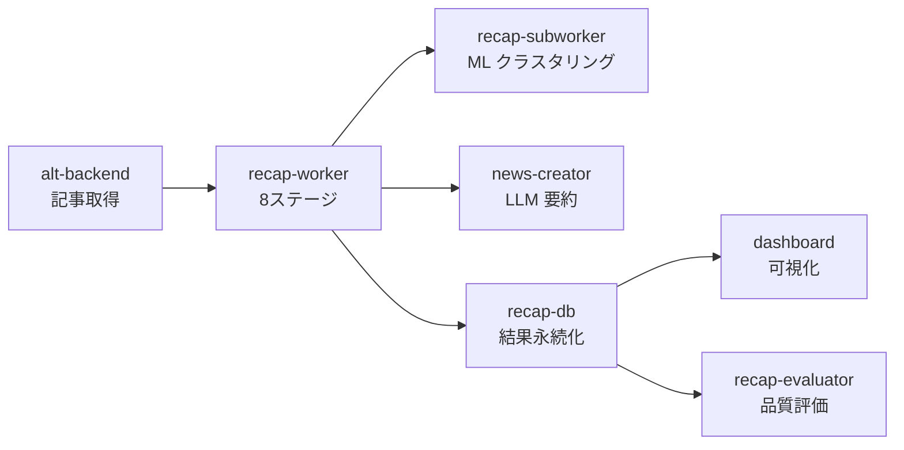
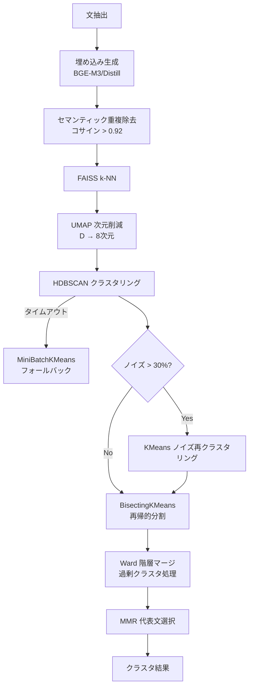
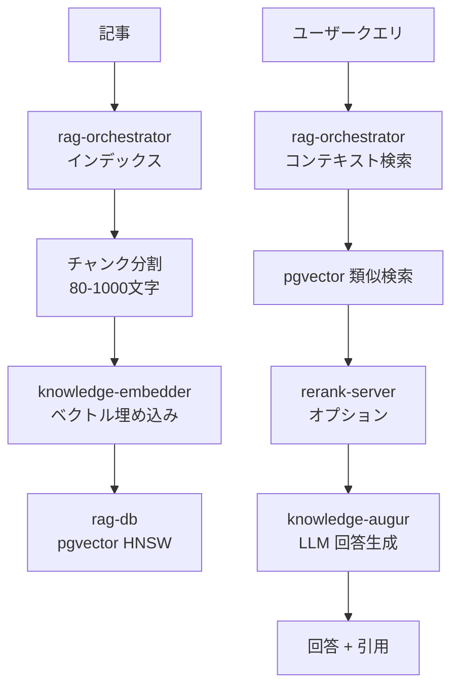

# Alt Platform — 包括的マイクロサービスガイド

> AI 拡張型 RSS ナレッジプラットフォーム
> 最終更新: 2026-02-12

---

## 目次

- [1. プラットフォーム概要](#1-プラットフォーム概要)
  - [1.1 Alt とは](#11-alt-とは)
  - [1.2 技術スタック一覧](#12-技術スタック一覧)
  - [1.3 アーキテクチャ原則](#13-アーキテクチャ原則)
  - [1.4 データフロー全体像](#14-データフロー全体像)
  - [1.5 サービス一覧クイックリファレンス](#15-サービス一覧クイックリファレンス)
- [2. インフラストラクチャ層](#2-インフラストラクチャ層)
  - [2.1 Docker Compose トポロジー](#21-docker-compose-トポロジー)
  - [2.2 データストア](#22-データストア)
  - [2.3 リバースプロキシ (Nginx)](#23-リバースプロキシ-nginx)
  - [2.4 マイグレーション管理 (Atlas)](#24-マイグレーション管理-atlas)
  - [2.5 ネットワーク・ボリューム・シークレット](#25-ネットワークボリュームシークレット)
  - [2.6 バックアップ戦略](#26-バックアップ戦略)
- [3. 認証・セキュリティ層](#3-認証セキュリティ層)
  - [3.1 認証アーキテクチャ全体像](#31-認証アーキテクチャ全体像)
  - [3.2 auth-hub (Go)](#32-auth-hub-go)
  - [3.3 Ory Kratos](#33-ory-kratos)
  - [3.4 auth-token-manager (Deno)](#34-auth-token-manager-deno)
  - [3.5 pre-processor-sidecar (Go)](#35-pre-processor-sidecar-go)
  - [3.6 サービス間認証パターン](#36-サービス間認証パターン)
- [4. コア API・BFF・フロントエンド](#4-コア-apibffフロントエンド)
  - [4.1 alt-backend (Go) — Clean Architecture・API 一覧](#41-alt-backend-go--clean-architectureapi-一覧)
  - [4.2 alt-butterfly-facade (Go) — BFF](#42-alt-butterfly-facade-go--bff)
  - [4.3 mq-hub (Go) — イベントブローカー](#43-mq-hub-go--イベントブローカー)
  - [4.4 alt-frontend-sv (SvelteKit) — プライマリ UI](#44-alt-frontend-sv-sveltekit--プライマリ-ui)
  - [4.5 alt-frontend (Next.js) — レガシー UI](#45-alt-frontend-nextjs--レガシー-ui)
  - [4.6 Protocol Buffers 定義](#46-protocol-buffers-定義)
- [5. AI/ML・NLP サービス](#5-aimlnlp-サービス)
  - [5.1 news-creator (Python) — LLM 要約](#51-news-creator-python--llm-要約)
  - [5.2 tag-generator (Python) — タグ生成](#52-tag-generator-python--タグ生成)
  - [5.3 pre-processor (Go) — 記事前処理](#53-pre-processor-go--記事前処理)
  - [5.4 search-indexer (Go) — 検索インデックス](#54-search-indexer-go--検索インデックス)
  - [5.5 tts-speaker (Python) — 日本語 TTS](#55-tts-speaker-python--日本語-tts)
  - [5.6 rerank-server (Python) — リランキング](#56-rerank-server-python--リランキング)
- [6. Recap・RAG パイプライン](#6-recaprag-パイプライン)
  - [6.1 Recap パイプライン概要](#61-recap-パイプライン概要)
  - [6.2 recap-worker (Rust) — 8 ステージパイプライン](#62-recap-worker-rust--8-ステージパイプライン)
  - [6.3 recap-subworker (Python) — ML クラスタリング](#63-recap-subworker-python--ml-クラスタリング)
  - [6.4 recap-evaluator (Python) — 品質評価](#64-recap-evaluator-python--品質評価)
  - [6.5 dashboard (Streamlit) — モニタリング](#65-dashboard-streamlit--モニタリング)
  - [6.6 RAG パイプライン概要](#66-rag-パイプライン概要)
  - [6.7 rag-orchestrator (Go) — RAG 調整](#67-rag-orchestrator-go--rag-調整)
  - [6.8 knowledge-augur / knowledge-embedder](#68-knowledge-augur--knowledge-embedder)
- [7. オブザーバビリティ・CLI・開発ツール](#7-オブザーバビリティcli開発ツール)
  - [7.1 rask-log-forwarder (Rust) — ログ収集](#71-rask-log-forwarder-rust--ログ収集)
  - [7.2 rask-log-aggregator (Rust) — ログ集約](#72-rask-log-aggregator-rust--ログ集約)
  - [7.3 Prometheus・Grafana・cAdvisor](#73-prometheusgrafanacadvisor)
  - [7.4 metrics CLI (Python)](#74-metrics-cli-python)
  - [7.5 altctl (Go) — CLI](#75-altctl-go--cli)
  - [7.6 alt-perf (Deno) — パフォーマンステスト](#76-alt-perf-deno--パフォーマンステスト)
- [8. 横断的関心事](#8-横断的関心事)
  - [8.1 サービス間通信パターン](#81-サービス間通信パターン)
  - [8.2 エラーハンドリング・リトライ](#82-エラーハンドリングリトライ)
  - [8.3 テスト戦略 (TDD)](#83-テスト戦略-tdd)
  - [8.4 ポート一覧](#84-ポート一覧)
  - [8.5 トラブルシューティング](#85-トラブルシューティング)

---

## 1. プラットフォーム概要

### 1.1 Alt とは

Alt は AI 拡張型 RSS ナレッジプラットフォームである。RSS フィードの収集・要約・分類・検索・定期レポート (Recap) 生成・RAG ベースの質問応答まで、情報消費の全ライフサイクルを統合的に支援する。

主な機能:

- **RSS フィード管理**: フィード登録・購読・閲覧・お気に入り管理
- **AI 要約**: Gemma 3 4B QAT による日本語記事の自動要約
- **タグ生成**: KeyBERT + ONNX によるトピックタグの自動付与
- **全文検索**: Meilisearch + MeCab トークナイザーによる日本語対応検索
- **Recap レポート**: 7 日間・3 日間の AI キュレーション定期レポート
- **RAG 質問応答**: pgvector ベクトル検索 + LLM による記事ベースの回答生成
- **TTS 音声合成**: Kokoro-82M による日本語記事の読み上げ
- **オブザーバビリティ**: SIMD パーサーベースの高速ログ収集・分析

### 1.2 技術スタック一覧

| 言語 | バージョン | 対象サービス | テストコマンド |
|------|-----------|-------------|--------------|
| Go | 1.24+ / 1.25+ | alt-backend, auth-hub, pre-processor, search-indexer, mq-hub, altctl, alt-butterfly-facade, rag-orchestrator, pre-processor-sidecar | `go test ./...` |
| Python | 3.11+ ~ 3.13+ | news-creator, tag-generator, metrics, recap-subworker, recap-evaluator, dashboard, tts-speaker, rerank-server | `uv run pytest` |
| Rust | 1.87+ | rask-log-aggregator, rask-log-forwarder, recap-worker | `cargo test` |
| TypeScript | SvelteKit 2.x / Next.js 15 | alt-frontend-sv, alt-frontend | `pnpm test` / `bun test` |
| Deno | 2.x | auth-token-manager, alt-perf | `deno test` |

### 1.3 アーキテクチャ原則

**Clean Architecture**

全サービスが以下のレイヤー構成に従う:

```
Handler → Usecase → Port (Interface) → Gateway → Driver
```

| レイヤー | 責務 | インポート可能な対象 |
|---------|------|------------------|
| Handler | HTTP エンドポイント、リクエスト検証 | Usecase, DI のみ |
| Usecase | ビジネスロジック | Port, Domain のみ |
| Port | インターフェース契約 | Domain のみ |
| Gateway | 外部サービス適応層 | Driver, Domain |
| Driver | データベース、外部 API | 外部ライブラリのみ |
| Domain | コアビジネスエンティティ | 何もインポートしない |

**TDD-First**: テスト駆動開発 (RED → GREEN → REFACTOR) を全サービスで実践。

**Compose-First**: Docker Compose を唯一の真実のソース (Source of Truth) とし、ローカル開発からステージングまで一貫した環境を提供。

### 1.4 データフロー全体像



### 1.5 サービス一覧クイックリファレンス

| サービス | 言語 | ポート | プロトコル | 役割 |
|---------|------|-------|----------|------|
| nginx | C | 80, 8080 | HTTP | リバースプロキシ |
| alt-backend | Go 1.24+ | 9000, 9101 | REST, Connect-RPC | コア API |
| alt-butterfly-facade | Go 1.25+ | 9250 | HTTP/2 h2c | BFF プロキシ |
| alt-frontend-sv | SvelteKit 2.x | 4173 | HTTP | プライマリ UI |
| alt-frontend | Next.js 15 | 3000 | HTTP | レガシー UI |
| auth-hub | Go 1.25+ | 8888 | HTTP | Identity-Aware Proxy |
| Ory Kratos | Go | 4433, 4434 | HTTP | アイデンティティ管理 |
| auth-token-manager | Deno 2.x | 9201 | HTTP | OAuth2 トークン管理 |
| pre-processor-sidecar | Go 1.24+ | — | Internal | OAuth トークンブリッジ |
| mq-hub | Go 1.24+ | 9500 | Connect-RPC | イベントブローカー |
| news-creator | Python 3.11+ | 11434 | REST | LLM 要約 |
| news-creator-backend | Ollama | 11435 | REST | LLM 推論 |
| tag-generator | Python 3.13+ | 9400 | REST | タグ生成 |
| pre-processor | Go 1.24+ | 9200, 9202 | REST, Connect-RPC | 記事前処理 |
| search-indexer | Go 1.24+ | 9300, 9301 | REST, Connect-RPC | 検索インデックス |
| tts-speaker | Python 3.12 | 9700 | Connect-RPC | 日本語 TTS |
| rerank-server | Python | 8080 | REST | リランキング |
| recap-worker | Rust 1.87+ | 9005 | HTTP | Recap 8 ステージパイプライン |
| recap-subworker | Python 3.12+ | 8002 | HTTP | ML クラスタリング |
| recap-evaluator | Python 3.13+ | 8085 | HTTP | 品質評価 |
| dashboard | Python (Streamlit) | 8501, 8502 | HTTP | モニタリング UI |
| rag-orchestrator | Go 1.25+ | 9010, 9011 | REST, Connect-RPC | RAG パイプライン |
| knowledge-augur | Ollama | 11435 | REST | RAG 用 LLM |
| knowledge-embedder | Ollama | 11434 | REST | ベクトル埋め込み |
| rask-log-aggregator | Rust 1.87+ | 9600, 4317, 4318 | HTTP, OTLP | ログ集約 |
| rask-log-forwarder | Rust 1.87+ | — | Internal | ログ収集 (14 インスタンス) |
| metrics | Python 3.13+ | — | CLI | SLI/SLO 分析 |
| altctl | Go | — | CLI | CLI オーケストレーション |
| alt-perf | Deno 2.x | — | CLI | E2E パフォーマンステスト |
| PostgreSQL 17 | SQL | 5432 | TCP | メイン DB |
| recap-db (PostgreSQL 18) | SQL | 5435 | TCP | Recap DB |
| rag-db (PostgreSQL + pgvector) | SQL | 5436 | TCP | RAG ベクトル DB |
| kratos-db (PostgreSQL 16) | SQL | 5434 | TCP | 認証 DB |
| Meilisearch | Rust | 7700 | HTTP | 全文検索 |
| ClickHouse | C++ | 8123, 9009 | HTTP, gRPC | ログ分析 |
| Redis Streams | C | 6380 | Redis | イベントストリーミング |
| Redis Cache | C | — | Redis | AI キャッシュ |

---

## 2. インフラストラクチャ層

### 2.1 Docker Compose トポロジー

Alt は `compose/` ディレクトリに 17 の YAML ファイルを持つモジュラー Compose アーキテクチャを採用している。

**Compose ファイル一覧:**

| ファイル | 役割 | 主要サービス |
|--------|------|------------|
| `base.yaml` | 共有リソース (シークレット、ネットワーク、ボリューム、YAML アンカー) | — |
| `compose.yaml` | メタオーケストレーター (全スタック統合) | — |
| `db.yaml` | データベース層 | PostgreSQL 17, Meilisearch, ClickHouse |
| `core.yaml` | コアサービス | Nginx, フロントエンド×2, alt-backend, migrate |
| `auth.yaml` | 認証 | Kratos, auth-hub, kratos-db |
| `mq.yaml` | メッセージキュー | Redis Streams, mq-hub |
| `workers.yaml` | バックグラウンドワーカー | search-indexer, tag-generator, auth-token-manager |
| `ai.yaml` | AI/LLM | news-creator, Ollama, redis-cache, pre-processor |
| `recap.yaml` | Recap パイプライン | recap-db, recap-worker, recap-subworker, dashboard |
| `rag.yaml` | RAG パイプライン | rag-db, rag-orchestrator |
| `logging.yaml` | ログ基盤 | rask-log-aggregator + 14 フォワーダー |
| `observability.yaml` | オブザーバビリティ | Prometheus, Grafana, cAdvisor |
| `backup.yaml` | バックアップ | Restic 0.17.3 |
| `bff.yaml` | Backend for Frontend | alt-butterfly-facade |
| `perf.yaml` | パフォーマンステスト | alt-perf |
| `dev.yaml` | 開発モード | mock-auth, ローカルサービス |
| `frontend-dev.yaml` | フロントエンド開発 | mock-auth, alt-frontend-sv |

**プロファイル一覧:**

| プロファイル | 説明 |
|------------|------|
| `db` | データベースサービス |
| `auth` | 認証サービス |
| `core` | コアアプリケーション |
| `workers` | バックグラウンドワーカー |
| `ai` | AI/LLM サービス |
| `rag` | RAG 拡張 |
| `recap` | Recap パイプライン |
| `logging` | ログ基盤 |
| `observability` | オブザーバビリティスタック |
| `backup` | バックアップ (オプトイン) |
| `perf` | パフォーマンステスト (オプトイン) |
| `mq` | メッセージキュー |
| `bff` | Backend for Frontend |
| `dev` | 開発モード |
| `frontend-dev` | フロントエンド開発 |

**操作コマンド:**

```bash
# 全サービス起動
docker compose -f compose/compose.yaml -p alt up -d

# 特定サービス起動
docker compose -f compose/compose.yaml -p alt up -d <service>

# ログ確認
docker compose -f compose/compose.yaml -p alt logs <service> -f

# 停止
docker compose -f compose/compose.yaml -p alt down
```

### 2.2 データストア

#### PostgreSQL 17 (メイン DB `alt-db`)

| 項目 | 値 |
|------|-----|
| イメージ | `postgres:17-alpine` |
| ポート | 5432 |
| ボリューム | `db_data_17` |
| max_connections | 100 |
| shared_buffers | 128MB |
| idle_in_transaction_session_timeout | 30s |

**サービスアクセスマトリクス:**

| サービス | DB ユーザー | 用途 |
|---------|-----------|------|
| alt-backend | `DB_USER` | コア API 操作 |
| pre-processor | `PRE_PROCESSOR_DB_USER` | 記事処理 |
| pre-processor-sidecar | `PRE_PROCESSOR_SIDECAR_DB_USER` | RSS/Inoreader 同期 |
| search-indexer | `SEARCH_INDEXER_DB_USER` | インデックスデータ取得 |
| tag-generator | `DB_TAG_GENERATOR_USER` | タグ管理 |

**主要テーブル (30+):**

| カテゴリ | テーブル |
|---------|---------|
| コア | `feeds`, `feed_links`, `articles`, `article_summaries` |
| タグ | `feed_tags`, `article_tags` |
| ユーザー状態 | `read_status`, `user_reading_status`, `favorite_feeds` |
| Inoreader | `inoreader_subscriptions`, `inoreader_articles`, `sync_state` |
| ドメイン | `scraping_domains`, `declined_domains` |
| ジョブ | `summarize_job_queue`, `outbox_events`, `feed_link_availability` |

#### recap-db (PostgreSQL 18)

| 項目 | 値 |
|------|-----|
| ポート | 5435 |
| ボリューム | `recap_db_data` |
| max_connections | 250 |
| 拡張 | `pg_cron` (スケジュールデータクリーンアップ) |

主要テーブル: `recap_jobs`, `recap_job_articles`, `recap_outputs`, `recap_sections`, `recap_cluster_evidence`, `tag_label_graph`, `recap_worker_config`, `morning_article_groups`

#### rag-db (PostgreSQL + pgvector)

| 項目 | 値 |
|------|-----|
| ポート | 5436 |
| ボリューム | `rag_db_data` |
| 拡張 | `pgvector` (ベクトル類似検索) |
| max_connections | 100 |

主要テーブル: `rag_documents`, `rag_document_versions`, `rag_chunks` (HNSW インデックス), `rag_chunk_events`, `rag_jobs`

#### kratos-db (PostgreSQL 16)

| 項目 | 値 |
|------|-----|
| イメージ | `postgres:16-alpine` |
| ポート | 5434 |
| 用途 | Ory Kratos アイデンティティ管理 |

#### Meilisearch v1.27.0

| 項目 | 値 |
|------|-----|
| ポート | 7700 |
| メモリ制限 | 15GB (リザーブ: 8GB) |
| 環境 | `MEILI_ENV=production` |
| ヘルスチェック | `curl -f http://localhost:7700/health` |

#### ClickHouse 25.9

| 項目 | 値 |
|------|-----|
| ポート | 8123 (HTTP), 9009 (gRPC) |
| データベース | `rask_logs` |
| ファイル制限 | `nofile` 262144 |

**主要テーブル:**

| テーブル | TTL | 用途 |
|---------|-----|------|
| `logs` | 2 日 | レガシーアプリケーションログ |
| `otel_logs` | 7 日 | OpenTelemetry ログ |
| `otel_traces` | 7 日 | OpenTelemetry トレース |
| `sli_metrics` | — | SLI メトリクス |

#### Redis インスタンス

| インスタンス | イメージ | ポート | maxmemory | ポリシー | 用途 |
|------------|---------|-------|-----------|---------|------|
| redis-streams | redis:8.4-alpine | 6380 | 512MB | `noeviction` | イベントストリーミング |
| redis-cache | redis:8.0.2-alpine | — | 256MB | `allkeys-lru` | AI キャッシュ |

Redis Streams は AOF 永続化、4 I/O スレッドで構成。

### 2.3 リバースプロキシ (Nginx)

Nginx はプラットフォームの単一エントリーポイントとして機能する。

**主要ルーティング:**

| パス | アップストリーム | タイムアウト | 備考 |
|------|---------------|------------|------|
| `/api/v1/sse/` | alt-backend:9000 | 300s | SSE、バッファリング無効 |
| `/sse/dashboard/` | dashboard:8000 | 300s | ダッシュボード SSE |
| `/ory/` | kratos:4433 | 30s | WebSocket 対応 |
| `/api/auth/csrf` | auth-hub:8888 | 5s | CSRF トークン |
| `/auth-validate` | auth-hub:8888 | 5s | 内部専用 |
| `/api/backend/*` | alt-backend:9000 | 240s | 認証検証付き |
| `/sv/api/.*stream\|sse` | alt-frontend-sv:4173 | 1h | SvelteKit SSE |
| `/sv/` | alt-frontend-sv:4173 | 300s | SvelteKit ページ |
| `/` | alt-frontend:3000 | 30s | レガシー UI |

**セキュリティヘッダー:**

- `server_tokens off` — Nginx バージョン非表示
- `X-Frame-Options: SAMEORIGIN`
- `X-Content-Type-Options: nosniff`
- `X-XSS-Protection: 1; mode=block`

**ステータスエンドポイント:** `/nginx_status` (ポート 8080、内部ネットワーク限定)

### 2.4 マイグレーション管理 (Atlas)

3 つのデータベースそれぞれに Atlas マイグレーションが存在する。

| DB | ディレクトリ | マイグレーション数 |
|----|------------|-----------------|
| メイン DB | `migrations-atlas/` | 60+ |
| recap-db | `recap-migration-atlas/` | 25+ |
| rag-db | `rag-migration-atlas/` | 3 |

各マイグレーションは `atlas.hcl` で設定され、`atlas.sum` でチェックサム検証される。Docker コンテナ (`migrate`, `recap-db-migrator`, `rag-db-migrator`) がサービス起動時に自動実行する。

### 2.5 ネットワーク・ボリューム・シークレット

**ネットワーク:** `alt-network` — 全サービスが接続する Docker 管理ネットワーク

**ボリューム (12):**

| ボリューム | 用途 |
|-----------|------|
| `db_data_17` | PostgreSQL 17 メイン DB |
| `kratos_db_data` | Kratos 認証 DB |
| `recap_db_data` | Recap DB |
| `rag_db_data` | RAG ベクトル DB |
| `meili_data` | Meilisearch インデックス |
| `clickhouse_data` | ClickHouse オブザーバビリティ |
| `news_creator_models` | Ollama モデルキャッシュ |
| `oauth_token_data` | OAuth2 トークン |
| `prometheus_data` | Prometheus メトリクス |
| `grafana_data` | Grafana ダッシュボード |
| `redis-streams-data` | Redis Streams 永続化 |
| `rask_log_aggregator_data` | ログアグリゲーター |

**シークレット (22):**

Docker シークレット (`/run/secrets/`) を使用し、全サービスで `*_FILE` パターンをサポート。

主要シークレット: `auth_shared_secret`, `backend_token_secret`, `postgres_password`, `db_password`, `csrf_secret`, `service_secret`, `meili_master_key`, `clickhouse_password`, `kratos_cookie_secret`, `kratos_cipher_secret`, `hugging_face_token`, `inoreader_client_id`, `inoreader_client_secret`, `grafana_admin_password`, `restic_password` 等

**YAML アンカー (テンプレート):**

| アンカー | 設定 |
|---------|------|
| `x-rask-env` | ログアグリゲーター環境 (バッチサイズ: 1, フラッシュ間隔: 500ms) |
| `x-rask-forwarder-env` | フォワーダー環境 (バッチサイズ: 1000, バッファ容量: 100K) |
| `x-healthcheck-http` | HTTP ヘルスチェック (間隔: 10s, リトライ: 5) |
| `x-healthcheck-db` | DB ヘルスチェック (間隔: 5s, リトライ: 10) |
| `x-logging-config` | ログ設定 (json-file, 10MB, 3 ファイル) |

### 2.6 バックアップ戦略

**Restic 0.17.3** による 3-2-1 バックアップ戦略を採用。

**バックアップ対象ボリューム (10):**

`db_data_17`, `kratos_db_data`, `recap_db_data`, `rag_db_data`, `meili_data`, `clickhouse_data`, `redis-streams-data`, `oauth_token_data`, `prometheus_data`, `grafana_data`

**スケジューラー:** Supercronic v0.2.33 によるクーロン実行。Healthchecks.io 連携による監視。

---

## 3. 認証・セキュリティ層

### 3.1 認証アーキテクチャ全体像



### 3.2 auth-hub (Go)

Identity-Aware Proxy パターンで Nginx `auth_request` と Ory Kratos を橋渡しする。

**エンドポイント:**

| パス | メソッド | レート制限 | 説明 |
|------|---------|----------|------|
| `/validate` | GET | 100 req/min | Nginx auth_request ハンドラー |
| `/session` | GET | 30 req/min | セッション情報 + JWT 発行 |
| `/csrf` | POST | 10 req/min | CSRF トークン生成 |
| `/health` | GET | 無制限 | ヘルスチェック |
| `/internal/system-user` | GET | 10 req/min | 内部システムユーザー |

**JWT トークン:**

- アルゴリズム: HS256
- 発行者: `auth-hub`
- 受信者: `alt-backend`
- TTL: 5 分 (設定可能)
- クレーム: `email`, `role`, `sid`, `sub`, `iss`, `aud`, `iat`, `exp`

**セッションキャッシュ:**

- 方式: インメモリ RWMutex ベース
- TTL: 5 分 (設定可能)
- クリーンアップ: 1 分間隔の goroutine

**ミドルウェアチェーン:**

1. `SecurityHeaders()` — HSTS, CSP, X-Frame-Options
2. `OTelecho.Middleware()` — OpenTelemetry トレーシング
3. `RequestLogger` — 構造化ログ
4. `Recover()` — パニックリカバリー
5. `RateLimiter` — エンドポイント別レート制限

**CSRF 保護:** HMAC-SHA256 (セッション ID ベース、最低 32 文字のシークレット)

### 3.3 Ory Kratos

Ory Kratos v1.3.0 によるアイデンティティ管理。

| 項目 | 設定 |
|------|------|
| 公開 URL | `https://example.com/ory` |
| セッション寿命 | 720 時間 (30 日) |
| Cookie ドメイン | `.example.com` |
| Cookie SameSite | Lax |
| ハッシュ | bcrypt (コスト: 12) |
| 認証方式 | パスワード, TOTP, Lookup Secret, Link, Code |

**アイデンティティスキーマ:**

```json
{
  "traits": {
    "email": { "type": "string", "format": "email" },
    "name": { "first": { "type": "string" }, "last": { "type": "string" } }
  },
  "required": ["email"]
}
```

**セルフサービスフロー:**

| フロー | UI URL | 寿命 |
|--------|--------|------|
| ログイン | `/sv/auth/login` | 30 分 |
| 登録 | `/sv/register` | 30 分 |
| リカバリー | `/sv/recovery` | Code 方式 |
| 設定 | `/sv/settings` | 特権セッション: 10 分 |

### 3.4 auth-token-manager (Deno)

Inoreader OAuth2 トークンのライフサイクルを管理する Deno サービス。

**CLI コマンド:**

| コマンド | 説明 |
|---------|------|
| `daemon` | デフォルトの常駐サービス (5 分間隔でトークン更新チェック) |
| `authorize` | インタラクティブ OAuth ブートストラップ |
| `refresh` | トークン強制更新 |
| `health` | 設定 + トークン検証 |
| `monitor` | トークン鮮度アラート (5m/30m/1h/2h/6h 閾値) |
| `validate` | CI/自動化ゲート |

**デーモンモード動作:**

1. 起動時に即座にトークンチェック
2. 5 分間隔でリフレッシュ判定 (残り 2 時間未満で更新)
3. Inoreader OAuth2 エンドポイントへの POST リクエスト
4. リトライ: 指数バックオフ (最大 3 回、基本 1 秒、最大 30 秒)

**機密データ保護:** `access_token`, `refresh_token`, `client_secret` は全てログで `[REDACTED]` に置換。

### 3.5 pre-processor-sidecar (Go)

Inoreader API 用 RSS インジェスションスケジューラー。OAuth トークンを auth-token-manager から取得する。

**トークン管理:**

- Kubernetes API 経由でトークン読み取り (`pre-processor-sidecar-oauth2-token` Secret)
- ポーリング間隔: 60 秒
- クロックスキュー許容: 60 秒

**HTTP クライアント構成:**

- TLS ハンドシェイクタイムアウト: 15 秒
- レスポンスヘッダータイムアウト: 60 秒
- フォールバック: プロキシ → 直接接続

**レート制限:** Inoreader Zone 1 ヘッダー (`X-Reader-Zone1-Usage` / `X-Reader-Zone1-Limit`) 監視。

### 3.6 サービス間認証パターン

| パターン | ヘッダー | 用途 | 検証方式 |
|---------|---------|------|---------|
| X-Internal-Auth | `X-Internal-Auth` | auth-hub 内部エンドポイント | `crypto/subtle.ConstantTimeCompare` |
| X-Service-Token | `X-Service-Token` | サービス間 API 呼び出し | 文字列比較 |
| X-Alt-Backend-Token | `X-Alt-Backend-Token` | フロントエンド → BFF → バックエンド | JWT HS256 署名検証 |
| X-Alt-* ヘッダー | `X-Alt-User-Id` 等 | リクエストコンテキスト伝播 | Nginx proxy_set_header |

---

## 4. コア API・BFF・フロントエンド

### 4.1 alt-backend (Go) — Clean Architecture・API 一覧

alt-backend はプラットフォームの中核 API サーバーで、REST (ポート 9000) と Connect-RPC (ポート 9101) のデュアルプロトコルを提供する。

**REST API エンドポイント (主要):**

| カテゴリ | パス | メソッド | 説明 |
|---------|------|---------|------|
| ヘルス | `/v1/health` | GET | DB ping 付きヘルスチェック |
| フィード | `/v1/feeds/fetch/cursor` | GET | カーソルベースフィード取得 |
| フィード | `/v1/feeds/count/unreads` | GET | 未読数取得 |
| フィード | `/v1/feeds/read` | POST | 既読マーク |
| フィード | `/v1/feeds/register/favorite` | POST | お気に入り登録 |
| フィード | `/v1/feeds/search` | POST | フィード検索 |
| フィード | `/v1/feeds/summarize/stream` | POST | ストリーミング要約 (SSE) |
| 記事 | `/v1/articles/fetch/cursor` | GET | カーソルベース記事取得 |
| 記事 | `/v1/articles/search` | POST | 記事検索 |
| 記事 | `/v1/articles/by-tag` | GET | タグ別記事取得 |
| RSS | `/v1/rss-feed-link/register` | POST | RSS フィード登録 |
| Recap | `/v1/recap/7days` | GET | 7 日間 Recap |
| Recap | `/v1/recap/3days` | GET | 3 日間 Recap |
| Recap | `/v1/recap/evening-pulse` | GET | Evening Pulse |
| Augur | `/v1/augur/answer` | POST | RAG 回答生成 |
| SSE | `/v1/sse/feeds/stats` | GET | リアルタイムフィード統計 |

**Connect-RPC サービス (ポート 9101):**

| サービス | メソッド数 | 主要メソッド |
|---------|----------|------------|
| `FeedService` | 14 | `GetUnreadFeeds`, `StreamFeedStats`, `StreamSummarize`, `SearchFeeds`, `ListSubscriptions` |
| `ArticleService` | 8 | `FetchArticleContent`, `FetchArticlesCursor`, `FetchArticlesByTag`, `StreamArticleTags` |
| `RSSService` | 4 | `RegisterRSSFeed`, `ListRSSFeedLinks`, `DeleteRSSFeedLink` |
| `AugurService` | 2 | `StreamChat` (RAG チャット), `RetrieveContext` |
| `MorningLetterService` | 1 | `StreamChat` (時間制限付き RAG) |
| `RecapService` | 3 | `GetSevenDayRecap`, `GetThreeDayRecap`, `GetEveningPulse` |

**バックグラウンドジョブ:**

| ジョブ | 間隔 | タイムアウト | 説明 |
|-------|------|-----------|------|
| `hourly-feed-collector` | 1 時間 | 30 分 | フィード収集、新規記事検知 |
| `daily-scraping-policy` | 24 時間 | 1 時間 | robots.txt リフレッシュ |
| `outbox-worker` | 5 秒 | 30 秒 | イベント Outbox 処理 |

**DI コンテナ:** `di/container.go` で 40+ ユースケースを配線。

### 4.2 alt-butterfly-facade (Go) — BFF

HTTP/2 h2c 透過プロキシとして alt-frontend-sv と alt-backend 間を仲介する。

```
Frontend :4173 → BFF :9250 (JWT 検証) → Backend :9101 (Connect-RPC)
```

**ストリーミングエンドポイント (5 分タイムアウト):**

1. `/alt.feeds.v2.FeedService/StreamFeedStats`
2. `/alt.feeds.v2.FeedService/StreamSummarize`
3. `/alt.augur.v2.AugurService/StreamChat`
4. `/alt.morning_letter.v2.MorningLetterService/StreamChat`

**リソース制限:** メモリ 128MB / リザーブ 64MB

### 4.3 mq-hub (Go) — イベントブローカー

Redis Streams ベースのイベントソーシング基盤。

**イベントストリーム:**

| ストリーム | プロデューサー | コンシューマー |
|-----------|-------------|--------------|
| `alt:events:articles` | alt-backend | pre-processor, search-indexer, tag-generator |
| `alt:events:summaries` | pre-processor | search-indexer |
| `alt:events:tags` | tag-generator | search-indexer |
| `alt:events:index` | search-indexer | — |

**イベント型:**

| イベント | トリガー |
|---------|---------|
| `ArticleCreated` | 新規記事スクレイピング |
| `SummarizeRequested` | ユーザーによる要約リクエスト |
| `ArticleSummarized` | 記事要約完了 |
| `TagsGenerated` | タグ生成完了 |

配信保証: At-Least-Once。コンシューマグループによるスケーラビリティ確保。

### 4.4 alt-frontend-sv (SvelteKit) — プライマリ UI

SvelteKit 2.x + Svelte 5 Runes + TailwindCSS v4 によるプライマリフロントエンド。

**ルート構成:**

| パス | 説明 |
|------|------|
| `/sv/` | ランディング |
| `/sv/(app)/feeds/` | メインフィードビュー |
| `/sv/(app)/feeds/swipe/` | カードスワイプ UI |
| `/sv/(app)/feeds/tag-trail/` | タグ横断探索 |
| `/sv/(app)/augur/` | RAG チャット |
| `/sv/(app)/recap/7days` | 7 日間 Recap |
| `/sv/(app)/recap/3days` | 3 日間 Recap |
| `/sv/(app)/recap/evening-pulse` | Evening Pulse |
| `/sv/(app)/recap/morning-letter` | Morning Letter |
| `/sv/desktop/` | デスクトップレイアウト |
| `/sv/mobile/` | モバイルレイアウト |

**データ取得:**

- **Connect-RPC**: `src/lib/connect/` — FeedService, ArticleService, AugurService 等のクライアント
- **TanStack Svelte Query**: `src/lib/queries/` — キャッシュ付きデータフェッチ
- **REST**: `src/lib/api.ts` — レガシー REST 呼び出し

**状態管理:** Svelte 5 Runes (`$state`, `$derived`, `$effect`)

**認証:** `hooks.server.ts` でサーバーサイドセッション検証 → auth-hub JWT 交換

### 4.5 alt-frontend (Next.js) — レガシー UI

Next.js 15 + React 19 + Chakra UI によるレガシーフロントエンド。段階的に alt-frontend-sv に置き換え中。

- ポート: 3000
- WCAG 2.1 AA アクセシビリティ準拠
- 記事は表示時に自動アーカイブ

### 4.6 Protocol Buffers 定義

`proto/alt/` に全サービスの `.proto` 定義が格納されている。

| ファイル | サービス |
|--------|---------|
| `feeds/v2/feeds.proto` | FeedService |
| `articles/v2/articles.proto` | ArticleService |
| `rss/v2/rss.proto` | RSSService |
| `augur/v2/augur.proto` | AugurService |
| `morning_letter/v2/morning_letter.proto` | MorningLetterService |
| `recap/v2/recap.proto` | RecapService |
| `tts/v1/tts.proto` | TTSService |
| `mqhub/v1/mqhub.proto` | MQHubService |

**共通メッセージ型:**

- `CursorRequest` / `CursorResponse` — カーソルベースページネーション
- `FeedItem` — フィードメタデータ + コンテンツ
- `ArticleItem` — 記事エンティティ
- `RecapGenre` — ジャンル別 Recap
- `PulseTopic` — Evening Pulse トピック (`NEED_TO_KNOW`, `TREND`, `SERENDIPITY`)
- `StreamChatEvent` — ストリーミングチャットイベント (`delta`, `meta`, `done`, `error`, `thinking`)

---

## 5. AI/ML・NLP サービス

### 5.1 news-creator (Python) — LLM 要約

LLM ベースの記事要約サービス。Gemma 3 4B QAT を Ollama 経由で使用。

**LLM モデル:**

| モデル | コンテキスト | Keep-Alive | 用途 |
|--------|-----------|-----------|------|
| `gemma3-4b-8k` | 8,192 トークン | 24 時間 | 通常の記事要約 |
| `gemma3-4b-60k` | 61,440 トークン | 15 分 | Recap 用大規模要約 |

**Ollama 構成:** `OLLAMA_NUM_PARALLEL=2`, `OLLAMA_MAX_LOADED_MODELS=1`, 8GB VRAM 対応

**Map-Reduce 階層要約:**



トリガー条件: クラスタセクション > 8,000 文字 or 5+ クラスタ

**Priority Semaphore (ハイブリッドスケジューリング):**

| 特性 | 設定 |
|------|------|
| RT 予約スロット | 1 |
| BE → RT 昇格 | 120 秒後 |
| エイジング閾値 | 60 秒 |
| BE 保証帯域 | 5 RT リクエスト毎に 1 BE |
| バックプレッシャー | キュー深度 10 |

**LLM 生成パラメータ:**

| パラメータ | 値 |
|-----------|-----|
| Temperature | 0.7 (CJK テキスト用) |
| Top P | 0.85 |
| Top K | 40 |
| Repeat Penalty | 1.15 |
| Max Prediction | 1,200 トークン |

**品質ゲーティング:** Ollama スコアリングによる品質検証。反復検出 (閾値 0.3、最大 2 リトライ)。低品質要約は自動削除。

**エンドポイント:**

| パス | メソッド | 説明 |
|------|---------|------|
| `/api/v1/summarize` | POST | 単一記事要約 |
| `/api/v1/summarize/batch` | POST | バッチ要約 (最大 3 並列) |
| `/api/v1/recap-summary` | POST | Recap クラスタ要約 |
| `/api/v1/expand-query` | POST | クエリ拡張 |
| `/health` | GET | ヘルス + モデル状態 |

### 5.2 tag-generator (Python) — タグ生成

Redis Streams イベント駆動のタグ生成サービス。

**ML パイプライン:**

- **KeyBERT + CascadeController**: 多段カスケードパイプライン
- **ONNX Runtime**: バイナリ量子化モデルで CPU 推論
- **バッチ処理**: バッチサイズ 75、処理後に明示的 GC

**CascadeController 判定ロジック:**

| 条件 | アクション |
|------|----------|
| 信頼度 > 0.72 かつ タグ数 ≥ 5 | 精緻化スキップ (高信頼度) |
| 信頼度 < 0.72 | 精緻化マーク |
| タグ数 < 5 | 精緻化マーク |
| 推論 > 180ms | 精緻化マーク |
| 精緻化予算上限 | 35% (コスト制御) |

**Redis Streams:**

- ストリームキー: 設定可能
- コンシューマグループ: `tag-generator-group`
- 手動 ACK (成功挿入後)

### 5.3 pre-processor (Go) — 記事前処理

デュアルプロトコル (REST:9200, Connect-RPC:9202) の記事前処理サービス。

**処理パイプライン:**

1. カーソルベースページネーションで未要約記事をフェッチ
2. バッチ処理で news-creator に要約依頼
3. 品質チェッカーによる要約検証

**サーキットブレーカー:** 外部 API 障害時のフォールバック。Dead Letter Queue で失敗記事を保存。

**レート制限:**

| 操作 | 間隔 |
|------|------|
| フィード処理 | 2 秒 |
| 要約処理 | 10 秒 |
| 品質チェック | 30 秒 |
| 外部 API | 最低 5 秒間隔 |

### 5.4 search-indexer (Go) — 検索インデックス

Meilisearch への文書インデックスと日本語全文検索を提供。

**日本語対応:**

- **Kagome v2** + IPA 辞書による形態素解析
- Wakati (分かち書き) モード
- タグ → 形態素レベルシノニム変換

**バッチサイズ:** 200 ドキュメント/バッチ、15 秒タイムアウト/操作

### 5.5 tts-speaker (Python) — 日本語 TTS

Kokoro-82M (82M パラメータ) による日本語テキスト音声合成。

**音声一覧:**

| ID | 名前 | 性別 |
|----|------|------|
| `jf_alpha` | Alpha | 女性 (デフォルト) |
| `jf_gongitsune` | Gongitsune | 女性 |
| `jf_nezumi` | Nezumi | 女性 |
| `jf_tebukuro` | Tebukuro | 女性 |
| `jm_kumo` | Kumo | 男性 |

**音声仕様:** 24kHz float32 WAV

**GPU 対応:** ROCm 7.2 (AMD iGPU)、CPU フォールバック対応

**エンドポイント:**

| パス | メソッド | 説明 |
|------|---------|------|
| `/alt.tts.v1.TTSService/Synthesize` | POST | テキスト → WAV |
| `/alt.tts.v1.TTSService/ListVoices` | GET | 利用可能音声一覧 |
| `/health` | GET | モデル状態 + デバイス情報 |

### 5.6 rerank-server (Python) — リランキング

CrossEncoder `BAAI/bge-reranker-v2-m3` によるリランキングサービス。

**デバイス優先度:** MPS (Apple Silicon) → CUDA → CPU

**リクエスト/レスポンス:**

```json
// リクエスト
{ "query": "検索クエリ", "candidates": ["テキスト1", "テキスト2"], "top_k": 10 }

// レスポンス
{ "results": [{"index": 0, "score": 0.95}], "model": "BAAI/bge-reranker-v2-m3" }
```

---

## 6. Recap・RAG パイプライン

### 6.1 Recap パイプライン概要



**パイプラインバリアント:**

| バリアント | ウィンドウ | スケジュール | 用途 |
|-----------|----------|-----------|------|
| 7 日間 Recap | 7 日 | 毎日 04:00 JST | 週次ディープダイブ |
| 3 日間 Recap | 3 日 | 随時 | 日次クイックキャッチ |
| Morning Update | 1 日 | JST 朝 | 記事グルーピング (軽量) |

### 6.2 recap-worker (Rust) — 8 ステージパイプライン

Rust 製の Recap オーケストレーター。Advisory Lock によるジョブ排他制御と `recap_stage_state` テーブルによるパイプライン再開をサポート。

**8 ステージ:**

| ステージ | 処理内容 | 主要技術 |
|---------|---------|---------|
| 1. Fetch | alt-backend から記事取得 (ページネーション) | 指数バックオフリトライ |
| 2. Preprocess | HTML クリーニング、言語検出、トークナイゼーション | Ammonia, html2text, Lindera (IPADIC) |
| 3. Dedup | 完全一致 + 近似重複検出 | XXH3 ハッシュ |
| 4. Genre | ハイブリッド 2 段階ジャンル分類 | Rocchio + Graph Label Propagation |
| 5. Select | ジャンル別記事トリミング (最大 20) | 外れ値フィルタリング |
| 6. Evidence | ジャンル別コーパス準備 | メタデータトラッキング |
| 7. Dispatch | 並列クラスタリング + 逐次要約 | recap-subworker + news-creator |
| 8. Persist | JSONB 永続化 | recap_outputs, recap_sections |

**ジャンル分類 (2 段階ハイブリッド):**

*第 1 段階: Coarse Pass (リモート分類)*

- Rocchio アルゴリズムによるセントロイドベース類似度
- マルチセントロイド対応
- Temperature スケーリングで信頼度キャリブレーション
- デフォルト閾値: 0.6 (society_justice は 0.75)
- Golden Dataset でセントロイド学習

*第 2 段階: Refine Pass (ローカルグラフ伝播)*

- `tag_label_graph` による Graph Label Propagation
- 類似度閾値: 0.85
- `RECAP_GENRE_REFINE_ROLLOUT_PERCENT` で段階的ロールアウト

**外部サービス連携:**

| サービス | エンドポイント | 用途 |
|---------|-------------|------|
| alt-backend | `/v1/recap/articles` | 記事ソース |
| recap-subworker | `/v1/runs`, `/v1/classify` | ML クラスタリング・分類 |
| news-creator | `/v1/summary/generate` | LLM 要約 (上位 40 クラスタ) |

**制御 API:**

| メソッド | パス | 説明 |
|---------|------|------|
| POST | `/v1/generate/recaps/7days` | 7 日ジョブ手動投入 (202 + job_id) |
| GET | `/v1/recaps/7days` | 最新 7 日 Recap 取得 |
| POST | `/v1/generate/recaps/3days` | 3 日ジョブ手動投入 |
| GET | `/v1/recaps/3days` | 最新 3 日 Recap 取得 |
| GET | `/v1/morning/updates` | Morning 記事グループ |
| POST | `/v1/evaluation/genres` | Golden Dataset ジャンル評価 |
| GET | `/metrics` | Prometheus メトリクス |

### 6.3 recap-subworker (Python) — ML クラスタリング

テキスト処理特化の ML/ETL サービス。Gunicorn + Uvicorn で稼働。

**エビデンスクラスタリングパイプライン:**



**分類バックエンド:**

| バックエンド | 技術 | 説明 |
|------------|------|------|
| `learning_machine` (デフォルト) | DistilBERT Student | 言語別 (JA/EN) マルチラベル分類 |
| `joblib` (レガシー) | LogisticRegression + TF-IDF | レガシー分類器 |

**学習・閾値最適化:**

1. `tag_label_graph` 再構築 (7 日・30 日ウィンドウ)
2. 学習データセットスナップショット生成
3. ベイズ最適化 (`gp_minimize`、デフォルト 30 回反復)
4. `graph_margin`, `boost_threshold`, `tag_count_threshold` 最適化
5. recap-worker へ学習結果送信

**デバイス構成:**

| GPU VRAM | 推奨設定 |
|----------|---------|
| 8GB+ (Ollama 無し) | 両方 `cuda` |
| 8GB (Ollama 使用) | embedding: `cuda`, classification: `cpu` |
| 4GB | 両方 `cpu` |

### 6.4 recap-evaluator (Python) — 品質評価

Recap ジョブの多次元品質評価サービス。

**評価指標:**

| 次元 | メトリクス |
|------|----------|
| ジャンル分類 | Macro F1, Micro F1, Weighted F1, Per-genre P/R/F1 |
| クラスタ品質 | Silhouette Score, Davies-Bouldin, Calinski-Harabasz |
| 要約品質 (G-Eval) | Coherence, Consistency, Fluency, Relevance (各 1-5) |
| パイプライン健全性 | 成功率、処理時間、ステージ別成功率 |

**アラート閾値:**

| メトリクス | 警告 | 危険 |
|-----------|------|------|
| Genre Macro F1 | 0.70 | 0.60 |
| Silhouette | 0.25 | 0.15 |
| G-Eval Coherence | 3.5 | 3.0 |
| Pipeline 成功率 | 0.95 | 0.90 |

**スケジュール:** 毎日 06:00 UTC (15:00 JST) に自動実行

### 6.5 dashboard (Streamlit) — モニタリング

Streamlit ベースの 8 タブモニタリング UI。

| タブ | 内容 |
|------|------|
| Overview | ジョブサマリー、タイミング、ステータス |
| Classification | 分類精度、ジャンル分布 |
| Clustering | クラスタ品質メトリクス |
| Summarization | 要約生成メトリクス |
| System Monitor | CPU、メモリ、ディスク、GPU |
| Log Analysis | 構造化ログ検索 |
| Admin Jobs | 管理ジョブ (リトライ、再実行) |
| Recap Jobs | ジョブ進捗トラッキング |

### 6.6 RAG パイプライン概要



### 6.7 rag-orchestrator (Go) — RAG 調整

Clean Architecture に従う RAG パイプラインオーケストレーター。

**インデックスフロー:**

1. ソースハッシュ (title + body) で冪等性チェック
2. 段落ベースチャンク分割 (V8: 80-1000 文字)
3. 新規/更新チャンクの埋め込み生成
4. 差分計算: `added`, `updated`, `deleted`, `unchanged`
5. チャンクと差分イベント永続化

**コンテキスト検索フロー:**

1. 日本語 → 英語翻訳 (必要時)
2. タグベースクエリ拡張
3. pgvector ベクトル検索 (HNSW インデックス)
4. オプションリランキング
5. 結果マージ・重複除去

**RAG 回答生成:**

- 単一フェーズ生成 (検索 → プロンプト構築 → LLM → 検証)
- LRU キャッシュ: 256 エントリ、10 分 TTL
- プロンプトトークン予算: 6,000 (デフォルト)

**API エンドポイント:**

| パス | メソッド | 説明 |
|------|---------|------|
| `/internal/rag/index/upsert` | POST | 記事インデックス (冪等) |
| `/v1/rag/retrieve` | POST | コンテキスト検索 |
| `/v1/rag/answer` | POST | RAG 回答生成 |
| `/v1/rag/answer/stream` | POST | ストリーミング回答 (SSE) |

### 6.8 knowledge-augur / knowledge-embedder

#### knowledge-augur (RAG 用 LLM)

Ollama ベースのテキスト生成サービス。

**プライマリモデル:** `qwen3-8b-rag`

| パラメータ | 値 |
|-----------|-----|
| num_ctx | 8,192 |
| num_predict | 512 |
| temperature | 0.2 |
| top_p | 0.9 |
| Flash Attention | 有効 |
| KV Cache | q8_0 (量子化) |

**GPU 対応:** Vulkan (AMD GPU)。エントリーポイントで GPU デバイス GID を自動検出し、権限を設定。

**レスポンス形式:**

```json
{
  "answer": "生成された回答...",
  "citations": [
    {"chunk_id": "uuid-1", "reason": "ソース参照"}
  ],
  "fallback": false
}
```

#### knowledge-embedder (ベクトル埋め込み)

Ollama ベースの埋め込み生成サービス。

| モデル | 用途 |
|--------|------|
| `embeddinggemma` | プライマリ埋め込み |
| `mxbai-embed-large` | マルチリンガル代替 |

設定: `OLLAMA_NUM_PARALLEL=8`, `OLLAMA_MAX_LOADED_MODELS=8`, `OLLAMA_KEEP_ALIVE=24h`

---

## 7. オブザーバビリティ・CLI・開発ツール

### 7.1 rask-log-forwarder (Rust) — ログ収集

超高性能ログフォワーディングサイドカー。15 インスタンスがデプロイされ、各サービスの Docker ログを収集する。

**パフォーマンス:**

| メトリクス | 値 | 技術 |
|-----------|-----|------|
| SIMD パーススループット | > 4 GB/s | simd-json (AVX2/NEON) |
| バッファスループット | 1M+ msg/sec | ロックフリーリングバッファ |
| メモリオーバーヘッド | ~100 MB | Arena アロケーター (bumpalo) |

**データパイプライン:**

```
Docker API (bollard) → DockerLogCollector
→ SIMD Parser (>4 GB/s) → ZeroAllocParser
→ MemoryManager (圧力監視)
→ LockFreeBuffer (キュー + バッチ)
→ HttpSender (圧縮 + リトライ)
→ rask-log-aggregator /v1/aggregate
  (障害時) → DiskFallback (sled) → リカバリー
```

**メモリ圧力制御 (3 段階):**

| レベル | 容量 | アクション |
|--------|------|----------|
| None | < 80% | 通常動作 |
| Warning | 80% | 1ms スリープスロットリング |
| Critical | 95% | 10ms スリープ + ドロップ許容 |

**リトライ:** 指数バックオフ (最大 5 回、基本 500ms、最大 60 秒、±50% ジッター)

**監視対象サービス (14):**

nginx, alt-backend, auth-hub, tag-generator, pre-processor, search-indexer, news-creator, news-creator-backend, recap-worker, recap-subworker, dashboard, recap-evaluator, rag-orchestrator

### 7.2 rask-log-aggregator (Rust) — ログ集約

デュアルサーバーモデルによるログ集約サービス。

| サーバー | ポート | プロトコル | エンドポイント |
|---------|-------|----------|-------------|
| メイン | 9600 | HTTP | `POST /v1/aggregate`, `GET /v1/health` |
| OTLP HTTP | 4318 | HTTP (protobuf) | `POST /v1/logs`, `POST /v1/traces` |

**OTLP レシーバー:**

- `POST /v1/logs`: OpenTelemetry ログを受信、protobuf デコード → ClickHouse エクスポート
- `POST /v1/traces`: OpenTelemetry トレースを受信、ClickHouse エクスポート
- gRPC (ポート 4317) は計画中

**ClickHouse エクスポート:**

| テーブル | TTL | インデックス |
|---------|-----|-----------|
| `otel_logs` | 7 日 | bloom_filter (TraceId, SpanId), tokenbf (Body), minmax (Severity) |
| `otel_traces` | 7 日 | bloom_filter (TraceId, SpanName), minmax (Duration), set (StatusCode) |

### 7.3 Prometheus・Grafana・cAdvisor

**Prometheus v3.1.0:**

| スクレイプジョブ | ターゲット | 間隔 |
|---------------|----------|------|
| prometheus | localhost:9090 | 15s |
| nginx | nginx-exporter:9113 | 10s |
| cadvisor | cadvisor:8080 | 15s |
| alt-backend | alt-backend:9000 | 15s |

保持期間: 7 日

**Grafana v11.4.0 (ポート 3001):**

データソース: Prometheus + ClickHouse (grafana-clickhouse-datasource プラグイン)

**ダッシュボード (8):**

| ダッシュボード | 内容 |
|-------------|------|
| golden-signals | レイテンシ、トラフィック、エラー、飽和度 |
| slo-overview | SLI/SLO メトリクスとエラーバジェット |
| rask-system-health | ログ集約システム健全性 |
| otel-overview | OpenTelemetry トレース概要 |
| trace-explorer | 分散トレース探索 |
| ai-pipeline-health | AI/ML パイプラインメトリクス |
| nginx-metrics | Nginx リバースプロキシメトリクス |
| recap-genre-dashboard | Recap システムメトリクス |

**cAdvisor v0.51.0 (ポート 8181):** コンテナリソースメトリクス (CPU、メモリ、ディスク、ネットワーク)

**nginx-exporter v1.4 (ポート 9113):** Nginx ステータスメトリクス

### 7.4 metrics CLI (Python)

ClickHouse データからヘルスレポートを生成する Python CLI。

**使用方法:**

```bash
uv run python -m alt_metrics analyze --hours 24 --verbose
```

**ヘルススコア算出:**

```
スコア = 100 - エラー率ペナルティ - レイテンシペナルティ - ログギャップペナルティ
```

| エラー率 | ペナルティ |
|---------|----------|
| > 10% | -40 |
| > 5% | -25 |
| > 1% | -10 |
| > 0.5% | -5 |

| レイテンシ (p95) | ペナルティ |
|----------------|----------|
| > 10s | -30 |
| > 5s | -20 |
| > 1s | -10 |

**ヘルスステータス:**

| スコア | ステータス |
|--------|----------|
| ≥ 90 | 正常 |
| ≥ 70 | 警告 |
| ≥ 50 | 劣化 |
| < 50 | 危険 |

**出力:** Jinja2 テンプレートによる日本語 Markdown レポート

### 7.5 altctl (Go) — CLI

15 スタック対応の Docker Compose オーケストレーション CLI。

**主要コマンド:**

```bash
altctl up [stacks...]      # スタック起動 (依存関係自動解決)
altctl down [stacks...]    # スタック停止
altctl restart [stacks...] # スタック再起動
altctl status [--json]     # ステータス表示
altctl list [--services]   # スタック一覧
altctl logs <service> [-f] # ログストリーミング
altctl exec <service> -- <cmd>  # コンテナ内コマンド実行
```

**15 スタック:**

| スタック | 依存関係 | オプション | 提供機能 |
|---------|---------|----------|---------|
| base | — | No | — |
| db | base | No | database |
| auth | base | No | auth |
| core | base, db, auth | No | — |
| workers | base, db, core | No | search |
| ai | base, db, core, mq | Yes | ai |
| recap | base, db, core | Yes | recap |
| logging | base, db | Yes | logging |
| rag | base, db, core, workers | Yes | rag |
| observability | base, db, core | Yes | observability |
| mq | base | Yes | mq |
| bff | base, db, auth, core | Yes | bff |
| perf | base, db, auth, core | Yes | — |
| backup | base, db | Yes | — |
| dev | base | Yes | — |

**Feature 依存関係警告:**

```
$ altctl up core
Feature Warnings:
  Stack 'core' requires feature 'search' which is not available.
  Suggestion: Also start: workers
```

**デフォルトスタック** (`altctl up` 引数なし): db, auth, core, workers

### 7.6 alt-perf (Deno) — パフォーマンステスト

Astral ブラウザ自動化による E2E パフォーマンス測定。

**Core Web Vitals 閾値:**

| メトリクス | Good | Needs Improvement | Poor |
|-----------|------|-------------------|------|
| LCP | < 2.5s | 2.5s - 4.0s | > 4.0s |
| INP | < 200ms | 200ms - 500ms | > 500ms |
| CLS | < 0.1 | 0.1 - 0.25 | > 0.25 |
| FCP | < 1.8s | 1.8s - 3.0s | > 3.0s |
| TTFB | < 800ms | 800ms - 1.8s | > 1.8s |

**測定手法:** PerformanceObserver API でブラウザ内計測。IQR 法で外れ値除去後の中央値を使用。

**出力形式:** CLI (カラー表示)、JSON、Markdown

---

## 8. 横断的関心事

### 8.1 サービス間通信パターン

| パターン | 技術 | 使用箇所 |
|---------|------|---------|
| REST | HTTP/JSON | alt-backend ↔ 全フロントエンド |
| Connect-RPC | HTTP/2 + Protobuf | alt-backend ↔ BFF ↔ フロントエンド |
| Redis Streams | At-Least-Once イベント | mq-hub ↔ workers |
| SSE | Server-Sent Events | リアルタイム更新 |
| OTLP | HTTP/Protobuf | 全サービス → rask-log-aggregator |
| Direct HTTP | サービス間 API | recap-worker ↔ recap-subworker |

### 8.2 エラーハンドリング・リトライ

| サービス | パターン | 設定 |
|---------|---------|------|
| news-creator | Priority Semaphore | RT/BE ハイブリッド、キュー深度 10 |
| pre-processor | サーキットブレーカー | Dead Letter Queue |
| recap-worker | 指数バックオフ + Advisory Lock | パイプライン再開対応 |
| recap-subworker | HDBSCAN → KMeans フォールバック | 300 秒タイムアウト |
| auth-token-manager | 指数バックオフ | 最大 3 回、基本 1 秒 |
| rask-log-forwarder | 指数バックオフ + ディスクフォールバック | 最大 5 回、sled DB |

### 8.3 テスト戦略 (TDD)

| 言語 | テストコマンド | フレームワーク |
|------|-------------|-------------|
| Go | `go test ./...` | testing + testify |
| Python | `uv run pytest` | pytest + pytest-asyncio |
| Rust | `cargo test` | 標準テスト + Testcontainers |
| TypeScript | `bun test` / `pnpm test` | Vitest / Jest |
| Deno | `deno test` | Deno 標準テスト |

**TDD 原則:** 全サービスで RED → GREEN → REFACTOR サイクルを遵守。

### 8.4 ポート一覧

| ポート | サービス | プロトコル |
|-------|---------|----------|
| 80 | Nginx | HTTP |
| 3000 | alt-frontend | HTTP |
| 3001 | Grafana | HTTP |
| 4173 | alt-frontend-sv | HTTP |
| 4317 | rask-log-aggregator | OTLP gRPC |
| 4318 | rask-log-aggregator | OTLP HTTP |
| 4433 | Kratos (Public) | HTTP |
| 4434 | Kratos (Admin) | HTTP |
| 5432 | PostgreSQL 17 | TCP |
| 5434 | kratos-db | TCP |
| 5435 | recap-db | TCP |
| 5436 | rag-db | TCP |
| 6380 | Redis Streams | Redis |
| 7700 | Meilisearch | HTTP |
| 8002 | recap-subworker | HTTP |
| 8080 | Nginx (metrics) / rerank-server | HTTP |
| 8085 | recap-evaluator | HTTP |
| 8123 | ClickHouse (HTTP) | HTTP |
| 8181 | cAdvisor | HTTP |
| 8501 | Dashboard (Streamlit) | HTTP |
| 8502 | Dashboard (SSE) | HTTP |
| 8888 | auth-hub | HTTP |
| 9000 | alt-backend (REST) | HTTP |
| 9005 | recap-worker | HTTP |
| 9009 | ClickHouse (gRPC) | gRPC |
| 9010 | rag-orchestrator (REST) | HTTP |
| 9011 | rag-orchestrator (Connect-RPC) | HTTP |
| 9090 | Prometheus | HTTP |
| 9101 | alt-backend (Connect-RPC) | HTTP |
| 9113 | nginx-exporter | HTTP |
| 9200 | pre-processor (REST) | HTTP |
| 9201 | auth-token-manager | HTTP |
| 9202 | pre-processor (Connect-RPC) | HTTP |
| 9250 | alt-butterfly-facade (BFF) | HTTP |
| 9300 | search-indexer (REST) | HTTP |
| 9301 | search-indexer (Connect-RPC) | HTTP |
| 9400 | tag-generator | HTTP |
| 9500 | mq-hub | Connect-RPC |
| 9600 | rask-log-aggregator | HTTP |
| 9700 | tts-speaker | Connect-RPC |
| 11434 | news-creator / knowledge-embedder | HTTP |
| 11435 | news-creator-backend / knowledge-augur | HTTP |

### 8.5 トラブルシューティング

| 問題 | 解決策 |
|------|--------|
| スタックが起動しない | `docker compose -f compose/compose.yaml -p alt down` → `up -d` |
| テストが失敗する | モックインターフェースが実装と一致しているか確認 |
| レート制限エラー | 外部 API 呼び出しに 5 秒間隔を確保 |
| インポートサイクル (Go) | レイヤー依存関係を確認 (Handler → Usecase → Port → Gateway → Driver) |
| LLM が応答しない | `curl http://localhost:11435/api/tags` でモデル状態確認 |
| Meilisearch 検索が空 | search-indexer のインデックスジョブ状態を確認 |
| Recap ジョブがスタック | `/admin/jobs/retry` で再投入、`recap_stage_state` テーブル確認 |
| ログが ClickHouse に届かない | rask-log-aggregator のヘルスチェック + ClickHouse 接続確認 |
| pgvector 検索が遅い | HNSW インデックスの再構築、`EXPLAIN ANALYZE` で確認 |
| JWT 検証エラー | auth-hub と BFF の `BACKEND_TOKEN_SECRET` 一致を確認 |

**ヘルスチェックエンドポイント:**

```bash
curl http://localhost:3000/api/health   # Frontend
curl http://localhost:9000/v1/health    # Backend
curl http://localhost:7700/health       # Meilisearch
curl http://localhost:9005/health/live  # Recap Worker
curl http://localhost:8888/health       # Auth Hub
curl http://localhost:9600/v1/health    # Log Aggregator
```
