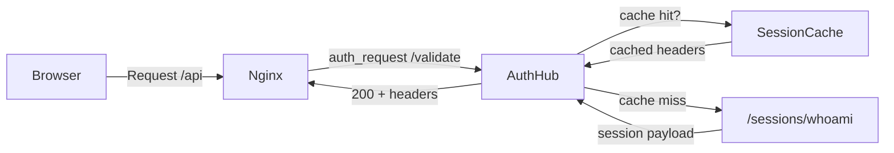

# Auth Hub

_Last reviewed: November 17, 2025_

**Location:** `auth-hub`

## Role
- Identity-Aware Proxy that bridges Nginx `auth_request` calls to Ory Kratos `/sessions/whoami`.
- Validates sessions, caches identities, and emits authoritative `X-Alt-*` headers (`X-Alt-User-Id`, `X-Alt-Tenant-Id`, `X-Alt-User-Email`) so downstream services stay auth-agnostic.
- Provides `/validate`, `/session`, `/csrf`, and `/health` endpoints while logging structured request metadata.

## Architecture & Flow
| Component | Responsibility |
| --- | --- |
| Handlers | `handler/validate_handler.go`, `session_handler.go`, `csrf_handler.go`, `health_handler.go` share a `slog` logger and wrap `KratosClient` + `SessionCache`. |
| Cache | `cache/session_cache.go` keeps entries for 5 minutes (default TTL) with ticker-based cleanup; `Get`/`Set` use RWMutex for safety. |
| Kratos client | `client/kratos_client.go` hits `/sessions/whoami` with the `ory_kratos_session` cookie and parses identity payloads. |
| Middleware | `main.go` installs request logging + recovery; handlers return 401 vs 500 based on `Kratos` error contents. |

## Endpoints & Behavior
- `GET /validate`: returns 200 + identity headers when `ory_kratos_session` cookie exists; caches the result (TTL = `CACHE_TTL` env, default 5m) to avoid repeated Kratos calls.
- `GET /session`: mirrors `/validate` but returns the session payload for downstream debugging (used by Next.js middleware).
- `POST /csrf`: stubbed handler that prepares for future CSRF validation; currently no enforcement.
- `GET /health`: lightweight readiness probe that responds with `200 OK`.
- Cache misses trigger `validate` to append `X-Alt-*` headers once Kratos returns identity; all failures log structured events.

## Configuration & Env
- `KRATOS_URL` (default `http://kratos:4433`), `PORT` (default `8888`), `CACHE_TTL` (parseable duration, default 5m).
- Config validation ensures non-empty values + positive TTL.
- Logger uses `slog.NewJSONHandler` with level from env; request log middleware logs status + latency.

## Testing & Tooling
- `go test ./...` covers handlers, cache, and Kratos client; mocks (gomock) simulate Kratos responses.
- `session_handler_test.go` ensures cache hits/ misses respond with headers; `cache/session_cache_test.go` manipulates cleanup loops to avoid ticker wait.
- Use `mockgen` when Kratos client interfaces evolve.

## Operational Runbook
1. `curl -i http://localhost:8888/health` → expect `200 OK`.
2. Warm Kratos cache by hitting `/validate` with `ory_kratos_session`; watch logs for cache hits (`cache_hit=true`).
3. To flush cache, restart service or remove TTL entry (future endpoint planned).
4. Adjust `CACHE_TTL` when load from recap-worker spikes; shorter TTL trades freshness for Kratos load.

## Observability
- Logs include `request_id`, `method`, `uri`, `latency_ms`, `cache_hit` booleans.
- Future `handler/metrics.go` will expose cache hit ratio, Kratos latency; for now, derive metrics from logs/ClickHouse.
- Add new headers? Update `validate_handler`, `auth-hub` duo, and Nginx `proxy_set_header` simultaneously.

## LLM Notes
- When editing auth-hub, specify whether change belongs in `handler/validate_handler.go`, `cache/session_cache.go`, or `client/kratos_client.go`.
- Mention cookie name `ory_kratos_session`, TTL semantics, and the difference between 401 (auth failure) vs 500 (infra error) to keep downstream handlers stable.
