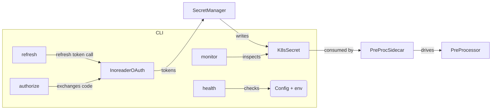

# Auth Token Manager

_Last reviewed: November 17, 2025_

**Location:** `auth-token-manager`

## Role
- Deno 2.x CLI that refreshes Inoreader OAuth2 tokens, validates configuration, and persists results into Kubernetes secrets consumed by ingestion services.
- Supports `authorize`, `refresh`, `monitor`, `health`, `validate`, and `help` commands while logging safely via `StructuredLogger`.
- Works in tandem with `pre-processor-sidecar` and `pre-processor` to keep Inoreader ingestion healthy.

## Command Flow
| Command | Purpose | Highlights |
| --- | --- | --- |
| `authorize` | Interactive OAuth bootstrap | Starts a local HTTP listener, exchanges code for tokens, writes JSON secret, prints `expires_at`. |
| `refresh` | Refreshes tokens | Uses `InoreaderTokenManager.refreshAccessToken`, updates secret via `K8sSecretManager`, enforces 5-second rate limits + retries/backoff. |
| `health` (default) | Validates config + dependencies | Runs config, env, Kubernetes connectivity, token horizon checks (healthy/degraded/unhealthy). |
| `monitor` | Long-running monitoring loop | Checks `expires_at`, `updated_at`, token staleness with thresholds (critical under 30m, warning under 2h), logs alerts and secrets status. |
| `validate` | Config validation | Ensures required env vars exist and are not placeholders; logs sanitized client ID snippet. |

## Configuration & Secrets
- `src/utils/config.ts` exposes:
  - `INOREADER_CLIENT_ID`, `INOREADER_CLIENT_SECRET`, `INOREADER_REDIRECT_URI` (default `http://localhost:8080/callback`).
  - Kubernetes metadata: `KUBERNETES_NAMESPACE` (defaults to `alt-processing`), `SECRET_NAME` (`pre-processor-sidecar-oauth2-token`), `ENABLE_SECRET_WATCH`.
  - Retry settings: `RETRY_MAX_*`, `RETRY_BASE_DELAY`, `RETRY_MAX_DELAY`, `RETRY_BACKOFF_FACTOR`.
  - Network timeouts: `HTTP_TIMEOUT`, `CONNECTIVITY_TIMEOUT`.
  - Logger flags (`LOG_LEVEL`, `LOG_INCLUDE_TIMESTAMP`).
- Config validation rejects placeholders (`demo-client-id`, `placeholder`), ensures minimal length, and prints a sanitized client ID summary.

## Core Integrations
- `InoreaderTokenManager` (src/auth/oauth.ts) implements refresh logic, interacts with `https://www.inoreader.com/oauth2/token`, and respects retry policy + circuit breaker semantics (max 3 attempts, exponential backoff).
- `K8sSecretManager` (`src/k8s/secret-manager-simple.ts`) reads/writes secrets via in-cluster API with JSON payload: `{access_token, refresh_token, expires_at}`.
- `StructuredLogger` (`src/utils/logger.ts`) redacts sensitive fields automatically; passes `access_token` metadata in logs only as `duration`/`status`.
- Monitor command introspects secret timestamps, classifies alerts (critical if <30m to expiry or >24h since update, warning between 2–6 hours) and exposes `needs_immediate_refresh`.

## Testing & Tooling
- `deno test` runs suites in `tests/`, stubbing `globalThis.fetch` and Kubernetes API via `@std/testing/mock`.
- `deno fmt` + `deno lint` enforce style; `deno task tm:health` wraps `deno run main.ts health`.
- TDD loop: write failing test for `InoreaderTokenManager`, mock `fetch`, then implement CLI flows.

## Runbook
1. **Dry run:** `deno task tm:health` after setting envs ensures env + secret connectivity.
2. **Manual refresh:** `deno run main.ts refresh` (with `--allow-net --allow-env`), watch logs for `Token refresh completed successfully`.
3. **Monitor mode:** `deno run --allow-net --allow-env main.ts monitor` (used by CronJobs) emits alert levels and horizon metrics for token horizon.
4. **Authorize CLI:** Run `deno run main.ts authorize`, open the printed URL, and follow the callback to bootstrap tokens if refresh token missing.
5. **Secret inspection:** `kubectl get secret <name> -n <ns> -o jsonpath='{.data.refresh_token}' | base64 -d` (avoid exposing tokens).

## Observability
- Logs from `monitor` include `time_until_expiry_hours`, `alert_level`, `needs_immediate_refresh`, `system_status`.
- Warnings surface when tokens expire within 30 minutes or `updated_at` lags >12h; the CLI exits `1` when `status === "unhealthy"`.
- Add watchers (e.g., Grafana alert) that parse the `monitor` log lines to detect `critical` alerts.

## LLM Notes
- When asking for new commands, mention required Deno permissions (`--allow-net --allow-env --allow-read`).
- Keep JSON secret schema (`access_token`, `refresh_token`, `expires_at`, `token_type`, `scope`) intact so downstream consumers continue working.
