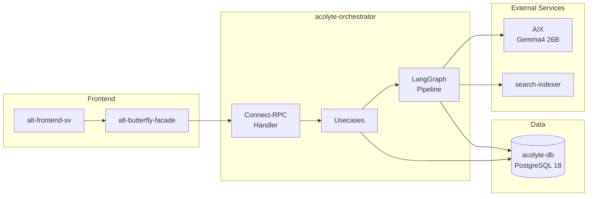

# Acolyte

Acolyte is Alt's versioned report generation orchestrator. It transforms evidence from multiple sources (RSS articles, search results) into structured, citation-backed reports using a multi-stage LLM pipeline. Every report version is tracked with field-level change items, enabling diff views and audit trails.

The system is built on **LangGraph** for orchestration, **Connect-RPC** for API boundaries, and **PostgreSQL 18** for persistence. Reports are generated using **Gemma4 26B** (via Ollama/AIX), with evidence retrieved from **search-indexer** (Meilisearch).

## Reading Order

| # | Document | What You'll Learn |
|---|----------|-------------------|
| 1 | [Architecture](./architecture.md) | Design invariants, service boundaries, database schema |
| 2 | [Data Flow](./data-flow.md) | Pipeline nodes, execution flow, checkpoint mechanics |
| 3 | [API Reference](./api-reference.md) | Connect-RPC endpoints, message schemas, streaming |
| 4 | [Extending](./extending.md) | How to add nodes, modify prompts, testing patterns |

## Key Terms

| Term | Definition |
|------|------------|
| **Report** | A versioned document with title, type, and sections. Mutable `current_version` points to the latest snapshot. |
| **Report Version** | Immutable snapshot of a report at a point in time. Contains `version_no` and `change_seq` for global ordering. |
| **Change Item** | Field-level change record: `added`, `updated`, `removed`, or `regenerated`. Enables precise diff views. |
| **Section** | A named part of a report (e.g., "Executive Summary", "Analysis"). Has its own version history. |
| **Run** | A single execution of the generation pipeline for a report. Tracks status, timing, and model info. |
| **Job** | Queue entry for pipeline execution. Uses `FOR UPDATE SKIP LOCKED` for race-free claiming. |
| **Pipeline Node** | A step in the LangGraph StateGraph (e.g., planner, writer, critic). |
| **Checkpoint** | LangGraph state persistence at super-step boundaries. Enables resume after failure. |
| **Evidence** | Articles retrieved from search-indexer as source material for report generation. |
| **Fact** | Atomic extracted claim with citation, normalized from evidence quotes. |
| **Brief** | Typed input specification: topic, entities, constraints, date range. |
| **Critique** | Critic node output: verdict (`accept`/`revise`) with failure mode analysis. |

## Quick Links

| Area | Path |
|------|------|
| Domain models | `acolyte-orchestrator/acolyte/domain/` |
| Pipeline graph | `acolyte-orchestrator/acolyte/usecase/graph/report_graph.py` |
| Pipeline nodes | `acolyte-orchestrator/acolyte/usecase/graph/nodes/` |
| Pipeline state | `acolyte-orchestrator/acolyte/usecase/graph/state.py` |
| Port interfaces | `acolyte-orchestrator/acolyte/port/` |
| Connect-RPC handler | `acolyte-orchestrator/acolyte/handler/connect_service.py` |
| Gateways | `acolyte-orchestrator/acolyte/gateway/` |
| Proto definition | `proto/alt/acolyte/v1/acolyte.proto` |
| Database migrations | `acolyte-migration-atlas/migrations/` |
| Frontend routes | `alt-frontend-sv/src/routes/(app)/acolyte/` |
| Frontend components | `alt-frontend-sv/src/lib/components/mobile/acolyte/` |
| BFF routing | `alt-butterfly-facade/internal/handler/` |
| Compose stack | `compose/acolyte.yaml` |
