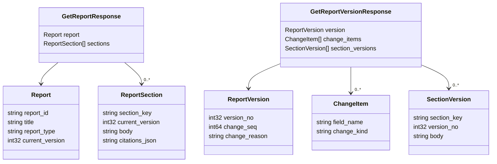

# API Reference

Acolyte exposes a single Connect-RPC service with 11 endpoints for report management and generation.

## AcolyteService

**Handler:** `acolyte-orchestrator/acolyte/handler/connect_service.py`

**Proto:** `proto/alt/acolyte/v1/acolyte.proto`

| RPC | Request | Response | Description |
|-----|---------|----------|-------------|
| `CreateReport` | `CreateReportRequest` | `CreateReportResponse` | Create a new report |
| `GetReport` | `GetReportRequest` | `GetReportResponse` | Get report with current version and sections |
| `ListReports` | `ListReportsRequest` | `ListReportsResponse` | Paginated list of reports (metadata only) |
| `GetReportVersion` | `GetReportVersionRequest` | `GetReportVersionResponse` | Get a specific version snapshot |
| `ListReportVersions` | `ListReportVersionsRequest` | `ListReportVersionsResponse` | Version history with change items |
| `DiffReportVersions` | `DiffReportVersionsRequest` | `DiffReportVersionsResponse` | Diff between two versions |
| `StartReportRun` | `StartReportRunRequest` | `StartReportRunResponse` | Enqueue a generation run |
| `GetRunStatus` | `GetRunStatusRequest` | `GetRunStatusResponse` | Current status of a run |
| `StreamRunProgress` | `StreamRunProgressRequest` | stream of `StreamRunProgressResponse` | Real-time generation progress |
| `RerunSection` | `RerunSectionRequest` | `RerunSectionResponse` | Re-generate a single section |
| `HealthCheck` | `HealthCheckRequest` | `HealthCheckResponse` | Service health status |

## Report CRUD

### CreateReport

Creates a new report with initial metadata.

**Request:**

| Field | Type | Description |
|-------|------|-------------|
| `title` | string | Report title |
| `report_type` | string | Type: `weekly_briefing`, `trend_analysis`, `deep_dive` |
| `scope` | map<string, string> | Scope parameters (topic, date_range, sources) |

**Response:**

| Field | Type | Description |
|-------|------|-------------|
| `report_id` | string | UUID of the created report |

### GetReport

Returns a report with its current version and all sections.

**Request:**

| Field | Type | Description |
|-------|------|-------------|
| `report_id` | string | Report UUID |

**Response:**

| Field | Type | Description |
|-------|------|-------------|
| `report` | Report | Report metadata |
| `sections` | ReportSection[] | Current section content |

### ListReports

Returns a paginated list of reports (metadata only, no body content).

**Request:**

| Field | Type | Default | Description |
|-------|------|---------|-------------|
| `cursor` | string | empty | Opaque pagination cursor |
| `limit` | int32 | 20 | Items per page (max 100) |

**Response:**

| Field | Type | Description |
|-------|------|-------------|
| `reports` | ReportSummary[] | Report metadata list |
| `next_cursor` | string | Cursor for next page |
| `has_more` | bool | Whether more pages exist |

## Version History

### GetReportVersion

Returns a specific version snapshot with change items and section versions.

**Request:**

| Field | Type | Description |
|-------|------|-------------|
| `report_id` | string | Report UUID |
| `version_no` | int32 | Version number to retrieve |

**Response:**

| Field | Type | Description |
|-------|------|-------------|
| `version` | ReportVersion | Version metadata |
| `change_items` | ChangeItem[] | Field-level changes |
| `section_versions` | SectionVersion[] | Section content at this version |

### ListReportVersions

Returns the version history for a report.

**Request:**

| Field | Type | Description |
|-------|------|-------------|
| `report_id` | string | Report UUID |
| `cursor` | string | Pagination cursor |
| `limit` | int32 | Items per page |

**Response:**

| Field | Type | Description |
|-------|------|-------------|
| `versions` | ReportVersionSummary[] | Version summaries with change items |
| `next_cursor` | string | Cursor for next page |
| `has_more` | bool | Whether more pages exist |

### DiffReportVersions

Returns the diff between two versions of a report.

**Request:**

| Field | Type | Description |
|-------|------|-------------|
| `report_id` | string | Report UUID |
| `from_version` | int32 | Starting version |
| `to_version` | int32 | Ending version |

**Response:**

| Field | Type | Description |
|-------|------|-------------|
| `change_items` | ChangeItem[] | Aggregated field changes |
| `section_diffs` | SectionDiff[] | Per-section body diffs |

## Generation Runs

### StartReportRun

Enqueues a generation run for a report. Creates a job that will be claimed by a worker.

**Request:**

| Field | Type | Description |
|-------|------|-------------|
| `report_id` | string | Report UUID |

**Response:**

| Field | Type | Description |
|-------|------|-------------|
| `run_id` | string | UUID of the created run |

### GetRunStatus

Returns the current status of a generation run.

**Request:**

| Field | Type | Description |
|-------|------|-------------|
| `run_id` | string | Run UUID |

**Response:**

| Field | Type | Description |
|-------|------|-------------|
| `run` | ReportRun | Run metadata and status |
| `jobs` | ReportJob[] | Associated job records |

### StreamRunProgress

Streams real-time generation progress events. Server-sent stream.

**Request:**

| Field | Type | Description |
|-------|------|-------------|
| `run_id` | string | Run UUID |

**Response (stream):**

| Field | Type | Description |
|-------|------|-------------|
| `kind` | string | Event kind: `step_start`, `step_complete`, `delta`, `error`, `done` |
| `step` | StepEvent | Step progress (when kind is `step_start` or `step_complete`) |
| `delta` | string | Incremental content (when kind is `delta`) |
| `error_message` | string | Error details (when kind is `error`) |
| `done` | RunDoneEvent | Completion info (when kind is `done`) |

**Note:** `StreamRunProgress` is currently unimplemented (P2).

### RerunSection

Re-generates a single section of a report without affecting other sections.

**Request:**

| Field | Type | Description |
|-------|------|-------------|
| `report_id` | string | Report UUID |
| `section_key` | string | Section key to regenerate |

**Response:**

| Field | Type | Description |
|-------|------|-------------|
| `run_id` | string | UUID of the created run |

**Note:** `RerunSection` is currently unimplemented (P2).

## Message Schemas

### Report

| Field | Type | Source | Description |
|-------|------|--------|-------------|
| `report_id` | string | DB | UUID primary key |
| `title` | string | CreateReport | Report title |
| `report_type` | string | CreateReport | `weekly_briefing`, `trend_analysis`, `deep_dive` |
| `current_version` | int32 | Pipeline | Latest version number (0 = never generated) |
| `latest_successful_run_id` | string | Pipeline | UUID of last successful run |
| `created_at` | string | DB | ISO 8601 timestamp |

### ReportSummary

Lightweight version of Report for list views.

| Field | Type | Description |
|-------|------|-------------|
| `report_id` | string | UUID |
| `title` | string | Report title |
| `report_type` | string | Report type |
| `current_version` | int32 | Latest version |
| `latest_run_status` | string | Status of most recent run |
| `created_at` | string | Creation timestamp |

### ReportVersion

| Field | Type | Description |
|-------|------|-------------|
| `report_id` | string | Report UUID |
| `version_no` | int32 | Version number (1, 2, 3, ...) |
| `change_seq` | int64 | Global ordering sequence |
| `change_reason` | string | Human-readable change description |
| `created_at` | string | Version creation timestamp |
| `prompt_template_version` | string | Version of prompts used |

### ChangeItem

Field-level change record.

| Field | Type | Description |
|-------|------|-------------|
| `field_name` | string | Field that changed (e.g., `section:executive_summary`) |
| `change_kind` | string | `added`, `updated`, `removed`, `regenerated` |
| `old_fingerprint` | string | Hash of previous content |
| `new_fingerprint` | string | Hash of new content |

### ReportSection

| Field | Type | Description |
|-------|------|-------------|
| `section_key` | string | Unique key (e.g., `executive_summary`, `analysis`) |
| `current_version` | int32 | Section's current version |
| `display_order` | int32 | Order for UI rendering |
| `body` | string | Markdown content |
| `citations_json` | string | JSON array of citation objects |

### SectionVersion

| Field | Type | Description |
|-------|------|-------------|
| `section_key` | string | Section key |
| `version_no` | int32 | Section version number |
| `body` | string | Markdown content |
| `citations_json` | string | JSON array of citations |
| `created_at` | string | Timestamp |

### SectionDiff

| Field | Type | Description |
|-------|------|-------------|
| `section_key` | string | Section key |
| `old_body` | string | Previous body (null if added) |
| `new_body` | string | New body (null if removed) |
| `old_version` | int32 | Previous version number |
| `new_version` | int32 | New version number |

### ReportRun

| Field | Type | Description |
|-------|------|-------------|
| `run_id` | string | UUID |
| `report_id` | string | Parent report UUID |
| `target_version_no` | int32 | Version this run will create |
| `run_status` | string | `pending`, `running`, `succeeded`, `failed`, `cancelled` |
| `planner_model` | string | Model used for Planner node |
| `writer_model` | string | Model used for Writer node |
| `critic_model` | string | Model used for Critic node |
| `started_at` | string | Run start timestamp |
| `finished_at` | string | Run completion timestamp |
| `failure_code` | string | Error code (if failed) |
| `failure_message` | string | Error details (if failed) |

### ReportJob

| Field | Type | Description |
|-------|------|-------------|
| `job_id` | string | UUID |
| `run_id` | string | Parent run UUID |
| `job_status` | string | `pending`, `claimed`, `running`, `succeeded`, `failed` |
| `attempt_no` | int32 | Attempt number (starts at 0) |
| `claimed_by` | string | Worker ID that claimed the job |
| `claimed_at` | string | Claim timestamp |
| `created_at` | string | Job creation timestamp |

## Response Relationships

## Streaming Events

The `StreamRunProgress` RPC uses these event kinds:

| Kind | Payload | Description |
|------|---------|-------------|
| `step_start` | StepEvent | Node execution started |
| `step_complete` | StepEvent | Node execution completed |
| `delta` | string | Incremental content (for future streaming generation) |
| `error` | string | Pipeline error occurred |
| `done` | RunDoneEvent | Pipeline completed |

### StepEvent

| Field | Type | Description |
|-------|------|-------------|
| `step_name` | string | Node name (e.g., `planner`, `writer`) |
| `step_index` | int32 | Current step index (0-based) |
| `total_steps` | int32 | Total number of steps |

### RunDoneEvent

| Field | Type | Description |
|-------|------|-------------|
| `new_version_no` | int32 | Created version number |
| `run_status` | string | Final status (`succeeded`, `failed`) |
