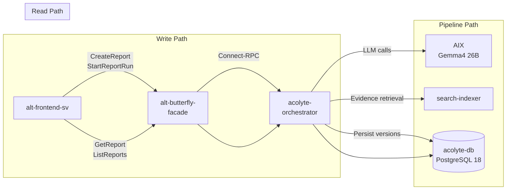
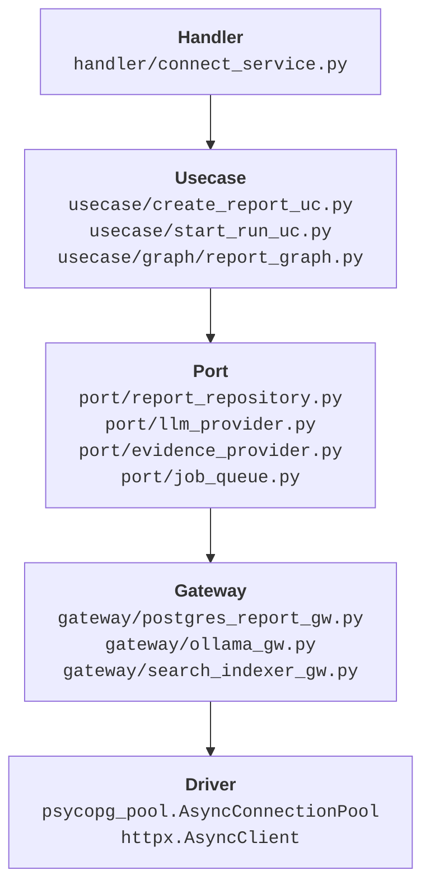

# Architecture

This document explains the design philosophy, service boundaries, and database schema behind Acolyte.

## Design Invariants

These five invariants are non-negotiable. Every contribution must respect them.

### 1. Version-First

State changes are tracked through explicit version numbers, not `updated_at` timestamps. The `reports` table has a mutable `current_version` integer, while `report_versions` contains immutable snapshots. When content changes, a new version row is inserted rather than updating existing data.

**Why:** Timestamps answer "when" but not "what changed." Integer versions enable precise diffing, rollback, and audit trails. The `change_seq` BIGSERIAL provides global ordering across all reports.

### 2. Two-Layer Versioning

Reports and sections are versioned independently. A report version bump doesn't require all sections to change, and a section can be regenerated without bumping the report version (via `RerunSection`).

**Why:** Fine-grained regeneration. Users can fix one section without invalidating the entire report.

### 3. Immutable Snapshots

The `report_versions` and `report_section_versions` tables are INSERT-only. No UPDATE or DELETE operations. Each generation produces new rows rather than modifying existing ones.

**Why:** Complete audit trail, easy rollback, and no risk of data corruption from partial updates.

### 4. JSONB for Auxiliary Only

Core queryable fields (`title`, `body`, `version_no`) are stored as SQL columns. JSONB is reserved for auxiliary data: `citations_jsonb`, `scope_snapshot`, `outline_snapshot`. These are read as blobs, not queried.

**Why:** SQL columns enable indexing and type safety. JSONB provides flexibility for evolving nested structures without schema migrations.

### 5. Job Queue Safety

Pipeline execution uses `SELECT ... FOR UPDATE SKIP LOCKED` on the `report_jobs` table. Workers claim jobs atomically without polling-based race conditions.

**Why:** No duplicate execution, no lost jobs, no thundering herd on restart.

## Service Boundaries

| Service | Responsibility |
|---------|---------------|
| **acolyte-orchestrator** | Python service hosting Connect-RPC handlers, LangGraph pipeline, and persistence logic. |
| **acolyte-db** | Dedicated PostgreSQL 18 database for Acolyte data. Isolated from alt-db. |
| **alt-butterfly-facade** | BFF that routes `/alt.acolyte.v1.AcolyteService/*` to acolyte-orchestrator. Injects `X-Service-Token`. |
| **alt-frontend-sv** | SvelteKit frontend with routes at `/acolyte/*`. |
| **search-indexer** | Evidence retrieval via REST API (`GET /v1/search`). Proxies Meilisearch. |
| **AIX** | LLM inference plane running Gemma4 26B via Ollama. |

## Clean Architecture Layers

Acolyte follows Alt's standard Clean Architecture pattern:

**Dependency rule:** Each layer only depends on the layer directly below it. Usecases depend on port interfaces (protocols), never on gateways or external packages directly.

## Database Schema

All tables are owned by `acolyte-orchestrator` and live in the `acolyte-db` PostgreSQL database.

### Core Tables

| Table | Mutability | Purpose | Key Columns |
|-------|------------|---------|-------------|
| `reports` | mutable | Current report state | `report_id`, `title`, `report_type`, `current_version` |
| `report_versions` | immutable | Version snapshots | `(report_id, version_no)`, `change_seq` (BIGSERIAL), `change_reason` |
| `report_change_items` | immutable | Field-level changes per version | `(report_id, version_no, field_name)`, `change_kind`, `old/new_fingerprint` |
| `report_sections` | mutable | Section current state | `(report_id, section_key)`, `current_version`, `display_order` |
| `report_section_versions` | immutable | Section content snapshots | `(report_id, section_key, version_no)`, `body`, `citations_jsonb` |

### Execution Tables

| Table | Mutability | Purpose | Key Columns |
|-------|------------|---------|-------------|
| `report_runs` | append-only | Execution records | `run_id`, `report_id`, `target_version_no`, `run_status`, model info, timing |
| `report_jobs` | mutable | Job queue | `job_id`, `run_id`, `job_status`, `claimed_by`, `claimed_at` |

### LangGraph Checkpoint Tables

These tables are managed by LangGraph's `PostgresSaver`, not by Atlas migrations:

| Table | Purpose |
|-------|---------|
| `checkpoints` | Super-step state snapshots |
| `checkpoint_blobs` | Serialized state data |
| `checkpoint_writes` | Write coordination |

**Thread ID format:** `acolyte-run:{run_id}`

## Change Kind Values

The `change_kind` column in `report_change_items` uses these values:

| Value | Meaning |
|-------|---------|
| `added` | Field was created (new section, first generation) |
| `updated` | Field content changed from previous version |
| `removed` | Field was deleted |
| `regenerated` | Field was regenerated but content may be same (e.g., RerunSection) |

## Run Status Values

The `run_status` column in `report_runs`:

| Status | Meaning |
|--------|---------|
| `pending` | Run created, waiting for job claim |
| `running` | Pipeline actively executing |
| `succeeded` | Pipeline completed, version bumped |
| `failed` | Pipeline failed, see `failure_code` and `failure_message` |
| `cancelled` | Run was cancelled (not currently implemented) |

## Job Status Values

The `job_status` column in `report_jobs`:

| Status | Meaning |
|--------|---------|
| `pending` | Job waiting to be claimed |
| `claimed` | Job claimed by a worker |
| `running` | Job actively executing pipeline |
| `succeeded` | Job completed successfully |
| `failed` | Job failed, may be retried |
