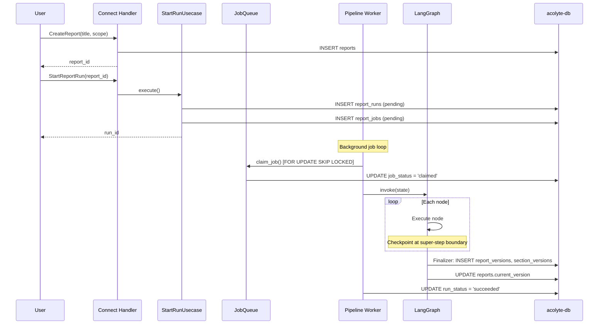
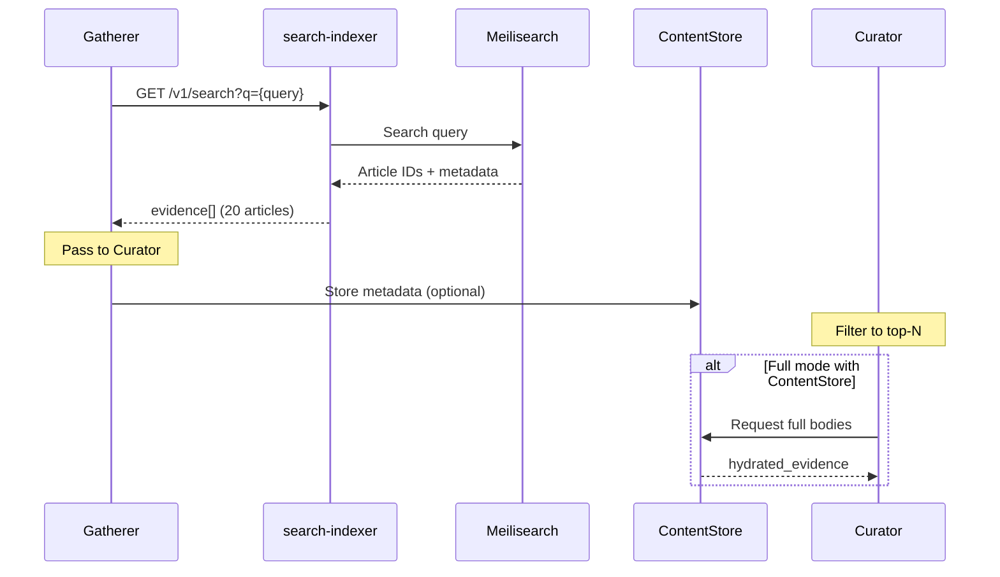

# Data Flow

This document traces how data moves through Acolyte: from report creation, through the LangGraph pipeline, to version persistence.

## Pipeline Nodes

The pipeline has two modes depending on whether a `content_store` is configured:

**Basic mode (6 nodes):** planner → gatherer → curator → writer → critic → finalizer

**Full mode (11 nodes):** planner → gatherer → curator → hydrator → compressor → quote_selector → fact_normalizer → section_planner → writer → critic → finalizer

| Node | Input | Output | LLM Call | Purpose |
|------|-------|--------|----------|---------|
| **Planner** | brief/scope | sections[] | Yes | Generate section outline from input specification |
| **Gatherer** | scope | evidence[] | No | Retrieve articles from search-indexer |
| **Curator** | evidence[] | curated[] | Yes | Filter evidence to top-N relevant articles per section |
| **Hydrator** | curated[] | hydrated_evidence | No | Fetch full article bodies for curated items |
| **Compressor** | hydrated_evidence | compressed_evidence | No | Truncate bodies to fit context window limits |
| **QuoteSelector** | compressed_evidence | selected_quotes[] | Yes* | Extract relevant quotes from each article |
| **FactNormalizer** | selected_quotes[] | extracted_facts[] | Yes* | Normalize quotes into atomic facts with citations |
| **SectionPlanner** | sections, facts | claim_plans | Yes | Plan claims per section with fact assignment |
| **Writer** | claim_plans | sections | Yes | Generate section bodies with citations |
| **Critic** | sections | critique | Yes | GroUSE failure mode detection, verdict |
| **Finalizer** | all | DB write | No | Persist version to PostgreSQL |

*QuoteSelector and FactNormalizer use incremental self-loop when checkpointing is enabled.

## Report Generation Lifecycle



## Pipeline Flow Modes

### Basic Mode (No Content Store)

When `content_store` is `None`, the pipeline skips evidence hydration and fact extraction:

```
planner → gatherer → curator → writer → critic → finalizer
                                  ↑         |
                                  └─ revise ┘
```

This mode is faster but produces less grounded reports (no explicit fact extraction).

### Full Mode (With Content Store)

When `content_store` is provided, the pipeline performs full evidence grounding:

```
planner → gatherer → curator → hydrator → compressor →
    quote_selector → fact_normalizer → section_planner →
    writer → critic → finalizer
      ↑         |
      └─ revise ┘
```

## Revision Loop

The Critic node can return `verdict: "revise"` with failure mode analysis. When this happens:

1. The `revision_count` in state is incremented
2. The pipeline loops back to Writer
3. Writer receives `critique` from state and incorporates feedback
4. **Important:** SectionPlanner is NOT re-run; `claim_plans` persist in state

The revision loop has a maximum of 2 iterations (`MAX_REVISIONS`). After that, the pipeline accepts whatever content exists.

## Checkpoint Mechanics

When `CHECKPOINT_ENABLED=true` and a `PostgresSaver` checkpointer is provided:

### Super-Step Boundaries

LangGraph saves state at each node boundary:

```
planner → [checkpoint] → gatherer → [checkpoint] → curator → [checkpoint] →
hydrator → [checkpoint] → compressor → [checkpoint] →
quote_selector → [checkpoint] → fact_normalizer → [checkpoint] →
section_planner → [checkpoint] → writer → [checkpoint] →
critic → [checkpoint] → finalizer → [checkpoint] → END
```

### Incremental Self-Loop

QuoteSelector and FactNormalizer support incremental processing when checkpointing is enabled:

```
quote_selector(article_1) → [checkpoint] →
quote_selector(article_2) → [checkpoint] →
...
quote_selector(article_N) → [checkpoint] → fact_normalizer
```

This uses state fields:
- `quote_selector_work_items`: list of articles to process
- `quote_selector_cursor`: current position
- `fact_normalizer_work_quotes`: list of quotes to normalize
- `fact_normalizer_cursor`: current position

### Thread ID

Each run is identified by `acolyte-run:{run_id}`. Resuming with the same run_id restores state from the last checkpoint.

### Durability

`durability="sync"` ensures each checkpoint is written to PostgreSQL before proceeding to the next node.

## Evidence Retrieval Flow



## Node Details

### PlannerNode

**Input:** `brief` or `scope` from state

**Output:** `outline` (list of section definitions)

**Behavior:**
- Generates section outline using structured JSON output
- Falls back to 3 fixed sections if JSON parsing fails
- Uses `num_predict=512` with low temperature

### GathererNode

**Input:** `scope` (topic, date_range)

**Output:** `evidence` (list of article metadata)

**Behavior:**
- Queries search-indexer with multi-facet queries
- Returns up to 20 articles per query
- Optionally stores in ContentStore for later hydration

### CuratorNode

**Input:** `evidence`

**Output:** `curated`, `curated_by_section`

**Behavior:**
- Scores articles for relevance to each section
- Filters to top-N (typically 10) per section
- Uses LLM for semantic relevance scoring

### HydratorNode

**Input:** `curated`

**Output:** `hydrated_evidence` (article_id → body)

**Behavior:**
- Fetches full article bodies from ContentStore
- Only hydrates curated articles (not all evidence)

### CompressorNode

**Input:** `hydrated_evidence`

**Output:** `compressed_evidence` (article_id → CompressedSpan[])

**Behavior:**
- Truncates article bodies to token budget
- Creates span markers for citation tracking

### QuoteSelectorNode

**Input:** `compressed_evidence`

**Output:** `selected_quotes`

**Behavior:**
- Extracts relevant quotes from each article
- Uses incremental self-loop when checkpointing enabled
- Each quote includes source article reference

### FactNormalizerNode

**Input:** `selected_quotes`

**Output:** `extracted_facts`

**Behavior:**
- Normalizes quotes into atomic facts
- Adds citation metadata
- Uses `reasoning` field first in JSON schema (ADR-632 pattern)

### SectionPlannerNode

**Input:** `outline`, `extracted_facts`

**Output:** `claim_plans` (section_key → PlannedClaim[])

**Behavior:**
- Assigns facts to sections
- Plans claim structure for each section
- NOT re-run on revision (claim_plans persist)

### WriterNode

**Input:** `claim_plans`, optionally `critique`

**Output:** `sections` (section_key → body)

**Behavior:**
- Generates section bodies from claim plans
- On revision, incorporates critic feedback
- Tracks `best_sections` for fallback on errors

### CriticNode

**Input:** `sections`

**Output:** `critique`, `failure_modes`

**Behavior:**
- GroUSE failure mode detection
- Returns `verdict: "accept"` or `verdict: "revise"`
- Identifies specific issues for writer feedback

### FinalizerNode

**Input:** All state

**Output:** `final_version_no`

**Behavior:**
- Computes change items (field fingerprints)
- Inserts `report_versions` and `report_section_versions`
- Updates `reports.current_version`
- Updates `report_runs.run_status = 'succeeded'`

## State Fields Reference

| Field | Type | Set By | Used By |
|-------|------|--------|---------|
| `report_id` | str | Handler | Finalizer |
| `run_id` | str | Handler | Checkpointer |
| `brief` | dict | Handler | Planner, Gatherer |
| `scope` | dict | Handler | Planner, Gatherer (deprecated) |
| `outline` | list[dict] | Planner | SectionPlanner, Writer |
| `evidence` | list[dict] | Gatherer | Curator |
| `curated` | list[dict] | Curator | Hydrator |
| `curated_by_section` | dict | Curator | SectionPlanner |
| `source_map` | dict | Gatherer | All nodes (ID mapping) |
| `hydrated_evidence` | dict | Hydrator | Compressor |
| `compressed_evidence` | dict | Compressor | QuoteSelector |
| `selected_quotes` | list[dict] | QuoteSelector | FactNormalizer |
| `extracted_facts` | list[dict] | FactNormalizer | SectionPlanner |
| `claim_plans` | dict | SectionPlanner | Writer |
| `sections` | dict | Writer | Critic, Finalizer |
| `critique` | dict | Critic | Writer (revision) |
| `failure_modes` | list[dict] | Critic | Writer (revision) |
| `revision_count` | int | Critic | Routing |
| `final_version_no` | int | Finalizer | Response |
| `error` | str | Any | Error handling |
