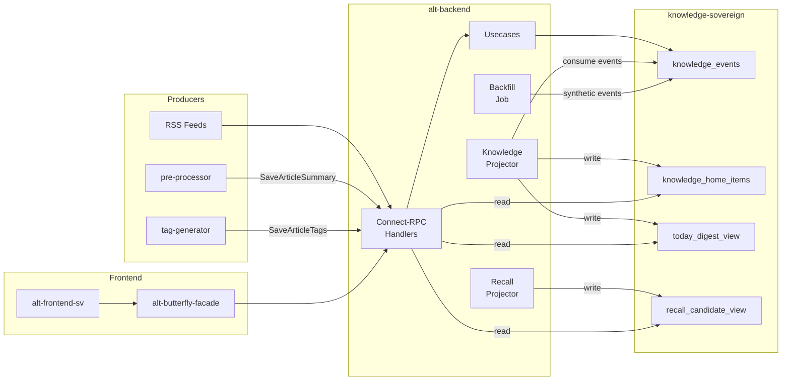

# Knowledge Home

Knowledge Home is Alt's central knowledge discovery surface. It transforms raw RSS articles into a personalized, explainable feed where every item tells you *why* it appeared. Built on an **immutable, event-sourced CQRS architecture**, Knowledge Home treats events as the source of truth and read models as disposable projections that can be rebuilt at any time.

The system spans multiple services: **alt-backend** hosts the projectors and API handlers, **knowledge-sovereign** owns all durable state via a dedicated database, and **alt-frontend-sv** renders the UI through a BFF layer. External services like **pre-processor** (summaries) and **tag-generator** (tags) feed events into the pipeline.

## Reading Order

| # | Document | What You'll Learn |
|---|----------|-------------------|
| 1 | [Architecture](./architecture.md) | Design invariants, service boundaries, database schema |
| 2 | [Data Flow](./data-flow.md) | End-to-end event lifecycle, projector mechanics, scoring |
| 3 | [API Reference](./api-reference.md) | Connect-RPC endpoints, message schemas, service quality |
| 4 | [Extending](./extending.md) | How to add events, signals, projections; operational recipes |

## Key Terms

| Term | Definition |
|------|------------|
| **Event Log** | Append-only `knowledge_events` table. Source of truth for all state. |
| **Projection** | Read-optimized table derived from events (e.g., `knowledge_home_items`). Disposable and rebuildable. |
| **Projector** | Background job that consumes events and writes projections. Checkpoint-based, idempotent. |
| **Checkpoint** | Tracks the last processed `event_seq` for each projector. Enables incremental catch-up. |
| **Backfill** | One-time job that generates synthetic `ArticleCreated` events for pre-existing articles. |
| **Reproject** | Rebuild projections from scratch by replaying the event log. Used for schema migrations and algorithm changes. |
| **Lens** | A saved viewpoint (tag/feed/recency filters) that changes which items appear in the Home feed. |
| **Why-reason** | Explains why an item was surfaced (e.g., `new_unread`, `tag_hotspot`, `summary_completed`). |
| **Supersede** | When a summary or tag set is replaced by a newer version, the item shows an "updated" badge. |
| **Recall Candidate** | An item surfaced for re-engagement based on past interaction signals. |
| **TodayDigest** | Daily aggregation snapshot: article counts, top tags, availability flags. |
| **Knowledge Sovereign** | Independent microservice that owns all Knowledge Home writes and durable state. |

## Quick Links

| Area | Path |
|------|------|
| Domain models | `alt-backend/app/domain/knowledge_event.go`, `knowledge_home_item.go`, `today_digest.go`, `recall_candidate.go`, `recall_signal.go` |
| Projectors | `alt-backend/app/job/knowledge_projector.go`, `recall_projector.go` |
| Projector runner | `alt-backend/app/job/knowledge_projector_runner.go` |
| API handler | `alt-backend/app/connect/v2/knowledge_home/handler.go` |
| Admin handler | `alt-backend/app/connect/v2/knowledge_home_admin/handler.go` |
| Port interfaces | `alt-backend/app/port/knowledge_home_port/`, `today_digest_port/`, `recall_candidate_port/`, `recall_signal_port/`, `knowledge_event_port/` |
| Sovereign service | `knowledge-sovereign/app/main.go`, `knowledge-sovereign/app/handler/` |
| Sovereign client | `alt-backend/app/driver/sovereign_client/` (8 files: `client.go`, `read_client.go`, `write_ports.go`, `watch_client.go`, `signal_client.go`, `backfill_client.go`, `lens_client.go`, `reproject_client.go`) |
| Sovereign proto | `proto/services/sovereign/v1/sovereign.proto` (43 RPCs) |
| Public API proto | `proto/alt/knowledge_home/v1/knowledge_home.proto` |
| Admin API proto | `proto/alt/knowledge_home/v1/knowledge_home_admin.proto` |
| Feature flags | `alt-backend/app/domain/feature_flag.go`, `alt-backend/app/gateway/feature_flag_gateway/gateway.go` |
| Migrations | `knowledge-sovereign/migrations/` (5 migrations) |
| Frontend hooks | `alt-frontend-sv/src/lib/hooks/useKnowledgeHome.svelte.ts`, `useRecallRail.svelte.ts`, `useLens.svelte.ts`, `useStreamUpdates.svelte.ts` |
| Frontend components | `alt-frontend-sv/src/lib/components/knowledge-home/` |
| BFF routing | `alt-butterfly-facade/internal/handler/proxy_handler.go`, `admin_proxy_handler.go` |
