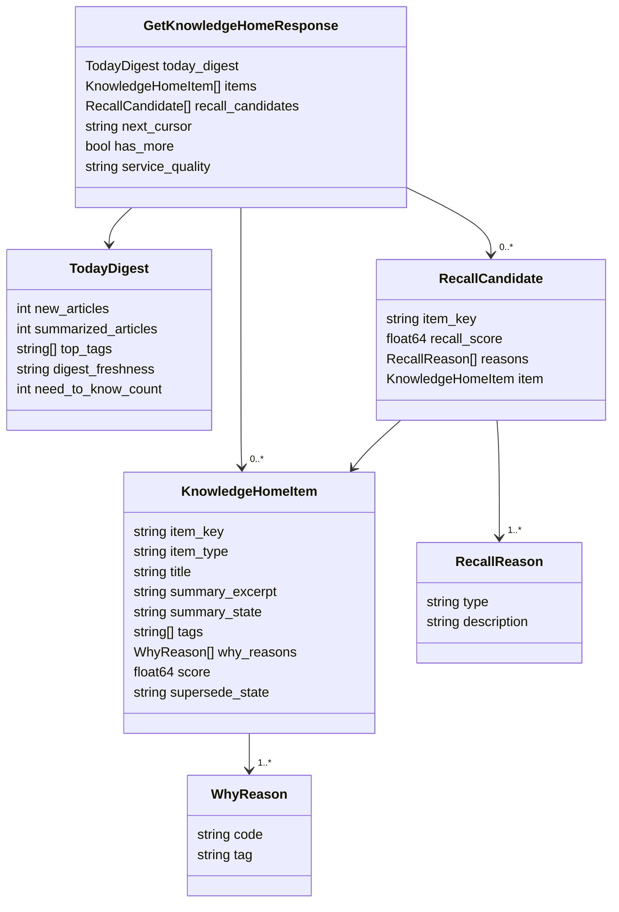

# API Reference

Knowledge Home exposes two Connect-RPC services: a **public API** for user-facing operations and an **admin API** for operational tooling.

## Public API: KnowledgeHomeService

**Handler:** `alt-backend/app/connect/v2/knowledge_home/handler.go`

| RPC | Request | Response | Description |
|-----|---------|----------|-------------|
| `GetKnowledgeHome` | `GetKnowledgeHomeRequest` | `GetKnowledgeHomeResponse` | Main feed endpoint: returns items, digest, recall candidates with pagination |
| `TrackHomeItemsSeen` | `TrackHomeItemsSeenRequest` | `TrackHomeItemsSeenResponse` | Reports which items were rendered on screen (exposure tracking) |
| `TrackHomeAction` | `TrackHomeActionRequest` | `TrackHomeActionResponse` | Tracks user interactions: `open`, `dismiss`, `ask`, `listen` |
| `GetRecallRail` | `GetRecallRailRequest` | `GetRecallRailResponse` | Returns recall candidates for the recall rail sidebar |
| `SnoozeRecallCandidate` | `SnoozeRecallCandidateRequest` | `SnoozeRecallCandidateResponse` | Temporarily hides a recall candidate until a specified time |
| `DismissRecallCandidate` | `DismissRecallCandidateRequest` | `DismissRecallCandidateResponse` | Permanently removes a recall candidate |
| `CreateLens` | `CreateLensRequest` | `CreateLensResponse` | Creates a new saved viewpoint with filter rules |
| `UpdateLens` | `UpdateLensRequest` | `UpdateLensResponse` | Updates an existing lens name or filter rules |
| `ListLenses` | `ListLensesRequest` | `ListLensesResponse` | Lists all lenses for the current user |
| `SelectLens` | `SelectLensRequest` | `SelectLensResponse` | Activates a lens (changes which items appear in the feed) |
| `ArchiveLens` | `ArchiveLensRequest` | `ArchiveLensResponse` | Soft-deletes a lens |
| `StreamKnowledgeHomeUpdates` | `StreamKnowledgeHomeUpdatesRequest` | stream of `StreamEvent` | Server-sent stream of real-time feed updates |

### GetKnowledgeHome

The primary read endpoint. Accepts these parameters:

| Parameter | Type | Default | Description |
|-----------|------|---------|-------------|
| `limit` | int32 | 20 | Items per page (max 100) |
| `cursor` | string | empty | Opaque pagination cursor from previous response |
| `date` | string | today | Date filter in `YYYY-MM-DD` format |
| `lens_id` | string | empty | Active lens ID for filtered view |

Returns:

```
GetKnowledgeHomeResponse
  +-- today_digest: TodayDigest
  +-- items[]: KnowledgeHomeItem
  +-- recall_candidates[]: RecallCandidate
  +-- next_cursor: string
  +-- has_more: bool
  +-- service_quality: string (full | degraded | fallback)
```

## Admin API: KnowledgeHomeAdminService

**Handler:** `alt-backend/app/connect/v2/knowledge_home_admin/handler.go`

Requires service-token authentication (no user JWT).

| RPC | Description |
|-----|-------------|
| `TriggerBackfill` | Starts a new backfill job for a given projection version |
| `PauseBackfill` | Pauses a running backfill job |
| `ResumeBackfill` | Resumes a paused backfill job |
| `GetBackfillStatus` | Returns progress of a backfill job |
| `GetProjectionHealth` | Returns active version, checkpoint seq, last updated time |
| `GetFeatureFlags` | Returns current feature flag configuration |
| `StartReproject` | Initiates a projection rebuild (mode, from/to version, optional time range) |
| `GetReprojectStatus` | Returns status of a reproject run |
| `ListReprojectRuns` | Lists all reproject runs with optional status filter |
| `CompareReproject` | Compares item counts, scores, and why-distributions between versions |
| `SwapReproject` | Atomically swaps the active projection version |
| `RollbackReproject` | Rolls back to the previous projection version |
| `GetSLOStatus` | Returns SLI values, error budgets, and active alerts |
| `RunProjectionAudit` | Samples items and verifies projection correctness |

## Message Schemas

### KnowledgeHomeItem

The core domain object for a single item in the Knowledge Home feed.

| Field | Type | Source | Description |
|-------|------|--------|-------------|
| `user_id` | UUID | Event | Owner of this item |
| `tenant_id` | UUID | Event | Tenant scope |
| `item_key` | string | Projector | Unique key, e.g., `article:{uuid}` |
| `item_type` | string | Projector | `article`, `recap_anchor`, or `pulse_anchor` |
| `primary_ref_id` | UUID | Projector | Reference to the source entity (e.g., `articles.id`) |
| `title` | string | Event payload | Article title |
| `summary_excerpt` | string | Projector | First 200 characters of summary |
| `summary_state` | string | Projector | `missing`, `pending`, or `ready` |
| `tags` | string[] | Projector | Tag names from latest tag_set_version |
| `why_reasons` | WhyReason[] | Projector | Why this item was surfaced |
| `score` | float64 | Projector | Ranking score (descending) |
| `published_at` | timestamp | Event payload | Original article publication time |
| `freshness_at` | timestamp | Projector | When the item was last refreshed |
| `last_interacted_at` | timestamp | Projector | Last user interaction time |
| `projection_version` | int | Projector | Which projection version created this |
| `supersede_state` | string | Projector | `summary_updated`, `tags_updated`, `reason_updated`, or `multiple_updated` |
| `superseded_at` | timestamp | Projector | When the supersede occurred |
| `previous_ref_json` | string | Projector | JSON of previous state for history display |
| `link` | string | Event payload | Original article URL |
| `dismissed_at` | timestamp | Projector | Soft-delete timestamp (excluded from feed queries) |

### WhyReason

| Field | Type | Description |
|-------|------|-------------|
| `code` | string | One of: `new_unread`, `in_weekly_recap`, `pulse_need_to_know`, `tag_hotspot`, `recent_interest_match`, `related_to_recent_search`, `summary_completed` |
| `ref_id` | string | Optional reference (e.g., recap ID) |
| `tag` | string | Optional tag name (for `tag_hotspot`) |

### TodayDigest

| Field | Type | Source | Description |
|-------|------|--------|-------------|
| `user_id` | UUID | Projection | Owner |
| `digest_date` | date | Projection | The date this digest covers |
| `new_articles` | int | Projector | Total new articles today |
| `summarized_articles` | int | Projector | Articles with ready summaries |
| `unsummarized_articles` | int | Projector | Articles still pending summary |
| `top_tags` | string[] | Projector | Most frequent tags today |
| `weekly_recap_available` | bool | Backend | Whether a weekly recap is ready |
| `evening_pulse_available` | bool | Backend | Whether an evening pulse is ready |
| `need_to_know_count` | int | Usecase | Count of pulse_need_to_know items (computed at request time) |
| `digest_freshness` | string | Usecase | `fresh` (<5 min), `stale` (>5 min), or `unknown` (no checkpoint) |
| `last_projected_at` | timestamp | Checkpoint | When the projector last updated this digest |

### RecallCandidate

| Field | Type | Description |
|-------|------|-------------|
| `user_id` | UUID | Owner |
| `item_key` | string | References a KnowledgeHomeItem |
| `recall_score` | float64 | Weighted score from signals |
| `reasons` | RecallReason[] | Why this item is being recalled |
| `next_suggest_at` | timestamp | When to next surface this candidate |
| `first_eligible_at` | timestamp | Earliest time this became eligible |
| `snoozed_until` | timestamp | If snoozed, hidden until this time |
| `item` | KnowledgeHomeItem | The referenced home item (populated on read) |

### RecallReason

| Field | Type | Description |
|-------|------|-------------|
| `type` | string | One of: `opened_before_but_not_revisited`, `related_to_recent_search`, `related_to_recent_augur_question`, `recap_context_unfinished`, `pulse_followup_needed`, `tag_interest_overlap` |
| `description` | string | Human-readable explanation |
| `source_item_key` | string | Optional reference to the triggering item |

## Response Relationships



## Service Quality

The `service_quality` field in `GetKnowledgeHomeResponse` reports the health of the data serving path:

| Value | Meaning | UI Behavior |
|-------|---------|-------------|
| `full` | All data sources healthy and fresh | No banner |
| `degraded` | Some data is stale (projector lag >15 min) but the system is responsive | Yellow warning banner |
| `fallback` | Some data sources failed; serving partial or cached data | Orange degradation banner |

The usecase computes this by checking projector checkpoint freshness. If the checkpoint hasn't been updated in 15+ minutes, the response is marked `degraded`.

## Feature Flags

Feature flags gate Knowledge Home subsystems for staged rollout:

| Flag | Type | Description |
|------|------|-------------|
| `enable_home_page` | bool | Master switch for Knowledge Home |
| `enable_tracking` | bool | Whether interaction tracking events are emitted |
| `enable_projection_v2` | bool | Use v2 projection logic |
| `rollout_percentage` | int | Percentage of users who see Knowledge Home |
| `enable_recall_rail` | bool | Show the recall rail sidebar |
| `enable_lens` | bool | Enable lens creation and selection |
| `enable_stream_updates` | bool | Enable real-time streaming updates |
| `enable_supersede_ux` | bool | Show "updated" badges on superseded items |
