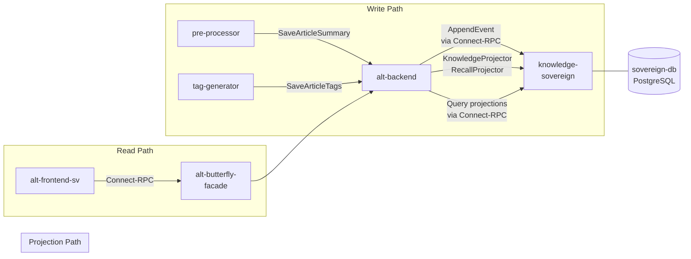
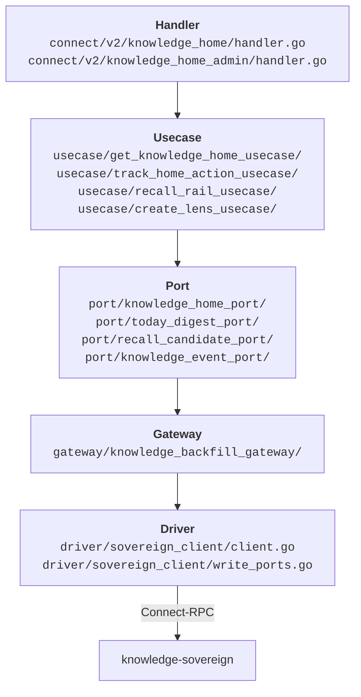

# Architecture

This document explains the design philosophy, service boundaries, and database schema behind Knowledge Home.

## Design Invariants

These five invariants are non-negotiable. Every contribution must respect them.

### 1. Append-First

State is expressed as immutable events, not mutable flags. The `knowledge_events` table is INSERT-only. There are no UPDATE or DELETE operations on events. When something changes (e.g., a summary is regenerated), a new event is appended rather than modifying existing data.

**Why:** Immutable events provide a complete audit trail, enable algorithm evolution without data migration, and align with Alt's existing at-least-once message delivery guarantees.

### 2. Reproject-Safe

Projectors must derive state solely from the event payload and referenced versioned artifacts (fetched by the specific ID in the event, not "latest"). A projector must never query current state to make projection decisions.

**Why:** This guarantees that replaying the event log produces identical read models. Without this, reprojection would silently diverge from the original projection, making disaster recovery and algorithm upgrades unreliable.

**Example:** `projectSummaryVersionCreated()` fetches the summary by `summary_version_id` from the event payload, never by "latest version for this article."

### 3. Versioned Artifacts

Summaries and tags are tracked as append-only version tables (`summary_versions`, `tag_set_versions`) with a `superseded_by` pointer. When a new version replaces an old one, both versions remain in the database. The projection tables point to the current version.

**Why:** Enables re-summarization tracking, model comparison, and reproducible projections. Users can see what changed and when.

### 4. Why as First-Class

Every item in Knowledge Home must explain why it was surfaced. The `why_reasons` field is not optional decoration; it is a core domain concept tracked from event creation through projection to UI rendering.

**Why:** "Why was this shown?" is critical for user trust and algorithm improvement. It enables ClickHouse-based analysis of exposure-to-action funnels and prevents the system from feeling like a black-box push notification.

**Allowed codes:** `new_unread`, `in_weekly_recap`, `pulse_need_to_know`, `tag_hotspot`, `recent_interest_match`, `related_to_recent_search`, `summary_completed`

### 5. Disposable Projections

Read models (`knowledge_home_items`, `today_digest_view`, `recall_candidate_view`) can be truncated and rebuilt from the event log at any time. They are optimized for fast display, not for durable storage.

**Why:** Freedom to evolve projection schemas, fix bugs in projector logic, or change scoring algorithms without data migration. The event log is the backup.

## Service Boundaries

| Service | Responsibility |
|---------|---------------|
| **alt-backend** | Hosts Connect-RPC handlers (public + admin), usecases, projectors, backfill job. Orchestrates reads and writes. |
| **knowledge-sovereign** | Owns the database. Exposes mutation and query RPCs. Enforces idempotency via `dedupe_key`. |
| **pre-processor** | Generates article summaries. Calls `SaveArticleSummary` on alt-backend. |
| **tag-generator** | Generates article tags. Calls `SaveArticleTags` on alt-backend. |
| **alt-frontend-sv** | SvelteKit frontend. Reads Knowledge Home via BFF. Never connects to alt-backend directly. |
| **alt-butterfly-facade** | BFF (Backend for Frontend). Routes frontend requests to alt-backend. |

## Clean Architecture Layers

Knowledge Home follows Alt's standard Clean Architecture pattern:

**Dependency rule:** Each layer only depends on the layer directly below it. Usecases depend on port interfaces, never on drivers or external packages.

## Database Schema

All tables are owned by `knowledge-sovereign` and live in the `sovereign-db` PostgreSQL database.

### Event Store

| Table | Purpose | Key Columns |
|-------|---------|-------------|
| `knowledge_events` | Append-only event log. Source of truth. | `event_id`, `event_seq` (BIGSERIAL), `event_type`, `aggregate_type`, `aggregate_id`, `dedupe_key` (UNIQUE), `payload` (JSONB) |
| `knowledge_user_events` | User interaction log (impressions, clicks). | `user_event_id`, `user_id`, `item_key`, `event_type`, `occurred_at`, `dedupe_key` (UNIQUE), `payload` (JSONB) |

A PostgreSQL trigger (`trg_knowledge_events_notify`) fires on each INSERT into `knowledge_events`, sending `pg_notify('knowledge_projector', event_seq)` to wake the projector immediately.

### Versioned Artifacts

| Table | Purpose | Key Columns |
|-------|---------|-------------|
| `summary_versions` | Immutable summary snapshots | `summary_version_id`, `article_id`, `summary_text`, `model`, `superseded_by` |
| `tag_set_versions` | Immutable tag set snapshots | `tag_set_version_id`, `article_id`, `tags_json`, `superseded_by` |

### Projections (Read Models)

| Table | Purpose | PK | Rebuilt By |
|-------|---------|-----|------------|
| `knowledge_home_items` | Home feed items with score, summary, tags, why, link | `(user_id, item_key, projection_version)` | KnowledgeProjector |
| `today_digest_view` | Daily aggregation: counts, top tags, availability | `(user_id, digest_date)` | KnowledgeProjector |
| `recall_candidate_view` | Recall rail candidates with score, reasons, and soft-delete via `dismissed_at` | `(user_id, item_key)` | KnowledgeProjector + RecallProjector |
| `recall_signals` | Raw interaction signals for recall scoring | `signal_id` | User actions |

### Lens & Curation

| Table | Purpose | Key Columns |
|-------|---------|-------------|
| `knowledge_lenses` | Saved viewpoints (filter rules) | `lens_id`, `user_id`, `name`, `description`, `archived_at` |
| `knowledge_lens_versions` | Versioned lens configurations (append-only per lens) | `lens_version_id`, `lens_id`, `query_text`, `tag_ids_json`, `time_window_json`, `sort_mode`, `superseded_by` |
| `knowledge_current_lens` | Active lens selection per user | `(user_id)`, `lens_id`, `lens_version_id`, `selected_at` |

### Infrastructure

| Table | Purpose |
|-------|---------|
| `knowledge_projection_checkpoints` | Tracks `last_event_seq` per projector |
| `knowledge_projection_versions` | Tracks active projection version for reproject |
| `knowledge_backfill_jobs` | Backfill job state and progress |
| `knowledge_reproject_runs` | Reproject run state and diff summaries |
| `knowledge_projection_audits` | Audit results: sample size, mismatch count, details |

## Knowledge Sovereign

Knowledge Sovereign is an independent Go microservice that acts as the single owner of all Knowledge Home durable state. It was extracted from alt-backend to enforce the database-per-service pattern.

**Protocol:** Connect-RPC (gRPC-compatible)

**Mutation RPCs:**
- `ApplyProjectionMutation` dispatches by mutation type: `upsert_home_item`, `dismiss_home_item`, `clear_supersede`, `upsert_today_digest`, `upsert_recall_candidate`
- `ApplyRecallMutation` dispatches: `snooze_candidate`, `dismiss_candidate`
- `ApplyCurationMutation` dispatches curation operations

**Streaming RPC:**
- `WatchProjectorEvents` — Server-streaming RPC that wraps PostgreSQL `LISTEN/NOTIFY` on the `knowledge_projector` channel. Sends heartbeats every 3 seconds and pushes `latest_event_seq` on each new event.

**Key files:**
- Service entry: `knowledge-sovereign/app/main.go`
- RPC handlers: `knowledge-sovereign/app/handler/sovereign_handler.go`, `rpc_projections.go`, `rpc_infra.go`, `rpc_lens.go`, `rpc_watch.go`
- Migrations: `knowledge-sovereign/migrations/` (5 migrations)
- Client in alt-backend: `alt-backend/app/driver/sovereign_client/` (`client.go`, `read_client.go`, `write_ports.go`, `watch_client.go`, `signal_client.go`, `backfill_client.go`, `lens_client.go`, `reproject_client.go`)
