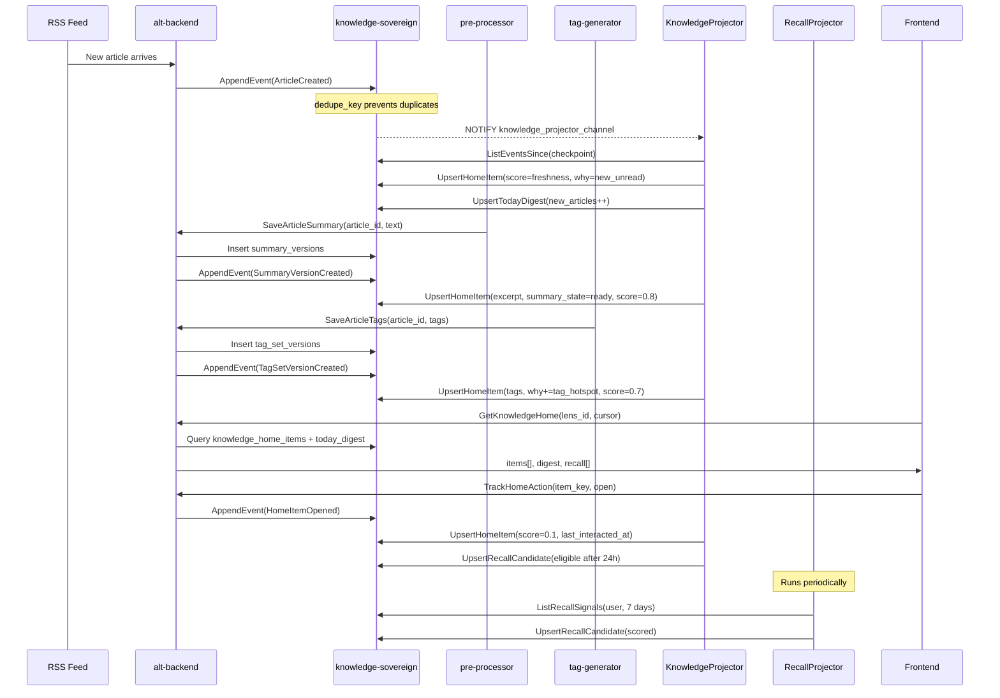
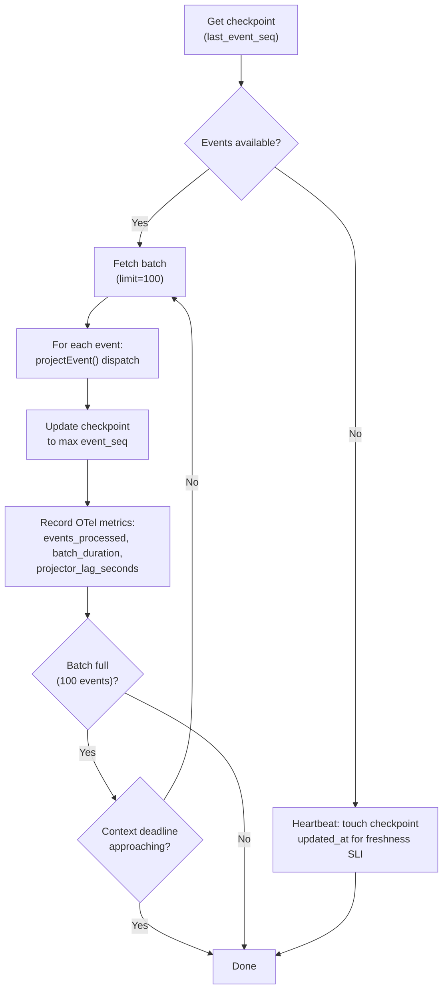

# Data Flow

This document traces how data moves through Knowledge Home: from event production, through projection, to API serving.

## Event Types

All events are appended to the `knowledge_events` table with a unique `dedupe_key` that prevents duplicates on network retry.

| Event Type | Producer | Payload | Projector Action |
|------------|----------|---------|-----------------|
| `ArticleCreated` | `CreateArticle` usecase | `article_id`, `title`, `published_at`, `tenant_id`, `link` | Creates home item (score=freshness), increments digest |
| `ArticleUpdated` | Article update path | `article_id`, updated fields | Updates home item metadata |
| `SummaryVersionCreated` | `SaveArticleSummary` usecase | `summary_version_id`, `article_id` | Sets excerpt, `summary_state=ready`, score=0.8 |
| `TagSetVersionCreated` | `SaveArticleTags` usecase | `tag_set_version_id`, `article_id` | Sets tags, adds `tag_hotspot` why-reason, score=0.7 |
| `HomeItemsSeen` | `TrackHomeItemsSeen` handler | `items_seen[]`, `session_id` | (Future: exposure tracking) |
| `HomeItemOpened` | `TrackHomeAction` handler | `item_key` | Suppresses score to 0.1, creates recall candidate |
| `HomeItemDismissed` | `TrackHomeAction` handler | `item_key` | Sets `dismissed_at`, removes from feed |
| `HomeItemAsked` | `TrackHomeAction` handler | `item_key` | Interaction tracking |
| `HomeItemListened` | `TrackHomeAction` handler | `item_key` | Interaction tracking |
| `SummarySuperseded` | Summary re-generation | `article_id`, `new_summary_version_id`, `old_summary_version_id`, `previous_summary_excerpt` | Sets `supersede_state=summary_updated` |
| `TagSetSuperseded` | Tag re-generation | `article_id`, `new_tag_set_version_id`, `old_tag_set_version_id`, `previous_tags` | Sets `supersede_state=tags_updated` |
| `HomeItemSuperseded` | Multi-field update | `article_id` | Sets `supersede_state=multiple_updated` |
| `ReasonMerged` | Why-code updates | `article_id`, `item_key`, `added_codes`, `previous_why_codes` | Sets `supersede_state=reason_updated` |
| `RecallSnoozed` | Recall rail interaction | `item_key`, `until` | Updates snooze in recall_candidate_view |
| `RecallDismissed` | Recall rail interaction | `item_key` | Removes from recall_candidate_view |

## Article Lifecycle

This sequence diagram traces one article from RSS ingestion through to recall candidacy:

## Projector Mechanics

The **KnowledgeProjector** (`alt-backend/app/job/knowledge_projector.go`) is the core engine that transforms events into read models.

### Processing Loop

**Key behaviors:**
- **Batch size:** 100 events per iteration
- **Safety margin:** Stops 250ms before context deadline
- **Heartbeat:** When no events are pending, touches the checkpoint so the freshness SLI stays accurate
- **Best effort:** If a single event fails to project, it logs the error and continues with the next event
- **Metrics:** Records `events_processed`, `batch_duration_ms`, `projector_lag_seconds`, and `errors` via OTel

### Event Dispatch

The `projectEvent()` function dispatches by `event_type`:

| Event Type | Handler Function | What It Does |
|------------|-----------------|-------------|
| `ArticleCreated` | `projectArticleCreated` | Creates home item with freshness score, increments TodayDigest |
| `SummaryVersionCreated` | `projectSummaryVersionCreated` | Fetches summary by version ID (reproject-safe), sets excerpt + state |
| `TagSetVersionCreated` | `projectTagSetVersionCreated` | Fetches tags by version ID, adds tag_hotspot why-reason |
| `HomeItemOpened` | `projectHomeItemOpened` | Suppresses score, sets interaction time, creates recall candidate |
| `HomeItemDismissed` | `projectHomeItemDismissed` | Sets `dismissed_at` to soft-delete from feed |
| `SummarySuperseded` | `projectSummarySuperseded` | Marks `supersede_state`, preserves previous excerpt |
| `TagSetSuperseded` | `projectTagSetSuperseded` | Marks `supersede_state`, preserves previous tags |
| `ReasonMerged` | `projectReasonMerged` | Updates supersede state with previous why-codes |

Unknown event types are silently skipped, allowing forward compatibility.

### Projector Runner

The runner (`knowledge_projector_runner.go`) uses a **hybrid polling + LISTEN/NOTIFY** approach:

1. **Primary mode:** Subscribes to PostgreSQL `LISTEN/NOTIFY` via sovereign's `WatchProjectorEvents` streaming RPC. Wakes immediately when new events arrive.
2. **Fallback mode:** If the listener connection fails, falls back to 5-second polling. Switches back automatically when the connection recovers.

## Score Calculation

Items are ranked by `score` (descending) in the Home feed. Scores are assigned during projection:

| Event | Score | Rationale |
|-------|-------|-----------|
| `ArticleCreated` | `1.0 - (hours_old / 48)` for <24h; `0.5 / (hours_old / 24)` for older | Freshness decay: newer articles rank higher |
| `SummaryVersionCreated` | `0.8` | Boost for having a summary ready |
| `TagSetVersionCreated` | `0.7` | Boost for having tags assigned |
| `HomeItemOpened` | `0.1` | Suppression: read items sink to the bottom |

Scores are written via merge-safe UPSERT, so later events override earlier scores for the same item.

## Recall Projector

The **RecallProjector** (`alt-backend/app/job/recall_projector.go`) scores recall candidates from user interaction signals.

### Signal Types and Weights

| Signal Type | Weight | Condition |
|-------------|--------|-----------|
| `opened` | 0.30 | Opened but not revisited in 48+ hours |
| `search_related` | 0.25 | Related to a recent search query |
| `augur_referenced` | 0.35 | Referenced in a recent Augur (RAG) question |
| `recap_context_unread` | 0.20 | Recap context article left unread |
| `pulse_followup` | 0.25 | Follow-up needed from a pulse alert |
| `tag_interest` | 0.15 | Matches user's interest tags |

**Parameters:**
- Signal window: 7 days
- Minimum score threshold: 0.2
- Signals are grouped by `item_key` and summed

### Process

1. Discover active users via `ListDistinctUserIDs` (from `knowledge_home_items`)
2. For each user, fetch recall signals from the past 7 days
3. Group signals by `item_key`, compute weighted score
4. Discard candidates below the 0.2 threshold
5. UPSERT remaining candidates to `recall_candidate_view`

## Supersede Flow

When an article's summary or tags are regenerated:

1. The usecase appends a `SummarySuperseded` or `TagSetSuperseded` event with both old and new version IDs
2. The projector sets `supersede_state` on the home item (`summary_updated`, `tags_updated`, or `multiple_updated`)
3. The UI shows an "updated" badge on the item
4. When the user opens the item, `HomeItemOpened` triggers `ClearSupersedeState`, acknowledging the update

The `previous_ref_json` field preserves the old excerpt or tags for optional history display.

## Backfill

The backfill job (`alt-backend/app/job/knowledge_backfill_job.go`) retroactively generates events for existing articles:

1. Admin triggers backfill via `TriggerBackfill` RPC with a target projection version
2. The job iterates through articles in batches of 100, ordered by `published_at`
3. For each article, it generates a synthetic `ArticleCreated` event with `actor_type=service, actor_id=backfill`
4. Dedupe key `article-created:{article_id}` ensures idempotency
5. The KnowledgeProjector picks up these events normally

Backfill is a bootstrap mechanism, not a daily process. Once the constant article flow is established (articles automatically append `ArticleCreated` events on creation), backfill is only needed for disaster recovery.
