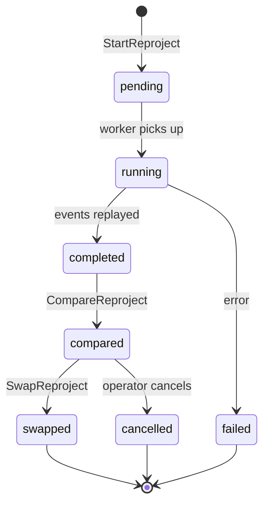

# Extending Knowledge Home

This document provides step-by-step checklists for common extension tasks, operational recipes, and testing patterns.

## Adding a New Event Type

When you need to track a new kind of state change in Knowledge Home:

1. **Define the event type constant** in `alt-backend/app/domain/knowledge_event.go`:
   ```go
   const EventMyNewEvent = "MyNewEvent"
   ```

2. **Define the payload struct** in `alt-backend/app/job/knowledge_projector.go`:
   ```go
   type myNewEventPayload struct {
       ArticleID string `json:"article_id"`
       // ... payload fields
   }
   ```

3. **Add a projection function** in the same file:
   ```go
   func projectMyNewEvent(ctx context.Context, event domain.KnowledgeEvent, ...) error {
       var payload myNewEventPayload
       if err := json.Unmarshal(event.Payload, &payload); err != nil {
           return fmt.Errorf("unmarshal MyNewEvent payload: %w", err)
       }
       // ... project to read model
   }
   ```

4. **Add the case to `projectEvent()`** switch:
   ```go
   case domain.EventMyNewEvent:
       return projectMyNewEvent(ctx, event, ...)
   ```

5. **Write tests first** (TDD) in `knowledge_projector_test.go`: create a mock event with your payload, call the projector, and assert the projected read model state.

6. **Emit the event** from the appropriate usecase by calling `AppendKnowledgeEvent` on the event port. Use a deterministic `dedupe_key` pattern (e.g., `MyNewEvent:{aggregate_id}:{content_hash}`).

7. **Update the canonical contract** in `docs/plan/knowledge-home-phase0-canonical-contract.md` if this event affects the API response shape.

## Adding a New Why-Reason Code

When you want to explain a new reason for surfacing an item:

1. **Add the constant** in `alt-backend/app/domain/knowledge_home_item.go`:
   ```go
   const WhyMyNewReason = "my_new_reason"
   ```

2. **Use it in the projector** when creating the `WhyReasons` slice:
   ```go
   whyReasons = append(whyReasons, domain.WhyReason{
       Code: domain.WhyMyNewReason,
       Tag:  "optional-context",
   })
   ```

3. **Update the frontend** why-reason display mapping to render the new code.

4. **Update the canonical contract** to document the new code and its semantics.

## Adding a New Recall Signal Type

When you discover a new user interaction pattern that should influence recall scoring:

1. **Add the signal type constant** in `alt-backend/app/domain/recall_signal.go`:
   ```go
   const SignalMyNewSignal = "my_new_signal"
   ```

2. **Add the recall reason constant** in `alt-backend/app/domain/recall_candidate.go`:
   ```go
   const ReasonMyNewReason = "my_new_reason"
   ```

3. **Add the weight constant** in `alt-backend/app/job/recall_projector.go`:
   ```go
   const weightMyNewSignal = 0.20 // tune based on expected signal strength
   ```

4. **Add the scoring case** in `scoreRecallCandidatesWithSovereign()`:
   ```go
   case domain.SignalMyNewSignal:
       reasons = append(reasons, domain.RecallReason{
           Type:        domain.ReasonMyNewReason,
           Description: "Human-readable explanation",
       })
       score += weightMyNewSignal
   ```

5. **Emit the signal** from the appropriate usecase or handler by inserting into `recall_signals` via the `AppendRecallSignalPort`.

6. **Write tests** in `recall_projector_test.go`: create mock signals, run the projector, assert candidate scores and reasons.

## Adding a New Read Model (Projection Table)

When you need a new optimized view of the event data:

1. **Create the migration** in `knowledge-sovereign/migrations/`:
   ```sql
   -- 00005_create_my_new_view.sql
   CREATE TABLE IF NOT EXISTS my_new_view (
       user_id UUID NOT NULL,
       -- ... columns
       projection_version INT NOT NULL DEFAULT 1,
       updated_at TIMESTAMPTZ NOT NULL DEFAULT NOW(),
       PRIMARY KEY (user_id, ...)
   );
   ```

2. **Define the domain struct** in `alt-backend/app/domain/`:
   ```go
   type MyNewView struct {
       UserID            uuid.UUID `json:"user_id" db:"user_id"`
       // ... fields
       ProjectionVersion int       `json:"projection_version" db:"projection_version"`
   }
   ```

3. **Define the port interface** in `alt-backend/app/port/my_new_view_port/`:
   ```go
   type UpsertMyNewViewPort interface {
       UpsertMyNewView(ctx context.Context, view domain.MyNewView) error
   }
   ```

4. **Implement the driver** in `alt-backend/app/driver/sovereign_client/`:
   - Add a write method that marshals the domain object and calls `ApplyProjectionMutation` with a new mutation type.

5. **Add sovereign handler** for the new mutation type in `knowledge-sovereign/app/handler/`.

6. **Wire the projector** to populate the new view by adding projection logic to the event dispatch.

7. **Wire DI** in `alt-backend/app/di/container.go` (see lines ~522-586 for existing sovereign client wiring).

## Operational Recipes

### Running a Backfill

Backfill generates synthetic `ArticleCreated` events for pre-existing articles:

```bash
# Trigger via admin API (using grpcurl or similar)
grpcurl -d '{"projection_version": 1}' \
  localhost:9000 alt.knowledge_home.v1.KnowledgeHomeAdminService/TriggerBackfill

# Monitor progress
grpcurl -d '{"job_id": "<job-uuid>"}' \
  localhost:9000 alt.knowledge_home.v1.KnowledgeHomeAdminService/GetBackfillStatus

# Pause if needed
grpcurl -d '{"job_id": "<job-uuid>"}' \
  localhost:9000 alt.knowledge_home.v1.KnowledgeHomeAdminService/PauseBackfill
```

### Running a Reproject

Reproject rebuilds projections from the event log, useful for schema migrations or algorithm changes:



**Steps:**

1. **Start:** `StartReproject(mode="full", from_version="1", to_version="2")`
2. **Monitor:** `GetReprojectStatus(run_id)` until status is `completed`
3. **Compare:** `CompareReproject(run_id)` returns item counts, average scores, and why-distribution diffs between versions
4. **Decide:** If the diff looks correct, proceed. If not, investigate.
5. **Swap:** `SwapReproject(run_id)` atomically activates the new version
6. **Rollback** (if needed): `RollbackReproject(run_id)` reverts to the previous version

### Checking Projection Health

```bash
# Get current health status
grpcurl localhost:9000 \
  alt.knowledge_home.v1.KnowledgeHomeAdminService/GetProjectionHealth

# Response includes:
# - active_version: current projection version
# - checkpoint_seq: last processed event sequence
# - last_updated: when the checkpoint was last touched
# - backfill_jobs: list of backfill job statuses

# Get SLO status
grpcurl localhost:9000 \
  alt.knowledge_home.v1.KnowledgeHomeAdminService/GetSLOStatus

# Response includes:
# - overall_health: "healthy" | "warning" | "critical"
# - slis[]: individual SLI values vs targets
# - error_budget_consumed_pct: how much error budget is used
# - active_alerts[]: currently firing alerts
```

## Testing Patterns

Knowledge Home follows Alt's TDD-first discipline: **RED -> GREEN -> REFACTOR**.

### Projector Tests

Test pattern: create mock events, run the projector function, assert the projected state.

```go
func TestProjectArticleCreated(t *testing.T) {
    // Arrange: create mock ports
    mockHomePort := &mockUpsertPort{}
    mockDigestPort := &mockDigestPort{}

    event := domain.KnowledgeEvent{
        EventType: domain.EventArticleCreated,
        TenantID:  testTenantID,
        Payload:   json.RawMessage(`{"article_id":"...","title":"Test","published_at":"2026-03-23T10:00:00Z"}`),
    }

    // Act
    err := projectArticleCreated(ctx, event, mockHomePort, mockDigestPort, 1)

    // Assert
    require.NoError(t, err)
    assert.Equal(t, "Test", mockHomePort.lastItem.Title)
    assert.Equal(t, domain.SummaryStatePending, mockHomePort.lastItem.SummaryState)
}
```

See `alt-backend/app/job/knowledge_projector_test.go` for the full test suite.

### Usecase Tests

Test pattern: mock port interfaces, test business logic in isolation.

```go
func TestGetKnowledgeHome(t *testing.T) {
    mockHomePort := &mockGetHomeItemsPort{items: testItems}
    mockDigestPort := &mockGetDigestPort{digest: testDigest}

    usecase := get_knowledge_home_usecase.NewGetKnowledgeHomeUsecase(
        mockHomePort, mockDigestPort, /* ... */
    )

    result, err := usecase.Execute(ctx, userID, "", 20, "", nil)

    require.NoError(t, err)
    assert.Len(t, result.Items, len(testItems))
}
```

### Handler Tests

Test pattern: use Connect test client with mock usecases.

```go
func TestGetKnowledgeHomeHandler(t *testing.T) {
    handler := knowledge_home.NewHandler(mockGetHome, /* ... */)
    _, h := knowledgehomev1connect.NewKnowledgeHomeServiceHandler(handler)

    server := httptest.NewServer(h)
    client := knowledgehomev1connect.NewKnowledgeHomeServiceClient(
        http.DefaultClient, server.URL,
    )

    resp, err := client.GetKnowledgeHome(ctx, connect.NewRequest(&knowledgehomev1.GetKnowledgeHomeRequest{}))
    require.NoError(t, err)
    assert.NotNil(t, resp.Msg.TodayDigest)
}
```

### Running Tests

```bash
# All Knowledge Home tests
cd alt-backend/app && go test ./job/... ./usecase/... ./connect/v2/knowledge_home/... ./connect/v2/knowledge_home_admin/... -v

# Projector tests only
cd alt-backend/app && go test ./job/... -run TestKnowledgeProjector -v

# Recall projector tests
cd alt-backend/app && go test ./job/... -run TestRecallProjector -v
```
