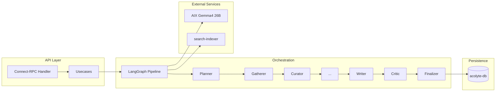

# Acolyte: From Concept to Production

## Overview

Acolyte is Alt's versioned report generation orchestrator. It transforms evidence from multiple sources into structured, citation-backed reports using a multi-stage LLM pipeline. Every report version is tracked with field-level change items, enabling diff views and audit trails.

The system was designed around a single architectural conviction: **version-first state management**. Rather than relying on `updated_at` timestamps to track changes, Acolyte uses explicit version numbers with immutable snapshots and field-level change records. This approach, inspired by Knowledge Home's event-sourcing model, provides precise diffing, reliable rollback, and complete audit trails.

The system was built on top of Alt's existing infrastructure: Python microservices with Connect-RPC for API boundaries, PostgreSQL 18 for persistence, LangGraph for pipeline orchestration, and SvelteKit for the frontend. A dedicated database (`acolyte-db`) isolates Acolyte data from the main `alt-db`.

---

## Architecture

Acolyte follows a strict separation between API handling (Connect-RPC handlers), business logic (usecases), and orchestration (LangGraph pipeline). The pipeline is the core engine that transforms inputs into versioned reports.



The API surface is minimal by design. The initial release exposed 11 Connect-RPC endpoints: CRUD operations for reports, version history queries, and generation run management. Streaming progress (`StreamRunProgress`) and section-level regeneration (`RerunSection`) were planned but deferred (P2).

---

## The Version-First Data Model

The version-first data model is the most distinctive aspect of Acolyte's architecture. Five invariants were established before any code was written:

**1. Version-First.** State changes are tracked through explicit version numbers, not timestamps. The `reports` table has a mutable `current_version` integer, while `report_versions` contains immutable snapshots. When content changes, a new version row is inserted.

**2. Two-Layer Versioning.** Reports and sections are versioned independently. A report version bump doesn't require all sections to change. This enables fine-grained regeneration.

**3. Immutable Snapshots.** The `report_versions` and `report_section_versions` tables are INSERT-only. No UPDATE or DELETE operations. Each generation produces new rows.

**4. JSONB for Auxiliary Only.** Core queryable fields are stored as SQL columns. JSONB is reserved for auxiliary data: `citations_jsonb`, `scope_snapshot`, `outline_snapshot`.

**5. Job Queue Safety.** Pipeline execution uses `SELECT ... FOR UPDATE SKIP LOCKED` for race-free job claiming without polling.

### Comparison with Knowledge Home

Acolyte shares design philosophy with Knowledge Home but differs in implementation:

| Aspect | Knowledge Home | Acolyte |
|--------|----------------|---------|
| State model | Event-sourced (append-only events) | Version-first (immutable snapshots) |
| Read models | Projections (disposable, rebuildable) | Direct table reads |
| Change tracking | Events in `knowledge_events` | Change items in `report_change_items` |
| Why-reason | First-class surfacing explanation | Not applicable (user-initiated reports) |
| Rebuild mechanism | Reproject from event log | Re-run generation pipeline |

Both systems share the conviction that state changes should be explicit and auditable, but Knowledge Home uses event sourcing while Acolyte uses version snapshots.

---

## Pipeline Evolution

### Initial Design: 6 Nodes

The original pipeline had 6 nodes:

```
planner → gatherer → curator → writer → critic → finalizer
```

This minimal pipeline worked but had limitations:
- No explicit fact extraction (writer worked from raw evidence)
- No citation tracking at the quote level
- Limited grounding in source material

### Current Design: 11 Nodes

The pipeline expanded to 11 nodes with full evidence grounding:

```
planner → gatherer → curator → hydrator → compressor →
quote_selector → fact_normalizer → section_planner →
writer → critic → finalizer
```

New nodes added:
- **Hydrator**: Fetch full article bodies for curated evidence
- **Compressor**: Truncate to token budget with span tracking
- **QuoteSelector**: Extract relevant quotes per article
- **FactNormalizer**: Normalize quotes into atomic facts with citations
- **SectionPlanner**: Plan claims per section with fact assignment

### Incremental Processing

QuoteSelector and FactNormalizer support incremental self-loop when checkpointing is enabled:

```
quote_selector(article_1) → [checkpoint] →
quote_selector(article_2) → [checkpoint] →
...
quote_selector(article_N) → [checkpoint] → fact_normalizer
```

This enables resume after failure at the article/quote granularity, not just node boundaries.

---

## Key Design Decisions

### Why LangGraph?

LangGraph was chosen over custom orchestration for several reasons:

1. **StateGraph abstraction**: Clean separation between nodes and routing logic
2. **Conditional edges**: Built-in support for revision loops and branching
3. **Checkpointing**: PostgresSaver provides durable execution with resume
4. **Ecosystem**: Integration with LangChain for structured output, retrieval

The alternative (custom orchestration) would require reimplementing state management, checkpoint persistence, and conditional routing.

### Why Python?

Despite Alt's Go backend tradition, Python was chosen for Acolyte:

1. **LangGraph/LangChain ecosystem**: Python-first libraries
2. **LLM tooling**: Better support for structured output, prompt engineering
3. **Rapid iteration**: Prompt changes don't require compilation
4. **connect-python**: Connect-RPC support in Python (alpha but functional)

### Why Dedicated Database?

Acolyte uses `acolyte-db` (PostgreSQL 18, port 5439) instead of `alt-db`:

1. **Isolation**: Schema changes don't affect core Alt services
2. **Migration independence**: Atlas migrations separate from alt-db
3. **Checkpoint tables**: LangGraph manages its own tables
4. **Future scaling**: Can be moved to dedicated infrastructure

### Why Connect Protocol (Not gRPC)?

Python's `connect-python` library supports Connect protocol but not full gRPC:

1. **BFF compatibility**: alt-butterfly-facade routes Connect-RPC natively
2. **Simpler deployment**: No gRPC-specific infrastructure needed
3. **HTTP/2 optional**: Works over HTTP/1.1 for easier debugging

---

## Structured Output Challenges

### Thinking Models and JSON

Gemma4 with thinking mode (`think=true`) presented challenges for structured output:

1. **Thinking tokens overflow**: Model generates reasoning tokens that consume `num_predict` budget
2. **JSON truncation**: Output cut off before closing braces
3. **Format parameter ignored**: `format="json"` not respected in thinking mode

### Solutions Implemented

**Reasoning-first JSON** (ADR-632 pattern): Put `reasoning` field first in JSON schema to absorb thinking tokens:

```json
{
  "reasoning": "... long chain of thought ...",
  "sections": [...]
}
```

**Increased num_predict**: Raised from 4096 to 6000 for nodes generating long outputs.

**Fallback structures**: When JSON parsing fails, use fixed fallback (e.g., 3 default sections).

**Retry with format hints**: On parse failure, retry with explicit "respond only with valid JSON" instruction.

---

## Lessons Learned

### 1. Structured Output Is Fragile

LLM structured output requires defensive programming:
- Always have a fallback structure
- Log raw responses for debugging
- Monitor `eval_count` vs `response_len` for truncation detection

### 2. Checkpointing Granularity Matters

Node-level checkpointing wasn't enough for long-running nodes. QuoteSelector and FactNormalizer needed incremental self-loop for article/quote-level granularity.

### 3. Version-First Simplifies Diff

Using `version_no` + `change_items` instead of `updated_at` made diff views trivial:
```sql
SELECT * FROM report_change_items 
WHERE report_id = ? AND version_no BETWEEN ? AND ?;
```

### 4. Dedicated Database Reduces Friction

Having `acolyte-db` separate from `alt-db` allowed rapid iteration on schema without affecting other services.

### 5. TDD with LLM Is Different

Unit tests mock LLM responses, but real behavior requires E2E tests with actual model calls. The gap between mock and reality is larger than with deterministic code.

---

## ADR References

| ADR | Title | Key Decision |
|-----|-------|--------------|
| [[000653]] | Knowledge Acolyte レポート生成オーケストレーターを導入する | Core architecture, 6-node pipeline, DB schema |
| [[000654]] | Acolyte LangGraph パイプラインを AIX Gemma4 26B に接続 | LangGraph integration, Ollama connection |
| [[000656]] | Acolyte レポート生成品質を5契約の整備で改善する | Contract-based quality (input/retrieval/claim/critic/evaluation) |
| [[000665]] | Acolyte パイプラインの LLM 呼び出し安定化 | JSON truncation fix, ReadTimeout handling |
| [[000700]] | Acolyte パイプラインの構造安定化と品質改善 | Writer thinking fix, FactNormalizer confidence, Executive Summary |

---

## Future Directions

### Implemented (P0-P1 Complete)

- 11-node pipeline with full evidence grounding
- LangGraph PostgreSQL checkpointing
- Incremental self-loop for QuoteSelector/FactNormalizer
- Critic revision loop (max 2 iterations)
- Connect-RPC API with 11 endpoints
- SvelteKit frontend (list, detail, new)
- Pact CDC tests for news-creator and search-indexer

### Planned (P2)

- `StreamRunProgress`: Real-time generation progress streaming
- `RerunSection`: Section-level regeneration
- `DiffReportVersions`: Full diff between versions
- PostgreSQL job queue (replace in-memory)
- Proto TypeScript codegen for frontend type safety
- Evaluation framework (ROUGE, LLM-as-judge)

### Future Considerations

- Multi-model pipeline (different models for different nodes)
- User feedback loop (critique → improvement)
- Template library for report types
- Collaborative editing (human + AI revision)
