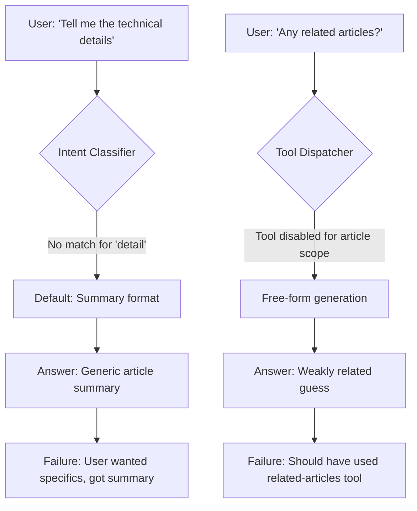
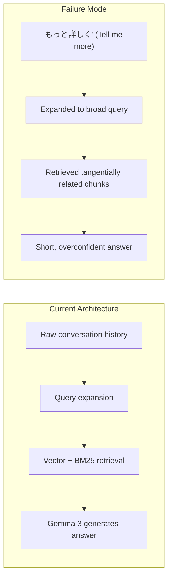
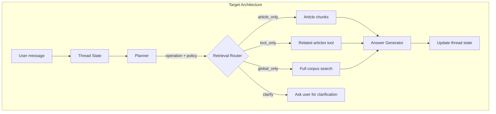
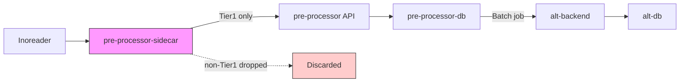

# AI Pipeline Evolution: RAG Redesign and Data Quality Architecture

## Overview

Alt's AI pipeline spans article ingestion, summarization, tagging, search, and conversational question-answering (RAG). This document covers two architectural challenges that emerged as the platform matured:

1. **RAG system redesign**: Moving from stateless retrieval to conversational state management after systematic failure analysis
2. **Data quality at the ingestion boundary**: Preventing low-quality external articles from contaminating the primary knowledge base

Both stories illustrate a common theme: when incremental fixes stop working, you need to step back and address the structural root cause.

## Part 1: RAG System — From Prompt Tuning to Architectural Reset

### The Problem

Alt's RAG system (Augur) uses a local Gemma 3 model served via Ollama for question-answering over the user's article corpus. Three failure patterns emerged from production logs:

**Failure 1**: A user asked for technical details about an article. The intent classifier only recognized `critique`, `opinion`, and `implication` as sub-intents — not `detail`. The prompt defaulted to summary format, and Gemma dutifully summarized instead of answering the question.

**Failure 2**: A user asked for related articles. A dedicated related-articles tool existed in the codebase, but the tool dispatcher returned `nil` for article-scoped queries. The system generated a free-form guess instead of executing a deterministic lookup.

**Failure 3**: A user asked "What is the root cause of recent oil crises?" The query was routed as `temporal` (because of "recent") instead of `causal/explanatory` (because of "root cause"). The retrieval set contained a mix of Venezuela, Iran, and policy articles — individually relevant but collectively incoherent for answering a causal question.

### Root Cause Analysis

The initial diagnosis identified five local bugs: missing sub-intents, disabled tools, wrong prompt templates, aggressive global retrieval merging, and incomplete routing after scope detection. All fixable incrementally.

But production logs revealed a deeper structural problem:

The system had no conversation state and no explicit planner. Every follow-up was treated as a new search query derived from raw chat history. Query expansion could produce syntactically reasonable rewrites, but it could not resolve what "more detail" referred to, what "is that true?" pointed at, or whether "related articles" meant related to the article topic or the last answer.

These are not keyword classification problems. They are conversation state problems.

### The Architectural Reset

The remediation plan evolved from "fix five bugs" to "redesign the conversational architecture":

**Key design decisions:**

1. **Explicit conversation state**: A structured thread state tracks the current mode (article-scoped, open topic, fact-check, discovery), focus entities, focus claims, last answer scope, and citations. Updated after every successful answer.

2. **Split planner and answerer**: The planner resolves ambiguous references, classifies the operation (`detail`, `evidence`, `related_articles`, `fact_check`, `topic_shift`, `clarify`), and decides retrieval policy — all as structured JSON output. The answer model receives pre-selected evidence and a clear formatting target.

3. **Operation-specific retrieval policies**:

   | Operation | Retrieval Policy |
   |-----------|-----------------|
   | `detail` | Article-only or topic-local first |
   | `evidence` | Article-only, citation-first |
   | `related_articles` | Tool-first, global related lookup |
   | `fact_check` | Claim-focused with evidence bias |
   | `topic_shift` | Fresh retrieval scope |
   | `clarify` | No retrieval — ask user instead |

4. **Clarification as a feature**: When the planner's confidence is low, the system asks a narrowing question instead of guessing. "What would you like more detail about? The previous answer covered A, B, and C."

5. **Failure taxonomy**: Eight explicit failure classes replaced the generic "LLM gave a bad answer" diagnosis: `reference_resolution_failure`, `operation_classification_failure`, `retrieval_policy_mismatch`, `topic_drift`, `evidence_selection_failure`, `short_answer_under_grounded_context`, `tool_should_have_been_used`, `clarification_should_have_been_asked`.

### Lessons from the Oil-Crisis Case

The oil-crisis failure deserved special attention because it exposed a retrieval coherence gap:

- Query `"What is the root cause of recent oil crises?"` was classified as temporal (wrong)
- Query expansion produced reasonable rewrites but didn't preserve causal structure
- Retrieved contexts mixed Venezuela, Iran, and live-blog articles — individually relevant, collectively incoherent
- A hard-stop mechanism correctly detected the bad answer, but the problem was upstream

The fix required:
- Causal intent detection (prioritize "root cause" over "recent" when both appear)
- Coherence-aware retrieval gating (reject mixed-topic bundles for causal queries)
- Causal answer contracts (require multi-factor decomposition, explicit uncertainty, no single-cause claims from mixed evidence)

### Key Takeaway: Know When to Stop Patching

The progression from "add a sub-intent" to "redesign conversational state management" is instructive. The local fixes were correct but insufficient. The architectural insight was:

> Augur is implementing conversational RAG as stateless retrieval + prompt stitching. It needs to become stateful conversation orchestration + task-specific retrieval + grounded answer generation.

The system's problem was not "Gemma 3 is not smart enough." It was "the architecture makes it easy for any model to do the wrong thing."

---

## Part 2: Data Quality at the Ingestion Boundary

### The Problem

Alt supplements user-initiated article ingestion with an external feed aggregator (Inoreader). However, Inoreader often returns thin content: truncated summaries, image-heavy pages, navigation boilerplate, or snippets under 500 characters. This content is not useful for downstream processing (summarization, tagging, RAG) and pollutes the primary database.

A secondary problem: the pre-processor service was sharing a database with alt-backend, creating a shared-database antipattern that complicated data ownership.

### Architecture Decision

The solution was simple: **filter at the boundary**.

A lightweight sidecar classifies articles at the ingestion point. Only Tier1 articles (content worthy of permanent storage) pass through. This simultaneously solves data quality and database ownership:

- `pre-processor-sidecar`: classifies and filters (no database writes)
- `pre-processor`: stores in its own database only (`pre-processor-db`)
- `alt-backend`: sole writer to the primary database (`alt-db`)

### Tier1 Definition

An article qualifies as Tier1 if:

- Normalized content length >= 500 characters
- No truncation markers (`read more`, `...`, etc.)
- Not image-dominant (< 80% `` tags by content area)
- Not matching known non-article URL patterns
- Not navigation/placeholder boilerplate

Everything else is discarded at the sidecar. No complex quality scoring models, no downstream filtering logic scattered across services.

### Rejected Alternatives

**"Filter downstream"**: Rejected because low-quality data would be stored first, and every downstream service would need its own exclusion logic. Complexity grows linearly with consumer count.

**"pre-processor writes to alt-db directly"**: Rejected because it creates shared database coupling between pre-processor and alt-backend. Data ownership becomes ambiguous.

### Key Takeaway: Filter Early, Own Clearly

The simplest architectural decision in this document was also the most impactful: put the filter at the boundary, not in the middle. One service classifies, one service processes, one service owns the database. No shared state, no scattered filtering logic, no downstream contamination.

---

## Lessons Learned

1. **When five local fixes don't solve the problem, look for a structural cause.** The RAG system had five identifiable bugs, all fixable. But fixing them would not have solved the conversation state problem. The architectural reset — adding explicit state and a planner — addressed the root cause.

2. **Separate planning from execution in AI pipelines.** Using the same small model for query planning, retrieval selection, and answer generation overloads a single reasoning budget. Dedicated planning (bounded JSON output, low token cap) plus grounded answering (moderate budget, pre-selected evidence) produces better results.

3. **Clarification is a feature, not a failure.** When a follow-up query like "tell me more" is ambiguous, asking the user what they want is better than guessing wrong. This requires conversation state to know what was said before.

4. **Filter at the boundary, not in the pipeline.** The Tier1 sidecar pattern is universally applicable: validate input quality at the system boundary rather than propagating garbage and filtering it later.

5. **Name your failures explicitly.** The RAG failure taxonomy (8 classes) replaced "bad answer" with actionable diagnostic categories. This made it possible to track which failure modes were improving and which were not.
