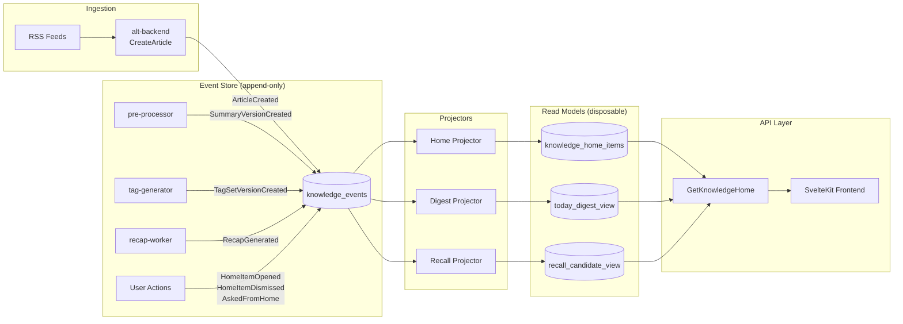
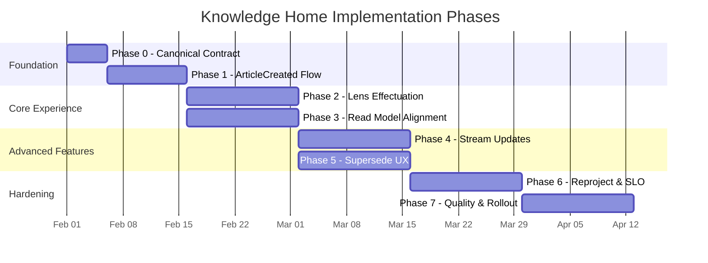
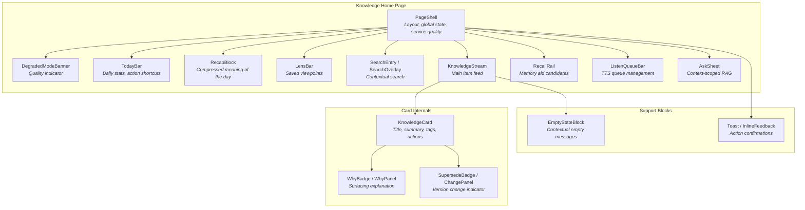

# Knowledge Home: From Concept to Production

## Overview

Knowledge Home is the central feature of Alt, an AI-augmented RSS knowledge platform. Where traditional feed readers present a reverse-chronological list of articles, Knowledge Home reimagines the entry point as a unified surface for the entire knowledge pipeline: ingestion, summarization, tagging, search, recap, RAG-based question answering, and text-to-speech. Its purpose is not to show more content, but to answer three questions every time a user opens the application: *What should I look at? Why is it here? What changed since last time?*

The feature was designed around a single architectural conviction: **state belongs in events, not flags**. Rather than scattering `is_summarized`, `is_in_home`, and `last_surfaced_at` columns across existing tables, Knowledge Home introduces an append-only event log and a set of disposable read models (projections) that can be rebuilt from that log at any time. This immutable data model philosophy -- event sourcing combined with CQRS -- became the north star for every design decision across seven implementation phases.

The system was built on top of Alt's existing infrastructure: Go microservices, Connect-RPC for service boundaries, PostgreSQL as the primary store, SvelteKit for the frontend, and Redis Streams for event-driven communication. No new heavyweight service was created. Instead, Knowledge Home extended the responsibilities of existing components and introduced new database tables, projectors, and API endpoints within the established architecture.

---

## Architecture

Knowledge Home follows a strict separation between the write side (event production) and the read side (projections for display). The backend service acts as the sole data owner -- no other service writes directly to the Knowledge Home tables. Upstream producers (the pre-processor for summaries, the tag-generator for tags, the recap-worker for weekly recaps) communicate through internal APIs, and the backend translates their outputs into domain events.

The API surface is minimal by design. The initial release exposed only three Connect-RPC endpoints: `GetKnowledgeHome` (a single fetch returning the digest, stream items, recall candidates, feature flags, and service quality in one response), `TrackHomeItemsSeen` (batch impression logging), and `TrackHomeAction` (user interactions like open, dismiss, ask, listen). Streaming updates were added later as `StreamKnowledgeHomeUpdates`, overlaid on top of the unary endpoint rather than replacing it.

---

## The Immutable Data Model

The immutable data model is the most distinctive aspect of Knowledge Home's architecture. Five invariants were established before any code was written, and they governed every subsequent phase:

**1. Append-first.** State changes are recorded as events in `knowledge_events`, an append-only table with a monotonically increasing sequence number (`event_seq`), a deduplication key (`dedupe_key` with a unique constraint), and a JSONB payload. No event is ever updated or deleted. The event types include `ArticleCreated`, `SummaryVersionCreated`, `TagSetVersionCreated`, `HomeItemOpened`, and `HomeItemDismissed`, among others.

**2. Reproject-safe.** Projectors consume only event payloads and stable resource data. They never query the latest state of another projection to compute their output. This means running the projector from event sequence zero produces the same read model as running it incrementally. If a projection's schema changes, a new version can be built in parallel and swapped in once it catches up.

**3. Versioned artifacts.** Summaries and tags are not overwritten. Each generation produces a new row in `summary_versions` or `tag_set_versions`, carrying the model name, prompt version, input hash, quality score, and a `superseded_by` pointer to the next version. The current summary shown to the user is a projection derived from the latest non-superseded version.

**4. Why as first-class.** Every item surfaced on the home screen carries a `why_json` array explaining why it appeared. Reason codes include `new_unread`, `in_weekly_recap`, `pulse_need_to_know`, `tag_hotspot`, `related_to_recent_search`, `recent_interest_match`, and `summary_completed`. The reasons are stored as structured codes with optional metadata (e.g., `{"code": "tag_hotspot", "tag": "distributed-systems"}`), and the frontend translates them into human-readable labels. This design decouples ranking improvements from API changes.

**5. Disposable projections.** The read models -- `knowledge_home_items`, `today_digest_view`, `recall_candidate_view` -- are explicitly treated as disposable. They can be dropped and rebuilt from the event log. A `knowledge_projection_checkpoints` table tracks each projector's progress, and a `knowledge_projection_versions` table enables running multiple projection versions simultaneously for blue-green swaps.

This approach has a concrete operational benefit: dismiss is not a boolean flag. When a user dismisses an item, a `HomeItemDismissed` event is appended. The projector uses this event to suppress the item for a configurable period. If the item later becomes relevant again (for example, its summary is significantly updated), the recall projector can resurface it. Mutable `is_hidden` flags make this kind of recovery impossible because the history of intent is lost.

---

## Phased Implementation

Knowledge Home was delivered across seven phases over a 90-day plan, with each phase building strictly on the foundations of the previous one.

**Phase 0: Canonical Contract.** Before any implementation began, the team fixed the canonical contract -- the exact fields, sources of truth, update triggers, nullability rules, and reproject-safety of every value returned by the API. This included the `KnowledgeHomeItem` schema (16 fields), the `TodayDigest` schema (10 fields including freshness and availability signals), the event contract (4 core events with idempotency keys), and the service quality contract (full / degraded / fallback). The contract document became the single reference point for all subsequent phases.

**Phase 1: ArticleCreated Flow.** The first implementation phase established the steady-state ingestion path. When `CreateArticle` succeeds in the backend, an `ArticleCreated` event is appended to `knowledge_events`. The projector picks it up and creates a minimal `knowledge_home_items` row with `summary_state = pending`. As the pre-processor and tag-generator complete their work, `SummaryVersionCreated` and `TagSetVersionCreated` events enrich the item. This phase reduced backfill from a primary data path to a recovery mechanism.

**Phase 2: Lens Effectuation.** Lenses are saved viewpoints -- not simple filters, but persistent configurations combining tags, source feeds, time windows, and sort modes. Phase 2 connected lenses to the backend's read path so that activating a lens changes the actual query results, not just a frontend filter. Lens conditions are stored in `knowledge_lenses` and `knowledge_lens_versions` (versioned, consistent with the append-first model), and the active lens is resolved per user via `knowledge_current_lens`.

**Phase 3: Read Model Alignment.** This phase unified the state contracts for TodayBar, RecallRail, and the main Knowledge Stream. The `today_digest_view` was refined to serve as the single source for availability signals (`weekly_recap_available`, `evening_pulse_available`), freshness indicators, and article counts. The recall candidate selection was isolated into a dedicated usecase. A key design decision: availability values are determined by the digest projector from read-model data, not by synchronous queries to external services at request time.

**Phase 4: Stream Updates.** Real-time updates were introduced via Connect-RPC server streaming. The design prioritized quiet updates: instead of automatically rearranging the DOM, the stream delivers a "3 new items available" notification bar. The user chooses when to apply the update. Updates are coalesced over short windows to avoid flooding the client, and the system gracefully degrades to unary polling if the stream connection fails.

**Phase 5: Supersede UX.** When a summary or tag set is regenerated, the `SummarySuperseded` or `TagSetSuperseded` event captures the transition. The projector sets `supersede_state` and `previous_ref_json` on the home item. The frontend displays this as a subtle badge ("Summary updated", "Tags refined") rather than silently changing content. Users can expand a detail panel to see what changed. This connects naturally to the recall system: if a previously opened item receives a significantly updated summary, it becomes a recall candidate again.

**Phase 6: Reproject, Backfill, and SLO.** The operational hardening phase delivered reprojection tooling (accessible via CLI commands for dry-run, scoped, and full reprojection), projection version management (shadow builds with compare-and-swap), SLI/SLO definitions (home availability at 99.5%, freshness P95 at 5 minutes, action durability at 99.9%), and burn-rate alerting. A GameDay exercise validated that the system behaves correctly under projector failure, stale projection injection, and stream disconnection.

**Phase 7: Quality Assurance and Rollout.** The final phase covered end-to-end testing across eight mandatory scenarios, performance budget verification (home initial load P50 under 200ms, P95 under 800ms), contract hardening with breaking-change detection in CI, and progressive rollout with feature flags for independent control of the page, tracking, and projection version.

---

## Canonical Contract and API Design

The canonical contract approach -- defining the complete API shape before writing implementation code -- proved to be one of the most valuable methodological decisions. The contract document specifies, for every field in the response:

- **Source of truth**: which table or computation produces the value.
- **Update trigger**: which events cause it to change.
- **Reproject safety**: whether the field can be faithfully reproduced from the event log alone.
- **UI purpose**: how the frontend consumes the value.
- **Nullability**: whether the field can be absent and what the frontend should do in that case.

For example, `summary_state` has three valid values: `missing`, `pending`, and `ready`. The frontend shows a skeleton placeholder for `pending`, displays the summary text only when `ready`, and treats `missing` as a loading state. These rules are part of the contract, not implementation details discovered during development.

The event contract is equally precise. Each event type specifies its required payload fields, the layer that appends it, the projector side effects it triggers, and its idempotency key. `ArticleCreated` uses `tenant_or_user + article_id + event_type` as its deduplication key. `SummaryVersionCreated` uses `summary_version_id`. This ensures that network retries and at-least-once delivery never produce duplicate projections.

The service quality contract defines three levels -- `full`, `degraded`, and `fallback` -- with explicit UI rules for each. The frontend shows no banner for `full`, a yellow banner for `degraded` (partial stale data), and an orange banner for `fallback` (minimal data only). A backward-compatibility rule ensures that older clients without `service_quality` support can fall back to the legacy `degraded_mode` boolean.

---

## UI Block Architecture

The frontend specification defines 13 functional blocks, each with explicit responsibilities, state definitions, events, API boundaries, and degradation behavior.

Each block follows a consistent specification pattern:

- **Responsibility**: A single sentence defining what the block does and does not do. For example, KnowledgeCard is "the minimum unit of the home -- not an article card, but a knowledge fragment shaped for the current user."
- **Required data**: The exact fields consumed, traced back to the read model.
- **Events emitted**: Impression events (e.g., `card_impression`), action events (e.g., `card_ask_clicked`), and explanation events (e.g., `why_panel_opened`).
- **Degradation behavior**: What happens when the block's data is unavailable. KnowledgeCard continues to display with title and source even if the summary is missing. RecallRail shows a compact note rather than disappearing entirely. TodayBar falls back to counts-only display when the primary theme is unavailable.

The KnowledgeCard deserves special attention because it embodies the "why-first" design philosophy. The card layout places the surfacing explanation badges immediately after the title, before the summary excerpt. A card with zero why badges is considered a defect, not a valid state. The maximum number of visible badges is capped at two to manage cognitive load, with a "+N" overflow indicator.

Five actions are available on every card: open (navigate to the full article), save (mark for later), dismiss (suppress with a decay timer, not delete), ask (open a scoped RAG question sheet with the item as context), and listen (add the summary audio to the TTS queue). Each action produces a tracking event that feeds back into the recall scoring system.

---

## Enhancement Roadmap

After the core implementation stabilized, the project defined eight enhancement initiatives organized around Alt's differentiation axes: recordability, reprojection, explainable surfacing, and data ownership.

The initiatives span five phases:

1. **Reliability and operations** -- reprojection tooling hardening (scoped reproject, dry-run with actual event scanning, `--from-seq` support), and event log partitioning preparation (a `knowledge_event_dedupes` table to decouple the deduplication constraint from the partitioned main table).

2. **Data ownership and privacy** -- a `ExportKnowledgeHome` RPC that exports all user data (events, home items, summary versions, tag versions) in JSON or Markdown format, and an account deletion flow using a `AccountDeletionRequested` event with a 7-day cooling period before physical deletion. The cooling period preserves the append-first principle while satisfying data erasure requirements.

3. **UX transparency** -- supersede detail drawers showing previous-versus-current summary comparisons, and enriched why codes (with careful attention to contract stability, since adding new codes requires updating the canonical contract first).

4. **Intelligence** -- time-decay functions for recall scoring (3-day half-life exponential decay), additional recall signal types (dwell time, Augur query match), and template-based natural language reasons for recall candidates.

5. **Integration hardening** -- end-to-end test expansion, performance budget enforcement, event log partitioning migration, and progressive feature flag rollout.

A red-pen review process was applied throughout the roadmap, challenging design proposals against the immutable model invariants. Notable corrections included rejecting a proposal to inject active lens state into the projector (which would have violated reproject-safety by making projections dependent on request-time user preferences), and flagging a proposal to have the projector write back `supersede_state` directly to the projection table instead of appending a proper `ReasonMerged` event.

---

## Key Design Decisions

**Chose event sourcing over flag accumulation.** The most fundamental decision. Previous iterations of the home screen added boolean flags (`is_summarized`, `is_in_home`) to the articles table. This created tight coupling between features, made it impossible to understand why an item appeared, and prevented safe rebuilds. The event log replaced all of this with a single append-only table.

**Chose a single-fetch API over multiple specialized endpoints.** `GetKnowledgeHome` returns the digest, items, recall candidates, feature flags, and service quality in one response. This eliminates waterfall requests on the frontend and makes the home page load predictable. Detailed data (full recap, ask answers, audio generation status) is fetched lazily on demand.

**Chose projection versioning over in-place migration.** When the projection schema changes, a new version is built in parallel using the same event log. The old version continues serving traffic until the new one is validated and swapped. This is directly analogous to blue-green deployment, but applied to data.

**Chose reason codes over explanation text in the API.** The `why_json` field carries structured codes rather than human-readable strings. This means ranking algorithm changes do not require API changes, and the frontend can localize or rephrase explanations independently. It also makes it possible to analyze surfacing reasons quantitatively in the observability pipeline.

**Chose quiet stream updates over automatic DOM replacement.** Real-time updates notify the user that new content is available rather than rearranging their screen. This respects the user's scroll position and active context while still providing freshness.

**Rejected direct database access from other services.** All Knowledge Home data flows through the backend's internal API. The pre-processor, tag-generator, and recap-worker never write to Knowledge Home tables directly. This preserves a clear data ownership boundary and ensures all mutations produce events.

**Rejected ML-based recall scoring in early phases.** RecallRail uses explainable, weight-based scoring with six signal types (opened, asked, listened, searched-related, recap-linked, tag-interest) rather than a machine learning model. The rationale: if users cannot understand why something reappeared, the feature erodes trust rather than building it. ML augmentation is planned for later phases, behind a feature flag.

---

## Lessons Learned

**Define the contract before the implementation.** The canonical contract document consumed significant upfront time but prevented an entire class of integration bugs. When the frontend and backend teams share a precise specification of every field, its source, and its degradation behavior, ambiguity-driven defects disappear.

**Projections are liberating when they are truly disposable.** The moment the team internalized that `knowledge_home_items` could be dropped and rebuilt without data loss, the fear of schema changes evaporated. Projection versioning made it possible to experiment with scoring algorithms, add new why codes, and restructure the ranking without migration risk.

**Append-first demands discipline, not complexity.** The most common temptation was to add "just one more flag" to an existing table. Every such request was redirected to an event. This felt slower at first, but it produced a system where every state transition is auditable and every read model is rebuildable. The long-term maintenance cost is lower, not higher.

**Degradation must be designed in, not bolted on.** The three-level service quality contract (full / degraded / fallback) was defined in Phase 0, not added after the first outage. This meant every UI block had an explicit plan for partial failure from the beginning. The DegradedModeBanner is not an error page -- it is a designed state.

**Feature flags belong on orthogonal axes.** Separating the feature flags for page visibility, interaction tracking, and projection version made it possible to collect tracking data before the new page was public, and to test projection changes without affecting the UI. This granularity was essential for safe progressive rollout.

**Why-surfacing is a product differentiator, not a debugging tool.** The `why_json` field was initially seen as a developer aid. In practice, it became the feature that most clearly distinguished Knowledge Home from a traditional feed reader. Users do not just want to see articles -- they want to understand why those articles were chosen for them, and what changed since the last time they looked.
