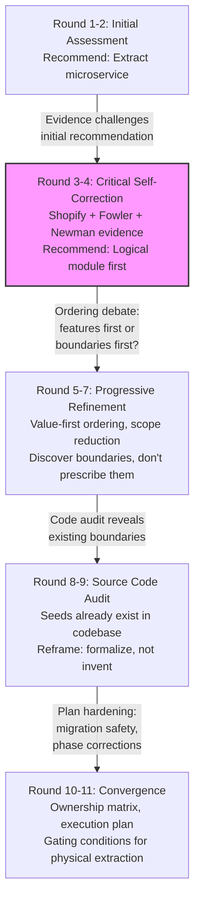
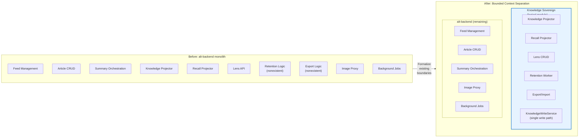
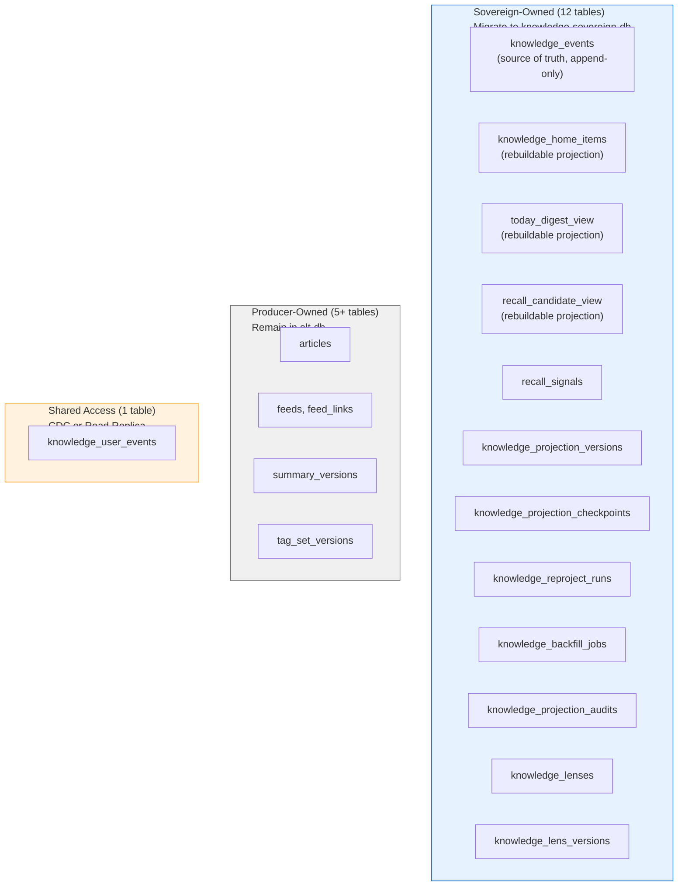

# Knowledge Sovereign: A Case Study in Bounded Context Evolution

How an AI-augmented RSS platform debated, self-corrected, and ultimately found the right abstraction for knowledge state ownership -- through 11 rounds of analysis and 5 execution phases.

---

## Overview

Should we extract a new microservice? This question haunts every team working in a growing monolith. The answer is rarely a clean yes or no. More often, it is a journey of progressive understanding -- one where the team must resist the pull of theoretical elegance, confront evidence that contradicts initial assumptions, and arrive at a pragmatic solution that respects both architectural ideals and operational reality.

This article documents one such journey. Alt, an AI-augmented RSS knowledge platform built with 20+ microservices across Go, Python, Rust, and TypeScript, faced a growing ownership problem in its core backend service. Knowledge-related responsibilities -- event sourcing, projections, recall candidates, retention policies, data export -- were scattered across the codebase with no clear owner. The team debated whether to extract a "Knowledge Sovereign" service from the monolithic alt-backend. That debate spanned 11 rounds of written analysis, multiple self-corrections, and ultimately produced a 5-phase execution plan that is both theoretically grounded and operationally honest.

The most valuable lesson is not the final architecture. It is the process of getting there.

## The Starting Point

Alt's core backend (`alt-backend`) had grown to handle a wide range of responsibilities: RSS feed management, article CRUD, full-text search orchestration via Meilisearch, AI summarization pipelines through local LLMs, recap generation, image proxying, background jobs, and the emerging Knowledge Home feature -- an event-sourced system for surfacing and rediscovering knowledge.

The Knowledge Home subsystem had already introduced event sourcing (an append-only `knowledge_events` table), CQRS-style projections (`knowledge_home_items`, `today_digest_view`, `recall_candidate_view`), and a growing set of protobuf-defined APIs (`GetKnowledgeHome`, `GetRecallRail`, Lens CRUD). But these components lived alongside feed management and article processing in the same service, with no formal ownership boundary.

Three structural problems demanded attention:

1. **Data lifecycle management was completely absent.** Across four PostgreSQL instances, Meilisearch, ClickHouse, and two Redis instances, there was no automatic deletion, archiving, or rotation of any kind. RAG vector embeddings alone were projected to reach 25-40GB within three years.

2. **Knowledge state had no owner.** Projections, recall candidates, retention policies, and export logic were scattered across usecases and job files with no single point of authority.

3. **Data portability did not exist.** There was no way to export or import knowledge artifacts. The only backup mechanism was a single shell script for PostgreSQL dumps.

## The Debate: 11 Rounds of Analysis

### Rounds 1-2: Initial Assessment

The first round (involve1) was a comprehensive academic survey. It evaluated microservice patterns and antipatterns, examined data tiering strategies, proposed sophisticated concepts like gradual forgetting models based on Ebbinghaus curves, and envisioned a full RAPTOR (Recursive Abstractive Processing for Tree-Organized Retrieval) implementation. The analysis was thorough but ambitious -- it proposed consolidated embeddings, SQLite-based portable exports with JSON-LD serialization, and CRDT-like conflict resolution.

The second round (involve2) distilled the options into a concrete three-way comparison:

| Option | Description | Recommendation |
|--------|-------------|----------------|
| Status quo | Keep everything in alt-backend | Low -- complexity continues to grow |
| Knowledge Sovereign + integrated backend | Extract knowledge responsibilities into a dedicated service | Medium-high -- best balance of cost and benefit |
| Full domain decomposition | Split into Feed, Article, Search, Knowledge services | Low -- operational cost too high for a solo developer |

Round 2 recommended Option 2: a dedicated Knowledge Sovereign microservice. The analysis included Mermaid architecture diagrams and a migration Gantt chart. It seemed like a clear path forward.

### Rounds 3-4: Critical Self-Correction

Round 3 (involve3) was the turning point. Instead of proceeding with the microservice plan, the team challenged its own recommendation against industry precedents.

The challenge drew on three critical sources:

- **Shopify's modular monolith**: 2.8 million lines of Ruby, 1000+ developers, processing 284 million requests per minute on Black Friday -- all without microservices. Shopify's insight: "The good parts of a monolith were all the result of code being in one place. The problems were all the direct result of not having boundaries between features in the code."

- **Martin Fowler's MonolithFirst principle**: "Almost all the successful microservice stories have started with a monolith that got too large and was broken up. Almost all the cases where I've heard of a system that was built as a microservice system from scratch have ended up in serious trouble."

- **Sam Newman at QCon London 2020**: "Microservices should not be the default choice. You can't fully understand the fear, pain, suffering, and cost of microservices until they are in production."

Round 4 (involve4) then applied five investigative lenses -- projection ownership patterns, bounded context splitting heuristics, knowledge management tool architectures, solo developer sustainability, and PostgreSQL data lifecycle management -- to validate the self-correction. The findings were stark:

- **No credible example of a solo developer sustaining 20+ microservices could be found.** This absence itself was a significant finding.
- **Robin Wieruch's case study** showed a solo developer abandoning microservices before reaching 5 services: "Reasoning about all microservices became too difficult. The separation became a negative asset."
- **DX analysis** suggested microservice complexity is justified only with 15-20+ developers.

The recommendation flipped: **logical module first, physical extraction only when gated conditions are met.**

### Rounds 5-7: Progressive Refinement

Round 5 (involve5) challenged the ordering of work. The original plan proposed "draw boundaries first, then add features." But Shopify's Packwerk pattern showed the opposite: components grew organically, boundaries were discovered in existing code, and then enforcement tools were applied. The revised principle became: **"Build features first, discover the natural boundaries, then enforce them."**

Round 6 (involve6) challenged the scope of earlier proposals. It correctly identified that rounds 1 and 7 had mixed research themes with implementation roadmaps. RAPTOR, consolidated embeddings, temporal knowledge graphs, and multi-variable Ebbinghaus reranking were classified as research topics -- interesting but not implementable given current system maturity. The team adopted a sharper filter:

**Adopt:** Modular monolith, Single Writer Principle (limited scope), retention tiers, Recall as re-connection.
**Defer:** RAPTOR, consolidated embeddings, temporal knowledge graphs, CRDT export.
**Reject:** Using involve1/involve7 as-is for implementation planning.

Round 7 (involve7) had proposed an ambitious future architecture with in-process event buses (kelindar/event), RAPTOR trees, and mathematical multi-variable reranking. Round 6's review reframed this: the proposals were directionally correct but operationally premature. The core insight it preserved was the definition of Knowledge Sovereign not as a "service" but as the **single owner of durable knowledge state**.

### Rounds 8-11: Convergence

Round 8 (involve8) produced the first comprehensive implementation plan. It synthesized all prior rounds into a unified document with clear adopt/defer/reject decisions, a retention tier design (active/warm/cold/archived), and a phased execution plan.

Round 9 (involve9) introduced a critical reality check: **the Knowledge Sovereign "seeds" already existed in the codebase.** The proto definitions for Knowledge Home were already defined. `knowledge_projector.go` was already projecting events into home items. `recall_projector.go` was already computing recall scores. OPML import/export had already been implemented. The question was not "should we build Knowledge Sovereign?" but "should we formalize the ownership that already exists?"

Round 10 (involve10) was the final comprehensive plan (v3), incorporating the source code audit findings. It produced the ownership matrix -- the concrete table of which components belong to Sovereign and which do not.

Round 11 (involve11) served as the execution-ready review. It identified remaining weaknesses in the plan: phase ordering contradictions, over-reliance on Go's `internal/` package for Single Writer enforcement, retention scoped too narrowly to articles, and insufficient migration safety design. The final plan added Phase 0 (boundary scaffolding) and Phase 4 (migration safety with shadow runs and reconciliation).

## The Decision

The final decision can be stated precisely:

**Knowledge Sovereign = Alt's single owner of durable knowledge state.**

It is not a new service. It is not a universal platform. It is the formal designation of responsibility for: knowledge events, projections, recall candidates, lenses, retention policy, and export manifests.

What it owns and what it does not own is equally important:

| Sovereign Owns | Sovereign Does NOT Own |
|---|---|
| Knowledge events (append-only event store) | RSS feed collection |
| Projection versions and checkpoints | Article raw CRUD |
| Knowledge Home items and Today Digest | Summary generation (news-creator) |
| Recall signals and candidates | Tag generation (tag-generator) |
| Lenses (user knowledge viewpoints) | Embedding generation (knowledge-embedder) |
| Export manifests and import jobs | RAG retrieval and answer generation |
| Retention tier policy and transitions | Recap pipeline execution |

The critical principle: **Recap, Augur, and RAG are producers. Knowledge Sovereign is the state owner.** If this separation breaks, the result is a distributed monolith.

## Execution Plan

The execution plan spans 5 phases with explicit gating conditions between them. The ordering principle is: **user value first, boundary enforcement second.**

### Phase 0: Boundary Scaffolding (1 week)

Create the minimal container. No heavy implementation -- just names, entry points, and ownership declarations.

- Create `knowledge_sovereign` package structure (domain, port, gateway, usecase)
- Define port interfaces: `ProjectionMutator`, `RecallMutator`, `CurationMutator`, `RetentionResolver`, `ExportScopeResolver`
- Implement stub drivers that return `ErrNotImplemented`
- Draft ownership matrix, retention policy matrix, and export data classification

### Phase 1: Write Path Consolidation (2-3 weeks)

Replace stubs with real dispatch logic. Route existing write paths through the Sovereign usecase.

- Implement mutation type dispatch in the driver layer
- Route `knowledge_projector` writes through Sovereign
- Route `recall_projector` writes through Sovereign
- Route dismiss fast-path through `CurationMutator`
- Implement retention and export resolvers with policy matrix lookups
- Wire into DI container and inject into projectors

Key design: the Sovereign usecase is injected as an optional parameter. If nil, the old path executes. This enables zero-risk incremental migration and preserves all existing tests.

### Phase 2: Migration Safety (3-5 weeks)

Build the infrastructure to prove the new paths are correct before committing to them.

- Complete remaining driver stub implementations
- Add Sovereign-specific observability metrics (8 metric types)
- Route reproject job through Sovereign
- Implement reconciliation job (30-minute interval, comparing old and new projections)
- Add idempotency key support to mutation dispatch
- Formalize rollback conditions and procedures

### Phase 3: Physical Extraction Preparation (4-6 weeks)

Prepare for the possibility of physical service separation without actually doing it.

- Route remaining write paths (lens CRUD) through Sovereign
- Define `SovereignEventEnvelope` transport contract
- Implement direct-dependency audit tests (compile-time detection of boundary violations)
- Build `CutoverReadinessUsecase` with quantitative gates
- Complete DB ownership table and cutover readiness checklist

### Phase 4: Physical Service + DB Extraction (conditional)

This phase executes only when all gating conditions are met. It creates a standalone `knowledge-sovereign` service with its own database, communicating via Connect-RPC.

- Create independent `knowledge-sovereign` service (Go, Clean Architecture, Connect-RPC)
- Provision `knowledge-sovereign-db` (PostgreSQL, compose service)
- Migrate data via snapshot + replay catch-up
- Shadow compare for integrity verification
- Execute cutover: freeze window, writer switch, post-compare validation
- Remove dual-path code from alt-backend

```mermaid
flowchart LR
    P0["Phase 0<br/>Boundary Scaffolding<br/>1 week"]
    P1["Phase 1<br/>Write Path Consolidation<br/>2-3 weeks"]
    P2["Phase 2<br/>Migration Safety<br/>3-5 weeks"]
    P3["Phase 3<br/>Extraction Preparation<br/>4-6 weeks"]
    P4["Phase 4<br/>Physical Extraction<br/>Conditional"]

    P0 -->|"Ownership matrix<br/>defined"| P1
    P1 -->|"All write paths<br/>through Sovereign"| P2
    P2 -->|"Reconciliation<br/>healthy >= 10 runs"| P3
    P3 -->|"All cutover gates<br/>satisfied"| P4

    G1{{"Gate: write path<br/>consolidation = 100%"}}
    G2{{"Gate: mismatch<br/>rate < 1%"}}
    G3{{"Gate: replay<br/>success verified"}}
    G4{{"Gate: operational<br/>judgment"}}

    P3 --> G1 --> G2 --> G3 --> G4 --> P4

    style P4 fill:#fff3e0,stroke:#ff9800,stroke-width:2px
    style G1 fill:#fff,stroke:#999
    style G2 fill:#fff,stroke:#999
    style G3 fill:#fff,stroke:#999
    style G4 fill:#fff,stroke:#999
```

## Database Ownership Model

A precise table-level ownership model drives the physical extraction decision. Tables fall into three categories: Sovereign-owned (migrate to sovereign-db), producer-owned (remain in alt-db), and shared-access (require special handling).

The migration strategy follows a **replay-only approach** -- no dual-write. Projections (`knowledge_home_items`, `today_digest_view`, `recall_candidate_view`) are disposable and can be rebuilt from the event log. Audit trails and lens data require direct migration. The `knowledge_user_events` table, which both Sovereign and producers access, is handled via CDC or read replica.

## Cutover Readiness

The cutover readiness checklist defines 8 categories of gating criteria. Every gate must pass before physical extraction begins.

| Category | Gate Criteria |
|----------|--------------|
| **Write Path Consolidation** | All 8 write paths route through Sovereign usecase (projector, recall, dismiss, reproject, 4 lens operations). Consolidation rate = 100% |
| **Reconciliation Health** | 30-minute reconciliation job stable. 10+ consecutive healthy runs. Item count drift < 5%, score drift < 10% |
| **Replay Safety** | Reproject via Sovereign WriteService succeeds. Post-replay reconciliation is healthy. Idempotency key deduplication verified |
| **Observability** | 8 Sovereign-specific metrics visible in dashboards. Cutover readiness gauge reads 1.0. Mismatch alerts configured |
| **Transport Contract** | `SovereignEventEnvelope` type defined and tested. Producer-to-Sovereign contract documented |
| **Boundary Integrity** | All lens write usecases route through Sovereign CurationMutator |
| **DB Ownership** | Complete table ownership matrix. Migration/non-migration targets unambiguous. Rebuildable tables identified |
| **Rollback** | Rollback reproject + version activate verified. Runbook exists. DI container nil-injection fallback tested |

When a gate fails, the response is specific: consolidation shortfall means identifying and routing the remaining write path; reconciliation failure means debugging projection drift; replay failure means investigating idempotency or event ordering.

## Key Design Decisions

### What Was Chosen

**Modular monolith over microservice extraction.** The team started with a microservice recommendation and reversed course after examining Shopify's Packwerk approach, Fowler's MonolithFirst, and the practical evidence that solo developers consistently fail at microservice maintenance. The Knowledge Sovereign concept was preserved, but its form changed from a network service to a Go package boundary.

**Single Writer Principle with limited scope.** Martin Thompson's benchmarks showing 393x performance improvement for single-threaded writes were compelling, but the team resisted applying the principle universally. Instead, Single Writer was applied only to projection writes, recall writes, retention tier management, and export manifests -- the "durable knowledge state." This avoided the trap of building an internal event bus before the basic ownership was stable.

**Features before boundaries.** The Shopify lesson was applied in reverse: rather than designing the perfect module structure and filling it with features, the team built retention workers, export logic, and recall projectors, then discovered the natural module boundary they formed. Phase 0 creates the minimal scaffolding, but the real boundary emerges from Phase 1-2 implementation.

**Retention as a knowledge concept, not a database operation.** Retention tiers (hot/warm/cold/archive) are managed per entity type through a policy matrix, not through a single column on the articles table. This respects the reality that article metadata, raw body, summaries, tags, recall signals, and recap results each have different lifecycle characteristics.

### What Was Rejected

**Physical microservice extraction as a starting point.** The evidence was overwhelming: Altready had 20+ services, solo developers fail at microservice maintenance before reaching 5 services, and the 15-20 developer threshold for justifying microservices was not met.

**Sophisticated AI features before basic ownership.** RAPTOR (recursive abstractive retrieval), consolidated embeddings (LLM-compressed vector summaries), temporal knowledge graphs, and multi-variable Ebbinghaus reranking were all proposed in early rounds. All were deferred -- not because they were wrong, but because implementing them without stable ownership would create unmaintainable complexity.

**New database technologies.** Graph databases and specialized vector stores (LanceDB) were proposed but rejected. PostgreSQL with pgvector, partial indexes, and the existing partitioning capabilities could handle Alt's scale (approximately 180,000 rows per year). New database types would be reconsidered only if pgvector performance degradation was measured in production.

### Why the Self-Correction Mattered

The most important moment in the entire debate was Round 3, when the team challenged its own microservice recommendation. Without that self-correction:

- A 21st microservice would have been added to a system already straining under operational complexity
- The solo developer would have faced distributed transaction coordination across network boundaries
- The real problem -- scattered ownership with no single authority for knowledge state -- would have been obscured by the ceremony of service extraction

The progression from "let's build a microservice" to "wait, let's validate against evidence" to "actually, logical module first" to "physical split only when 8 categories of gating conditions are met" represents a mature engineering process. It is easy to propose extraction. It is harder to prove it is warranted. It is hardest to define the conditions under which it becomes warranted.

## Lessons Learned

**1. The debate is more valuable than the decision.** Eleven rounds of written analysis produced a decision that no single round could have reached. Each round added constraints, challenged assumptions, and introduced evidence from outside the project. The final architecture is better not because someone was brilliant, but because the process was rigorous.

**2. Evidence beats intuition, even your own.** The initial recommendation (extract a microservice) was reasonable. The evidence against it (Shopify, Fowler, Newman, Robin Wieruch, DX analysis) was stronger. The team had the discipline to follow the evidence rather than defend the initial position.

**3. Ownership before features.** The Knowledge Sovereign concept was not about adding new capabilities. It was about designating a single authority for capabilities that already existed. `knowledge_projector.go`, `recall_projector.go`, and the Knowledge Home proto definitions were already in the codebase -- they just lacked a formal owner.

**4. Gating conditions turn "maybe later" into "here's when."** The cutover readiness checklist transforms the vague statement "we might extract a service someday" into a concrete, measurable set of conditions. This removes the ambiguity that leads either to premature extraction or indefinite postponement.

**5. Self-correction is a feature, not a bug.** Changing your mind in Round 3 after recommending extraction in Round 2 is not inconsistency. It is the scientific method applied to architecture. The written record of why the recommendation changed is itself a reusable artifact for future decisions.

**6. The modular monolith is not a compromise.** Shopify processes billions of requests with a modular monolith and 1000+ developers. The pattern is not a stepping stone to microservices -- it is a valid architectural endpoint. Physical extraction should be treated as an option to exercise when conditions warrant, not an inevitable destination.

---

*This article is derived from internal architecture decision records and planning documents produced during 2026. Service names, technology choices, and design patterns reflect the actual system. The cutover readiness checklist and ownership matrix are presented as reusable artifacts for teams facing similar bounded context evolution decisions.*
