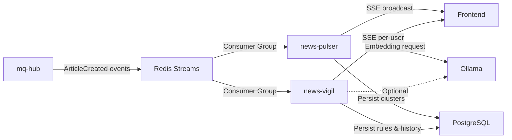
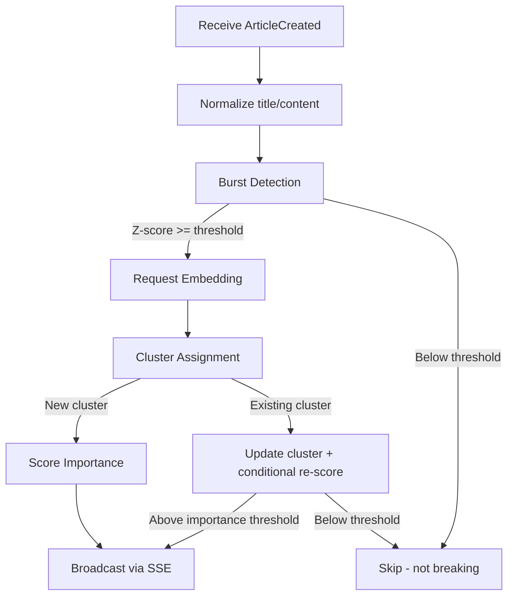
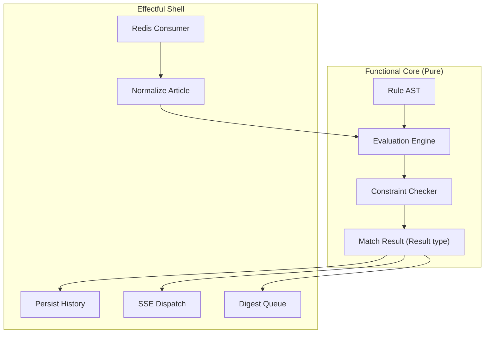
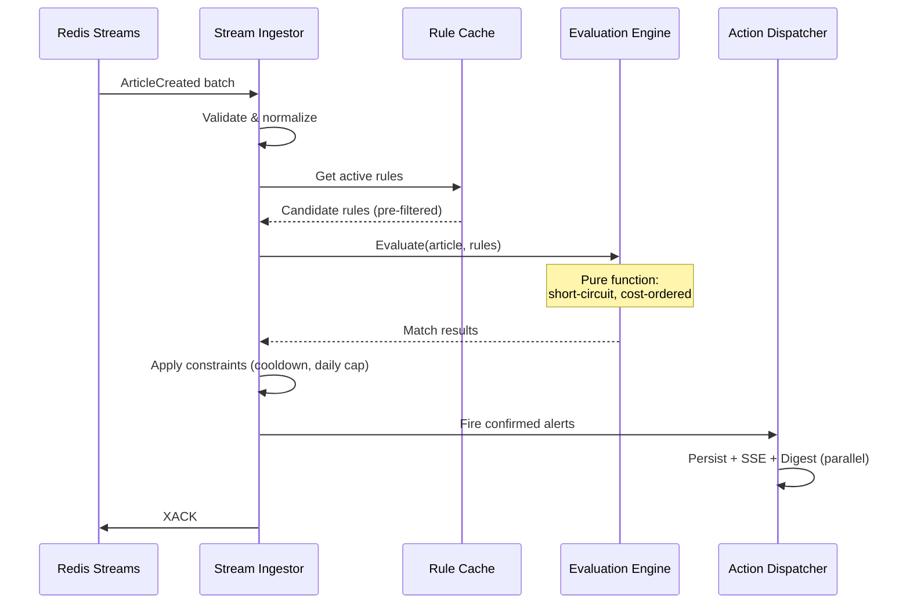
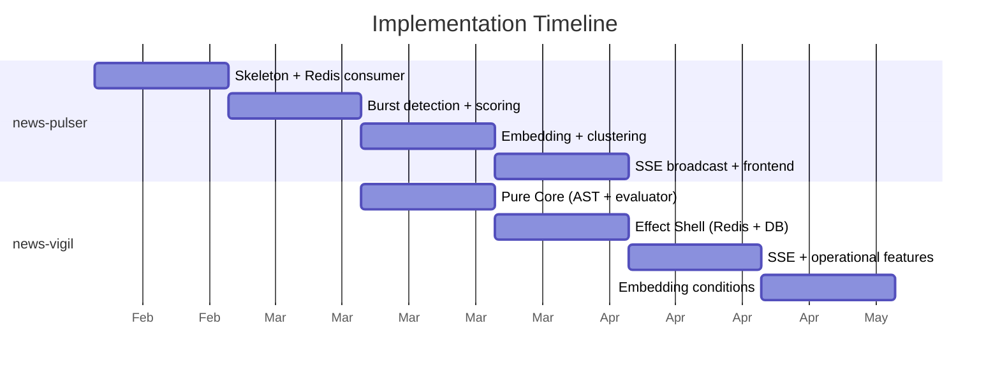

# Real-time News Detection and Alert Architecture in F#

## Overview

Alt's knowledge pipeline processes RSS articles through summarization, tagging, search indexing, and weekly recaps. Two planned services extend this pipeline into real-time territory:

- **news-pulser**: Detects breaking news by analyzing article arrival patterns and clustering related stories using embeddings
- **news-vigil**: Evaluates user-defined alert rules against the article stream, enabling personalized notifications

Both services are designed in F# 10 / .NET 10, following functional programming principles and Alt's existing Clean Architecture pattern (`Handler -> Usecase -> Port -> Gateway -> Driver`).

This document describes the architectural decisions behind these services — why F# was chosen, how the functional core / effectful shell pattern was applied, and how real-time detection integrates with an existing event-driven microservice platform.

## System Context

Both services consume from the same Redis Streams topic (`ArticleCreated` events) using independent consumer groups. This means they process the same article stream independently, without interfering with each other or the existing consumers (pre-processor, tag-generator, search-indexer).

## news-pulser: Breaking News Detection

### Detection Pipeline

#### Burst Detection (Sliding Window + Z-Score)

The burst detector maintains a sliding window (5-minute buckets over a 60-minute horizon) of normalized token frequencies. When a token's frequency deviates significantly from its expected rate (Z-score >= 3.0), a burst signal is generated.

This approach detects sudden spikes in topic coverage without requiring historical baselines — the window itself establishes the "normal" rate.

#### Embedding-Based Clustering

Articles that trigger burst detection are embedded via the platform's Ollama instance (using `mxbai-embed-large`, 1024 dimensions). Cosine similarity determines cluster assignment:

- Similarity >= 0.85 with an active cluster: article joins the cluster
- Below threshold: a new cluster is created (potential new breaking event)

Clusters have a lifecycle: `active` (< 24h since last update) -> `inactive` -> `archived` (> 7 days). Only active clusters participate in similarity matching.

#### Importance Scoring

A weighted combination of three factors:

| Factor | Weight | Description |
|--------|--------|-------------|
| Burst Score | 0.40 | Normalized Z-score (0-1 range) |
| Source Authority | 0.30 | Media tier classification |
| Recency | 0.30 | Exponential decay from publication time |

#### Degradation Design

| Failure | Behavior | Impact |
|---------|----------|--------|
| Embedding API down | Skip clustering, continue burst detection only | Unclustered breaking events increase |
| Database down | Continue SSE broadcast, stop history persistence | Duplicate notifications increase |
| Redis down | Service stops (no input) | Automatic recovery via consumer group on reconnect |

### SSE Broadcast

news-pulser hosts its own SSE endpoint. The implementation follows the platform's established SSE patterns:

- 10-second heartbeat interval (`: heartbeat\n\n`)
- Security headers (`X-Content-Type-Options: nosniff`, `X-Frame-Options: DENY`)
- Client-side exponential backoff with jitter on reconnection
- 25-second health check timeout (2.5x heartbeat interval)

The frontend hook uses Svelte 5 Runes (`$state`, `$derived`) for reactive state management, matching the existing `useSSEFeedsStats` pattern.

## news-vigil: User-Defined Alert Rules

### Design Philosophy

news-vigil applies three F# design principles rigorously:

#### 1. Functional Core, Effectful Shell

All rule evaluation, normalization, and priority decisions are pure functions. Redis, PostgreSQL, SSE, and embedding calls are isolated in the effectful shell. This enables fast unit testing of the core logic without any external dependencies.

#### 2. Make Illegal States Unrepresentable

The rule condition tree is modeled as a discriminated union (algebraic data type). Invalid condition trees are rejected at parse time, not at evaluation time. Evaluation results use `Result` types, making failure paths explicit and exhaustive.

#### 3. Sequential Evaluation, Parallel Side Effects

Within a single article, rule evaluation runs sequentially — this enables shared-cache access and short-circuit evaluation (cheap conditions first, `And`/`Or` short-circuiting). Independent side effects (history persistence, SSE dispatch, digest queue insertion) run in parallel using F#'s `task` computation expressions with `and!` for concurrent awaiting.

### Rule Evaluation Pipeline

#### Candidate Pre-filtering

Not every rule needs evaluation for every article. A keyword/source pre-index narrows the candidate set before the evaluation engine runs. This keeps evaluation cost proportional to matched rules, not total rules.

#### Backpressure

A bounded channel sits between Redis ingestion and evaluation. When the evaluation pipeline backs up, the ingest side naturally slows down. Monitoring tracks pending count, queue depth, and processing latency — but drops are designed never to occur (backpressure, not load shedding).

### Persistence Design

Four tables with distinct responsibilities:

| Table | Purpose | Write Pattern |
|-------|---------|--------------|
| `rules` | Current active rule state | CRUD |
| `rule_events` | Change audit log | Append-only |
| `alert_history` | Firing results | Append-only |
| `digest_queue` | Batched notification queue | Append + drain |

Consistency is achieved through idempotency keys and unique constraints rather than distributed transactions. If persistence fails, evaluation results are still logged and metrics are emitted.

### Multi-tenancy

Authentication flows through the platform's auth-hub service. Rule CRUD and SSE channels are tenant-isolated. All queries include `user_id` as the leading filter condition. Audit logs preserve tenant identifiers for compliance.

## Why F# for These Services

The choice of F# 10 for both services was deliberate:

1. **Discriminated unions for domain modeling**: Rule ASTs, pipeline states (`Received -> BurstChecked -> Clustered -> Scored -> Published`), and error types map naturally to sum types with exhaustive pattern matching.

2. **Pure function testing**: The evaluation engine and scoring logic can be tested with property-based testing, without mocking any infrastructure.

3. **`task` computation expressions**: .NET integration is seamless — Redis, PostgreSQL, and HTTP clients work natively. `and!` enables safe parallel side effects within a familiar syntax.

4. **File ordering enforces dependency direction**: F#'s compilation order (`Domain -> Port -> Usecase -> Gateway -> Handler -> Worker -> Program`) physically prevents circular dependencies between Clean Architecture layers.

### What F# Does Not Do Here

- No abstract interface hierarchies — dependencies are injected as function records
- No generic DI containers — composition root wires concrete implementations
- No exception-driven control flow — `Result` types everywhere
- No over-abstraction — Active Patterns are used sparingly, only for classification

## Implementation Phases

Each phase has explicit acceptance criteria and exit conditions. Phase boundaries are defined by functional completeness, not calendar dates.

## Key Takeaways

1. **Functional Core / Effectful Shell scales to real-time services**: Keeping detection and evaluation logic pure enables sub-second unit test suites and makes reasoning about concurrent behavior tractable.

2. **Consumer groups enable zero-coordination parallelism**: Both services consume the same event stream independently. Adding a new consumer requires no changes to producers or existing consumers.

3. **Design for degradation, not just success**: Both services define explicit behavior for every external dependency failure. The key principle: never stop processing because a non-essential dependency is down.

4. **F#'s type system prevents architectural violations**: File ordering + discriminated unions + Result types create a system where illegal states, circular dependencies, and unhandled errors are compile-time failures.

5. **Start with pure functions, add effects last**: news-vigil's Phase 1 delivers a complete, tested evaluation engine with zero external dependencies. Infrastructure arrives in Phase 2. This ordering forces clean domain boundaries.
