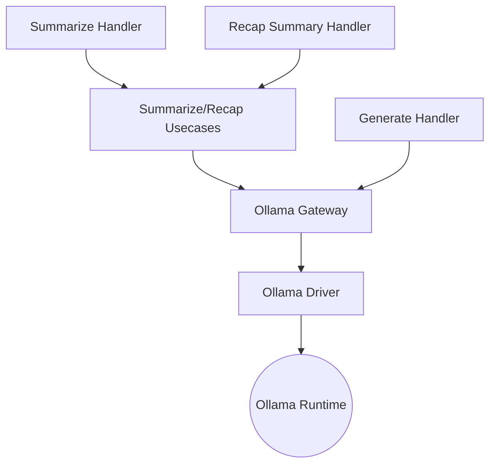

# News Creator

_Last reviewed: November 17, 2025_

**Location:** `news-creator/app`

## Role
- FastAPI service (Python 3.11+) that synthesizes article summaries and recap blurbs via an Ollama LLM while preserving Clean Architecture boundaries.
- Keeps handlers thin and testable; orchestrates summarization, recap summary generation, and a generic `/api/generate` passthrough for experimentation.
- Addresses the `ollama` Compose profile, wired into the recap-worker pipeline and callable by ad-hoc clients via authenticated service tokens.

## Architecture & Flow
| Layer | Components |
| --- | --- |
| Handler | `create_summarize_router`, `create_generate_router`, `create_recap_summary_router`, `create_health_router` (FastAPI routers with Pydantic schemas). |
| Usecase | `SummarizeUsecase`, `RecapSummaryUsecase` (business logic, orchestrates prompts + metadata). |
| Port | `LLMProviderPort`, `AuthPort`, `UserPreferencesPort` (ABCs for external dependencies). |
| Gateway | `OllamaGateway` adapts ports to `driver` calls, serializes prompts/options. |
| Driver | `ollama_driver.py` (aiohttp client, handles streaming, retries, metadata). |
| Config | `NewsCreatorConfig` (env-driven values for service secret, LLM endpoint, prompt params). |

## Handlers & Contracts
- `POST /api/v1/summarize` (request `article_id`, `content`): `SummarizeUsecase` returns `summary`, `model`, token counts; errors map to 400/502/500 accordingly.
- `POST /api/generate` forwards arbitrary prompts to `Gateway.generate` with optional `num_predict` overrides; response mimics Ollama schema (`model`, `response`, `done`, `total_duration`).
- `POST /v1/summary/generate` accepts `RecapSummaryRequest`, uses the same Ollama gateway but reshapes evidence clusters, metadata, and ensures 502 on runtime failures.
- `GET /v1/health` pings `OllamaGateway` readiness; router comes from `create_health_router`.
- Lifespan (`asynccontextmanager`) initializes/cleans `OllamaGateway` session so `aiohttp` sessions reuse connections.

## Configuration & Environment
- `SERVICE_SECRET` (required) guards recap/summarize endpoints; `AUTH_SERVICE_URL` points auth-hub for future extensions.
- LLM settings: `LLM_SERVICE_URL`, `LLM_MODEL`, `LLM_TIMEOUT_SECONDS`, `LLM_KEEP_ALIVE_SECONDS`, `LLM_NUM_CTX`, `LLM_NUM_PREDICT`, `LLM_TOP_P`, `LLM_TOP_K`, `LLM_REPEAT_PENALTY`, `LLM_NUM_KEEP`, `LLM_STOP_TOKENS`.
- Summary-specific knob: `SUMMARY_NUM_PREDICT`.
- Config logs sanitized values to `logging` during startup.

## Integration & Data Flow
- `DependencyContainer` in `main.py` wires `NewsCreatorConfig`, `OllamaGateway`, `SummarizeUsecase`, and `RecapSummaryUsecase`.
- `OllamaGateway` uses `driver/ollama_driver.py` (aiohttp client) to send typed JSON to Ollama; the driver handles timeouts, status checks, and JSON decoding.
- Recap worker depends on `/v1/summary/generate`; `news-creator` returns structured `RecapSummaryResponse` with `genre`, `evidence`, and `metadata`.
- Generation endpoint can be used directly by developers for prototype prompts without touching recap payload shapes.
- Sanitization helpers (`news_creator/domain/prompts.py`) centralize template text + safety filters.

## Testing & Tooling
- `uv run pytest` covers `tests/handler`, `tests/usecase`, `tests/gateway`, `tests/driver`, `tests/domain` (golden prompt datasets). Use `pytest-asyncio` + `AsyncMock`.
- Golden datasets live under `tests/domain` and must be updated whenever prompt templates change.
- `uv run ruff check`, `uv run mypy` ensure lint/type coverage; `uv run ruff format` standardizes style.
- For new prompts, add deterministic tests that assert key metadata fields `model`, `prompt_tokens`, and `total_duration_ms`.

## Operational Notes
1. Start with `docker compose --profile ollama up news-creator` (Ollama runtime must be healthy).
2. Fire a summarization request manually: `curl -X POST http://localhost:8001/api/v1/summarize -d '{"article_id":"t","content":"..."}'`.
3. Monitor `ollama_gateway` latency logs; GPU contention manifests as slow `total_duration_ms`.
4. Changing `NEWS_CREATOR_MODEL` requires redeploy + re-run golden tests.
5. Recap worker expects `summary` + `genre` metadata from `/v1/summary/generate`; keep service secret in sync with the worker’s `service-token`.

## Observability
- Logging uses Python `logging` with fields `operation`, `model`, `prompt_tokens`, `response`, `total_duration_ms`.
- Add new histograms (e.g., `ollama_inference_duration`) by extending `news_creator/handler` to emit instrumentation or hooking into `Prometheus` when ready.
- The `generate` handler logs overrides so experiments can be traced.

## LLM Notes
- When asking for code changes, specify which layer to touch (handler/usecase/gateway/driver). Provide request/response schemas (Pydantic models in `news_creator/domain/models.py`).
- Emphasize `OllamaGateway` for all LLM requests so authentication and retry policies stay centralized.
