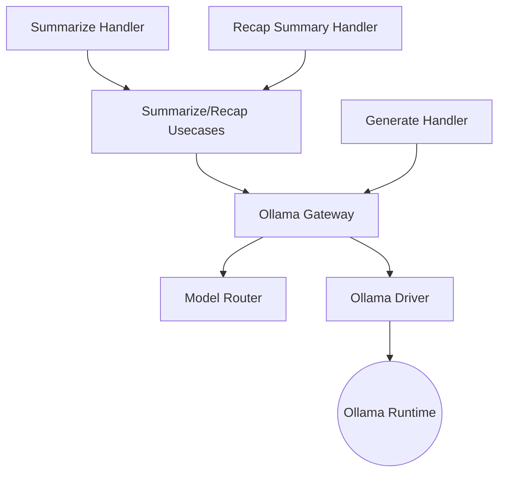

# News Creator

_Last reviewed: December 18, 2025_

**Location:** `news-creator/app`

## Role
- FastAPI service (Python 3.11+) that synthesizes article summaries and recap blurbs via an Ollama LLM while preserving Clean Architecture boundaries.
- Keeps handlers thin and testable; orchestrates summarization, recap summary generation, and a generic `/api/generate` passthrough for experimentation.
- Addresses the `ollama` Compose profile, wired into the recap-worker pipeline and callable by ad-hoc clients via authenticated service tokens.
- **Key Capability**: Automatically handles large inputs via **Map-Reduce** summarization and optimizes VRAM usage via **Model Bucket Routing** (16K/80K).

## Architecture & Flow
| Layer | Components |
| --- | --- |
| Handler | `create_summarize_router`, `create_generate_router`, `create_recap_summary_router`, `create_health_router` (FastAPI routers with Pydantic schemas). |
| Usecase | `SummarizeUsecase`, `RecapSummaryUsecase` (business logic, orchestrates prompts + metadata). |
| Port | `LLMProviderPort`, `AuthPort`, `UserPreferencesPort` (ABCs for external dependencies). |
| Gateway | `OllamaGateway` adapts ports to `driver` calls. Includes `ModelRouter` (selects 16K/80K model), `OOMDetector` (handles VRAM errors), and `FIFOSemaphore` (concurrency control). |
| Driver | `ollama_driver.py` (aiohttp client, handles streaming, retries, precision timeouts, metadata). |
| Config | `NewsCreatorConfig` (env-driven values for service secret, LLM endpoint, prompt params, thresholds). |

## Key Features

### 1. Model Bucket Routing & Optimization
To balance performance and VRAM usage on consumer GPUs (e.g., RTX 4060 Ti 16GB), the service uses a **Bucket System**:
- **Standard (16K Context)**: Used for normal summaries and small inputs. Loaded into VRAM by default (warmup) or on-demand with 30m keep-alive.
- **Large (80K Context)**: Used for massive recap tasks. Loaded on-demand with 15m keep-alive to free up resources quickly.
- **Auto-Routing**: `ModelRouter` analyzes input size + options to select the most efficient model automatically.

### 2. Map-Reduce Hierarchical Summarization
For extremely large inputs (multiple article clusters) that exceed even the 80K context window:
1.  **Map Phase**: Splits clusters into chunks (config: `HIERARCHICAL_CHUNK_MAX_CHARS`) and generates intermediate summaries in parallel.
2.  **Reduce Phase**: Combines intermediate summaries into a final structured recap.
3.  **Thresholds**: Triggered if input > `HIERARCHICAL_THRESHOLD_CHARS` (default ~50K tokens) or > `HIERARCHICAL_THRESHOLD_CLUSTERS`.

### 3. Resilience & Zero-Trust
- **OOM Recovery**: `OOMDetector` catches "Out of Memory" errors or timeouts and automatically retries with a smaller model or fallback strategy.
- **Repetition Detection**: `repetition_detector` scans outputs for loops. If detected, retries with higher `repeat_penalty` and lower `temperature`.
- **Zero-Trust Cleaning**: `html_cleaner` strips HTML tags before processing to prevent token waste and injection, even if input claims to be text.

## Handlers & Contracts
- `POST /api/v1/summarize` (request `article_id`, `content`): `SummarizeUsecase` returns `summary`, `model`, token counts. Supports automatic fallback for short content.
- `POST /api/generate` forwards arbitrary prompts to `Gateway.generate`.
- `POST /v1/summary/generate`: accepts `RecapSummaryRequest`.
    - Inputs: `clusters` (list of representative sentences) OR `genre_highlights`.
    - Output: `RecapSummaryResponse` (Structured JSON with title, bullets, refs).
    - Fallback: If LLM fails, constructs a fallback summary from top sentences.
- `GET /v1/health`: Checks `OllamaGateway` readiness.

## Configuration & Environment
- **Core**: `SERVICE_SECRET`, `LLM_SERVICE_URL`.
- **LLM Parameters**: `LLM_MODEL` (default base), `LLM_NUM_CTX` (default 16K), `LLM_TIMEOUT_SECONDS` (default 300s).
- **Routing**:
    - `MODEL_ROUTING_ENABLED` (true/false)
    - `MODEL_16K_NAME`, `MODEL_80K_NAME` (actual Ollama model tags)
    - `WARMUP_ENABLED` (preloads 16K model)
- **Map-Reduce**:
    - `HIERARCHICAL_THRESHOLD_CHARS`, `HIERARCHICAL_CHUNK_MAX_CHARS`.
- **Sanitization**: `SUMMARY_NUM_PREDICT` (output limit), `REPETITION_THRESHOLD`.

## Integration & Data Flow
- `DependencyContainer` in `main.py` wires all components.
- `OllamaGateway` enforces concurrency via `OLLAMA_REQUEST_CONCURRENCY` (if unset, falls back to `OLLAMA_NUM_PARALLEL`) to prevent VRAM thrashing.
- **Observability**: Structured logs track `token_per_second`, `load_duration`, and `prompt_eval_duration` (prefill speed).

## Operational Notes
1. **Startup**: `docker compose --profile ollama up news-creator`.
2. **Warmup**: Service attempts to ping the 16K model on boot to load weights into VRAM.
3. **Monitoring**: Watch logs for `ABNORMAL PROMPT SIZE` warnings or `Slow LLM generation` alerts.
4. **VRAM Management**: The service aggressively manages `keep_alive` to ensure the 80K model unloads after use, preventing OOMs during subsequent standard tasks.
5. **Testing**: `tests/domain` contains golden prompts. Use `pytest` to verify routing logic.
