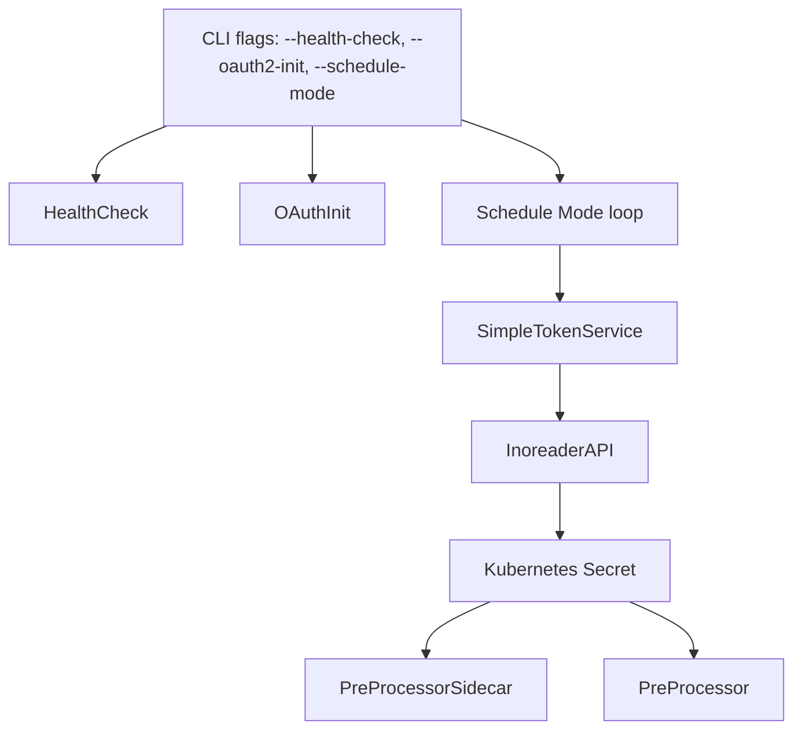

# Pre-processor Sidecar

_Last reviewed: November 17, 2025_

**Location:** `pre-processor-sidecar/app`

## Role
- Scheduler that keeps Inoreader ingestion healthy by rotating tokens, syncing subscriptions, and triggering article fetches via `SimpleTokenService`.
- Runs as a CronJob (Forbid concurrency) but supports `--schedule-mode` for continuous debugging, `--oauth2-init` for bootstrap, and `--health-check` for readiness.
- Uses `singleflight`, secret watchers, and adaptive rate limiting to respect Inoreader quotas.

## Flags & Control Modes
- `--health-check`: runs `performHealthCheckWithOutput`, verifies config, DB, OAuth2 endpoints, and exits.
- `--oauth2-init`: waits for Linkerd (10s), validates DB, and bootstraps tokens before exiting; uses `performOAuth2Initialization`.
- `--schedule-mode`: toggles dual schedule loop (`article_fetch_interval` 30m + `subscription_sync_interval` 12h) with `runScheduleMode`; useful when debugging rate limits or watching `TOKEN_REFRESH` logs.
- Default (CronJob) mode triggers scheduler once, respecting Kubernetes `ConcurrencyPolicy: Forbid`.

## Simple Token Flow
- `SimpleTokenService` (in `service/`) uses `SimpleTokenConfig` (env-driven) to:
  - Refresh tokens via `Inoreader` OAuth2 with `RefreshBuffer` (30m) and `CheckInterval` (3h).
  - Watch reserved `Kubernetes` secret when `ENABLE_SECRET_WATCH=true`, reloading tokens without restarts.
  - Use `golang.org/x/sync/singleflight` to deduplicate simultaneous refreshes.
  - Emit logs (`TOKEN_REFRESH`, `ARTICLE_FETCH`, `SECRET_UPDATED`) with `component`, `interval`, `status`.
- Rate limiting, API budgets, and `max_daily_rotations` live in `RotationConfig` + `RateLimitConfig`.

## Integrations & Configuration
- `config.LoadConfig()` expects secrets for `INOREADER_CLIENT_ID`, `INOREADER_CLIENT_SECRET`, `INOREADER_REFRESH_TOKEN`, `PRE_PROCESSOR_SIDECAR_DB_PASSWORD`, and optionally `OAUTH2_SECRET_NAME`.
- Database connection string built from `DB_*` envs; OAuth2 base URLs (Inoreader, `cfg.OAuth2.BaseURL`) stay separate.
- Proxy settings (`HTTPS_PROXY`, `NO_PROXY`) default to internal Envoy; HTTP client configs define timeouts, idle connections, and TLS handshake overrides.
- `service.SimpleTokenConfig` accepts `EnableSecretWatch`, `RefreshBuffer`, `CheckInterval`, `RateLimit.DailyLimit`, `OAuth2SecretName`.

## Testing & Tooling
- `go test ./...` exercises services, repository mocks, and scheduler loops.
- Use `mocks/` packages for OAuth2 provider and scheduler interfaces.
- Time manipulation uses provided `Clock` interfaces (`domain/time`) to deterministically test expiry and scheduling drift.
- Run `make generate-mocks` when introducing new dependencies.

## Operational Runbook
1. For daily CronJob, rely on Kubernetes manifest (Forbid concurrency, `startingDeadlineSeconds`).
2. Run `go run cmd/main.go --health-check` before enabling schedule mode.
3. `--oauth2-init` flows connect to DB (via `DatabaseConfig`) and update secrets; wait 10s for Linkerd proxies before calling Inoreader.
4. Monitoring loop (`--schedule-mode`) logs `TOKEN_REFRESH`, `ARTICLE_FETCH`, and `SECRET_UPDATED`; adjust `MAX_DAILY_ROTATIONS` via env to throttle consumption.
5. When `auth-token-manager` rotates tokens, ensure `ENABLE_SECRET_WATCH=true` so the sidecar reloads without restart.

## Observability
- Logs (JSON) include `component`, `interval`, `subscription_sync_interval`, `article_fetch_interval`, `token_status`.
- `SimpleAdminAPIMetricsCollector` (hosted inline) increments counters for `/metrics`, `/debug/*`, and `rate limit hit` warnings.
- Watch for `Admin API rate limit hit` logs; they hint at needing a higher `api_daily_limit` or longer `CheckInterval`.

## LLM Notes
- Mention whether new code honors `SimpleTokenService`, scheduler loops, or secret watching; provide exact env names (`ENABLE_SECRET_WATCH`, `MAX_DAILY_ROTATIONS`) so LLMs wire configs correctly.
