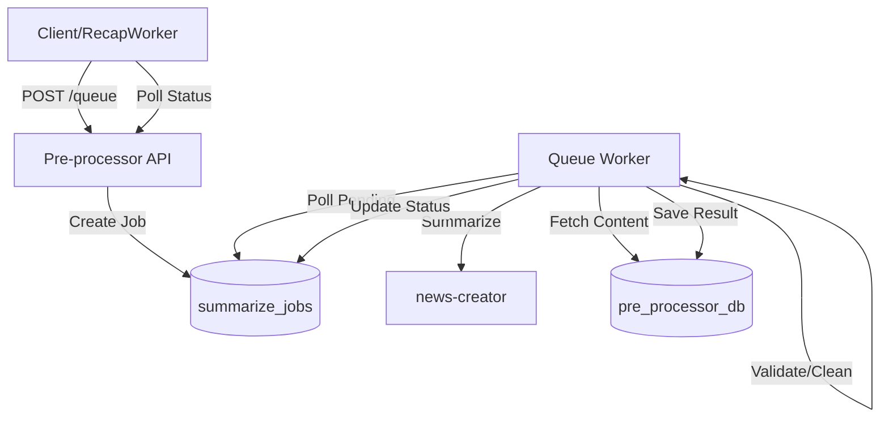

# Pre-processor

_Last reviewed: December 18, 2025_

**Location:** `pre-processor/app`

## Role
- Go 1.24+ worker service that fetches feeds, sanitizes content, and orchestrates summarization via `news-creator`.
- **Primary Interface**: Exposes an **Async Summarization Queue** (`POST /api/v1/summarize/queue`) for reliable, long-running LLM tasks.
- **Gatekeeper**: Enforces strict **Zero Trust** content validation (strips HTML at handler, worker, and driver layers) to protect downstream ML services.
- **Network Resilience**: Uses circuit breakers, extensive retries, and optional Envoy Proxy routing for external calls.

## Architecture & Diagram
| Component | Summary |
| --- | --- |
| HTTP API | `handler/summarize_handler.go` (Async Queue & Legacy Sync endpoints), `handler/health_handler.go`. |
| Workers | `SummarizeQueueWorker` (pulls confirmation jobs), `JobHandler` (orchestrates ticker-based jobs). |
| Services | `ArticleSummarizerService` (batch logic), `QualityCheckerService` (validation). |
| Repository | `SummarizeJobRepository` (job state), `ArticleRepository`, `ExternalAPIRepository` (LLM client). |
| Driver | `summarizer_api.go` (news-creator client), `alt_db` (Postgres). |

## Key Features

### 1. Async Summarization Queue
To handle long-running LLM generation without HTTP timeouts:
1.  **Submit**: `POST /api/v1/summarize/queue` returns a `job_id` (202 Accepted).
2.  **Process**: `SummarizeQueueWorker` picks up pending jobs, cleans content, and calls `news-creator`.
3.  **Poll**: `GET /api/v1/summarize/status/:job_id` returns running/completed/failed status and the final summary.

### 2. Zero Trust Security (Defense in Depth)
Content is sanitized at **three** distinct layers to ensure no raw HTML reaches the LLM or analytics:
1.  **Handler**: Extracts text before saving/queueing.
2.  **Worker**: Re-validates/extracts text before processing a job.
3.  **Driver**: Final extraction pass before the HTTP call to `news-creator`.

### 3. Resilience & Proxying
- **Envoy Integration**: Can route traffic via Sidecar (`USE_ENVOY_PROXY=true`) for observability/mesh features.
- **Circuit Breakers**: 3 failures open the circuit for 10s to protect downstream services.
- **Smart Retries**: Network errors trigger retries with exponential backoff; "Content Too Short" is treated as a logic skip, not a system error.

## Endpoints
- **Async Queue (Recommended)**:
    - `POST /api/v1/summarize/queue`: Queue a generic summarization task.
    - `GET /api/v1/summarize/status/:job_id`: Check job status and retrieve result.
- **Legacy**:
    - `POST /api/v1/summarize`: Synchronous summarization (deprecated for large batches).
- **Ops**:
    - `GET /api/v1/health`: Checks dependencies (DB, News Creator).

## Configuration & Environment
- **Queue Tuning**:
    - `SUMMARIZE_QUEUE_WORKER_INTERVAL` (default 10s), `SUMMARIZE_QUEUE_POLLING_INTERVAL`, `SUMMARIZE_QUEUE_MAX_RETRIES`.
- **LLM/News Creator**:
    - `NEWS_CREATOR_HOST`, `NEWS_CREATOR_TIMEOUT` (default 120s - fail fast).
- **HTTP / Proxy**:
    - `USE_ENVOY_PROXY` (bool), `ENVOY_PROXY_URL`.
    - `HTTP_USER_AGENT_ROTATION`, `HTTP_ENABLE_BROWSER_HEADERS`.
- **Resilience**:
    - `RETRY_MAX_ATTEMPTS` (3), `RETRY_BACKOFF_FACTOR` (2.0).

## Testing & Tooling
- `go test ./...` runs unit tests. `service/testutil` contains mocks.
- `make generate-mocks`: Refreshes GoMock wrappers.
- **Integration**: Verify Async Queue flow using `curl` to post a job and then poll its ID.

## Operational Runbook
1. **Startup**: `make up` (or Docker Compose). Worker starts automatically.
2. **Monitoring**: Check logs for "processing summarization job" and "article summarized successfully".
3. **Queue Lag**: If jobs stay "pending" too long, check `SUMMARIZE_QUEUE_WORKER` logs or DB connection pool.
4. **VRAM/Timeout**: If "failed to summarize article" spikes, check `news-creator` dashboard for OOMs or timeouts.
