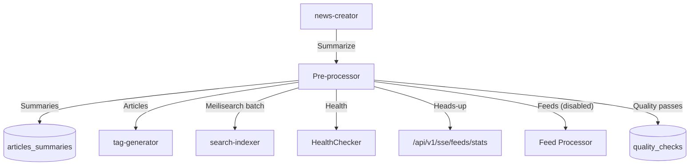

# Pre-processor

_Last reviewed: November 17, 2025_

**Location:** `pre-processor/app`

## Role
- Go 1.24+ worker that fetches feeds, summarizes articles via news-creator, and enforces quality gates before downstream pipelines consume content.
- Hosts `POST /api/v1/summarize` plus `GET /api/v1/health`, while running cron-style summarization and quality check jobs.
- Enforces `≥5s` spacing for outbound hosts, wraps external calls with circuit breakers, and tracks telemetry for dashboards.

## Architecture & Diagram
| Component | Summary |
| --- | --- |
| HTTP API | `handler/summarize_handler.go` (`/api/v1/summarize`), `handler/health_handler.go`. |
| Jobs | `handler/job_handler.go` spins up summarization (10s ticker) and quality-check (5m ticker) loops; feed job intentionally disabled for ethical compliance. |
| Services | `service.NewArticleSummarizerService`, `ArticleFetcherService`, `QualityCheckerService`, `HealthCheckerService`. |
| Repository | Postgres repositories (`ArticleRepository`, `FeedRepository`, `SummaryRepository`, `ExternalAPIRepository`). |
| Driver | `driver/alt_db` for Postgres, `driver/summarizer_api.go` for news-creator HTTP interactions. |

## Jobs & Endpoints
- `JobHandler` starts:
  1. **Summarization job** – waits for `NewsCreator` health (`HealthChecker.WaitForHealthy`), then calls `ArticleSummarizerService.SummarizeArticles` every 10 seconds; individual articles go through `ExternalAPIRepository.SummarizeArticle`.
  2. **Quality check job** – same health gating, loops every 5 minutes to validate summarizations via `QualityCheckerService`.
  3. **Feed processing** – code exists but commented out (`StartFeedProcessingJob`); logs explain ethical pause. Re-enable by uncommenting and ensuring compliance approval.
- HTTP surface:
  - `POST /api/v1/summarize` (uses `ExternalAPIRepository`, `SummaryRepository`).
  - `GET /api/v1/health` (executes `HealthCheckerServiceWithFactory` and `HealthMetricsCollector`).

## External Integrations
- `ExternalAPIRepository` calls `driver.ArticleSummarizerAPIClient`, which:
  - Constructs payload for `news-creator` `/api/v1/summarize`.
  - Uses `utils.NewHTTPClientManager().GetSummaryClient()` for rate-limited HTTP with 5s minimum interval, 3 retries, 30s timeout, circbreaker (3 failures → 10s open).
  - Validates 200 responses and unmarshals `SummarizeResponse`.
- Circuit breakers and `mercari/go-circuitbreaker` wrappers prevent flood when external hosts fail.
- Deduped articles feed downstream to `tag-generator` and `search-indexer` to refresh the `tag_label_graph` and Meilisearch indexes.

## Configuration & Environment
- `config.Config` loads:
  - Server timeouts: `SERVER_PORT`, `SERVER_READ_TIMEOUT`, `SERVER_WRITE_TIMEOUT`, `SERVER_SHUTDOWN_TIMEOUT`.
  - HTTP client: `HTTP_TIMEOUT`, `HTTP_MAX_IDLE_CONNS*`, user-agent rotation, redirect rules, `Envoy` proxy toggles.
  - Retry: `RETRY_MAX_ATTEMPTS`, `RETRY_BASE_DELAY`, `RETRY_BACKOFF_FACTOR`.
  - Rate limit: `RATE_LIMIT_DEFAULT_INTERVAL`, domain-specific intervals, burst size.
  - DLQ settings: `DLQ_QUEUE_NAME`, `DLQ_TIMEOUT`, `DLQ_RETRY_ENABLED`.
  - Metrics: toggled via `METRICS_ENABLED` + port/path.
  - News creator: `NEWS_CREATOR_HOST`, `NEWS_CREATOR_API_PATH`, `NEWS_CREATOR_MODEL`, `NEWS_CREATOR_TIMEOUT`.
- Logging configuration lives in `utils/logger`; structured log includes `operation`, `batch_size`, `feed_url`.

## Testing & Tooling
- `go test ./...` across handlers/services/repositories; `service/testutil` provides fixtures and fake HTTP clients.
- Repository tests can use `pgxmock` or ephemeral Postgres; set `PGX_LOG_LEVEL=error` for silence.
- When touching HTTP client logic, add table-driven tests for proxy toggles, UA rotation, and circuit breaker transitions.
- Run `make generate-mocks` after editing interfaces.

## Operational Runbook
1. `make up` to start dependencies (db, news-creator) and service. Summarizer + quality jobs auto-start.
2. Manual summarize: `curl -X POST http://localhost:9200/api/v1/summarize -d '{"article_id":"test","content":"..."}'`.
3. Health check ensures `news-creator` reachable; logs `health check` via `service.NewHealthMetricsCollector`.
4. Feed processing re-enable requires ethical sign-off; comment removal, run `go run ./cmd` to verify.
5. Watch circuit breaker logs (`breaker open`) and consider throttling host-specific intervals via `RATE_LIMIT_DOMAIN_INTERVALS`.

## Observability
- Logs enriched with `operation`, `feed_url`, `article_id`, `batch_size`.
- `service.NewHealthMetricsCollector` exposes job durations; future Prometheus path under `cfg.Metrics.Path`.
- SSE stats feed uses `cfg.Server.SSEInterval` for ticker period; each event flushes `UnsummarizedFeedStatsSummary`.

## LLM Notes
- Clarify whether work belongs in `handler/job_handler.go` (orchestration) vs `service/` (business logic) vs `repository/driver`.
- Provide explicit config keys (e.g., `HTTP_USER_AGENT_ROTATION`, `RATE_LIMIT_DOMAIN_INTERVALS`) when asking for new env wiring.
