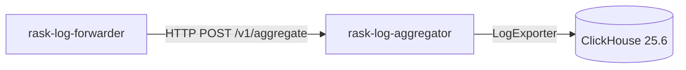

# Rask Log Aggregator

_Last reviewed: November 17, 2025_

**Location:** `rask-log-aggregator/app`

## Role
- Rust 1.87 Axum API that ingests newline-delimited JSON log batches from forwarders and writes them into ClickHouse for observability analytics.
- Keeps a small surface (`/v1/aggregate`, `/v1/health`) while accommodating extensible exporters (`LogExporter` trait).
- Emits structured tracing via `tracing_subscriber` and propagates errors when ClickHouse rejects payloads.

## Handlers & Exporters
- `/v1/aggregate` (`aggregate_handler`): reads raw request body, parses each line into `EnrichedLogEntry`, filters parse errors (logs them), and sends the batch to the configured `LogExporter`.
- `/v1/health`: simple handler that logs health checks and returns `"Healthy"`.
- `LogExporter` trait (`log_exporter/mod.rs`) lets you swap exporters; default `ClickHouseExporter` takes a vector of `EnrichedLogEntry` and writes HTTP INSERTs to ClickHouse.
- Parsing errors log `Failed to parse log entry` and skip bad lines instead of failing the entire request.

## Configuration & Environment
- `APP_CLICKHOUSE_HOST`, `APP_CLICKHOUSE_PORT`, `APP_CLICKHOUSE_USER`, `APP_CLICKHOUSE_PASSWORD`, `APP_CLICKHOUSE_DATABASE` are required; `config::get_configuration()` fails fast when any are missing.
- ClickHouse client reads envs, builds the connection, and reuses `clickhouse::Client`.
- Use `RUST_LOG` to control verbosity; default `EnvFilter` includes `INFO`.

## Testing & Tooling
- `cargo test` covers unit/integration tests; extend `tests/` when adding new exporter variants.
- Run `cargo fmt` + `cargo clippy -- -D warnings` before commits.
- Integration tests (see `tests/`) can start ClickHouse via Docker or mock exporters to verify retry/error handling.

## Operational Runbook
1. Set ClickHouse envs, then `cargo run --release`.
2. Smoke test ingestion: `printf '{"message":"hi"}\n' | curl -X POST --data-binary @- localhost:9600/v1/aggregate`.
3. Check ClickHouse tables to ensure `recap_genre_refine_*` counters arrive.
4. Add retries/backoffs in `ClickHouseExporter` if transient errors surface.
5. Health probe: `curl localhost:9600/v1/health`.

## Observability
- Tracing via `tracing_subscriber` includes `info!` logs when batches arrive, and `error!` when parsing/exporting fails.
- Future exporters (S3, Kafka) can implement `LogExporter`.
- When extending `EnrichedLogEntry`, update the exporter’s column mapping before writing to ClickHouse to avoid schema mismatches.
