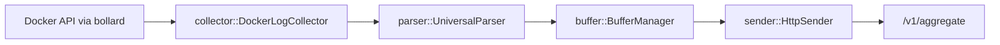

# Rask Log Forwarder

_Last reviewed: November 17, 2025_

**Location:** `rask-log-forwarder/app`

## Role
- Rust 1.87 sidecar that tails Docker logs (via `bollard`), parses them with SIMD-aware pipelines, buffers batches, and ships them to `rask-log-aggregator`.
- Designed for zero-copy parsing, lock-free buffering, backpressure awareness, and optional disk fallback (`sled`) when the aggregator is unavailable.
- CLI entrypoint (`clap` + `Config::from_args_and_env`) exposes `--target-service`, `--endpoint`, `--batch-size`, `--health-check`, `--metrics`, etc.

## Components & Pipeline
- `App::from_args`: loads CLI/env configuration, runs `ApplicationInitializer`, and builds `ServiceManager`.
- `ServiceManager`: coordinates collector, parser, buffer, sender, reliability manager, and `ShutdownHandle`.
- Buffer manager flushes batches based on size/time, tracks capacity (backpressure kicks in at 80%), and optionally spills to disk.
- Sender compresses payloads, retries with exponential backoff, and emits health reports via `reliability`.
- `config::Config` (clap + env) exposes `target_service`, `endpoint`, `batch_size`, `buffer_capacity`, `metrics_port`, `log_level`, `enable_connect`, etc.
- Logging uses `tracing` + `logging_system::setup_logging_safe` to ensure safe global initialization.

## Testing & Performance
- `cargo test` covers units (collectors, parsers, buffers), `tests/` includes integration scenarios with `wiremock` + mock Docker streams.
- `cargo bench` (Criterion) benchmarks parser/buffer hot paths; keep regressions <5%.
- `make` can wrap builds/tests; refer to `Makefile` for pre-defined commands.
- When adding config flags, update `clap` definitions plus env fallback in `Config`.

## Operational Notes
1. Start with `cargo run -- --target-service alt-backend --endpoint http://rask-log-aggregator:9600/v1/aggregate`.
2. Health check via `--health-check` (or rely on reliability probe logs).
3. Tune `buffer_capacity`, `batch_size`, `flush_interval` together when throughput increases.
4. Override auto-detection (Docker labels) by setting `RASK_TARGET_SERVICE` or `--target-service`.
5. Enable disk fallback (`sled` volume) when aggregator latency spikes to avoid data loss.

## Observability
- Use `RUST_LOG=debug` for detailed throughput diagnostics.
- Reliability manager records retry metrics, `PendingChunks`, and `HealthReport`.
- The service exposes `metrics` (if enabled) plus `debug/dns`, `debug/config` endpoints for troubleshooting.
