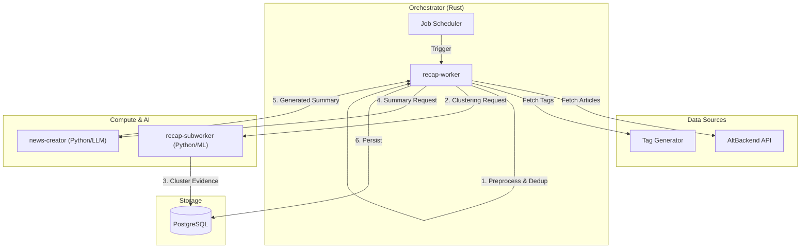

# 7-Day Recap Pipeline Architecture Report

This document outlines the technical details, architecture, and operational guide for the "7-Day Recap" generation pipeline in the Alt system.

## 1. Overview

The **7-Day Recap Pipeline** is a distributed system that collects and analyzes a vast amount of news articles from the past 7 days, clustering them by genre to generate summaries of key topics.

### Key Objectives
-   **Information Condensation**: Extract "major movements" valuable to users from thousands of articles.
-   **Multi-perspective**: Present topics based on semantic connections (clusters) rather than just access count rankings.
-   **Automation**: Fully automated execution every day at a scheduled time (04:00 JST).

### High-Level Architecture

The system consists mainly of three microservices and a database cluster.

---

## 2. Pipeline Phases

The process is orchestrated by `recap-worker` and executed in the following stages:

### Phase 1: Ingestion & Preprocessing
**Responsibility**: `recap-worker` (`src/pipeline/fetch_stage.rs`, `preprocess_stage.rs`)

1.  **Article Ingestion**:
    -   Fetch articles from the past 7 days (`RECAP_WINDOW_DAYS`) via `AltBackend`'s `/v1/recap/articles`.
    -   Uses paging to handle the volume, processing in streams or batches to avoid loading everything into memory.
    -   Fetches `TagSignal` for each article from `TagGenerator` to enrich metadata.
2.  **Text Cleaning**:
    -   **HTML Removal**: Uses `ammonia` and `html2text` to safely strip tags from the body text.
    -   **Language Detection**: Determines the article language using the `whatlang` library.
    -   **Normalization**: Applies Unicode NFC normalization.
3.  **Deduplication**:
    -   **Algorithm**: XXH3 rolling hash + window size 100.
    -   **Threshold**: Similarity of 0.8 or higher is considered a duplicate and filtered out.

### Phase 2: Classification & Refinement
**Responsibility**: `recap-worker` (`src/pipeline/genre_stage.rs`)

1.  **Coarse Classification**:
    -   Initial genre assignment based on keyword matching.
2.  **Refinement**:
    -   **TagLabelGraph**: Uses the tag co-occurrence graph generated by `tag-generator`.
    -   **RefineEngine**: Matches article tags against the graph to score genre confidence.
    -   **Learning**: Classification results are saved to `recap_genre_learning_results` to inform future graph updates.
3.  **Selection**:
    -   Selects top articles (up to ~20) based on Confidence score for each genre to build the `EvidenceCorpus`.

### Phase 3: Clustering & Evidence Extraction
**Responsibility**: `recap-subworker` (Python, `services/pipeline.py`)

Executes CPU/GPU-intensive ML tasks in a separate Python service.

1.  **Embedding**:
    -   Model: `BAAI/bge-m3` (or lightweight equivalent) + Distillation.
    -   Vectorizes each sentence.
2.  **Clustering**:
    -   **UMAP**: Performs dimensionality reduction to reduce computational cost.
    -   **HDBSCAN**: Executes density-based clustering to form topic clusters while removing noise.
3.  **Evidence Extraction (MMR)**:
    -   Extracts representative sentences (Evidence) from each cluster using the **MMR (Maximal Marginal Relevance)** algorithm to ensure high content coverage and low redundancy.
    -   Results are saved to the `recap_cluster_evidence` table.

### Phase 4: Generation
**Responsibility**: `news-creator` (Python, `RecapSummaryUsecase`)

1.  **Prompt Construction**:
    -   Presents representative sentences and keywords (Top Terms) for each cluster to the LLM in JSON format.
    -   System Prompt: `RECAP_CLUSTER_SUMMARY_PROMPT`.
2.  **LLM Inference**:
    -   **OllamaGateway**: Requests to a local or remote Ollama instance (Model: `command-r`, `llama3`, etc.).
    -   **JSON Mode**: Enforces output as structured data (bulleted lists, etc.).
3.  **Fallback**:
    -   Implements a rule-based (heuristic) safety measure to extract summaries from text if the LLM fails to generate valid JSON.

### Phase 5: Persistence & Delivery
**Responsibility**: `recap-worker` (`src/pipeline/persist.rs`)

1.  **Persistence**:
    -   Saves generated summaries and metadata to `recap_outputs` and `recap_final_sections` tables.
2.  **API Serving**:
    -   `AltBackend` joins `recap_outputs` (summaries) and `recap_cluster_evidence` (supporting articles) to serve clients via the `/v1/recaps/7days` endpoint.

---

## 3. Component Architecture

### 3.1 recap-worker (Rust)
The commander of the pipeline.
-   **Concurrency**: Runs on the `tokio` runtime, controlling parallel processing per genre using `Semaphore` (`max_concurrent = (cpu_count * 3) / 2`).
-   **Robustness**: Applies retries with exponential backoff (`RetryConfig`) for external API calls.
-   **Memory Management**: Properly drops data between stages to handle large volumes of articles.

### 3.2 recap-subworker (Python)
Worker specialized for ML processing.
-   **ProcessPool**: Uses `ProcessPoolExecutor` to bypass the GIL (Global Interpreter Lock) and parallelize CPU-bound tasks (Embedding, UMAP).
-   **Idempotency**: Checks `Idempotency-Key` to prevent duplicate execution of the same job.
-   **Diagnostics**: Records detailed metrics such as processing time and noise ratio in `recap_subworker_diagnostics`.

### 3.3 news-creator (Python)
The LLM interface.
-   **Abstraction**: `OllamaGateway` hides the backend LLM implementation details.
-   **Configuration**: Model parameters (`temperature`, `num_predict`, etc.) can be flexibly adjusted via `NewsCreatorConfig`.

---

## 4. Operational Guide

### Configuration
Key Environment Variables:

| Variable Name | Default | Description |
| :--- | :--- | :--- |
| `RECAP_WINDOW_DAYS` | `7` | Recap target period (days) |
| `RECAP_GENRES` | (List) | Target genres list |
| `RECAP_SUBWORKER_PIPELINE_MODE` | `processpool` | Subworker parallel execution mode |
| `LLM_MODEL` | (Optional) | Ollama model name to use |
| `SERVICE_SECRET` | (Required) | Inter-service authentication secret |

### Monitoring & Metrics
Recommended monitoring via Prometheus / Grafana:
-   **Job Success Rate**: Job completion status of `recap_worker`.
-   **Processing Time**: Duration of each stage (especially Subworker clustering).
-   **LLM Error Rate**: Rate of 502/503 responses from `news-creator`.
-   **Memory Usage**: Watch for memory leaks, especially in `recap-subworker`.

### Troubleshooting
-   **Q: Job remains "running" and doesn't finish.**
    -   A: Check `recap-subworker` logs for hang-ups. Verify timeout settings (default 900s).
-   **Q: Summary is empty or low quality.**
    -   A: Check `recap_cluster_evidence` to see if enough articles were clustered. If the article count is too low (below `MIN_DOCUMENTS_PER_GENRE`), processing is skipped.
-   **Q: LLM connection error.**
    -   A: Check connectivity from `news-creator` to Ollama. Consider relaxing `OllamaDriver` timeout settings.
