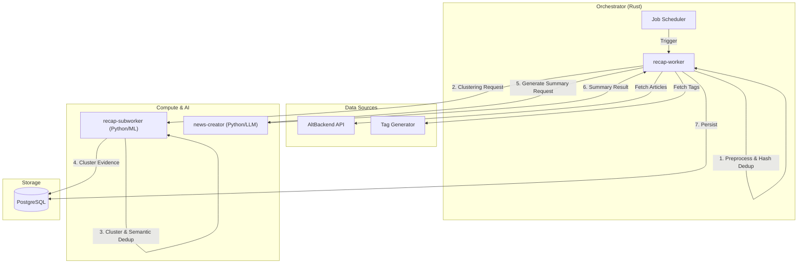

# 7-Day Recap Pipeline Architecture Report

This document outlines the technical details, architecture, and operational guide for the "7-Day Recap" generation pipeline in the Alt system.

## 1. Overview

The **7-Day Recap Pipeline** is a distributed system that collects and analyzes a vast amount of news articles from the past 7 days, clustering them by genre to generate summaries of key topics.

### Key Objectives
-   **Information Condensation**: Extract "major movements" valuable to users from thousands of articles.
-   **Multi-perspective**: Present topics based on semantic connections (clusters) rather than just access count rankings.
-   **Automation**: Fully automated execution every day at a scheduled time (04:00 JST).

### High-Level Architecture

The system consists mainly of three microservices and a database cluster.

---

## 2. Pipeline Phases

The process is orchestrated by `recap-worker` and executed in the following stages:

### Phase 1: Ingestion & Preprocessing
**Responsibility**: `recap-worker` (`src/pipeline/fetch.rs`, `preprocess.rs`)

1.  **Article Ingestion**:
    -   Fetch articles from `alt-backend` for the past 7 days (`RECAP_WINDOW_DAYS`).
    -   **Volume**: Typically ~1,600+ articles per run.
    -   **Tag Enrichment**: Fetch tags from `tag-generator` to assist in classification.

2.  **Preprocessing**:
    -   **HTML Cleaning**: `ammonia` for sanitization, `html2text` for plain text conversion.
    -   **Normalization**: Unicode NFC normalization.
    -   **Tokenization**: Language-aware tokenization (custom Japanese tokenizer for `ja`, whitespace/punctuation for others).
    -   **Filtering**: Empty articles are dropped.

### Phase 2: Deduplication (Hash-Based)
**Responsibility**: `recap-worker` (`src/pipeline/dedup.rs`)

-   **Algorithm**: XXH3 hashing + Rolling Hash (Rabin-Karp like) for near-duplicate detection.
-   **Threshold**: Jaccard similarity threshold of **0.85** (default).
-   **Logic**:
    -   Articles are split into sentences.
    -   If an article shares >85% of its sentence hashes with a previously seen article, it is marked as a duplicate.
    -   Only the "canonical" (first seen) article is kept for downstream processing.

### Phase 3: Genre Classification
**Responsibility**: `recap-worker` (`src/pipeline/genre.rs`, `genre_refine.rs`)

A two-stage classification process assigns articles to genres (e.g., `ai`, `politics`, `business`).

1.  **Coarse Pass (Centroid-based)**:
    -   Uses **Rocchio Classification** with TF-IDF/BM25 feature vectors.
    -   **Multi-centroid**: Each genre has multiple centroids learned from a "Golden Dataset".
    -   **Temperature Scaling**: Adjusts score distribution to prevent over-confidence.
    -   **Fallback**: If no centroid matches, falls back to keyword matching. If that fails, assigns `other`.

2.  **Refine Pass (Graph-based)**:
    -   **Algorithm**: **Graph Label Propagation** on a Tag-Genre graph.
    -   **Logic**: Propagates genre labels from known tags to the article.
    -   **Tie-breaking**: Uses LLM (if enabled) or weighted scores to resolve ambiguous cases.
    -   **Rollout**: Controlled by `RECAP_GENRE_REFINE_ROLLOUT_PERCENT`.

**Data Insight**: Currently, a significant portion of articles may be classified as `other` or non-target genres and filtered out, resulting in a highly focused subset for summarization.

### Phase 4: Selection & Dispatch
**Responsibility**: `recap-worker` (`src/pipeline/select.rs`, `dispatch.rs`)

1.  **Selection**:
    -   Filters out genres with insufficient documents.
    -   **Dynamic Thresholding**: Uses historical distribution data (mean - 0.5 * std) to set per-genre thresholds, falling back to a default (e.g., 10) if data is unavailable.
    -   **Outlier Filtering**: Removes articles with low semantic coherence (cosine similarity < 0.5).
    -   **Trimming**: Caps the number of articles per genre to prevent processing overload.

2.  **Dispatch**:
    -   Sends grouped articles to `recap-subworker` for clustering via the `/v1/runs` endpoint.
    -   **Parallelism**: Genres are processed in parallel.

### Phase 5: Clustering & Semantic Deduplication (ML)
**Responsibility**: `recap-subworker` (`services/pipeline.py`, `services/clusterer.py`)

This phase converts raw text into structured evidence.

1.  **Embedding**: Uses `intfloat/multilingual-e5-large` (or BGE-M3) to generate vector embeddings for sentences.
2.  **Semantic Deduplication**:
    -   Unlike Phase 2 (Article-level), this stage performs **Sentence-level deduplication**.
    -   Removes sentences that are semantically identical (Cosine Similarity > 0.92) to ensure diversity in the evidence budget.
3.  **Clustering**:
    -   **UMAP**: Projects vectors into a lower-dimensional space.
    -   **HDBSCAN**: Identifies density-based clusters.
    -   **Strategy**: "Other" genre uses iterative sub-clustering; standard genres use optimized grid search (maximizing DBCV score).
4.  **Representative Selection**:
    -   Selects sentences using **MMR (Maximal Marginal Relevance)** to balance centrality (representativeness) and diversity.
    -   Persists results to `recap_cluster_evidence`.

### Phase 6: Summarization (Single-Shot)
**Responsibility**: `news-creator` -> `recap-worker`

The summarization process uses a "Single-Shot" approach optimized for large contexts.

1.  **Evidence Selection**:
    -   `recap-worker` retrieves the top clusters (up to ~40) from `recap-subworker` results.
    -   Constructs a single prompt containing the representative sentences from these clusters.
2.  **Token Budgeting**:
    -   Allocates the available token budget (e.g., 60k tokens) to clusters based on their size (`size^0.8`), ensuring important topics get more space.
3.  **Generation**:
    -   Sends a single request to `news-creator`.
    -   **Output**: A structured 7-Day Recap with ~15 key bullet points.
    -   **Concurrency**: Sequential processing (Queue mode) per genre to respect LLM rate limits.

### Phase 7: Persistence
**Responsibility**: `recap-worker` (`src/pipeline/persist.rs`)

-   **Database**: Stores the final results in `recap_outputs` (JSONB) and `recap_sections` tables.
-   **Status Update**: Marks the job as `completed` or `failed`.
-   **Metrics**: Records final execution metrics (duration, success counts) to `recap_jobs`.

---

## 3. Operational Guide

### Configuration
Key Environment Variables for `recap-worker`:

| Variable Name | Default | Description |
| :--- | :--- | :--- |
| `RECAP_WINDOW_DAYS` | `7` | Lookback period for fetching articles. |
| `RECAP_GENRES` | (List) | Comma-separated list of target genres. **Only these genres are processed.** |
| `RECAP_MIN_DOCUMENTS_PER_GENRE` | `10` | Minimum articles required to trigger summarization for a genre. |
| `RECAP_GENRE_REFINE_ENABLED` | `true` | Enable the Graph Label Propagation stage. |

### Monitoring & Metrics
Recommended metrics to watch in `recap-db`:

1.  **Job Success**: Check `recap_jobs` for `status='completed'`.
2.  **Data Volume**:
    -   `recap_preprocess_metrics`: Monitor `total_articles_fetched` vs `articles_processed`.
    -   `recap_cluster_evidence`: Monitor the count of representative sentences.
3.  **Cluster Health**:
    -   `recap_run_diagnostics`: Check for `noise_ratio` and `dbcv_score`.

### Troubleshooting

-   **Q: Why are some genres missing from the recap?**
    -   A: Likely due to `RECAP_MIN_DOCUMENTS_PER_GENRE`. If a genre has fewer than 10 articles after deduplication and outlier filtering, it is skipped.
-   **Q: Why is the summary so short?**
    -   A: If the cluster is small (few sentences), the LLM has less context to work with. Check `recap_cluster_evidence` for the specific genre.
-   **Q: How to add a new genre?**
    -   A: Add the genre name to `RECAP_GENRES` in `compose.yaml` (or `recap_worker_config` table) AND ensure there is a corresponding centroid in the Golden Dataset or keyword mapping.

---

## 4. Quality Evaluation

The system includes a dedicated evaluation pipeline to measure the accuracy of genre classification against a "Golden Dataset".

### Evaluation Methodology
-   **Golden Dataset**: A manually curated set of articles with correct genre labels (`/app/data/golden_classification.json`).
-   **Metrics**: Precision, Recall, F1 Score.
-   **Continuous Improvement**: The `recap-worker` periodically runs evaluation jobs (`recap_genre_evaluation_runs`) and stores metrics in `recap_genre_evaluation_metrics`.

## 5. Summarization Enhancement history

### Centroid Utilization
-   **Concept**: Explicitly identify the "centroid" (most representative sentence) of each cluster.
-   **Implementation**: `recap-subworker` calculates this during MMR selection and flags it in the evidence. `news-creator` uses specific prompts to focus on these points.

### Token Awareness & Budgeting
-   **Objective**: Prevent random truncation.
-   **Logic**: Uses `tokenizers` to strictly count tokens before sending requests and allocates budget proportional to cluster importance (`size^0.8`).

### Architecture Evolution
-   **Deprecation of Map-Reduce**: Earlier versions used a Map-Reduce approach (intermediate summaries per cluster). This was replaced by the current **Single-Shot** architecture to improve coherence and reduce latency, enabled by larger LLM context windows (e.g., Gemma 2/3, Gemini 1.5).
