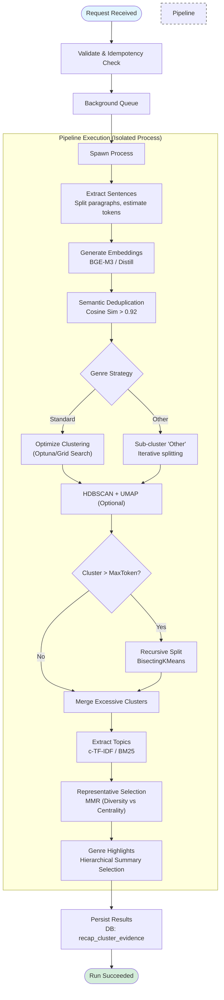
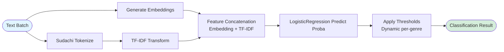

# Recap Subworker

_Last updated: December 18, 2025_

**Location:** `recap-subworker/`

## Role
Recap Subworker is a specialized ML/ETL microservice responsible for heavy text processing tasks that support the Recap Worker. It primarily executes:
1.  **Evidence Gathering**: Embeds, deduplicates, and clusters article sentences to form "Evidence Bundles" for summarization.
2.  **Genre Classification**: Provides an inference endpoint for genre verification using hybrid features (Embeddings + TF-IDF) and scikit-learn models.

It runs as a **FastAPI** application on Gunicorn, optimized for high-concurrency CPU-bound operations.

## Architecture

| Layer | Details |
| --- | --- |
| **HTTP Edge** | `gunicorn` + `uvicorn.workers.UvicornWorker`. Configured for high concurrency. |
| **Orchestration** | `RunManager` handles async job submission (`/v1/runs`), idempotency checks (via `XXH3`), and background task scheduling. |
| **Pipeline Execution** | `PipelineTaskRunner` spawns dedicated processes (via `ProcessPoolExecutor`) for CPU-intensive tasks to prevent blocking the async event loop. |
| **ML Engine** | **Embeddings**: `sentence-transformers` (BGE-M3/Distill) with LRU caching.<br>**Clustering**: `umap-learn` + `hdbscan` (density-based) + Recursive `BisectingKMeans` (for splitting large clusters).<br>**Features**: `scikit-learn` + `sudachipy` for classification features. |
| **Persistence** | Async `SQLAlchemy` (PostgreSQL) for run state, clusters, diagnostics (`recap_run_diagnostics`), and evidence (`recap_cluster_evidence`). |

## API & Endpoints

### 1. Evidence Clustering (`/v1/runs`)
Handles the core "reduce" phase of the recap pipeline.
-   **POST `/v1/runs`**: Submit a generic clustering job.
    -   **Payload**: `ClusterJobPayload` (List of documents, constraints).
    -   **Behavior**: Async 202 Accepted. Starts background processing.
-   **GET `/v1/runs/{run_id}`**: Poll for status (`running` -> `succeeded` | `partial` | `failed`). Returns clusters and representatives.

### 2. Classification Inference (`/v1/classify`)
Provides synchronous inference for genre detection.
-   **POST `/v1/classify/classify`**: Classify a batch of texts.
    -   **Payload**: List of strings, optional `multi_label`, `top_k`.
    -   **Logic**: Embeds text -> Concatenates TF-IDF (optional) -> Predicts Probabilities (LogisticRegression) -> Applies Dynamic Thresholds.

### 3. Administration (`/admin`)
-   **POST `/admin/warmup`**: Pre-loads models (Embedder, Tokenizers) into memory.
-   **POST `/admin/learning-jobs`**: Enqueues an async job to retrain genre thresholds via Bayesian optimization (Optuna).
-   **GET `/admin/learning-jobs/{job_id}`**: Poll status of learning job.
-   **POST `/admin/graph-jobs`**: Enqueues an async job to rebuild the `tag_label_graph` for genre refinement.
-   **GET `/admin/graph-jobs/{job_id}`**: Poll status of graph build job.

## Workflows

### Evidence Pipeline Flow
This process converts a raw corpus of articles into structured "clusters" of evidence.



### Classification Inference Flow
Used by `recap-worker` (or other clients) to verify or refine genre assignments.



## Key Configuration (Environment Variables)

| Variable | Default | Description |
| --- | --- | --- |
| `RECAP_SUBWORKER_PIPELINE_MODE` | `processpool` | Use `processpool` to isolate heavy ML tasks from the API server. |
| `RECAP_SUBWORKER_WORKER_PROCESSES` | `2` | Number of concurrent ML processes allowed (memory intensive). |
| `RECAP_SUBWORKER_MODEL_BACKEND` | `sentence-transformers` | Can be set to `onnx` for faster CPU inference if compatible models exist. |
| `RECAP_SUBWORKER_CLUSTERING_RECURSIVE_ENABLED` | `true` | Enable recursive splitting of large clusters using BisectingKMeans. |
| `RECAP_SUBWORKER_USE_BAYES_OPT` | `false` | Enable Optuna-based hyperparameter tuning for clustering. |

## Observability
-   **Metrics**: Prometheus at `/metrics`. Tracks `embed_seconds`, `hdbscan_seconds`, `dedup_removed`.
-   **Diagnostics**: Every run stores a `diagnostics` JSON in Postgres.
    -   `noise_ratio`: % of sentences discarded as noise by HDBSCAN.
    -   `dbcv_score`: Density-Based Clustering Validation score (cluster quality).
    -   `dedup_pairs`: Number of sentences removed as duplicates.

## Development & Testing

### Commands
```bash
# Run Unit Tests
uv run pytest tests/unit

# Run Integration Tests
uv run pytest tests/integration

# Check Code Quality
uv run ruff check
```
