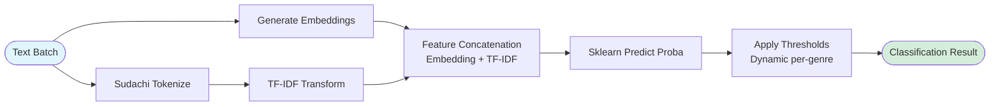

# Recap Subworker

_Last reviewed: 2025-12-11_

**Location:** `recap-subworker/`

## Role
Recap Subworker is a specialized ML/ETL microservice responsible for heavy text processing tasks that support the Recap Worker. It primarily executes:
1.  **Evidence Gathering**: Embeds, deduplicates, and clusters article sentences to form "Evidence Bundles" for summarization.
2.  **Genre Classification**: Provides an inference endpoint for genre verification using hybrid features (Embeddings + TF-IDF) and scikit-learn models.

It runs as a **FastAPI** application on Gunicorn, optimized for high-concurrency CPU-bound operations via process pooling.

## Architecture

| Layer | Details |
| --- | --- |
| **HTTP Edge** | `gunicorn` + `uvicorn.workers.UvicornWorker`. Configured for high concurrency with request timeouts. |
| **Orchestration** | `RunManager` handles async job submission, idempotency checks (via `XXH3`), and background task scheduling using `asyncio`. |
| **Pipeline Execution** | `PipelineTaskRunner` spawns dedicated processes (via `ProcessPoolExecutor`) for CPU-intensive tasks (clustering, topic dispatch) to prevent blocking the async event loop. |
| **ML Engine** | **Embeddings**: `sentence-transformers` (BGE-M3/Distill) with LRU caching.<br>**Clustering**: `umap-learn` + `hdbscan` for density-based clustering.<br>**Features**: `scikit-learn` + `sudachipy` for classification features. |
| **Persistence** | Async `SQLAlchemy` (PostgreSQL) for run state, clusters, diagnostics (`recap_run_diagnostics`), and evidence (`recap_cluster_evidence`). |

## API & Endpoints

### 1. Evidence Clustering (`/v1/runs`)
Handles the core "reduce" phase of the recap pipeline.
-   **POST `/v1/runs`**: Submit a generic clustering job.
    -   **Payload**: `ClusterJobPayload` (List of documents, constraints).
    -   **Behavior**: Async 202 Accepted. Starts background processing.
-   **GET `/v1/runs/{run_id}`**: Poll for status (`running` -> `succeeded` | `partial` | `failed`). Returns clusters and representatives.

### 2. Classification Inference (`/v1/classify`)
Provides synchronous (or async wrapper) inference for genre detection.
-   **POST `/v1/classify/classify`**: Classify a batch of texts.
    -   **Payload**: List of strings, optional `multi_label`, `top_k`.
    -   **Logic**: Embeds text -> Concatenates TF-IDF (optional) -> Predicts Probabilities -> Applies Dynamic Thresholds.

### 3. Administration
-   **POST `/admin/warmup`**: Pre-loads models (Embedder, Tokenizers) into memory to prevent cold-start latency.
-   **POST `/admin/learning`**: Triggers Bayesian optimization for genre thresholds (if enabled).

## Workflows

### Evidence Pipeline Flow
This process converts a raw corpus of articles into structured "clusters" of evidence.

```mermaid
flowchart TB
    Start([Request Received]) --> Validate[Validate & Idempotency Check]
    Validate --> Queue[Background Queue]
    Queue --> Spawn[Spawn Process]

    subgraph "Pipeline Execution (Isolated Process)"
        Spawn --> Extract[Extract Sentences<br/>Split paragraphs, estimate tokens]
        Extract --> Embed[Generate Embeddings<br/>BGE-M3 / Distill]
        Embed --> Dedup[Semantic Deduplication<br/>Cosine Sim > 0.92]

        Dedup --> ClusterStrategy{Genre Strategy}
        ClusterStrategy -->|Other| SubCluster[Sub-cluster 'Other'<br/>Iterative splitting]
        ClusterStrategy -->|Standard| Optimize[Optimize Clustering<br/>UMAP + HDBSCAN]

        Optimize --> Merge[Merge Excessive Clusters<br/>If > 10, merge nearest centroids]
        SubCluster --> Merge

        Merge --> Topics[Extract Topics<br/>c-TF-IDF / BM25]

        Topics --> Select[Representative Selection<br/>MMR (Diversity vs Centrality)]

        Select --> Highlights[Genre Highlights<br/>Hierarchical Summary Selection]
    end

    Highlights --> Persist[Persist Results<br/>DB: recap_cluster_evidence]
    Persist --> Complete([Run Succeeded])

    style Start fill:#e1f5ff
    style Complete fill:#d4edda
    style Pipeline Execution fill:#f9f9f9,stroke:#333,stroke-dasharray: 5 5
```

### Classification Inference Flow
Used by `recap-worker` (or other clients) to verify or refine genre assignments.



## Key Configuration (Environment Variables)

| Variable | Default | Description |
| --- | --- | --- |
| `RECAP_SUBWORKER_PIPELINE_MODE` | `processpool` | Use `processpool` to isolate heavy ML tasks from the API server. |
| `RECAP_SUBWORKER_WORKER_PROCESSES` | `2` | Number of concurrent ML processes allowed (memory intensive). |
| `RECAP_SUBWORKER_MODEL_BACKEND` | `sentence-transformers` | Can be set to `onnx` for faster CPU inference if compatible models exist. |
| `RECAP_SUBWORKER_MAX_TOTAL_SENTENCES` | `3000` | Hard cap on sentences per genre to prevent OOM. |
| `RECAP_SUBWORKER_LEARNING_SCHEDULER_ENABLED` | `true` | Enables background learning optimization tasks. |

## Observability
-   **Metrics**: Prometheus at `/metrics`. Tracks `embed_seconds`, `hdbscan_seconds`, `dedup_removed`.
-   **Diagnostics**: Every run stores a `diagnostics` JSON in Postgres.
    -   `noise_ratio`: % of sentences discarded as noise by HDBSCAN.
    -   `dbcv_score`: Density-Based Clustering Validation score (cluster quality).
    -   `dedup_pairs`: Number of sentences removed as duplicates.

## Development & Testing
-   **Unit Tests**: `uv run pytest tests/unit`
-   **Integration**: `uv run pytest tests/integration` (Requires DB)
-   **Linting**: `uv run ruff check`

### Common Issues
1.  **"Pipeline Timed Out"**: The job took longer than `RECAP_SUBWORKER_RUN_EXECUTION_TIMEOUT_SECONDS`. Increase timeout or reduce `MAX_TOTAL_SENTENCES`.
2.  **"Connection Refused" (Worker)**: Subworker isn't ready. Check `/health/ready`.
3.  **High Memory Usage**: Reduce `RECAP_SUBWORKER_WORKER_PROCESSES` or switch to a distilled embedding model.
