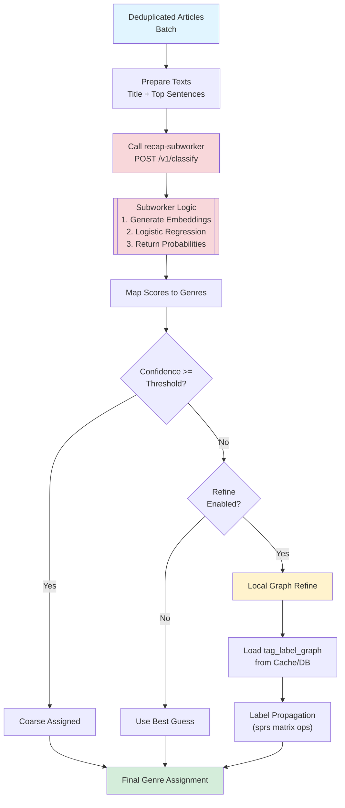
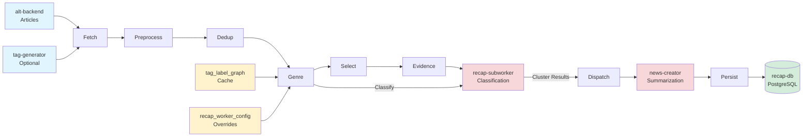

# Recap Worker

_Last updated: December 2025_

**Location:** `recap-worker/recap-worker`

## Role
`recap-worker` is the **orchestrator and pipeline runner** for the Alt 7-day recap system. Written in Rust (2024 edition), it manages the end-to-end flow of generating weekly Japanese news recaps.

Unlike earlier versions, it **delegates heavy ML tasks** (embedding generation, coarse classification, clustering) to `recap-subworker`, keeping the worker itself focused on high-throughput data processing, pipeline coordination, and persistence.

It runs two parallel pipelines:
1.  **7-Day Recap Pipeline:** The main batch process (daily at 04:00 JST).
2.  **Morning Update Pipeline:** A lighter pipeline for daily article deduplication and grouping.

## Service Snapshot

| Layer | Responsibilities |
| --- | --- |
| **Control Plane** | Axum router exposing health checks, metrics (`/metrics`), manual triggers (`/v1/generate/recaps/7days`), and admin utilities (`/admin/genre-learning`, `/admin/jobs/retry`). |
| **Pipeline Core** | `src/pipeline/`: Modular stages for Fetch, Preprocess, Dedup, Genre, Select, Evidence, Dispatch, Persist. |
| **Clients** | `src/clients/`: Strongly-typed HTTP clients for: <br>- **`recap-subworker`**: Coarse classification, clustering, graph refresh. <br>- **`news-creator`**: LLM summarization. <br>- **`alt-backend`**: Article fetching. <br>- **`tag-generator`**: Optional tag enrichment. |
| **Classification** | **Remote Coarse**: Calls `recap-subworker` (`/v1/classify`) for initial genre assignment. <br>**Local Refine**: Optional Graph Label Propagation stage (`src/pipeline/genre_refine.rs`) using cached graph data to rescue low-confidence articles. |
| **Store** | `src/store/`: SQLx DAO managing `recap_jobs`, `recap_cluster_evidence`, `recap_genre_learning_results`, and `tag_label_graph` (cached from DB). |
| **Observability** | Prometheus metrics (pipeline counters, latencies), OTLP tracing, and structured logging. |

## Pipeline Flow

The 7-Day Recap Pipeline follows these stages:

```mermaid
flowchart TB
    Start([Job Triggered<br/>Scheduler/Manual]) --> Init[Pipeline Initialization]

    Init --> GraphRefresh{Graph Pre-Refresh<br/>Enabled?}
    GraphRefresh -->|Yes| RefreshGraph[Refresh Graph via<br/>recap-subworker]
    GraphRefresh -->|No| LoadConfig
    RefreshGraph --> LoadConfig[Load Graph Override Settings<br/>from recap_worker_config]

    LoadConfig --> Fetch[Fetch Stage<br/>AltBackendFetchStage]

    Fetch --> FetchDetails[Fetch Articles<br/>- Paginated from alt-backend<br/>- Optional tag enrichment<br/>- Backup raw HTML to DB]

    FetchDetails --> Preprocess[Preprocess Stage<br/>TextPreprocessStage]

    Preprocess --> PreprocessDetails["Preprocess Articles<br/>HTML cleaning (ammonia)<br/>Language detection (whatlang)<br/>Tokenization (Lindera)<br/>Tag signal extraction"]

    PreprocessDetails --> Dedup[Dedup Stage<br/>HashDedupStage]

    Dedup --> DedupDetails["Deduplicate Articles<br/>XXH3 hashing<br/>Sentence-level similarity"]

    DedupDetails --> Genre[Genre Stage<br/>RemoteGenreStage + Refine]

    Genre --> RemoteCoarse["Remote Coarse Pass<br/>(Call recap-subworker /v1/classify)"]

    RemoteCoarse --> RefineCheck{Refine<br/>Needed?}
    RefineCheck -->|Yes| LocalRefine["Local Graph Refine<br/>(Label Propagation)"]
    RefineCheck -->|No| Select
    LocalRefine --> Select

    Select --> SelectDetails["Select Stage<br/>Trim max 20 per genre<br/>Ensure min documents"]

    SelectDetails --> Evidence[Evidence Stage<br/>EvidenceBundle]

    Evidence --> Dispatch[Dispatch Stage<br/>MlLlmDispatchStage]

    Dispatch --> Phase1["Phase 1: Parallel Clustering<br/>(Call recap-subworker /v1/cluster)"]

    Phase1 --> Phase2["Phase 2: Sequential Summary<br/>(Call news-creator /v1/completions)"]

    Phase2 --> Persist[Persist Stage<br/>FinalSectionPersistStage]

    Persist --> End([Pipeline Complete])

    style Start fill:#e1f5ff
    style End fill:#d4edda
    style Genre fill:#fff3cd
    style RemoteCoarse fill:#fff3cd
    style LocalRefine fill:#fff3cd
    style Dispatch fill:#f8d7da
    style Phase1 fill:#f8d7da
    style Phase2 fill:#f8d7da
```




### 1. Fetch (`fetch.rs`)
*   Pulls articles from `alt-backend` for the configured window (default 7 days).
*   Optionally enriches with tags from `tag-generator`.
*   Persists raw HTML/metadata to `recap_job_articles`.

### 2. Preprocess (`preprocess.rs`)
*   Cleans HTML (`ammonia`, `html2text`).
*   Normalizes Unicode (`nfkc`).
*   Tokenizes (Lindera IPADIC) and extracts tag signals.
*   Executed in parallel using `rayon` or `spawn_blocking`.

### 3. Dedup (`dedup.rs`)
*   Filters near-duplicates using XXH3 hashing and sentence-level comparison.
*   Identifies a representative article for each duplicate group.

### 4. Genre Assignment (`genre.rs`, `genre_remote.rs`)
The genre classification is a hybrid **Remote + Local** process:



*   **Step 1: Remote Coarse (`RemoteGenreStage`)**: Sends article text batches to `recap-subworker`. The subworker uses a GPU-accelerated embedding model and a Logistic Regression classifier to return genre probabilities.
*   **Step 2: Local Refine (Optional)**: If the primary genre's confidence is below `GENRE_CLASSIFIER_THRESHOLD`, the worker runs a local Graph Label Propagation using the cached `tag_label_graph` to rescue the article based on its tags.

### 5. Selection (`select.rs`)
*   Trims articles per genre to meet the target count (default ~20).
*   Ensures minimum document counts per genre.
*   Can use `embedding.rs` (if enabled) for coherence filtering, though heavy clustering is deferred.

### 6. Evidence Assembly (`evidence.rs`)
*   Bundles selected articles into an `EvidenceBundle`.
*   Constructs the payload for clustering, including sentences, titles, and metadata.

### 7. Dispatch (`dispatch.rs`)
*   **Clustering**: Sends the `EvidenceBundle` to `recap-subworker` (`/v1/cluster`). The subworker performs HDBSCAN/K-Means clustering and returns sorted clusters with representatives.
*   **Summarization**: Iterates through top clusters and sends them to `news-creator` (`/v1/completions`) for LLM-based summarization. This is done sequentially per genre to manage LLM context windows.

### 8. Persist (`persist.rs`)
*   Saves the final `Recap` and `RecapGenre` results to `recap_db`.
*   Stores cluster evidence in `recap_cluster_evidence` for transparency and frontend display.

## Data Flow Overview



## Configuration & Tuning

Configuration is handled via `src/config.rs` (env vars) and dynamic DB overrides.

### Key Environment Variables
*   `RECAP_WINDOW_DAYS`: Number of days to include in the recap (default 7).
*   `GENRE_CLASSIFIER_THRESHOLD`: Confidence threshold for remote classification.
*   `RECAP_GENRE_REFINE_ENABLED`: Enable/disable local graph refinement.
*   `RECAP_GENRE_REFINE_ROLLOUT_PERCENT`: Gradual rollout control for refinement.
*   `MIN_DOCUMENTS_PER_GENRE`: Minimum articles required to generate a recap for a genre.

### Graph & Learning
*   **Tag Label Graph**: Cached locally for `TAG_LABEL_GRAPH_TTL_SECONDS`. Loaded from `tag_label_graph` table.
*   **Graph Overrides**: Dynamic thresholds and weights can be loaded from `recap_worker_config` table at runtime.
*   **Refresh**: The pipeline can trigger a graph refresh on `recap-subworker` before execution (`RECAP_PRE_REFRESH_GRAPH_ENABLED`).

## Development & Testing

### Commands
*   **Run Unit Tests**: `cargo test -p recap-worker`
*   **Run Specific Test**: `cargo test -p recap-worker -- tests::pipeline_test`
*   **Check Health**: `curl http://localhost:9005/health/ready`

### Replay Tools
*   **`replay_genre_pipeline`**: A binary (`src/bin/replay_genre_pipeline.rs`) allowed to re-run the genre assignment stage using local datasets or DB data. Useful for tuning refinement logic without running the full pipeline.
    ```bash
    cargo run --bin replay_genre_pipeline -- --dataset path/to/dataset.json --dsn $RECAP_DB_DSN
    ```

## Database Interaction
`recap-worker` relies on `recap-db` (Postgres).
*   **Migrations**: Managed in `recap-migration-atlas`.
*   **Key Tables**:
    *   `recap_jobs`: Job status and metadata.
    *   `recap_job_articles`: Raw article backup.
    *   `recap_outputs` / `recap_genres`: Final recap content.
    *   `recap_cluster_evidence`: Articles used for each cluster.
    *   `recap_worker_config`: Dynamic configuration store.
