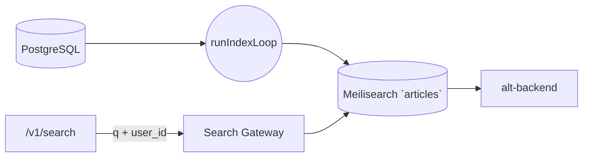

# Search Indexer

_Last reviewed: November 17, 2025_

**Location:** `search-indexer/app`

## Role
- Go 1.24+ service that batches canonical articles into Meilisearch and exposes a user-scoped `/v1/search` endpoint.
- Runs a continuous indexing loop (200-doc batches) while serving search queries via a lightweight net/http handler.
- Shares Clean Architecture layers and reuses the same tokenizer for ingestion + queries.

## Architecture & Diagram
| Layer | Component |
| --- | --- |
| Driver | `driver/database_driver.go`, `driver/meilisearch_driver.go` handle Postgres + Meilisearch connections with retries, health checks, and connection pooling. |
| Gateway | `gateway/article_repository_gateway.go` (fetches batches). `gateway/search_engine_gateway.go` ensures Meilisearch index settings (searchable/filterable attributes). |
| Usecases | `usecase.IndexArticlesUsecase` (indexing loop) + `SearchArticlesUsecase` for query handling. |
| Server | `main.go` orchestrates `runIndexLoop` and registers `rest.SearchArticles`. |
| Tokenizer | `tokenize/tokenizer.go` loads MeCab-based tokenizer for consistent scoring. |

## Indexing Loop
- `runIndexLoop` (`main.go`) maintains cursor (`lastCreatedAt`, `lastID`), requests `IndexArticlesUsecase.Execute(ctx, cursor, 200)`, and retries with `INDEX_RETRY_INTERVAL` on failures.
- When no new articles, sleeps `INDEX_INTERVAL` (1m). After each batch, logs `Indexed` count and updates cursor for monotonic progress.
- `IndexArticlesUsecase` uses tokenizer, fetches articles via `ArticleRepositoryGateway`, ensures indexes exist, and upserts normalized payloads.

## Search Endpoint
- Handler requires query params: `q` (search string) + `user_id`. Missing values return `400 Bad Request`.
- Builds filter `user_id = "<value>"` via `search_engine.EscapeMeilisearchValue` to avoid injection.
- Sends request to `search_engine.SearchArticlesWithFilter`, then maps `meilisearch.Hit` into `SearchArticlesResponse` (id, title, content, tags). Invalid hits are skipped, not fatal.
- Always responds with `application/json`.

## Configuration & Environment
- Meilisearch: `MEILISEARCH_HOST` (required), optional `MEILISEARCH_API_KEY`.
- Database: `DB_HOST`, `DB_PORT`, `DB_NAME`, `DB_SEARCH_INDEXER_USER`, `DB_SEARCH_INDEXER_PASSWORD`, `DB_SSL_MODE`.
- Indexing knobs: `INDEX_BATCH_SIZE` (200), `INDEX_INTERVAL` (60s), `INDEX_RETRY_INTERVAL` (60s). `initMeilisearchClient` retries 5 times with 5s delay and checks `Health()`.
- Tokenizer initialization uses MeCab + custom dictionary (via `tokenize` package) to keep ingestion/query scoring aligned.

## Testing & Tooling
- `go test ./...` covers usecases, gateways, tokenizers.
- Integration tests can run against a real Meilisearch (via `docker compose`) or the `meilisearch-go` client.
- When changing index schema, include tests verifying `EnsureIndex` updates searchable/filterable attributes.
- Consider mocking Meili when altering `rest/handler`.

## Operational Runbook
1. Ensure Meilisearch envs set, run `go run main.go`.
2. Confirm Meili health: `curl http://localhost:7700/health`.
3. Query endpoint: `curl "http://localhost:9300/v1/search?q=test&user_id=tenant-1"`.
4. Only one process should run the loop (`INDEX_BATCH_SIZE` + `INDEX_INTERVAL` tuned via Compose).
5. If re-index needed, reset cursor (via env or `usecase`) and restart service.

## LLM Notes
- When editing indexing logic, specify whether change goes into `usecase`, `gateway`, or `driver`.
- Provide constants (`INDEX_BATCH_SIZE`, `INDEX_INTERVAL`) so tuning remains centralized.
